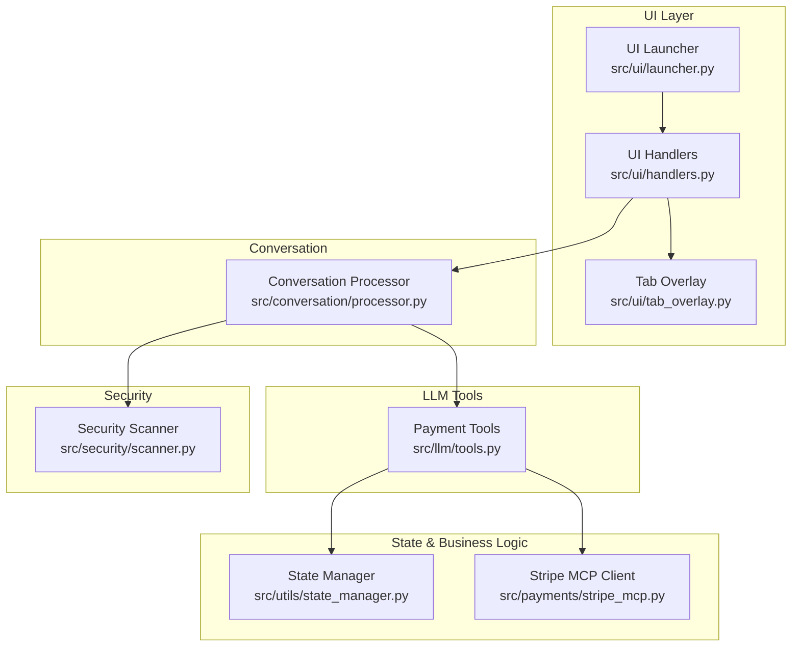
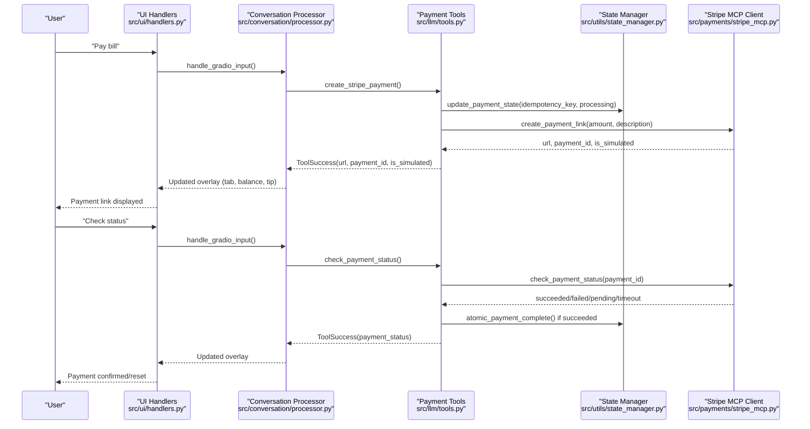
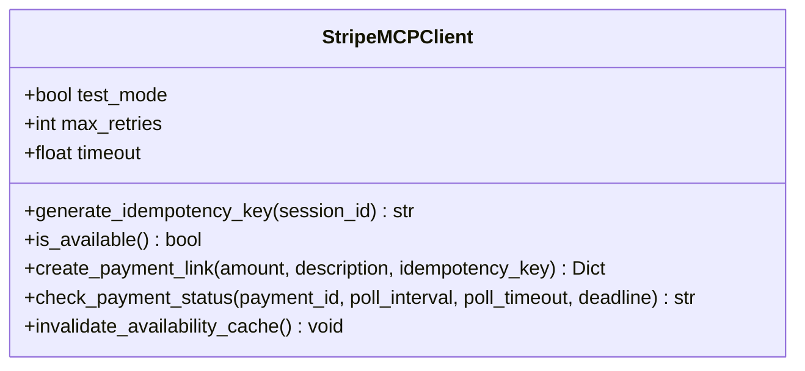
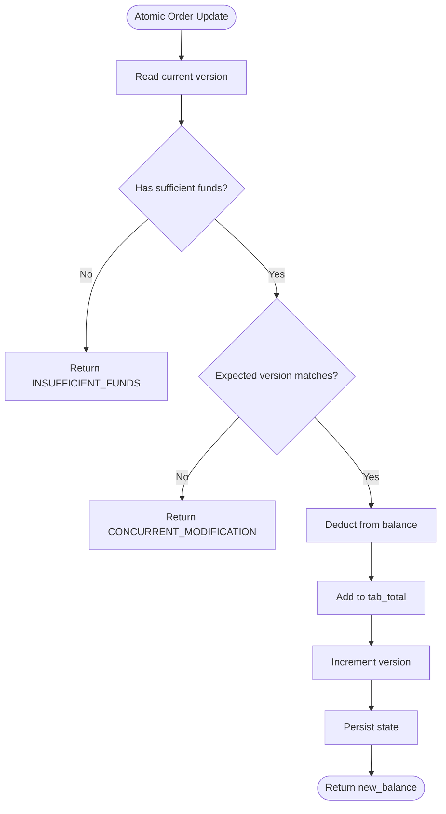
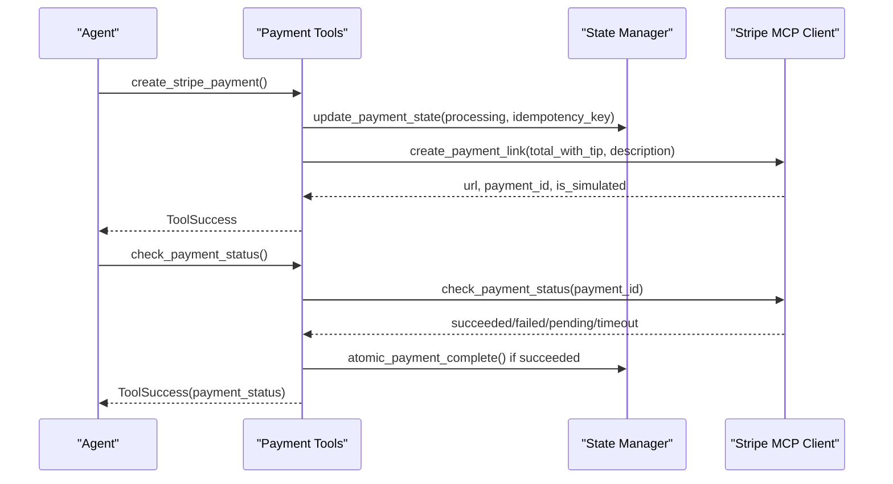
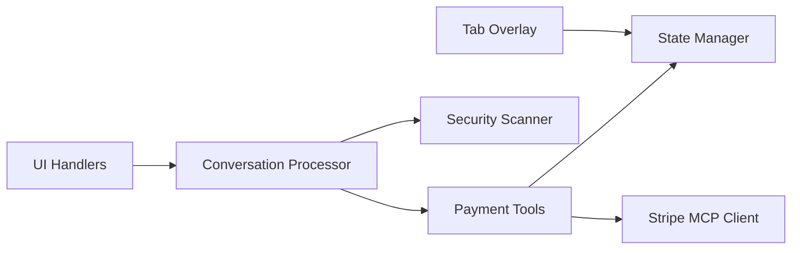

# Payment Workflow

<cite>
**Referenced Files in This Document**
- [src/payments/stripe_mcp.py](file://src/payments/stripe_mcp.py)
- [src/utils/state_manager.py](file://src/utils/state_manager.py)
- [src/llm/tools.py](file://src/llm/tools.py)
- [src/ui/handlers.py](file://src/ui/handlers.py)
- [src/ui/launcher.py](file://src/ui/launcher.py)
- [src/ui/tab_overlay.py](file://src/ui/tab_overlay.py)
- [src/conversation/processor.py](file://src/conversation/processor.py)
- [src/security/scanner.py](file://src/security/scanner.py)
- [TODO.md](file://TODO.md)
</cite>

## Table of Contents
1. [Introduction](#introduction)
2. [Project Structure](#project-structure)
3. [Core Components](#core-components)
4. [Architecture Overview](#architecture-overview)
5. [Detailed Component Analysis](#detailed-component-analysis)
6. [Dependency Analysis](#dependency-analysis)
7. [Performance Considerations](#performance-considerations)
8. [Troubleshooting Guide](#troubleshooting-guide)
9. [Conclusion](#conclusion)

## Introduction
This document explains the complete payment workflow in MayaMCP, focusing on the end-to-end payment processing pipeline from order placement to payment completion. It covers:
- Balance validation and atomic order updates
- Payment link generation with idempotency and fallback to mock payments
- Payment status verification and timeout handling
- Tip calculation and inclusion in payment totals
- Integration with LLM tools for payment-related conversations
- State management coordination across the payment lifecycle
- Security measures and graceful degradation strategies

## Project Structure
The payment workflow spans several modules:
- Payments: Stripe MCP client and mock fallback
- State Management: Atomic operations, validation, and payment state schema
- LLM Tools: Payment tools exposed to the agent
- UI: Handlers, launcher, and tab overlay for user interaction
- Conversation Processor: Orchestrates LLM tool calls and integrates payment tools
- Security: Input/output scanning for safety

**Diagram sources**
- [src/ui/launcher.py](file://src/ui/launcher.py#L49-L354)
- [src/ui/handlers.py](file://src/ui/handlers.py#L23-L392)
- [src/ui/tab_overlay.py](file://src/ui/tab_overlay.py#L151-L485)
- [src/conversation/processor.py](file://src/conversation/processor.py#L73-L456)
- [src/llm/tools.py](file://src/llm/tools.py#L221-L555)
- [src/utils/state_manager.py](file://src/utils/state_manager.py#L17-L814)
- [src/payments/stripe_mcp.py](file://src/payments/stripe_mcp.py#L66-L475)
- [src/security/scanner.py](file://src/security/scanner.py#L32-L137)

**Section sources**
- [src/ui/launcher.py](file://src/ui/launcher.py#L49-L354)
- [src/ui/handlers.py](file://src/ui/handlers.py#L23-L392)
- [src/ui/tab_overlay.py](file://src/ui/tab_overlay.py#L151-L485)
- [src/conversation/processor.py](file://src/conversation/processor.py#L73-L456)
- [src/llm/tools.py](file://src/llm/tools.py#L221-L555)
- [src/utils/state_manager.py](file://src/utils/state_manager.py#L17-L814)
- [src/payments/stripe_mcp.py](file://src/payments/stripe_mcp.py#L66-L475)
- [src/security/scanner.py](file://src/security/scanner.py#L32-L137)

## Core Components
- StripeMCPClient: Async payment link creation with retry/backoff, availability probing, and mock fallback
- State Manager: Atomic order updates, payment state schema, validation, and status transitions
- Payment LLM Tools: Balance checks, order additions with balance validation, tip management, payment link creation, and status polling
- UI Integration: Handlers and tab overlay for tip selection and payment state visualization
- Security Scanner: Input and output scanning to mitigate risks

Key capabilities:
- Idempotent payment link creation using session-based keys
- Retry with exponential backoff and overall timeout
- Graceful fallback to mock payments when Stripe MCP is unavailable
- Tip calculation and inclusion in payment totals
- Atomic state updates with optimistic locking and validation
- Animated UI overlays for tab, balance, tip, and total

**Section sources**
- [src/payments/stripe_mcp.py](file://src/payments/stripe_mcp.py#L66-L475)
- [src/utils/state_manager.py](file://src/utils/state_manager.py#L17-L814)
- [src/llm/tools.py](file://src/llm/tools.py#L221-L555)
- [src/ui/handlers.py](file://src/ui/handlers.py#L218-L392)
- [src/ui/tab_overlay.py](file://src/ui/tab_overlay.py#L151-L485)
- [src/security/scanner.py](file://src/security/scanner.py#L32-L137)

## Architecture Overview
The payment workflow is orchestrated by the conversation processor, which detects intents and invokes payment tools. The tools coordinate with state management and the Stripe MCP client. The UI reflects state changes and enables tip selection.

**Diagram sources**
- [src/ui/handlers.py](file://src/ui/handlers.py#L23-L184)
- [src/conversation/processor.py](file://src/conversation/processor.py#L73-L456)
- [src/llm/tools.py](file://src/llm/tools.py#L358-L555)
- [src/utils/state_manager.py](file://src/utils/state_manager.py#L642-L800)
- [src/payments/stripe_mcp.py](file://src/payments/stripe_mcp.py#L183-L441)

## Detailed Component Analysis

### StripeMCPClient
Responsibilities:
- Generate idempotency keys for deduplication
- Create payment links with async retries and exponential backoff
- Availability probing with caching
- Fallback to mock payments when unavailable
- Poll payment status with timeouts and deadlines
- Respect test mode and sandbox constraints

Implementation highlights:
- Idempotency key format: `{session_id}_{unix_timestamp}`
- Retry configuration: up to 3 retries with delays [1s, 2s, 4s], capped by overall timeout
- Availability cache TTL: 30s; per-probe timeout: 5s
- Status polling: interval 2s, per-poll timeout 5s, deadline 30s, max attempts 15
- Fallback behavior: when unavailable or retries exhausted, return mock payment with `is_simulated: true`

**Diagram sources**
- [src/payments/stripe_mcp.py](file://src/payments/stripe_mcp.py#L66-L475)

**Section sources**
- [src/payments/stripe_mcp.py](file://src/payments/stripe_mcp.py#L66-L475)

### State Manager
Responsibilities:
- Define PaymentState schema with validation rules
- Enforce status transitions: pending → processing → completed
- Atomic order updates with optimistic locking and version increments
- Atomic payment completion resetting tab and tip
- Tip calculation and toggle behavior
- Thread-safe session locking with expiration

Validation rules:
- balance ≥ 0, tab_total ≥ 0, version ≥ 0
- stripe_payment_id optional, must match Stripe ID pattern
- idempotency_key optional, must match `{session_id}_{unix_timestamp}` pattern
- needs_reconciliation False when payment_status is completed

**Diagram sources**
- [src/utils/state_manager.py](file://src/utils/state_manager.py#L685-L757)

**Section sources**
- [src/utils/state_manager.py](file://src/utils/state_manager.py#L17-L814)

### Payment LLM Tools
Responsibilities:
- Balance checks and order additions with balance validation
- Tip setting/getting with toggle behavior
- Payment link creation and status polling
- Error classification and user-friendly messages

Key tools:
- `add_to_order_with_balance`: Validates balance and atomically updates state
- `get_balance`: Returns current balance and tab
- `set_tip`: Calculates tip, stores tip fields, returns total
- `get_tip`: Returns current tip and total
- `create_stripe_payment`: Builds description with tip, generates idempotency key, creates payment link
- `check_payment_status`: Polls status and completes payment atomically on success

**Diagram sources**
- [src/llm/tools.py](file://src/llm/tools.py#L221-L555)
- [src/utils/state_manager.py](file://src/utils/state_manager.py#L642-L800)
- [src/payments/stripe_mcp.py](file://src/payments/stripe_mcp.py#L183-L441)

**Section sources**
- [src/llm/tools.py](file://src/llm/tools.py#L221-L555)

### UI Integration
Responsibilities:
- Handle user input and integrate with conversation processor
- Manage tip selection and send notifications to the agent
- Render tab, balance, tip, and total via tab overlay
- Wire JavaScript callbacks for tip buttons

Key behaviors:
- Tip buttons generate notifications sent to the agent
- Tab overlay animates changes and reflects tip/total
- Clear button resets all payment state to defaults

**Section sources**
- [src/ui/handlers.py](file://src/ui/handlers.py#L218-L392)
- [src/ui/launcher.py](file://src/ui/launcher.py#L13-L354)
- [src/ui/tab_overlay.py](file://src/ui/tab_overlay.py#L151-L485)

### Security Measures
- Input scanning for prompt injection and toxicity
- Output scanning to sanitize responses
- Graceful degradation when security scanners are unavailable
- Test mode enforcement for Stripe MCP client

**Section sources**
- [src/security/scanner.py](file://src/security/scanner.py#L32-L137)
- [src/payments/stripe_mcp.py](file://src/payments/stripe_mcp.py#L83-L108)

## Dependency Analysis
The payment workflow depends on:
- UI handlers invoking conversation processor
- Conversation processor invoking LLM tools
- LLM tools coordinating state and Stripe MCP client
- UI tab overlay reflecting state changes

**Diagram sources**
- [src/ui/handlers.py](file://src/ui/handlers.py#L23-L184)
- [src/conversation/processor.py](file://src/conversation/processor.py#L73-L456)
- [src/llm/tools.py](file://src/llm/tools.py#L221-L555)
- [src/utils/state_manager.py](file://src/utils/state_manager.py#L17-L814)
- [src/payments/stripe_mcp.py](file://src/payments/stripe_mcp.py#L66-L475)
- [src/security/scanner.py](file://src/security/scanner.py#L32-L137)
- [src/ui/tab_overlay.py](file://src/ui/tab_overlay.py#L151-L485)

**Section sources**
- [src/ui/handlers.py](file://src/ui/handlers.py#L23-L184)
- [src/conversation/processor.py](file://src/conversation/processor.py#L73-L456)
- [src/llm/tools.py](file://src/llm/tools.py#L221-L555)
- [src/utils/state_manager.py](file://src/utils/state_manager.py#L17-L814)
- [src/payments/stripe_mcp.py](file://src/payments/stripe_mcp.py#L66-L475)
- [src/security/scanner.py](file://src/security/scanner.py#L32-L137)
- [src/ui/tab_overlay.py](file://src/ui/tab_overlay.py#L151-L485)

## Performance Considerations
- Asynchronous retries avoid blocking request threads
- Availability cache reduces probe overhead
- Polling limits prevent long-running operations
- Optimistic locking minimizes contention
- UI animations serialize updates to preserve responsiveness

[No sources needed since this section provides general guidance]

## Troubleshooting Guide
Common issues and resolutions:
- Stripe MCP unavailable: Verify server availability and API key; fallback to mock payments is automatic
- Mock payment links only: Confirm MCP configuration and test mode settings
- Payment link creation failures: Ensure test mode key and idempotency keys are unique
- Tab not updating: Check browser console for JavaScript errors; verify overlay rendering

Operational notes:
- Graceful fallback: When Stripe MCP is unavailable, mock payments are used automatically
- Idempotency: Payment requests use `{session_id}_{timestamp}` keys to prevent duplicates
- Retry logic: 3 retries with exponential backoff (1s, 2s, 4s)
- Test mode only: The code enforces `test_mode=True` by default

**Section sources**
- [TODO.md](file://TODO.md#L116-L136)
- [src/payments/stripe_mcp.py](file://src/payments/stripe_mcp.py#L83-L108)

## Conclusion
MayaMCP’s payment workflow integrates state management, LLM tools, UI overlays, and Stripe MCP client to provide a robust, secure, and user-friendly payment experience. It emphasizes idempotency, atomic state updates, graceful fallbacks, and clear user feedback through animated UI components. The design ensures reliability under partial failures and maintains compliance with sandbox constraints.