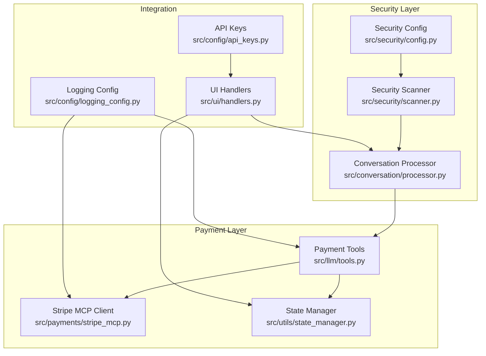
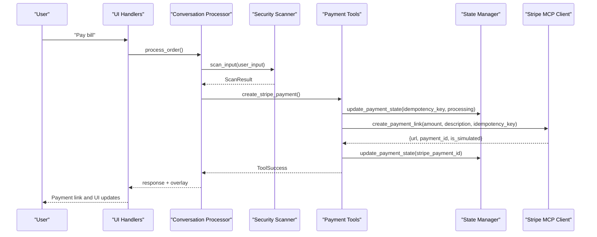
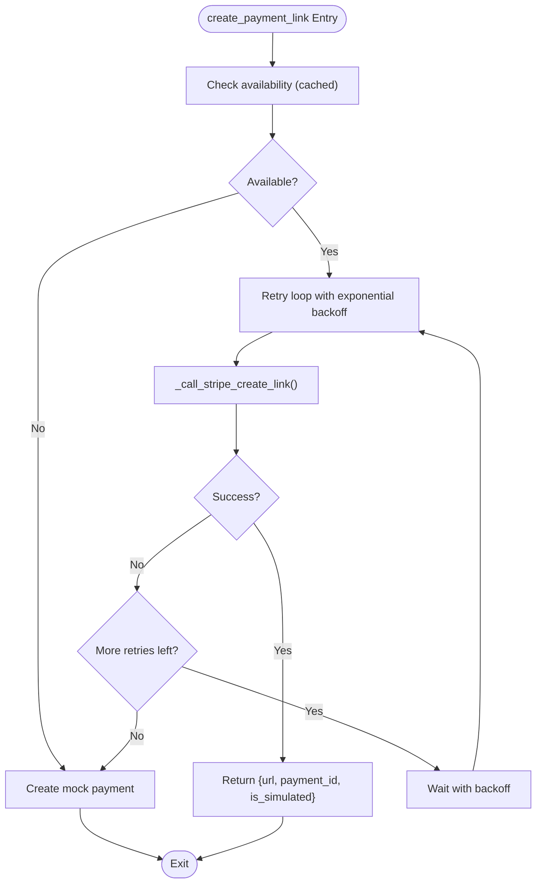
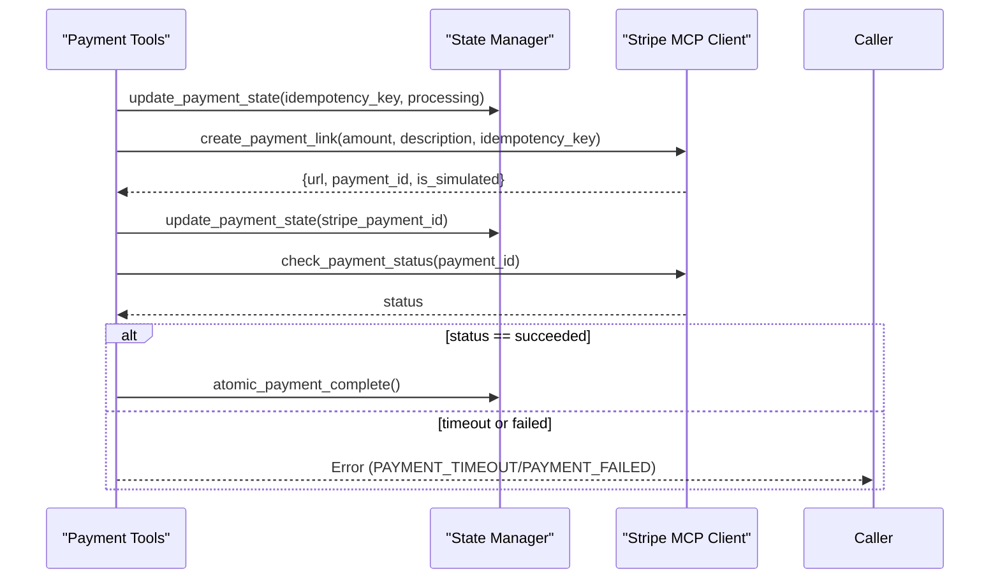
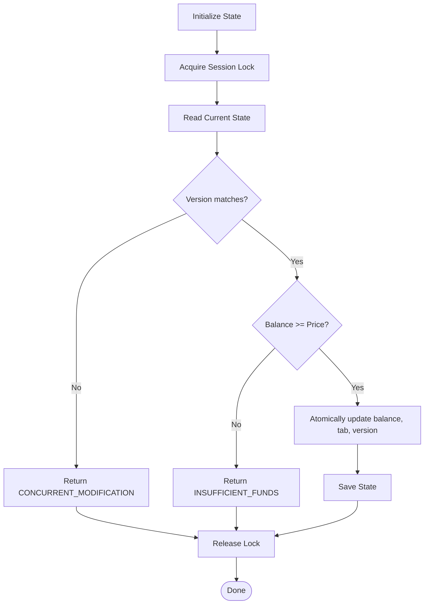
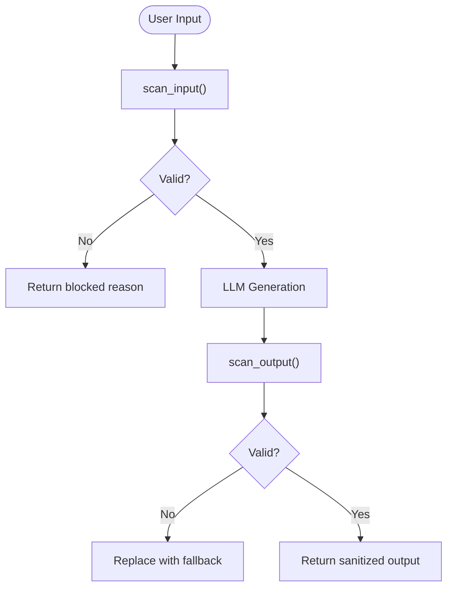
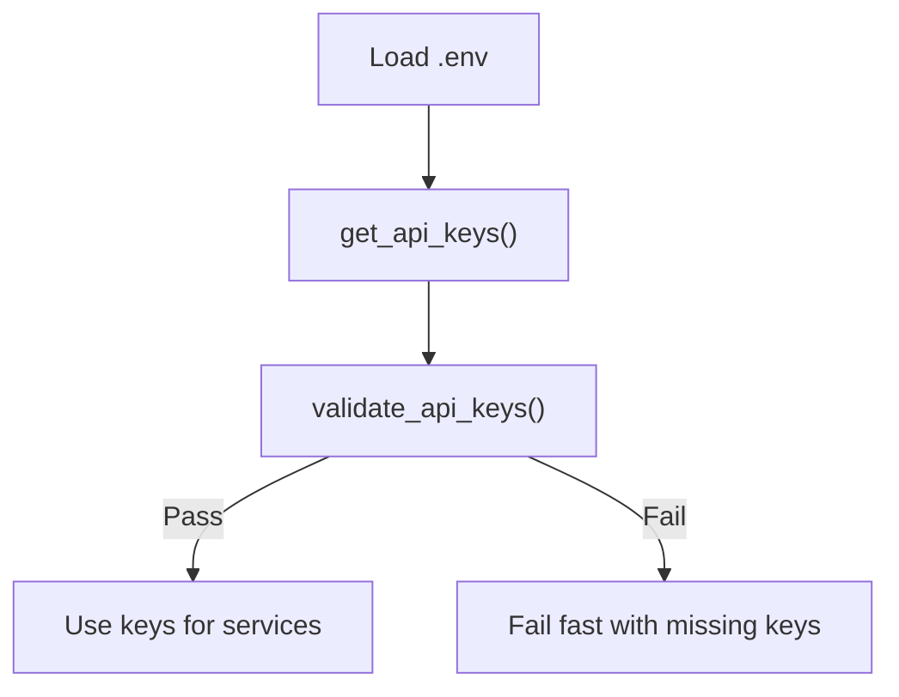
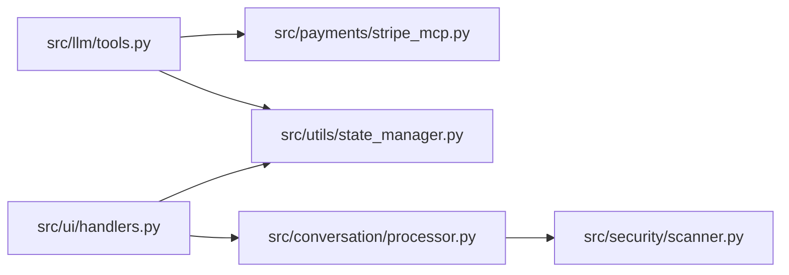

# Security Measures

<cite>
**Referenced Files in This Document**
- [stripe_mcp.py](file://src/payments/stripe_mcp.py)
- [tools.py](file://src/llm/tools.py)
- [state_manager.py](file://src/utils/state_manager.py)
- [processor.py](file://src/conversation/processor.py)
- [handlers.py](file://src/ui/handlers.py)
- [scanner.py](file://src/security/scanner.py)
- [config.py](file://src/security/config.py)
- [logging_config.py](file://src/config/logging_config.py)
- [api_keys.py](file://src/config/api_keys.py)
- [.env.example](file://.env.example)
- [requirements.txt](file://requirements.txt)
- [test_payment_properties.py](file://tests/test_payment_properties.py)
- [test_security_scanner.py](file://tests/test_security_scanner.py)
- [test_processor_security.py](file://tests/test_processor_security.py)
</cite>

## Table of Contents
1. [Introduction](#introduction)
2. [Project Structure](#project-structure)
3. [Core Components](#core-components)
4. [Architecture Overview](#architecture-overview)
5. [Detailed Component Analysis](#detailed-component-analysis)
6. [Dependency Analysis](#dependency-analysis)
7. [Performance Considerations](#performance-considerations)
8. [Troubleshooting Guide](#troubleshooting-guide)
9. [Conclusion](#conclusion)
10. [Appendices](#appendices)

## Introduction
This document details the security measures implemented in MayaMCP’s payment processing system. It focuses on protecting financial transactions and sensitive data, configuring test mode to ensure sandbox operations, managing API keys securely, validating inputs and filtering outputs to prevent injection attacks, implementing idempotency keys to avoid duplicate payments, designing retry logic for transient failures, maintaining graceful fallbacks when external services are unavailable, establishing logging and monitoring strategies for suspicious activity, and providing guidelines for secure handling, error message sanitization, and compliance. It also outlines security testing and vulnerability assessment procedures grounded in the repository’s code and tests.

## Project Structure
The payment security stack spans several modules:
- Payment orchestration and sandbox operations: src/payments/stripe_mcp.py
- LLM tools and payment state management: src/llm/tools.py, src/utils/state_manager.py
- Conversation security scanning: src/conversation/processor.py, src/security/scanner.py, src/security/config.py
- Logging and API key management: src/config/logging_config.py, src/config/api_keys.py
- UI handlers and state updates: src/ui/handlers.py
- Environment and dependencies: .env.example, requirements.txt
- Security tests: tests/test_security_scanner.py, tests/test_processor_security.py, tests/test_payment_properties.py

**Diagram sources**
- [stripe_mcp.py](file://src/payments/stripe_mcp.py#L66-L475)
- [tools.py](file://src/llm/tools.py#L346-L555)
- [state_manager.py](file://src/utils/state_manager.py#L17-L167)
- [processor.py](file://src/conversation/processor.py#L18-L31)
- [scanner.py](file://src/security/scanner.py#L1-L137)
- [config.py](file://src/security/config.py#L1-L24)
- [handlers.py](file://src/ui/handlers.py#L1-L392)
- [logging_config.py](file://src/config/logging_config.py#L1-L51)
- [api_keys.py](file://src/config/api_keys.py#L1-L51)

**Section sources**
- [stripe_mcp.py](file://src/payments/stripe_mcp.py#L1-L475)
- [tools.py](file://src/llm/tools.py#L1-L1066)
- [state_manager.py](file://src/utils/state_manager.py#L1-L814)
- [processor.py](file://src/conversation/processor.py#L1-L456)
- [scanner.py](file://src/security/scanner.py#L1-L137)
- [config.py](file://src/security/config.py#L1-L24)
- [handlers.py](file://src/ui/handlers.py#L1-L392)
- [logging_config.py](file://src/config/logging_config.py#L1-L51)
- [api_keys.py](file://src/config/api_keys.py#L1-L51)
- [.env.example](file://.env.example#L1-L33)
- [requirements.txt](file://requirements.txt#L1-L41)

## Core Components
- Stripe MCP Client: Provides sandboxed payment link creation, idempotency key generation, availability probing, retry logic, and graceful fallback to mock payments.
- Payment Tools: Orchestrates payment lifecycle, enforces idempotency, manages state transitions, and integrates with the Stripe MCP client.
- State Manager: Enforces strict payment state validation, optimistic locking, and atomic operations to prevent inconsistent states.
- Security Scanner: Performs input and output scanning for prompt injection and toxicity with configurable thresholds and graceful fallbacks.
- Logging and API Keys: Centralized logging configuration and API key retrieval/validation for secure credential handling.

**Section sources**
- [stripe_mcp.py](file://src/payments/stripe_mcp.py#L66-L475)
- [tools.py](file://src/llm/tools.py#L346-L555)
- [state_manager.py](file://src/utils/state_manager.py#L66-L167)
- [scanner.py](file://src/security/scanner.py#L32-L137)
- [logging_config.py](file://src/config/logging_config.py#L7-L51)
- [api_keys.py](file://src/config/api_keys.py#L10-L51)

## Architecture Overview
The payment flow integrates conversation security scanning, LLM tools, state management, and Stripe MCP client. It emphasizes sandbox operations, idempotency, retries, and fallbacks.

**Diagram sources**
- [handlers.py](file://src/ui/handlers.py#L86-L184)
- [processor.py](file://src/conversation/processor.py#L103-L202)
- [scanner.py](file://src/security/scanner.py#L32-L96)
- [tools.py](file://src/llm/tools.py#L358-L472)
- [state_manager.py](file://src/utils/state_manager.py#L642-L677)
- [stripe_mcp.py](file://src/payments/stripe_mcp.py#L183-L317)

## Detailed Component Analysis

### Stripe MCP Client and Sandbox Operations
- Test mode and sandbox: The client initializes with test_mode enabled by default, ensuring all operations occur in Stripe’s test environment.
- Idempotency key generation: Creates keys in the format {session_id}_{unix_timestamp} to prevent duplicate payment link creation.
- Availability probing: Lightweight probe with caching to avoid repeated MCP server checks.
- Retry logic: Asynchronous retries with exponential backoff and overall timeout to handle transient failures.
- Graceful fallback: Falls back to mock payment when Stripe is unavailable, preserving UX continuity.
- Status polling: Controlled polling with timeouts and deadlines to avoid indefinite waits.

**Diagram sources**
- [stripe_mcp.py](file://src/payments/stripe_mcp.py#L130-L273)
- [stripe_mcp.py](file://src/payments/stripe_mcp.py#L274-L317)
- [stripe_mcp.py](file://src/payments/stripe_mcp.py#L319-L346)

**Section sources**
- [stripe_mcp.py](file://src/payments/stripe_mcp.py#L83-L128)
- [stripe_mcp.py](file://src/payments/stripe_mcp.py#L130-L181)
- [stripe_mcp.py](file://src/payments/stripe_mcp.py#L183-L273)
- [stripe_mcp.py](file://src/payments/stripe_mcp.py#L319-L346)

### Payment Tools and Idempotency
- Idempotency enforcement: The tools generate and store idempotency keys, set payment_status to processing, and include tip amounts in the payment total.
- Atomic operations: Payment completion is atomic; on success, tab and tip reset, and status transitions to completed.
- Error handling: Comprehensive error codes for insufficient funds, concurrent modification, network errors, rate limits, invalid sessions, item not found, payment timeouts, and invalid tip percentages.

**Diagram sources**
- [tools.py](file://src/llm/tools.py#L358-L472)
- [tools.py](file://src/llm/tools.py#L474-L555)
- [state_manager.py](file://src/utils/state_manager.py#L780-L806)

**Section sources**
- [tools.py](file://src/llm/tools.py#L358-L472)
- [tools.py](file://src/llm/tools.py#L474-L555)
- [state_manager.py](file://src/utils/state_manager.py#L780-L806)

### State Management and Validation
- Strict typing and validation: PaymentState enforces constraints on balances, tab totals, tip percentages, Stripe IDs, idempotency keys, status transitions, and reconciliation flags.
- Optimistic locking: atomic_order_update uses version increments to prevent concurrent modifications.
- Status transitions: Enforces forward-only transitions (pending → processing → completed).

**Diagram sources**
- [state_manager.py](file://src/utils/state_manager.py#L685-L756)

**Section sources**
- [state_manager.py](file://src/utils/state_manager.py#L17-L167)
- [state_manager.py](file://src/utils/state_manager.py#L685-L756)

### Input Validation and Output Filtering
- Input scanning: Detects prompt injection and toxicity with configurable thresholds; blocks or sanitizes input accordingly.
- Output scanning: Applies toxicity checks to LLM outputs and replaces toxic content with a safe fallback.
- Fail-open behavior: Security scanners gracefully pass through content if dependencies are unavailable.

**Diagram sources**
- [processor.py](file://src/conversation/processor.py#L103-L202)
- [scanner.py](file://src/security/scanner.py#L32-L137)

**Section sources**
- [scanner.py](file://src/security/scanner.py#L32-L137)
- [processor.py](file://src/conversation/processor.py#L103-L202)

### API Key Management and Secure Storage
- Environment-based storage: API keys are loaded from environment variables via python-dotenv.
- Validation: Utilities validate presence of required keys before use.
- Example template: .env.example demonstrates secure placement of keys and test-only Stripe configuration.

**Diagram sources**
- [api_keys.py](file://src/config/api_keys.py#L10-L51)
- [.env.example](file://.env.example#L1-L33)

**Section sources**
- [api_keys.py](file://src/config/api_keys.py#L10-L51)
- [.env.example](file://.env.example#L1-L33)

### Logging and Monitoring
- Centralized logging: setup_logging configures log level and format; get_logger retrieves named loggers.
- Payment events: Extensive logging for availability checks, retries, timeouts, and fallbacks.
- Recommendations: Emit structured logs for anomalies, track payment latency, and monitor error rates.

**Section sources**
- [logging_config.py](file://src/config/logging_config.py#L7-L51)
- [stripe_mcp.py](file://src/payments/stripe_mcp.py#L104-L165)

### Security Testing and Vulnerability Assessment
- Property-based tests: Validate payment state invariants (deduction consistency, insufficient funds rejection, state preservation, tab accumulation accuracy, completion reset).
- Security scanner tests: Confirm blocking of prompt injection and toxicity, and replacement of toxic outputs.
- Processor integration tests: Verify that blocked inputs and toxic outputs are handled as expected.

**Section sources**
- [test_payment_properties.py](file://tests/test_payment_properties.py#L59-L158)
- [test_payment_properties.py](file://tests/test_payment_properties.py#L161-L263)
- [test_payment_properties.py](file://tests/test_payment_properties.py#L265-L367)
- [test_payment_properties.py](file://tests/test_payment_properties.py#L369-L473)
- [test_security_scanner.py](file://tests/test_security_scanner.py#L36-L156)
- [test_processor_security.py](file://tests/test_processor_security.py#L26-L81)

## Dependency Analysis
- Payment tools depend on the Stripe MCP client for sandboxed operations and on state manager for atomic updates.
- Conversation processor depends on security scanner for input and output filtering.
- UI handlers coordinate user interactions, state updates, and payment tool invocations.

**Diagram sources**
- [tools.py](file://src/llm/tools.py#L27-L29)
- [stripe_mcp.py](file://src/payments/stripe_mcp.py#L21-L23)
- [state_manager.py](file://src/utils/state_manager.py#L8-L10)
- [processor.py](file://src/conversation/processor.py#L18-L22)
- [scanner.py](file://src/security/scanner.py#L4-L6)
- [handlers.py](file://src/ui/handlers.py#L6-L14)

**Section sources**
- [tools.py](file://src/llm/tools.py#L27-L29)
- [stripe_mcp.py](file://src/payments/stripe_mcp.py#L21-L23)
- [state_manager.py](file://src/utils/state_manager.py#L8-L10)
- [processor.py](file://src/conversation/processor.py#L18-L22)
- [scanner.py](file://src/security/scanner.py#L4-L6)
- [handlers.py](file://src/ui/handlers.py#L6-L14)

## Performance Considerations
- Async retries with exponential backoff minimize wasted resources and improve resilience under transient failures.
- Availability caching reduces MCP probe overhead.
- Polling timeouts and deadlines bound resource usage during status checks.
- Optimistic locking avoids long-held locks, improving throughput.

[No sources needed since this section provides general guidance]

## Troubleshooting Guide
Common issues and mitigations:
- Stripe unavailable: Expect fallback to mock payment; verify availability cache invalidation and retry configuration.
- Payment timeouts: Review polling deadlines and per-poll timeouts; confirm idempotency keys are set.
- Concurrent modifications: Ensure clients retry with updated versions after receiving CONCURRENT_MODIFICATION.
- Security scanner disabled: llm-guard installation affects scanning; tests demonstrate graceful fallback behavior.

**Section sources**
- [stripe_mcp.py](file://src/payments/stripe_mcp.py#L130-L181)
- [stripe_mcp.py](file://src/payments/stripe_mcp.py#L348-L441)
- [state_manager.py](file://src/utils/state_manager.py#L724-L729)
- [scanner.py](file://src/security/scanner.py#L20-L31)

## Conclusion
MayaMCP’s payment system employs a robust, layered security approach: sandboxed operations, idempotency, retry logic, graceful fallbacks, strict state validation, input/output scanning, and centralized logging. The included tests validate correctness and resilience, while environment-based key management and configuration templates support secure deployment.

[No sources needed since this section summarizes without analyzing specific files]

## Appendices

### Security Guidelines for Payment Handling
- Always operate in test mode for sandbox operations.
- Enforce idempotency keys for all payment requests.
- Use optimistic locking and atomic state updates.
- Sanitize inputs and filter outputs for injection and toxicity.
- Monitor logs for anomalies and implement alerting.
- Validate API keys and fail fast on missing credentials.

[No sources needed since this section provides general guidance]