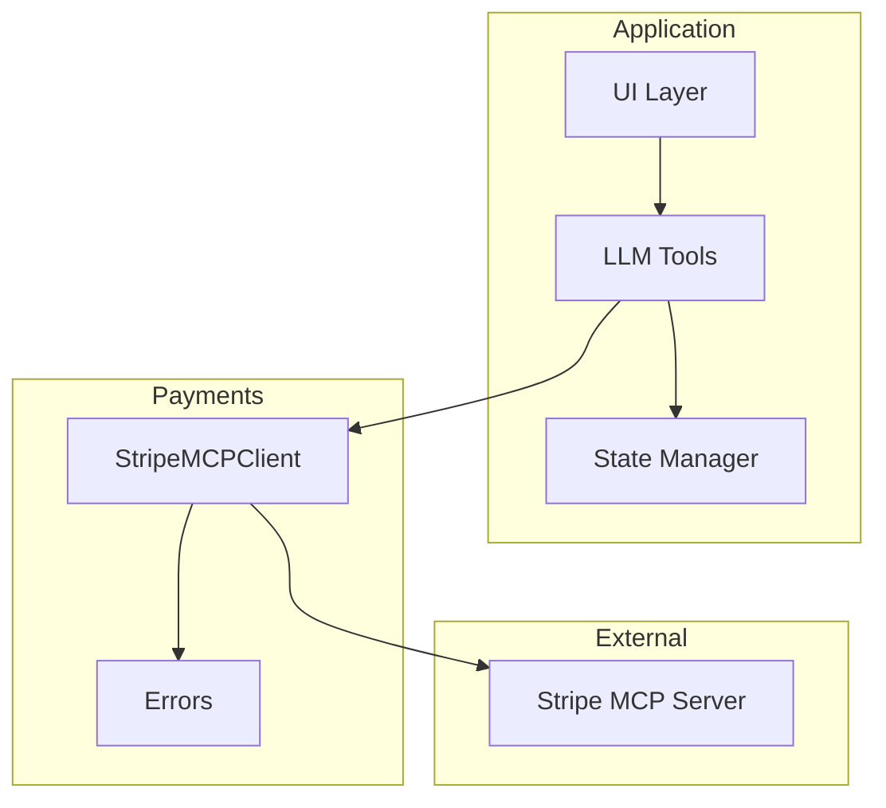
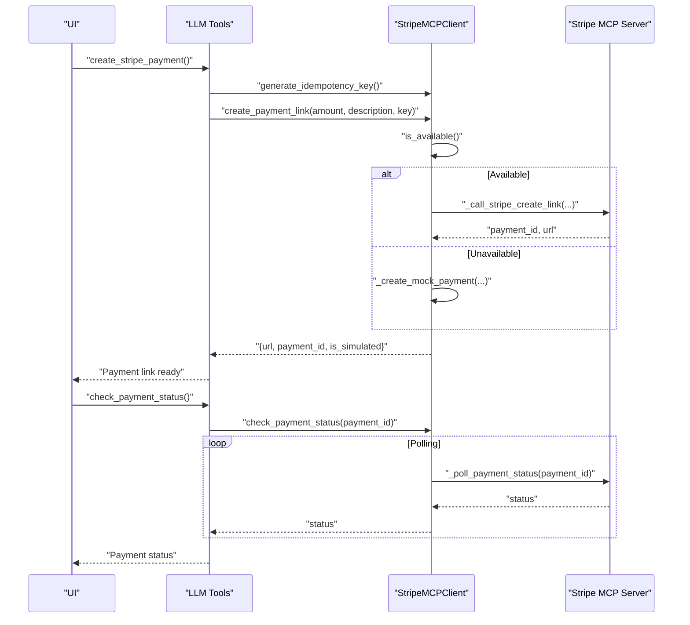
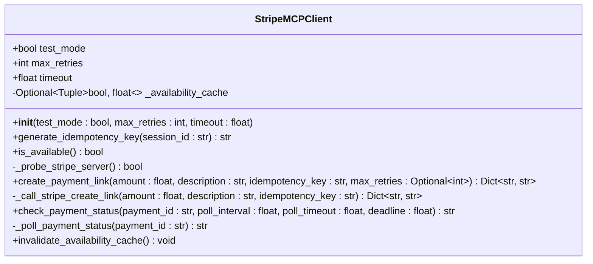
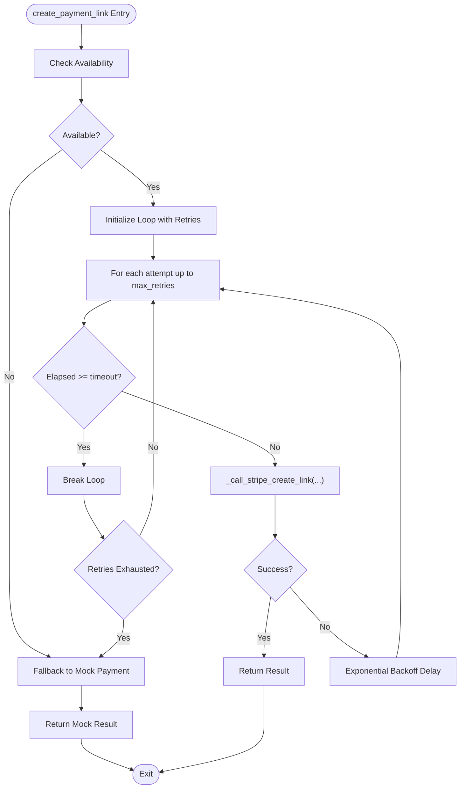
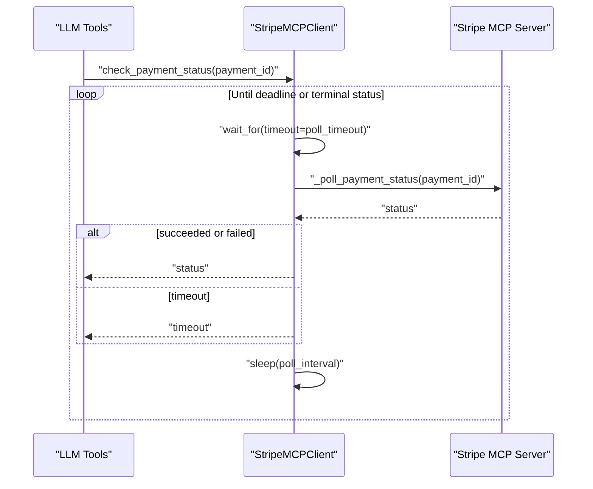
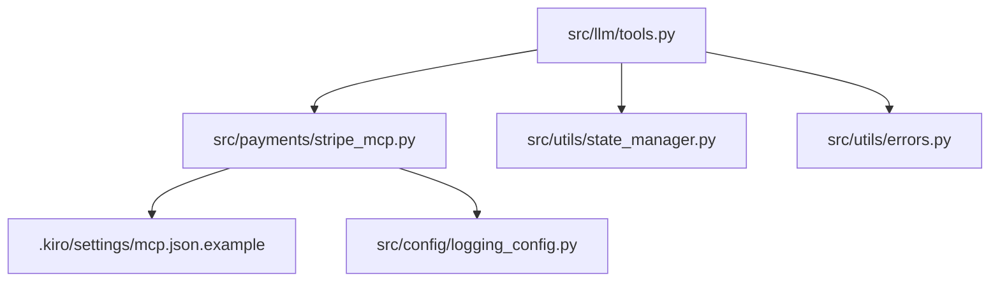

# Stripe MCP Integration

<cite>
**Referenced Files in This Document**
- [stripe_mcp.py](file://src/payments/stripe_mcp.py)
- [errors.py](file://src/utils/errors.py)
- [design.md](file://.kiro/specs/stripe-payment/design.md)
- [mcp.json.example](file://.kiro/settings/mcp.json.example)
- [tools.py](file://src/llm/tools.py)
- [test_payment_properties.py](file://tests/test_payment_properties.py)
</cite>

## Table of Contents
1. [Introduction](#introduction)
2. [Project Structure](#project-structure)
3. [Core Components](#core-components)
4. [Architecture Overview](#architecture-overview)
5. [Detailed Component Analysis](#detailed-component-analysis)
6. [Dependency Analysis](#dependency-analysis)
7. [Performance Considerations](#performance-considerations)
8. [Troubleshooting Guide](#troubleshooting-guide)
9. [Conclusion](#conclusion)
10. [Appendices](#appendices)

## Introduction
This document explains the Stripe MCP client integration for payment link generation and status checking. It covers the StripeMCPClient class architecture, initialization parameters, test mode configuration, retry logic, idempotency key generation, availability checking with caching, payment link creation workflow with exponential backoff and fallback to mock payments, and the payment status polling system with configurable intervals and deadlines. It also documents the error handling strategy with custom exception classes and provides examples of payment creation, status checking, and error recovery patterns. Finally, it highlights the stub implementation placeholders that will be replaced with actual MCP server integration.

## Project Structure
The Stripe MCP integration spans several modules:
- Payments client: [stripe_mcp.py](file://src/payments/stripe_mcp.py)
- LLM tools that orchestrate payment operations: [tools.py](file://src/llm/tools.py)
- Shared error classification helpers: [errors.py](file://src/utils/errors.py)
- Design specification and requirements: [design.md](file://.kiro/specs/stripe-payment/design.md)
- MCP server configuration example: [mcp.json.example](file://.kiro/settings/mcp.json.example)
- Property-based tests validating payment behavior: [test_payment_properties.py](file://tests/test_payment_properties.py)

**Diagram sources**
- [stripe_mcp.py](file://src/payments/stripe_mcp.py#L66-L108)
- [tools.py](file://src/llm/tools.py#L346-L356)
- [design.md](file://.kiro/specs/stripe-payment/design.md#L9-L41)

**Section sources**
- [stripe_mcp.py](file://src/payments/stripe_mcp.py#L1-L475)
- [tools.py](file://src/llm/tools.py#L1-L1066)
- [design.md](file://.kiro/specs/stripe-payment/design.md#L1-L668)

## Core Components
- StripeMCPClient: Provides payment link creation with retry logic, payment status polling, availability probing with caching, and idempotency key generation.
- LLM Tools: Orchestrate payment operations, including creating payment links and checking payment status.
- Error Classification Helpers: Provide consistent logging and classification of errors across the system.
- MCP Server Configuration: Defines the Stripe MCP server command, environment variables, and auto-approval list.

Key capabilities:
- Idempotency key generation for request deduplication
- Availability check with TTL-based caching
- Exponential backoff retries for payment link creation
- Graceful fallback to mock payments when Stripe is unavailable
- Configurable polling for payment status with timeouts and deadlines
- Custom exception classes for different failure scenarios

**Section sources**
- [stripe_mcp.py](file://src/payments/stripe_mcp.py#L66-L108)
- [tools.py](file://src/llm/tools.py#L358-L472)
- [errors.py](file://src/utils/errors.py#L1-L39)
- [mcp.json.example](file://.kiro/settings/mcp.json.example#L1-L17)

## Architecture Overview
The Stripe MCP integration follows a layered architecture:
- UI layer triggers LLM tools to initiate payment operations.
- LLM tools call the StripeMCPClient to create payment links and check statuses.
- StripeMCPClient communicates with the Stripe MCP server via kiroPowers tools (currently stubbed).
- State Manager coordinates payment state updates and atomic operations.

**Diagram sources**
- [tools.py](file://src/llm/tools.py#L358-L472)
- [stripe_mcp.py](file://src/payments/stripe_mcp.py#L183-L317)
- [stripe_mcp.py](file://src/payments/stripe_mcp.py#L348-L441)

## Detailed Component Analysis

### StripeMCPClient Class
The StripeMCPClient encapsulates all Stripe MCP operations:
- Initialization parameters: test_mode, max_retries, timeout
- Idempotency key generation for deduplication
- Availability checking with TTL-based caching
- Payment link creation with exponential backoff retries and fallback
- Payment status polling with configurable intervals and deadlines
- Availability cache invalidation

**Diagram sources**
- [stripe_mcp.py](file://src/payments/stripe_mcp.py#L66-L108)
- [stripe_mcp.py](file://src/payments/stripe_mcp.py#L109-L128)
- [stripe_mcp.py](file://src/payments/stripe_mcp.py#L130-L181)
- [stripe_mcp.py](file://src/payments/stripe_mcp.py#L183-L317)
- [stripe_mcp.py](file://src/payments/stripe_mcp.py#L348-L464)

Initialization parameters:
- test_mode: Enables Stripe test mode by default.
- max_retries: Maximum retry attempts for payment link creation.
- timeout: Overall timeout for operations.

Idempotency key generation:
- Format: {session_id}_{unix_timestamp}
- Purpose: Prevent duplicate payment links on retries.

Availability checking:
- Lightweight probe via kiroPowers activate
- Success criteria: server responds within 5 seconds with a valid tool list
- Unavailability indicators: connection refused, timeout, 5xx errors, empty tool list
- Caching: Results cached for 30 seconds to reduce probe overhead

Payment link creation workflow:
- Pre-check availability; if unavailable, immediately fall back to mock payment
- Retry with exponential backoff: 1s, 2s, 4s
- Overall timeout caps total retry duration
- On exhaustion, fallback to mock payment
- Mock payment returns a synthetic URL and ID

Payment status polling:
- Poll interval: 2 seconds
- Per-poll timeout: 5 seconds
- Total deadline: 30 seconds
- Maximum attempts: 15
- Returns "pending", "succeeded", "failed", or "timeout"

Error handling:
- StripeMCPError: Base exception for Stripe MCP operations
- StripeUnavailableError: Raised when Stripe MCP server is unavailable
- PaymentLinkCreationError: Raised when payment link creation fails after retries
- PaymentStatusTimeoutError: Raised when payment status polling exceeds deadline

**Section sources**
- [stripe_mcp.py](file://src/payments/stripe_mcp.py#L66-L108)
- [stripe_mcp.py](file://src/payments/stripe_mcp.py#L109-L128)
- [stripe_mcp.py](file://src/payments/stripe_mcp.py#L130-L181)
- [stripe_mcp.py](file://src/payments/stripe_mcp.py#L183-L317)
- [stripe_mcp.py](file://src/payments/stripe_mcp.py#L348-L464)

### Payment Link Creation Workflow

**Diagram sources**
- [stripe_mcp.py](file://src/payments/stripe_mcp.py#L183-L272)
- [stripe_mcp.py](file://src/payments/stripe_mcp.py#L274-L317)

**Section sources**
- [stripe_mcp.py](file://src/payments/stripe_mcp.py#L183-L272)
- [stripe_mcp.py](file://src/payments/stripe_mcp.py#L274-L317)

### Payment Status Polling System

**Diagram sources**
- [stripe_mcp.py](file://src/payments/stripe_mcp.py#L348-L441)
- [stripe_mcp.py](file://src/payments/stripe_mcp.py#L443-L464)

Polling configuration:
- Poll interval: 2 seconds
- Per-poll timeout: 5 seconds
- Total deadline: 30 seconds
- Maximum attempts: 15

**Section sources**
- [stripe_mcp.py](file://src/payments/stripe_mcp.py#L348-L441)
- [stripe_mcp.py](file://src/payments/stripe_mcp.py#L443-L464)

### Error Handling Strategy
Custom exception classes:
- StripeMCPError: Base exception for Stripe MCP operations
- StripeUnavailableError: Raised when Stripe MCP server is unavailable
- PaymentLinkCreationError: Raised when payment link creation fails after retries
- PaymentStatusTimeoutError: Raised when payment status polling exceeds deadline

Error classification helpers:
- classify_and_log_genai_error: Classifies common GenAI errors by message and logs with consistent format

**Section sources**
- [stripe_mcp.py](file://src/payments/stripe_mcp.py#L46-L63)
- [errors.py](file://src/utils/errors.py#L11-L37)

### Stub Implementation Placeholders
Several methods are currently stubbed and will be replaced with actual MCP server integration:
- _probe_stripe_server: Lightweight probe via kiroPowers activate
- _call_stripe_create_link: Calls Stripe MCP server to create payment link
- _poll_payment_status: Polls Stripe MCP server for payment status

These placeholders include TODO comments indicating future implementation and simulate behavior for development.

**Section sources**
- [stripe_mcp.py](file://src/payments/stripe_mcp.py#L167-L181)
- [stripe_mcp.py](file://src/payments/stripe_mcp.py#L274-L317)
- [stripe_mcp.py](file://src/payments/stripe_mcp.py#L443-L464)

## Dependency Analysis
The Stripe MCP integration depends on:
- LLM tools for orchestrating payment operations
- State manager for atomic state updates
- Logging configuration for consistent logging
- MCP server configuration for Stripe MCP server settings

**Diagram sources**
- [tools.py](file://src/llm/tools.py#L27-L27)
- [stripe_mcp.py](file://src/payments/stripe_mcp.py#L21-L23)
- [mcp.json.example](file://.kiro/settings/mcp.json.example#L1-L17)

**Section sources**
- [tools.py](file://src/llm/tools.py#L27-L27)
- [stripe_mcp.py](file://src/payments/stripe_mcp.py#L21-L23)
- [mcp.json.example](file://.kiro/settings/mcp.json.example#L1-L17)

## Performance Considerations
- Availability cache TTL: 30 seconds to reduce probe overhead
- Exponential backoff: 1s, 2s, 4s to avoid thundering herd and conserve resources
- Overall timeout: 15 seconds for payment link creation to bound latency
- Polling: 2-second intervals with 5-second per-poll timeout and 30-second deadline
- Mock fallback: Ensures system remains responsive when Stripe is unavailable

[No sources needed since this section provides general guidance]

## Troubleshooting Guide
Common issues and recovery patterns:
- Stripe MCP server unavailable:
  - Availability check returns False, triggering immediate fallback to mock payment
  - Logs a warning with session_id and error details
  - Surface fallback to user with a friendly message
- Payment link creation failures:
  - After retries exhausted, fallback to mock payment
  - Logs error with idempotency key for debugging
  - Maya informs user payment is being processed alternatively
- Payment status polling timeout:
  - Hard deadline of 30 seconds total polling time
  - Returns "timeout" status to caller
  - Do not modify tab or balance on timeout
  - Maya responds with guidance to check again later

**Section sources**
- [stripe_mcp.py](file://src/payments/stripe_mcp.py#L216-L272)
- [stripe_mcp.py](file://src/payments/stripe_mcp.py#L384-L398)
- [design.md](file://.kiro/specs/stripe-payment/design.md#L548-L594)

## Conclusion
The Stripe MCP integration provides a robust, resilient payment system with idempotency, retry logic, availability caching, and graceful fallbacks. The StripeMCPClient encapsulates all Stripe MCP operations, while LLM tools orchestrate the end-to-end payment flow. The design emphasizes correctness, performance, and user experience, with clear error handling and property-based testing to validate behavior.

[No sources needed since this section summarizes without analyzing specific files]

## Appendices

### MCP Server Configuration
- Command: uvx mcp-server-stripe
- Environment variables: STRIPE_SECRET_KEY
- Auto-approve: create_payment_link, get_payment_link
- Disabled: false

**Section sources**
- [mcp.json.example](file://.kiro/settings/mcp.json.example#L1-L17)

### Property-Based Testing Context
- Property-based tests validate correctness properties for payment state management, including balance deduction consistency, tab accumulation accuracy, insufficient funds rejection, state preservation on rejection, and payment completion state reset.
- Tests use Hypothesis for randomized inputs and assertions.

**Section sources**
- [test_payment_properties.py](file://tests/test_payment_properties.py#L1-L1497)
- [design.md](file://.kiro/specs/stripe-payment/design.md#L439-L667)