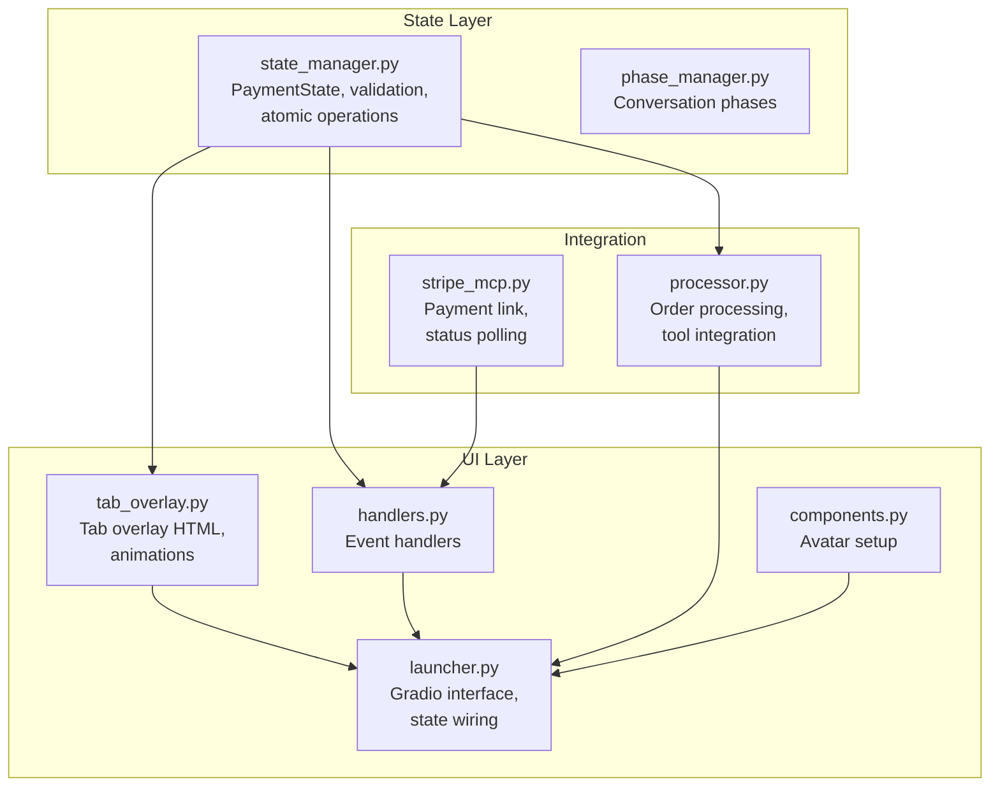
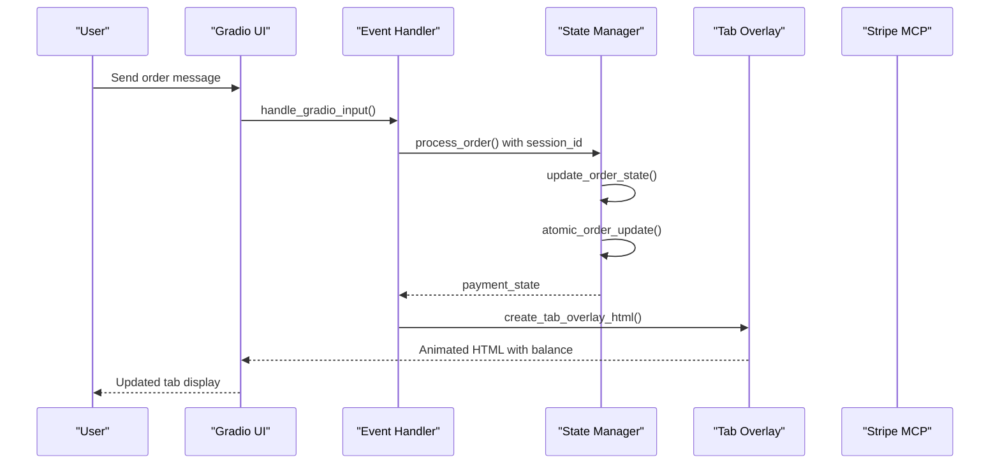
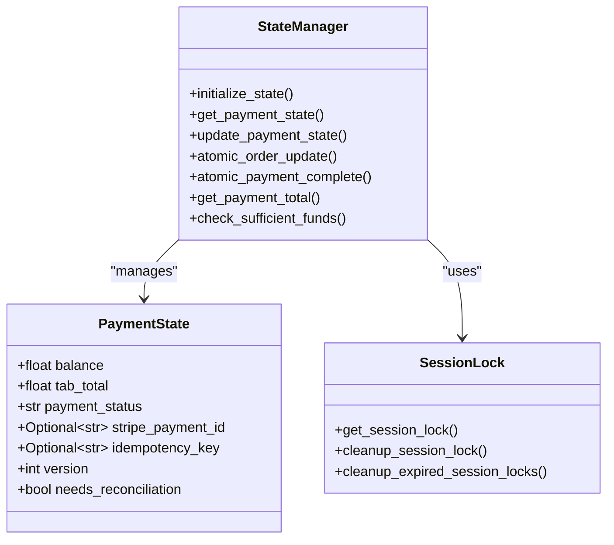
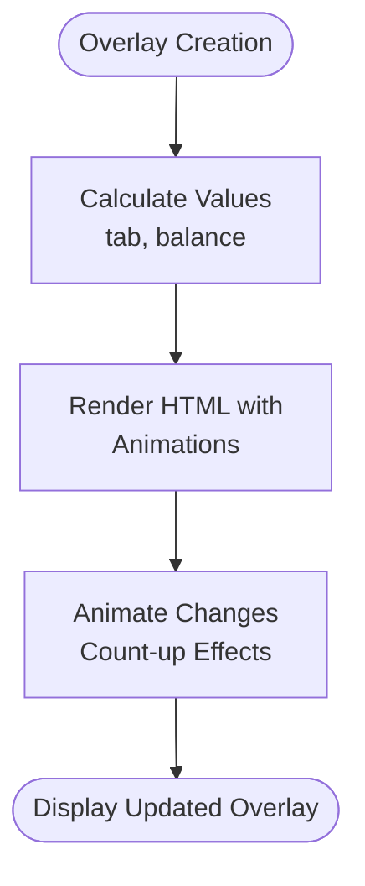
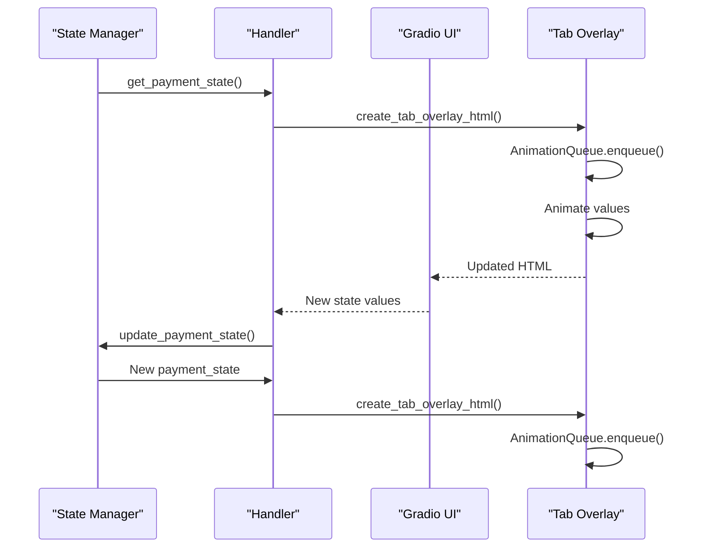
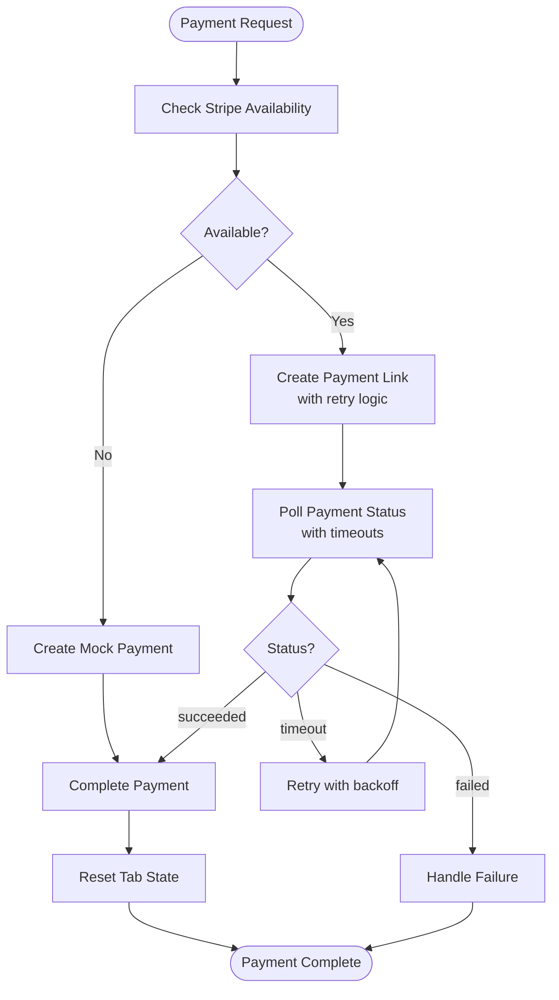
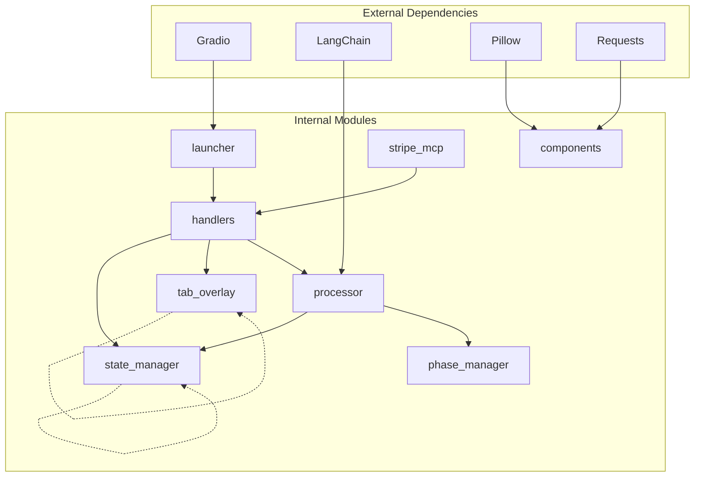

# Tab Management System

<cite>
**Referenced Files in This Document**
- [state_manager.py](file://src/utils/state_manager.py)
- [tab_overlay.py](file://src/ui/tab_overlay.py)
- [handlers.py](file://src/ui/handlers.py)
- [launcher.py](file://src/ui/launcher.py)
- [components.py](file://src/ui/components.py)
- [stripe_mcp.py](file://src/payments/stripe_mcp.py)
- [processor.py](file://src/conversation/processor.py)
- [phase_manager.py](file://src/conversation/phase_manager.py)
- [test_state_manager.py](file://tests/test_state_manager.py)
- [test_ui_handlers.py](file://tests/test_ui_handlers.py)
- [test_ui_components.py](file://tests/test_ui_components.py)
</cite>

## Update Summary
**Changes Made**
- Updated tip management section to reflect simplified approach without interactive tip controls
- Modified UI integration documentation to remove tip button functionality
- Updated state management documentation to reflect streamlined payment state handling
- Revised troubleshooting guide to address simplified tip handling scenarios

## Table of Contents
1. [Introduction](#introduction)
2. [Project Structure](#project-structure)
3. [Core Components](#core-components)
4. [Architecture Overview](#architecture-overview)
5. [Detailed Component Analysis](#detailed-component-analysis)
6. [Dependency Analysis](#dependency-analysis)
7. [Performance Considerations](#performance-considerations)
8. [Troubleshooting Guide](#troubleshooting-guide)
9. [Conclusion](#conclusion)

## Introduction
This document provides comprehensive documentation for MayaMCP's tab management system, focusing on balance tracking and order state management. The system maintains user payment sessions with robust state validation, thread-safe concurrency control, and a real-time tab overlay UI that displays balances with animated visual feedback. The architecture integrates state management with UI components to ensure seamless updates during payment processing, order modifications, and tab resets.

**Updated** The system now focuses on core payment state management without interactive tip controls, providing a simplified approach to tab tracking and balance management.

## Project Structure
The tab management system spans several modules:
- State management: centralized payment and order state handling
- UI overlay: real-time balance display with animations
- Handlers: Gradio event processing and integration
- Launcher: Gradio interface orchestration
- Payments: Stripe integration for payment processing
- Conversation: Phase management and order processing

**Diagram sources**
- [state_manager.py](file://src/utils/state_manager.py#L1-L871)
- [tab_overlay.py](file://src/ui/tab_overlay.py#L1-L595)
- [handlers.py](file://src/ui/handlers.py#L1-L259)
- [launcher.py](file://src/ui/launcher.py#L1-L362)
- [components.py](file://src/ui/components.py#L1-L55)
- [processor.py](file://src/conversation/processor.py#L1-L480)
- [phase_manager.py](file://src/conversation/phase_manager.py#L1-L92)
- [stripe_mcp.py](file://src/payments/stripe_mcp.py#L1-L475)

**Section sources**
- [state_manager.py](file://src/utils/state_manager.py#L1-L871)
- [tab_overlay.py](file://src/ui/tab_overlay.py#L1-L595)
- [handlers.py](file://src/ui/handlers.py#L1-L259)
- [launcher.py](file://src/ui/launcher.py#L1-L362)

## Core Components
The tab management system consists of four primary components:

### Payment State Manager
The state manager provides:
- Strongly-typed payment state with validation
- Atomic operations for balance and tab updates
- Thread-safe session locking
- Version-based optimistic concurrency control
- Comprehensive state persistence and migration support

Key data structures:
- PaymentState: balance, tab_total, payment_status, version tracking
- Session locks for thread safety
- Default state templates for backward compatibility

### Tab Overlay UI
The overlay component delivers:
- Real-time balance and tab display with animated count-up effects
- Dynamic avatar integration with emotion-based state
- Responsive design with color-coded balance indicators

### Gradio Handlers
Event handlers manage:
- User input processing and state updates
- Avatar state management and emotion transitions
- Error handling and graceful degradation

### Payment Integration
Stripe MCP integration provides:
- Payment link generation with retry logic
- Payment status polling with timeouts
- Fallback mechanisms for offline scenarios
- Idempotency key generation for safe retries

**Section sources**
- [state_manager.py](file://src/utils/state_manager.py#L17-L58)
- [tab_overlay.py](file://src/ui/tab_overlay.py#L13-L44)
- [handlers.py](file://src/ui/handlers.py#L23-L184)
- [stripe_mcp.py](file://src/payments/stripe_mcp.py#L66-L108)

## Architecture Overview
The system follows a layered architecture with clear separation of concerns:

**Diagram sources**
- [handlers.py](file://src/ui/handlers.py#L71-L229)
- [state_manager.py](file://src/utils/state_manager.py#L671-L742)
- [tab_overlay.py](file://src/ui/tab_overlay.py#L151-L485)
- [stripe_mcp.py](file://src/payments/stripe_mcp.py#L183-L273)

The architecture ensures:
- State isolation through session-based storage
- Thread-safe operations with session locks
- Real-time UI updates through animation queues
- Robust error handling and fallback mechanisms

## Detailed Component Analysis

### State Manager Architecture
The state manager implements a comprehensive payment session management system:

**Diagram sources**
- [state_manager.py](file://src/utils/state_manager.py#L17-L871)

#### Payment State Validation
The system enforces strict validation rules:
- Balance and tab_total must be non-negative
- Payment status follows linear transitions (pending → processing → completed)
- Stripe payment IDs follow specific patterns
- Idempotency keys use session_id_timestamp format

#### Atomic Operations
Atomic operations ensure data consistency:
- Optimistic locking with version increments
- Concurrent modification detection
- Insufficient funds validation
- Thread-safe session locking

**Section sources**
- [state_manager.py](file://src/utils/state_manager.py#L67-L168)
- [state_manager.py](file://src/utils/state_manager.py#L671-L742)
- [state_manager.py](file://src/utils/state_manager.py#L745-L780)

### Tab Overlay UI Component
The tab overlay provides a sophisticated real-time display system:

**Diagram sources**
- [tab_overlay.py](file://src/ui/tab_overlay.py#L151-L485)

#### Animation System
The overlay implements a sophisticated animation queue:
- Collapsing update strategy (merges rapid successive updates)
- Max queue depth of 5 items
- Smooth count-up animations with scaling effects
- Real-time balance color updates based on funding levels

**Section sources**
- [tab_overlay.py](file://src/ui/tab_overlay.py#L24-L44)
- [tab_overlay.py](file://src/ui/tab_overlay.py#L46-L116)
- [tab_overlay.py](file://src/ui/tab_overlay.py#L151-L485)

### Integration Between State and UI
The integration ensures seamless updates:

**Diagram sources**
- [handlers.py](file://src/ui/handlers.py#L71-L229)
- [tab_overlay.py](file://src/ui/tab_overlay.py#L307-L485)

The integration pattern provides:
- Bidirectional state synchronization
- Real-time visual feedback
- Graceful error handling
- Persistent state across UI updates

**Section sources**
- [handlers.py](file://src/ui/handlers.py#L71-L229)
- [launcher.py](file://src/ui/launcher.py#L159-L165)

### Payment Processing Integration
Stripe MCP integration provides robust payment handling:

**Diagram sources**
- [stripe_mcp.py](file://src/payments/stripe_mcp.py#L183-L273)
- [stripe_mcp.py](file://src/payments/stripe_mcp.py#L348-L441)

**Section sources**
- [stripe_mcp.py](file://src/payments/stripe_mcp.py#L130-L182)
- [stripe_mcp.py](file://src/payments/stripe_mcp.py#L183-L273)
- [stripe_mcp.py](file://src/payments/stripe_mcp.py#L348-L441)

## Dependency Analysis
The system exhibits well-managed dependencies with clear boundaries:

**Diagram sources**
- [launcher.py](file://src/ui/launcher.py#L1-L362)
- [handlers.py](file://src/ui/handlers.py#L1-L259)
- [processor.py](file://src/conversation/processor.py#L1-L480)
- [state_manager.py](file://src/utils/state_manager.py#L1-L871)
- [tab_overlay.py](file://src/ui/tab_overlay.py#L1-L595)
- [components.py](file://src/ui/components.py#L1-L55)
- [phase_manager.py](file://src/conversation/phase_manager.py#L1-L92)
- [stripe_mcp.py](file://src/payments/stripe_mcp.py#L1-L475)

Key dependency characteristics:
- Loose coupling between UI and state management
- Clear separation of concerns across modules
- Minimal circular dependencies
- External dependencies isolated in specific modules

**Section sources**
- [launcher.py](file://src/ui/launcher.py#L1-L362)
- [handlers.py](file://src/ui/handlers.py#L1-L259)

## Performance Considerations
The system implements several performance optimizations:

### Concurrency Control
- Thread-safe session locks prevent race conditions
- Session lock cleanup prevents memory leaks
- Expiration mechanism manages stale locks
- Optimistic locking reduces contention

### Animation Efficiency
- Animation queue collapsing merges rapid updates
- Max queue depth limits memory usage
- RequestAnimationFrame provides smooth animations
- Color updates use efficient DOM manipulation

### State Persistence
- Deep copying prevents state mutations
- Migration support handles schema evolution
- Default state templates minimize initialization overhead
- Efficient state serialization/deserialization

### Payment Processing
- Retry logic with exponential backoff
- Availability caching reduces probe overhead
- Timeout management prevents resource exhaustion
- Fallback mechanisms ensure system resilience

## Troubleshooting Guide

### Common State Management Issues
**Insufficient Funds Error**
- Symptom: atomic_order_update returns INSUFFICIENT_FUNDS
- Resolution: Check current balance and ensure adequate funds
- Prevention: Use check_sufficient_funds() before updates

**Concurrent Modification**
- Symptom: atomic_order_update returns CONCURRENT_MODIFICATION
- Resolution: Retry operation with updated version
- Prevention: Implement proper error handling in UI

**State Validation Failures**
- Symptom: PaymentStateValidationError exceptions
- Resolution: Validate state updates before applying
- Prevention: Use update_payment_state() for atomic updates

### UI Animation Problems
**Animation Queue Stalls**
- Symptom: Values don't animate or stop mid-animation
- Resolution: Check AnimationQueue.is_running flag
- Prevention: Monitor queue depth and collapse strategy

### Payment Processing Issues
**Stripe Unavailable**
- Symptom: Payment link creation fails
- Resolution: System falls back to mock payment
- Prevention: Monitor availability cache and retry logic

**Payment Status Timeout**
- Symptom: Payment polling exceeds deadline
- Resolution: Check network connectivity and retry
- Prevention: Implement proper timeout handling

**Section sources**
- [state_manager.py](file://src/utils/state_manager.py#L671-L742)
- [tab_overlay.py](file://src/ui/tab_overlay.py#L307-L485)
- [stripe_mcp.py](file://src/payments/stripe_mcp.py#L130-L182)

## Conclusion
MayaMCP's tab management system provides a robust, scalable solution for payment session management with real-time UI updates. The architecture successfully separates concerns between state management, UI presentation, and payment processing while maintaining thread safety and data consistency. The system's comprehensive validation, atomic operations, and graceful error handling ensure reliable operation in production environments. The integration between state management and UI components creates a seamless user experience with immediate visual feedback for all payment operations.

The modular design enables easy maintenance and extension, while the well-defined interfaces facilitate future enhancements such as additional payment providers, enhanced analytics capabilities, and improved user interaction patterns.

**Updated** The simplified approach without interactive tip controls maintains the core functionality of balance tracking and order state management while reducing complexity and improving system reliability.