# Architecture Overview

<cite>
**Referenced Files in This Document**
- [README.md](file://README.md)
- [pyproject.toml](file://pyproject.toml)
- [requirements.txt](file://requirements.txt)
- [src/mayamcp_cli.py](file://src/mayamcp_cli.py)
- [src/ui/launcher.py](file://src/ui/launcher.py)
- [src/conversation/processor.py](file://src/conversation/processor.py)
- [src/conversation/phase_manager.py](file://src/conversation/phase_manager.py)
- [src/llm/client.py](file://src/llm/client.py)
- [src/llm/tools.py](file://src/llm/tools.py)
- [src/rag/pipeline.py](file://src/rag/pipeline.py)
- [src/payments/stripe_mcp.py](file://src/payments/stripe_mcp.py)
- [src/utils/state_manager.py](file://src/utils/state_manager.py)
- [src/voice/tts.py](file://src/voice/tts.py)
- [src/security/scanner.py](file://src/security/scanner.py)
</cite>

## Table of Contents
1. [Introduction](#introduction)
2. [Project Structure](#project-structure)
3. [Core Components](#core-components)
4. [Architecture Overview](#architecture-overview)
5. [Detailed Component Analysis](#detailed-component-analysis)
6. [Dependency Analysis](#dependency-analysis)
7. [Performance Considerations](#performance-considerations)
8. [Troubleshooting Guide](#troubleshooting-guide)
9. [Conclusion](#conclusion)
10. [Appendices](#appendices)

## Introduction
This document presents the architecture of MayaMCP, an AI bartender agent that integrates a Gradio UI with a layered conversation processing pipeline. The system orchestrates:
- LLM integration via Google Gemini
- Dual-backend Retrieval-Augmented Generation (RAG) using Memvid video memory and FAISS
- Payment processing through Stripe MCP with graceful fallbacks
- Text-to-speech via Cartesia
- Security scanning with llm-guard
- Event-driven conversation flows with robust state management and error handling

The architecture emphasizes modularity, resilience, and scalability, with clear separation of concerns across layers and integration points.

## Project Structure
MayaNCP follows a feature-based, layered organization:
- UI layer: Gradio interface and tab overlay
- Conversation processing: phase management, intent detection, tool orchestration
- LLM integration: unified Gemini client and tool binding
- RAG: dual-backend pipelines (Memvid and FAISS)
- Payments: Stripe MCP client with availability probing and fallback
- Voice: TTS with text cleaning and retry logic
- Security: input/output scanning with fail-open behavior
- Utilities: state management, helpers, and configuration

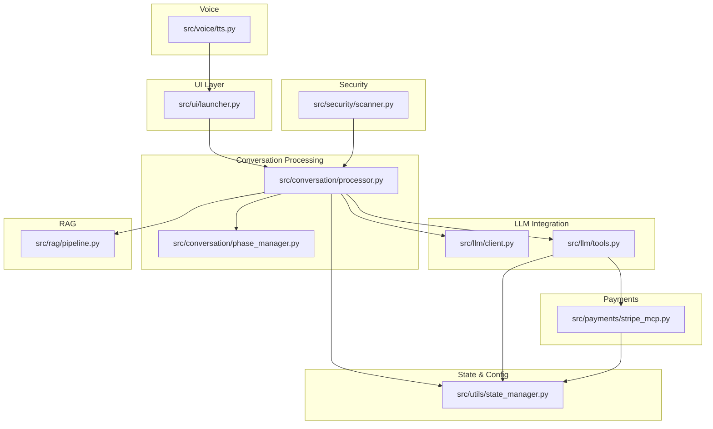

**Diagram sources**
- [src/ui/launcher.py](file://src/ui/launcher.py#L49-L354)
- [src/conversation/processor.py](file://src/conversation/processor.py#L1-L456)
- [src/conversation/phase_manager.py](file://src/conversation/phase_manager.py#L1-L92)
- [src/llm/client.py](file://src/llm/client.py#L1-L211)
- [src/llm/tools.py](file://src/llm/tools.py#L1-L800)
- [src/rag/pipeline.py](file://src/rag/pipeline.py#L1-L105)
- [src/payments/stripe_mcp.py](file://src/payments/stripe_mcp.py#L1-L475)
- [src/voice/tts.py](file://src/voice/tts.py#L1-L200)
- [src/security/scanner.py](file://src/security/scanner.py#L1-L137)
- [src/utils/state_manager.py](file://src/utils/state_manager.py#L1-L814)

**Section sources**
- [README.md](file://README.md#L34-L41)
- [pyproject.toml](file://pyproject.toml#L1-L105)
- [requirements.txt](file://requirements.txt#L1-L41)

## Core Components
- Gradio UI launcher: constructs the chat interface, avatar overlay, and event handlers; wires inputs to the conversation processor and state management.
- Conversation processor: orchestrates LLM calls, tool execution, RAG augmentation, security scanning, and state updates; manages conversation phases.
- LLM client: initializes and wraps Google Gemini via LangChain, with retry and error classification.
- Tools: payment operations (add to order, tip, bill, payment link creation/status), menu retrieval, recommendations, and order processing.
- RAG pipeline: retrieves relevant documents and augments responses using Gemini.
- Stripe MCP client: creates payment links, polls status, and falls back to mock payments with idempotency and availability caching.
- Voice synthesis: cleans text and synthesizes speech via Cartesia with retry logic.
- Security scanner: input/output scanning with fail-open behavior.
- State manager: thread-safe, typed state for payments, orders, and conversations with optimistic locking and validation.

**Section sources**
- [src/ui/launcher.py](file://src/ui/launcher.py#L49-L354)
- [src/conversation/processor.py](file://src/conversation/processor.py#L1-L456)
- [src/llm/client.py](file://src/llm/client.py#L91-L211)
- [src/llm/tools.py](file://src/llm/tools.py#L221-L800)
- [src/rag/pipeline.py](file://src/rag/pipeline.py#L60-L105)
- [src/payments/stripe_mcp.py](file://src/payments/stripe_mcp.py#L66-L475)
- [src/voice/tts.py](file://src/voice/tts.py#L112-L200)
- [src/security/scanner.py](file://src/security/scanner.py#L32-L137)
- [src/utils/state_manager.py](file://src/utils/state_manager.py#L17-L814)

## Architecture Overview
MayaMCP employs a layered architecture:
- Presentation layer: Gradio UI emits events (text input, tip selection, clear).
- Control layer: UI delegates to the conversation processor with injected dependencies (LLM, RAG, TTS, state).
- Processing layer: LLM invokes tools, optionally enhances responses with RAG, applies security scanning, and updates state.
- Persistence and integration: state manager coordinates concurrent access; payment tools integrate with Stripe MCP; TTS renders audio.

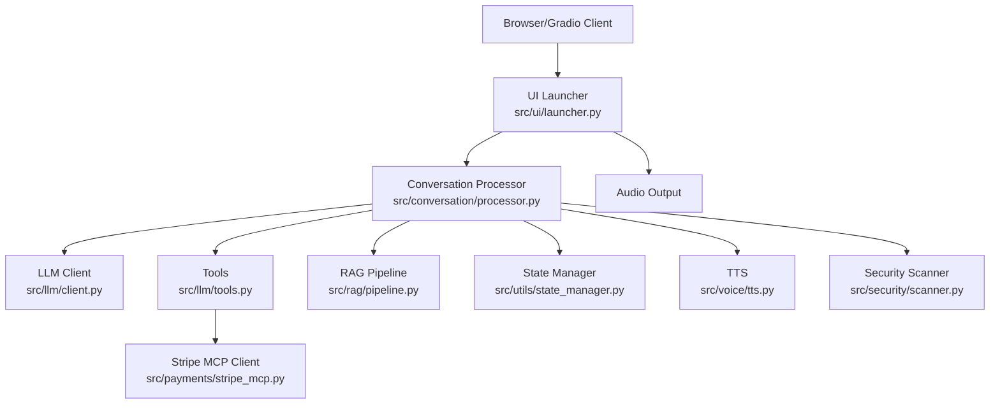

**Diagram sources**
- [src/ui/launcher.py](file://src/ui/launcher.py#L49-L354)
- [src/conversation/processor.py](file://src/conversation/processor.py#L1-L456)
- [src/llm/client.py](file://src/llm/client.py#L91-L211)
- [src/llm/tools.py](file://src/llm/tools.py#L358-L555)
- [src/rag/pipeline.py](file://src/rag/pipeline.py#L60-L105)
- [src/utils/state_manager.py](file://src/utils/state_manager.py#L394-L814)
- [src/payments/stripe_mcp.py](file://src/payments/stripe_mcp.py#L66-L475)
- [src/voice/tts.py](file://src/voice/tts.py#L140-L200)
- [src/security/scanner.py](file://src/security/scanner.py#L32-L137)

## Detailed Component Analysis

### UI Layer: Gradio Integration
- Creates the chatbot, avatar overlay, and audio output.
- Wires user events (submit, tip selection, clear) to handlers.
- Manages session state (history, orders, payment state) and overlays tab/balance/tip visuals.

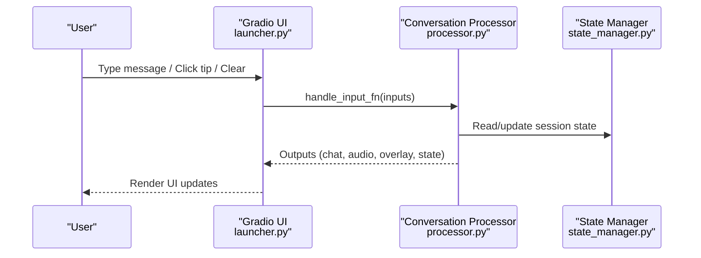

**Diagram sources**
- [src/ui/launcher.py](file://src/ui/launcher.py#L155-L354)
- [src/conversation/processor.py](file://src/conversation/processor.py#L83-L456)
- [src/utils/state_manager.py](file://src/utils/state_manager.py#L394-L529)

**Section sources**
- [src/ui/launcher.py](file://src/ui/launcher.py#L49-L354)

### Conversation Processing: Event-Driven Orchestration
- Validates input via security scanner.
- Determines intent (speech acts or keyword-based) and routes to tools.
- Executes tool calls with parameter validation and error handling.
- Optionally augments LLM responses with RAG using Memvid or FAISS.
- Updates conversation phase and state; cleans up session context.

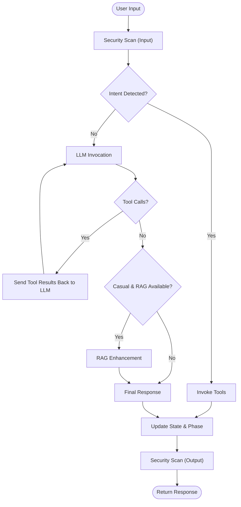

**Diagram sources**
- [src/conversation/processor.py](file://src/conversation/processor.py#L103-L443)
- [src/llm/tools.py](file://src/llm/tools.py#L221-L800)
- [src/rag/pipeline.py](file://src/rag/pipeline.py#L60-L105)
- [src/security/scanner.py](file://src/security/scanner.py#L32-L137)

**Section sources**
- [src/conversation/processor.py](file://src/conversation/processor.py#L1-L456)
- [src/conversation/phase_manager.py](file://src/conversation/phase_manager.py#L1-L92)

### LLM Integration: Unified Client and Tool Binding
- Initializes ChatGoogleGenerativeAI with model configuration.
- Binds tools to the LLM for function calling.
- Provides retry logic and error classification for API calls.

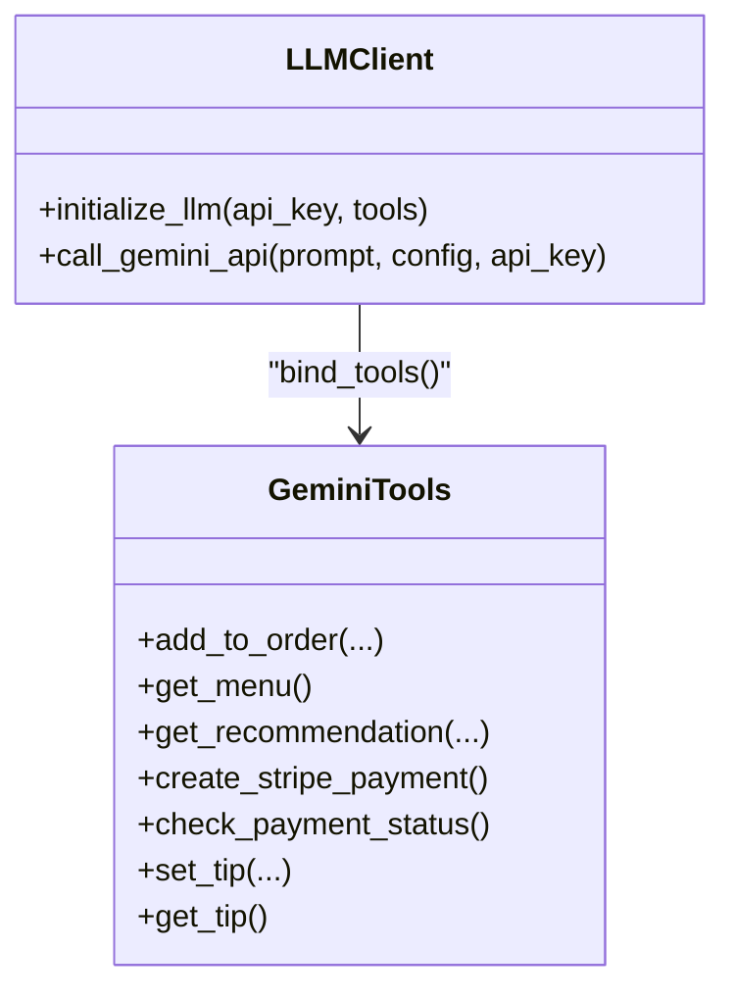

**Diagram sources**
- [src/llm/client.py](file://src/llm/client.py#L91-L211)
- [src/llm/tools.py](file://src/llm/tools.py#L221-L800)

**Section sources**
- [src/llm/client.py](file://src/llm/client.py#L1-L211)
- [src/llm/tools.py](file://src/llm/tools.py#L1-L800)

### RAG Systems: Dual Backend Orchestration
- Memvid pipeline: video-based retrieval with a retriever and API key.
- FAISS pipeline: vector store retrieval and augmentation with Gemini.
- The processor selects the appropriate pipeline based on availability and content.

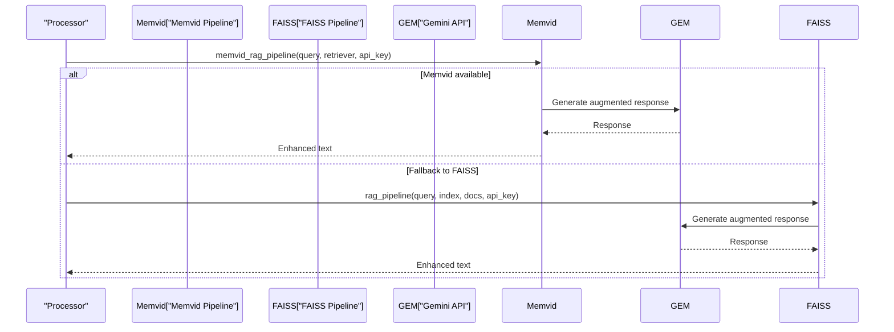

**Diagram sources**
- [src/conversation/processor.py](file://src/conversation/processor.py#L317-L361)
- [src/rag/pipeline.py](file://src/rag/pipeline.py#L60-L105)

**Section sources**
- [src/rag/pipeline.py](file://src/rag/pipeline.py#L1-L105)
- [src/conversation/processor.py](file://src/conversation/processor.py#L301-L361)

### Payment Processing: Stripe MCP and Fallbacks
- Creates idempotent payment links with exponential backoff.
- Polls payment status with timeouts and caches availability.
- Falls back to mock payments when Stripe MCP is unavailable.
- Tools coordinate with state manager for balances, tabs, and tips.

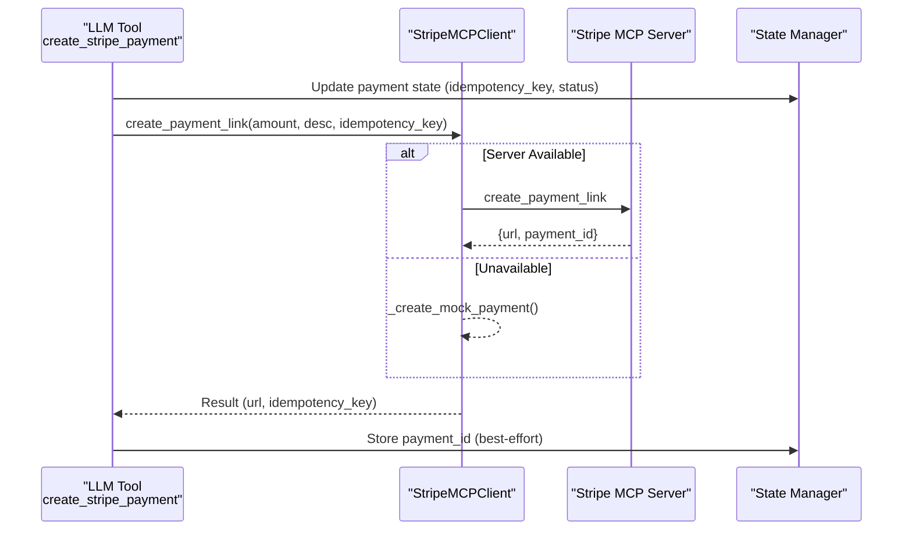

**Diagram sources**
- [src/llm/tools.py](file://src/llm/tools.py#L358-L472)
- [src/payments/stripe_mcp.py](file://src/payments/stripe_mcp.py#L183-L346)
- [src/utils/state_manager.py](file://src/utils/state_manager.py#L642-L677)

**Section sources**
- [src/payments/stripe_mcp.py](file://src/payments/stripe_mcp.py#L66-L475)
- [src/llm/tools.py](file://src/llm/tools.py#L358-L555)
- [src/utils/state_manager.py](file://src/utils/state_manager.py#L556-L677)

### Voice Synthesis: Text Cleaning and TTS
- Cleans text for pronunciation and removes problematic punctuation.
- Synthesizes speech via Cartesia with retry logic and returns WAV bytes.

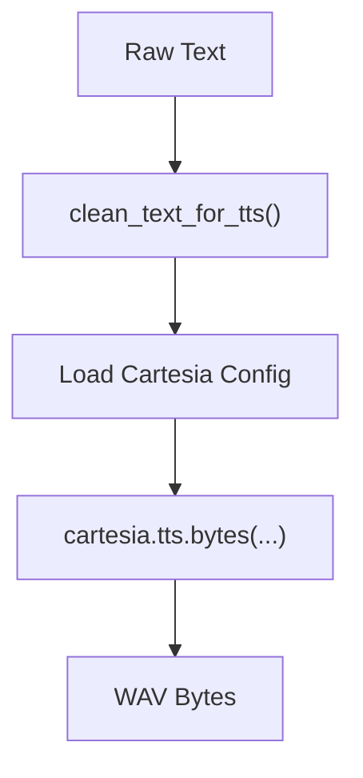

**Diagram sources**
- [src/voice/tts.py](file://src/voice/tts.py#L16-L111)
- [src/voice/tts.py](file://src/voice/tts.py#L140-L200)

**Section sources**
- [src/voice/tts.py](file://src/voice/tts.py#L1-L200)

### Security: Input/Output Scanning
- Checks user input for prompt injection and toxicity.
- Sanitizes or blocks input; sanitizes output with a fallback message.
- Fail-open behavior ensures availability under scanner errors.

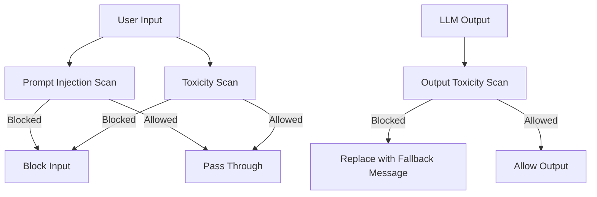

**Diagram sources**
- [src/security/scanner.py](file://src/security/scanner.py#L32-L137)

**Section sources**
- [src/security/scanner.py](file://src/security/scanner.py#L1-L137)

### State Management: Typed, Thread-Safe, Optimistic Locking
- Enforces strict schemas for payment, order, and conversation state.
- Provides atomic operations for concurrent updates with versioning.
- Includes validation, transitions, and cleanup routines.

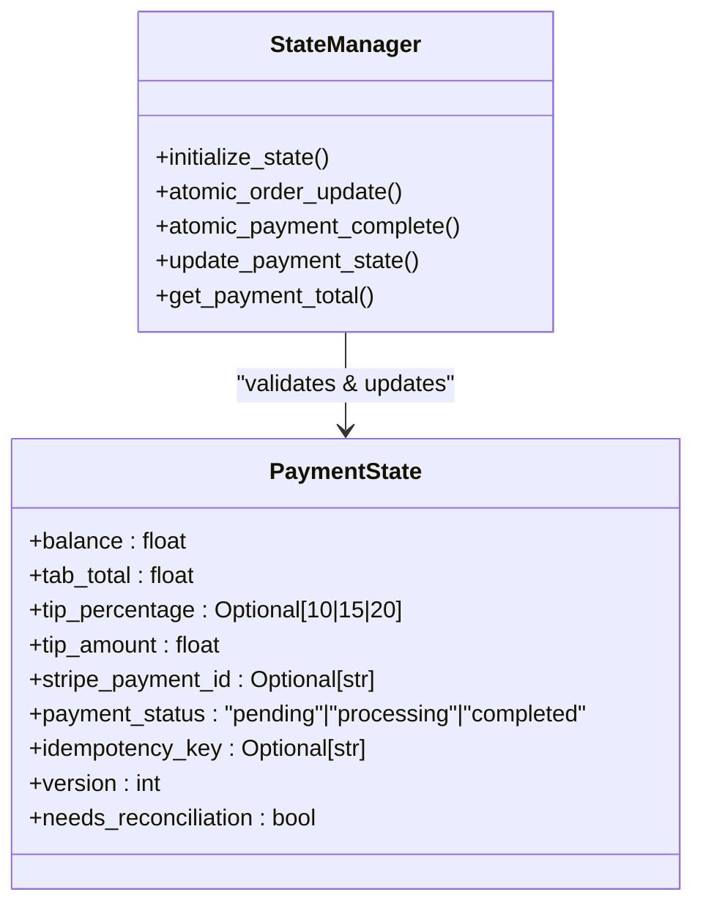

**Diagram sources**
- [src/utils/state_manager.py](file://src/utils/state_manager.py#L17-L814)

**Section sources**
- [src/utils/state_manager.py](file://src/utils/state_manager.py#L1-L814)

## Dependency Analysis
Key dependencies and integration points:
- External services: Google Gemini (via google-generativeai and langchain-google-genai), Cartesia TTS, Stripe MCP server.
- Optional security: llm-guard for input/output scanning.
- Vector stores: FAISS (legacy fallback), Memvid (primary).
- UI framework: Gradio for the chat interface.

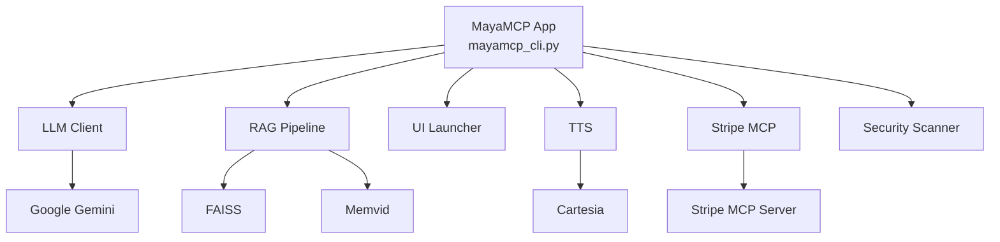

**Diagram sources**
- [src/mayamcp_cli.py](file://src/mayamcp_cli.py#L25-L133)
- [src/llm/client.py](file://src/llm/client.py#L91-L211)
- [src/rag/pipeline.py](file://src/rag/pipeline.py#L60-L105)
- [src/ui/launcher.py](file://src/ui/launcher.py#L49-L354)
- [src/voice/tts.py](file://src/voice/tts.py#L112-L200)
- [src/payments/stripe_mcp.py](file://src/payments/stripe_mcp.py#L66-L475)
- [src/security/scanner.py](file://src/security/scanner.py#L20-L31)

**Section sources**
- [requirements.txt](file://requirements.txt#L1-L41)
- [pyproject.toml](file://pyproject.toml#L29-L31)
- [src/mayamcp_cli.py](file://src/mayamcp_cli.py#L25-L133)

## Performance Considerations
- Resilient LLM calls: retry with exponential backoff and classification of errors.
- RAG fallback chain: Memvid first, then FAISS, then no enhancement to avoid blocking.
- TTS retry: transient failures are retried with bounded attempts.
- Concurrency: thread-safe session locks and optimistic locking prevent race conditions.
- Memory footprint: FAISS kept for compatibility; Memvid preferred when available.

[No sources needed since this section provides general guidance]

## Troubleshooting Guide
Common issues and strategies:
- API key validation: startup routine checks required keys and logs actionable messages.
- Rate limits and timeouts: LLM client classifies and retries; TTS and Stripe MCP clients apply backoff and timeouts.
- RAG initialization failures: Memvid → FAISS → no RAG with warnings.
- Security scanner unavailability: fail-open behavior preserves functionality.
- Payment link creation: availability cache and mock fallback ensure continuity.

**Section sources**
- [src/mayamcp_cli.py](file://src/mayamcp_cli.py#L32-L84)
- [src/llm/client.py](file://src/llm/client.py#L130-L211)
- [src/voice/tts.py](file://src/voice/tts.py#L133-L200)
- [src/payments/stripe_mcp.py](file://src/payments/stripe_mcp.py#L130-L346)
- [src/security/scanner.py](file://src/security/scanner.py#L20-L31)

## Conclusion
MayaNCP’s layered architecture cleanly separates presentation, processing, and integration concerns. The system leverages MCP-compatible payment services, dual-backend RAG, and robust error handling to provide a resilient, scalable, and user-friendly conversational bartender experience. Event-driven flows, typed state management, and security scanning further strengthen reliability and safety.

[No sources needed since this section summarizes without analyzing specific files]

## Appendices

### Technology Stack Choices
- LLM: Google Gemini via langchain-google-genai and google-generativeai.
- RAG: Memvid (primary) and FAISS (fallback).
- UI: Gradio.
- Voice: Cartesia.
- Payments: Stripe MCP with mock fallback.
- Security: llm-guard (optional).
- Testing and linting: pytest, ruff.

**Section sources**
- [requirements.txt](file://requirements.txt#L1-L41)
- [pyproject.toml](file://pyproject.toml#L29-L31)
- [README.md](file://README.md#L125-L182)

### Scalability Considerations
- Asynchronous payment operations: Stripe MCP client uses async patterns for non-blocking retries and polling.
- Stateless UI: Gradio events are handled by the processor with injected dependencies, enabling horizontal scaling.
- Modular components: Each layer can be scaled independently (e.g., multiple LLM workers, RAG replicas).
- Observability: Metrics exposure and structured logging support monitoring and tuning.

**Section sources**
- [src/payments/stripe_mcp.py](file://src/payments/stripe_mcp.py#L183-L475)
- [README.md](file://README.md#L396-L419)