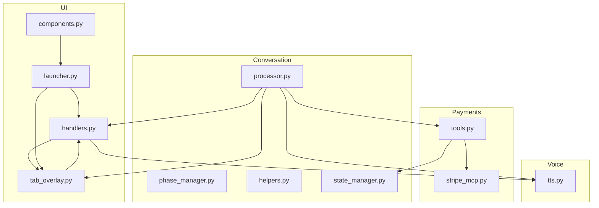
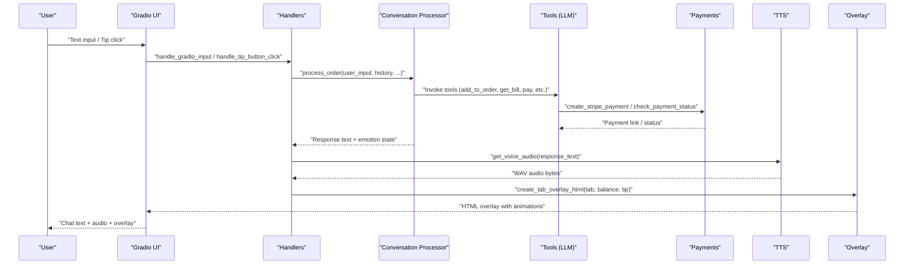
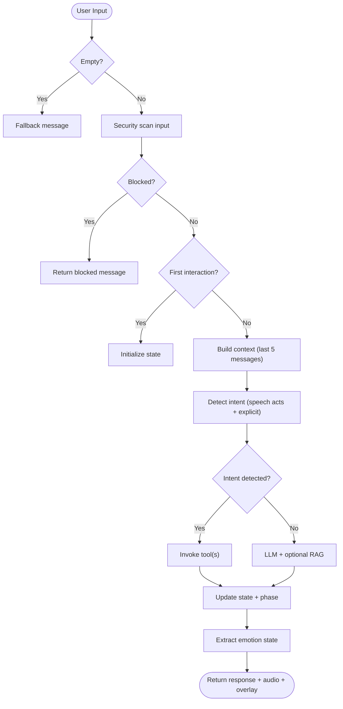
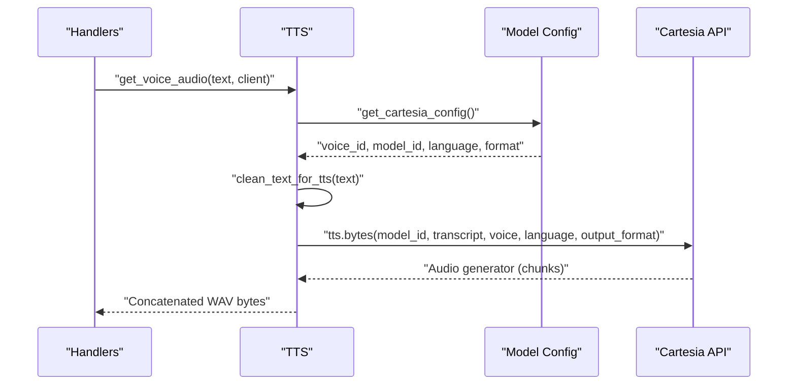
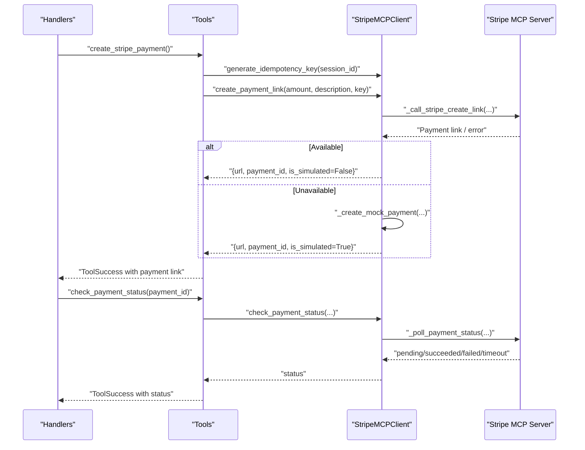
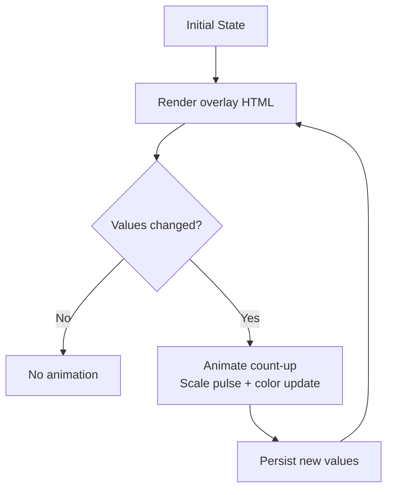
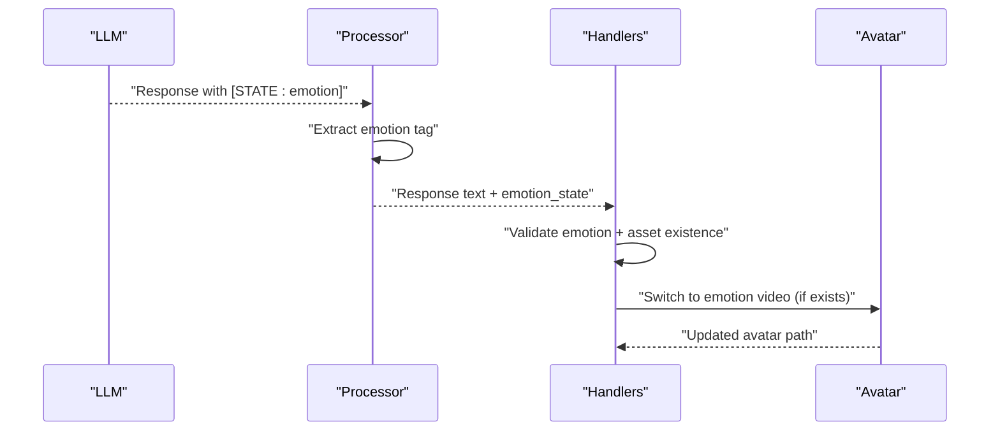
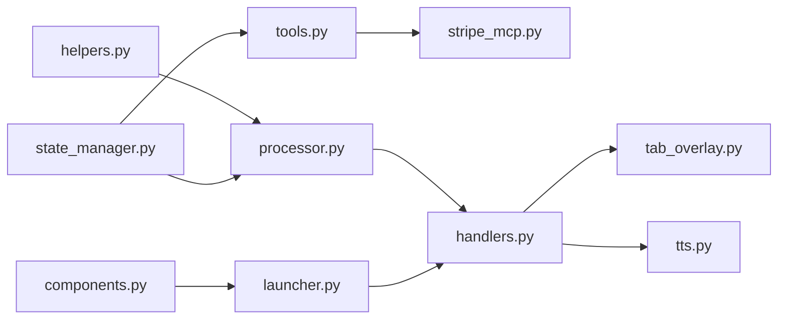

# Core Features

<cite>
**Referenced Files in This Document**
- [processor.py](file://src/conversation/processor.py)
- [phase_manager.py](file://src/conversation/phase_manager.py)
- [helpers.py](file://src/utils/helpers.py)
- [state_manager.py](file://src/utils/state_manager.py)
- [tools.py](file://src/llm/tools.py)
- [tts.py](file://src/voice/tts.py)
- [stripe_mcp.py](file://src/payments/stripe_mcp.py)
- [tab_overlay.py](file://src/ui/tab_overlay.py)
- [handlers.py](file://src/ui/handlers.py)
- [launcher.py](file://src/ui/launcher.py)
- [components.py](file://src/ui/components.py)
- [EMOTION_SYSTEM.md](file://docs/EMOTION_SYSTEM.md)
- [test_speech_acts.py](file://tests/test_speech_acts.py)
- [test_tts.py](file://tests/test_tts.py)
- [test_payment_properties.py](file://tests/test_payment_properties.py)
</cite>

## Table of Contents
1. [Introduction](#introduction)
2. [Project Structure](#project-structure)
3. [Core Components](#core-components)
4. [Architecture Overview](#architecture-overview)
5. [Detailed Component Analysis](#detailed-component-analysis)
6. [Dependency Analysis](#dependency-analysis)
7. [Performance Considerations](#performance-considerations)
8. [Troubleshooting Guide](#troubleshooting-guide)
9. [Conclusion](#conclusion)

## Introduction
This document presents MayaMCP’s core features with a focus on user-facing capabilities and practical demonstrations. It explains how Maya transforms traditional bar ordering into an engaging, AI-driven experience through:
- Multi-turn conversational ordering with intent detection and speech act recognition
- Real-time streaming voice chat powered by Cartesia TTS with natural-sounding audio synthesis
- Stripe payment integration with test mode support, live tab counter overlay, animated balance updates, and tip management
- Emotion-based avatar animation system with dynamic expression switching based on conversation state

The goal is to help users understand what Maya can do, how it works under the hood, and how to integrate and extend these capabilities effectively.

## Project Structure
MayaMCP organizes functionality by domain:
- Conversation processing orchestrates intent detection, tool invocation, and state updates
- Voice synthesis integrates Cartesia for natural speech
- Payments integrate with Stripe MCP in test mode, with fallbacks and polling
- UI composes the avatar overlay, animations, and Gradio interface
- Utilities provide helpers, state management, and validation

**Diagram sources**
- [processor.py](file://src/conversation/processor.py#L1-L456)
- [phase_manager.py](file://src/conversation/phase_manager.py#L1-L92)
- [helpers.py](file://src/utils/helpers.py#L1-L265)
- [state_manager.py](file://src/utils/state_manager.py#L1-L814)
- [tts.py](file://src/voice/tts.py#L1-L200)
- [stripe_mcp.py](file://src/payments/stripe_mcp.py#L1-L475)
- [tools.py](file://src/llm/tools.py#L1-L1066)
- [tab_overlay.py](file://src/ui/tab_overlay.py#L1-L595)
- [handlers.py](file://src/ui/handlers.py#L1-L392)
- [launcher.py](file://src/ui/launcher.py#L1-L354)
- [components.py](file://src/ui/components.py#L1-L55)

**Section sources**
- [processor.py](file://src/conversation/processor.py#L1-L456)
- [tts.py](file://src/voice/tts.py#L1-L200)
- [stripe_mcp.py](file://src/payments/stripe_mcp.py#L1-L475)
- [tab_overlay.py](file://src/ui/tab_overlay.py#L1-L595)
- [handlers.py](file://src/ui/handlers.py#L1-L392)
- [launcher.py](file://src/ui/launcher.py#L1-L354)
- [components.py](file://src/ui/components.py#L1-L55)

## Core Components
- Multi-turn conversational ordering with intent detection and speech act recognition
  - Intent detection identifies order, bill, and payment intents
  - Speech act detection recognizes commissive/assertive/directive patterns for richer understanding
  - Context-aware drink extraction improves accuracy for implicit orders
- Real-time streaming voice chat powered by Cartesia TTS
  - Text cleaning for pronunciation and monetary amounts
  - Robust retry logic and graceful fallbacks
- Stripe payment integration with test mode support
  - Idempotent link creation, availability probing, and polling
  - Fallback to mock payments when Stripe MCP is unavailable
- Live tab counter overlay with animated balance updates and tip management
  - Animated count-up transitions, color-coded balances, and tip buttons
  - Toggle behavior for tip selection/removal
- Emotion-based avatar animation system
  - Internal emotion tags in LLM responses drive dynamic avatar expressions
  - Smooth transitions with poster/fade-in technique

**Section sources**
- [processor.py](file://src/conversation/processor.py#L73-L456)
- [helpers.py](file://src/utils/helpers.py#L9-L265)
- [tts.py](file://src/voice/tts.py#L1-L200)
- [stripe_mcp.py](file://src/payments/stripe_mcp.py#L1-L475)
- [tab_overlay.py](file://src/ui/tab_overlay.py#L1-L595)
- [EMOTION_SYSTEM.md](file://docs/EMOTION_SYSTEM.md#L1-L71)

## Architecture Overview
The system integrates conversation processing, voice synthesis, payments, and UI into a cohesive experience. The flow begins with user input, which is processed by the conversation engine, optionally invokes tools (e.g., payment operations), and returns both text and audio responses. The UI composes the avatar overlay and animations, and the state manager tracks balances, tabs, and tips.

**Diagram sources**
- [handlers.py](file://src/ui/handlers.py#L23-L184)
- [processor.py](file://src/conversation/processor.py#L73-L456)
- [tools.py](file://src/llm/tools.py#L221-L800)
- [stripe_mcp.py](file://src/payments/stripe_mcp.py#L183-L475)
- [tts.py](file://src/voice/tts.py#L140-L200)
- [tab_overlay.py](file://src/ui/tab_overlay.py#L151-L485)

## Detailed Component Analysis

### Multi-Turn Conversational Ordering with Intent Detection and Speech Act Recognition
Maya detects both explicit and implicit ordering intents:
- Explicit intents: “show order,” “get bill,” “pay bill”
- Implicit intents: speech acts indicating commitment (“I can get you that”), assertion (“Here is your drink”), or directives (“Can you make me a whiskey”)

The processor:
- Initializes conversation state on first interaction
- Detects speech acts and order inquiries
- Processes contextual drink mentions for improved accuracy
- Invokes appropriate tools (add to order, get bill, pay)
- Updates conversation phase and emits emotion state for avatar animation

**Diagram sources**
- [processor.py](file://src/conversation/processor.py#L73-L456)
- [helpers.py](file://src/utils/helpers.py#L9-L265)
- [phase_manager.py](file://src/conversation/phase_manager.py#L10-L92)

Practical examples:
- “I can get you that whiskey on the rocks” → Committive speech act → Add to order
- “Show my order” → Explicit intent → Return current order
- “What is my tab?” → Explicit intent → Return bill

Validation:
- Tests demonstrate detection of commissive/assertive/directive speech acts and confidence scoring thresholds

**Section sources**
- [processor.py](file://src/conversation/processor.py#L73-L456)
- [helpers.py](file://src/utils/helpers.py#L9-L265)
- [phase_manager.py](file://src/conversation/phase_manager.py#L10-L92)
- [test_speech_acts.py](file://tests/test_speech_acts.py#L1-L163)

### Real-Time Streaming Voice Chat with Cartesia TTS
Maya synthesizes natural speech using Cartesia:
- Text cleaning for pronunciation and monetary amounts
- Configurable voice and language settings
- Retry logic for transient network errors
- Streaming-ready WAV output for immediate playback

**Diagram sources**
- [tts.py](file://src/voice/tts.py#L140-L200)
- [handlers.py](file://src/ui/handlers.py#L120-L132)

Practical examples:
- Monetary amounts are converted to speech-friendly phrasing (e.g., “$12.50” → “12 dollars and 50 cents”)
- Emojis and special symbols are removed to improve pronunciations
- Empty or invalid inputs are handled gracefully with warnings

**Section sources**
- [tts.py](file://src/voice/tts.py#L1-L200)
- [test_tts.py](file://tests/test_tts.py#L1-L503)

### Stripe Payment Integration with Test Mode Support
Maya supports secure, idempotent payments with Stripe MCP:
- Idempotency keys prevent duplicate payment links
- Availability probing with caching and fallback to mock payments
- Async retry logic with exponential backoff
- Payment status polling with timeouts and terminal-state handling
- Atomic payment completion resets tab and marks status as completed

**Diagram sources**
- [tools.py](file://src/llm/tools.py#L358-L555)
- [stripe_mcp.py](file://src/payments/stripe_mcp.py#L183-L475)

Practical examples:
- Payment link creation with idempotency and fallback
- Status polling with bounded deadlines and timeouts
- Atomic payment completion resets tab and sets status to completed

**Section sources**
- [tools.py](file://src/llm/tools.py#L358-L555)
- [stripe_mcp.py](file://src/payments/stripe_mcp.py#L1-L475)
- [test_payment_properties.py](file://tests/test_payment_properties.py#L472-L590)

### Live Tab Counter Overlay, Animated Balance Updates, and Tip Management
Maya displays a live tab and balance with animated transitions and tip controls:
- Animated count-up from previous to current values
- Color-coded balances based on thresholds
- Tip buttons (10%, 15%, 20%) with toggle behavior
- Tip notifications sent to Maya for contextual responses

**Diagram sources**
- [tab_overlay.py](file://src/ui/tab_overlay.py#L151-L485)
- [handlers.py](file://src/ui/handlers.py#L166-L175)

Practical examples:
- Tab increases when drinks are added; balance decreases accordingly
- Tip selection toggles on repeated clicks; total updates automatically
- Negative balances switch to red; low balances to orange

**Section sources**
- [tab_overlay.py](file://src/ui/tab_overlay.py#L1-L595)
- [handlers.py](file://src/ui/handlers.py#L218-L392)
- [test_payment_properties.py](file://tests/test_payment_properties.py#L612-L686)

### Emotion-Based Avatar Animation System
Maya’s avatar reacts dynamically to conversation state:
- LLM responses include internal emotion tags (e.g., [STATE: happy])
- The processor extracts emotion tags and strips them from the final text
- Handlers resolve the avatar path to the corresponding emotion video if available
- Smooth transitions use a fade-in technique with poster images

**Diagram sources**
- [processor.py](file://src/conversation/processor.py#L172-L202)
- [handlers.py](file://src/ui/handlers.py#L140-L165)
- [EMOTION_SYSTEM.md](file://docs/EMOTION_SYSTEM.md#L15-L71)

Practical examples:
- “I can get you that whiskey” → emotion “happy” → play maya_happy.mp4
- Unknown or missing assets fall back to current avatar state

**Section sources**
- [processor.py](file://src/conversation/processor.py#L172-L202)
- [handlers.py](file://src/ui/handlers.py#L140-L165)
- [EMOTION_SYSTEM.md](file://docs/EMOTION_SYSTEM.md#L1-L71)

## Dependency Analysis
Key dependencies and interactions:
- Conversation processor depends on helpers for intent and speech act detection, state manager for conversation and payment state, and tools for invoking LLM tools
- Handlers orchestrate UI updates, TTS, and overlay composition
- Tools depend on StripeMCPClient and state manager for atomic operations
- UI components depend on tab overlay and launcher for rendering and state wiring

**Diagram sources**
- [processor.py](file://src/conversation/processor.py#L1-L456)
- [helpers.py](file://src/utils/helpers.py#L1-L265)
- [state_manager.py](file://src/utils/state_manager.py#L1-L814)
- [tools.py](file://src/llm/tools.py#L1-L1066)
- [stripe_mcp.py](file://src/payments/stripe_mcp.py#L1-L475)
- [handlers.py](file://src/ui/handlers.py#L1-L392)
- [tab_overlay.py](file://src/ui/tab_overlay.py#L1-L595)
- [tts.py](file://src/voice/tts.py#L1-L200)
- [launcher.py](file://src/ui/launcher.py#L1-L354)
- [components.py](file://src/ui/components.py#L1-L55)

**Section sources**
- [processor.py](file://src/conversation/processor.py#L1-L456)
- [tools.py](file://src/llm/tools.py#L1-L1066)
- [handlers.py](file://src/ui/handlers.py#L1-L392)
- [launcher.py](file://src/ui/launcher.py#L1-L354)

## Performance Considerations
- Streaming voice chat: WAV concatenation from generator minimizes latency; retry logic reduces failures
- Payment operations: Async retries and bounded polling deadlines prevent UI stalls
- UI animations: Collapse strategy merges rapid updates; max queue depth prevents memory pressure
- Conversation processing: RAG enhancement is gated by casual conversation detection to avoid unnecessary overhead

[No sources needed since this section provides general guidance]

## Troubleshooting Guide
Common issues and resolutions:
- TTS failures: Empty text or client not provided; verify input and client initialization
- Payment link creation timeouts: Exceeded retries or unavailable Stripe MCP; fallback to mock payment
- Payment status polling timeouts: Increase deadline or retry later
- Insufficient funds: Atomic order update rejects orders exceeding balance; inform user and adjust selection
- Emotion asset missing: Handler preserves current avatar; ensure emotion video assets exist

**Section sources**
- [tts.py](file://src/voice/tts.py#L133-L200)
- [stripe_mcp.py](file://src/payments/stripe_mcp.py#L216-L273)
- [tools.py](file://src/llm/tools.py#L272-L293)
- [handlers.py](file://src/ui/handlers.py#L120-L132)

## Conclusion
MayaMCP delivers a modern, immersive bar experience by combining intelligent conversation, expressive avatars, and seamless payments. Users can place orders naturally, receive real-time audio responses, manage tabs and tips visually, and enjoy contextual emotion-driven animations—all backed by robust state management, retryable voice synthesis, and test-mode payment flows.