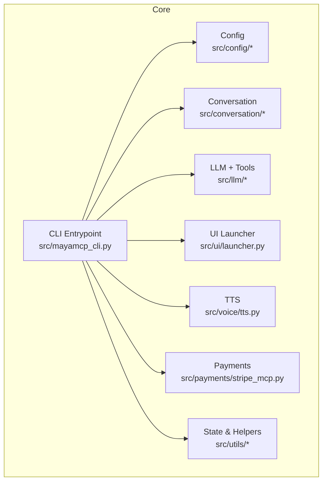
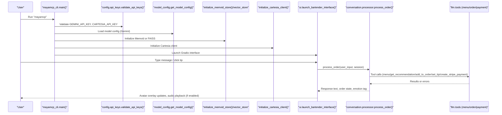
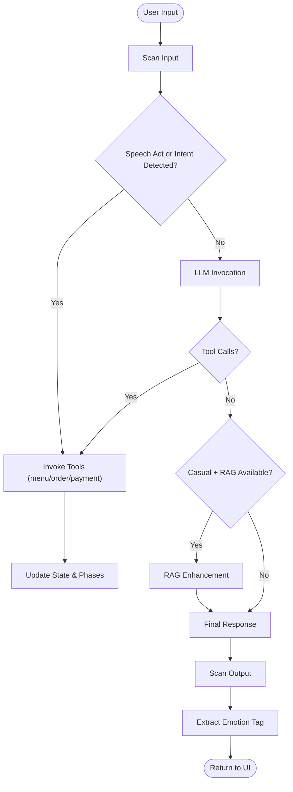
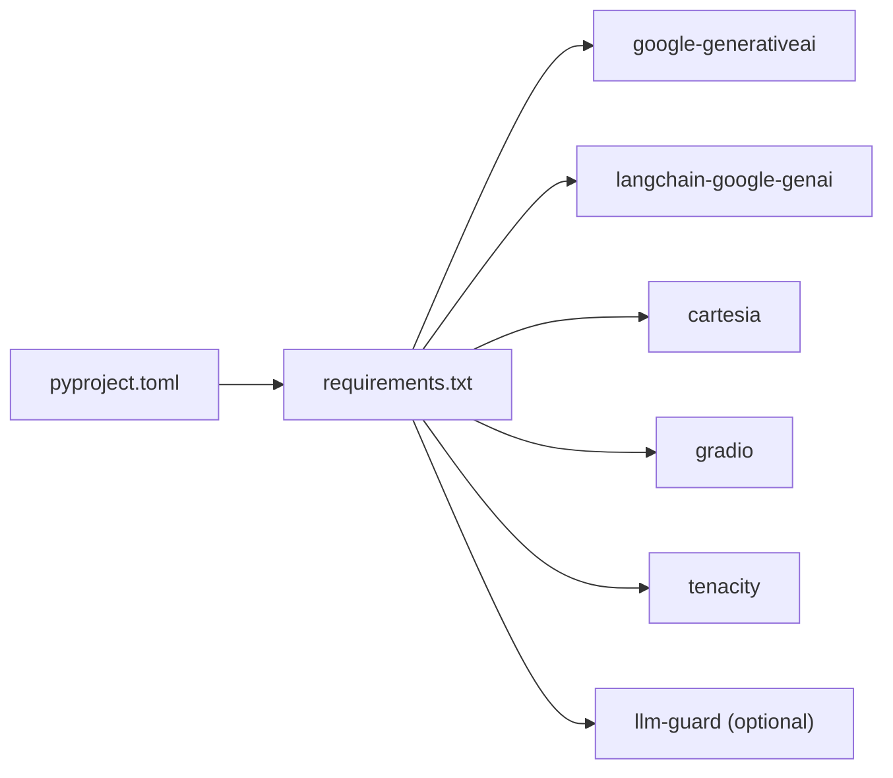

# Getting Started

<cite>
**Referenced Files in This Document**
- [README.md](file://README.md)
- [requirements.txt](file://requirements.txt)
- [pyproject.toml](file://pyproject.toml)
- [src/mayamcp_cli.py](file://src/mayamcp_cli.py)
- [src/config/api_keys.py](file://src/config/api_keys.py)
- [src/config/model_config.py](file://src/config/model_config.py)
- [src/conversation/phase_manager.py](file://src/conversation/phase_manager.py)
- [src/conversation/processor.py](file://src/conversation/processor.py)
- [src/ui/launcher.py](file://src/ui/launcher.py)
- [src/voice/tts.py](file://src/voice/tts.py)
- [src/utils/state_manager.py](file://src/utils/state_manager.py)
- [src/llm/tools.py](file://src/llm/tools.py)
- [src/payments/stripe_mcp.py](file://src/payments/stripe_mcp.py)
</cite>

## Table of Contents
1. [Introduction](#introduction)
2. [Project Structure](#project-structure)
3. [Core Components](#core-components)
4. [Architecture Overview](#architecture-overview)
5. [Detailed Component Analysis](#detailed-component-analysis)
6. [Dependency Analysis](#dependency-analysis)
7. [Performance Considerations](#performance-considerations)
8. [Troubleshooting Guide](#troubleshooting-guide)
9. [Conclusion](#conclusion)

## Introduction
MayaMCP is an AI-powered bartending assistant that blends conversational AI, secure payment processing, and real-time audio-visual interactions. It runs a Gradio UI with an animated bartender avatar, supports multi-turn ordering, and integrates tools for menu queries, recommendations, and payments. The system uses MCP (Model Context Protocol) concepts to orchestrate capabilities like Gemini for reasoning, Cartesia for speech synthesis, and Stripe via MCP for payment links.

Key capabilities:
- Conversational ordering with “conversation phases”
- Real-time streaming voice chat via Cartesia TTS
- Stripe payment links with MCP server integration (test mode)
- Emotion-driven avatar animations synchronized with conversation state
- Robust fallbacks for RAG, TTS, and payment systems

## Project Structure
High-level layout for rapid onboarding:
- src/: Modular Python package with core features
- config/: API key and model configuration
- conversation/: Phase management and processing logic
- llm/: LLM client, prompts, and tools
- ui/: Gradio launcher and components
- voice/: TTS integration with Cartesia
- payments/: Stripe MCP client and fallbacks
- utils/: State management and helpers
- assets/: Avatar images and animations
- tests/: Unit and integration tests

**Diagram sources**
- [src/mayamcp_cli.py](file://src/mayamcp_cli.py#L25-L133)
- [src/config/api_keys.py](file://src/config/api_keys.py#L10-L51)
- [src/conversation/phase_manager.py](file://src/conversation/phase_manager.py#L10-L92)
- [src/conversation/processor.py](file://src/conversation/processor.py#L1-L456)
- [src/llm/tools.py](file://src/llm/tools.py#L1-L800)
- [src/ui/launcher.py](file://src/ui/launcher.py#L49-L354)
- [src/voice/tts.py](file://src/voice/tts.py#L112-L200)
- [src/payments/stripe_mcp.py](file://src/payments/stripe_mcp.py#L66-L475)
- [src/utils/state_manager.py](file://src/utils/state_manager.py#L394-L814)

**Section sources**
- [README.md](file://README.md#L34-L51)
- [src/mayamcp_cli.py](file://src/mayamcp_cli.py#L25-L133)

## Core Components
- CLI Entrypoint: Initializes logging, validates API keys, loads model config, sets up RAG/TTS, and launches the UI.
- Configuration: Loads .env, validates keys, and exposes model/TTS configs.
- Conversation Phases: Manages conversation turns, small talk counters, and phase transitions.
- LLM + Tools: Gemini-backed LLM with tool calling for menu, recommendations, ordering, tips, and payments.
- UI: Gradio Blocks with avatar overlay, chat, and audio output.
- Voice: Cartesia TTS with retry logic and text cleaning.
- Payments: Stripe MCP client with availability probing, idempotent link creation, and status polling.

**Section sources**
- [src/mayamcp_cli.py](file://src/mayamcp_cli.py#L25-L133)
- [src/config/api_keys.py](file://src/config/api_keys.py#L10-L51)
- [src/config/model_config.py](file://src/config/model_config.py#L31-L77)
- [src/conversation/phase_manager.py](file://src/conversation/phase_manager.py#L10-L92)
- [src/conversation/processor.py](file://src/conversation/processor.py#L1-L456)
- [src/llm/tools.py](file://src/llm/tools.py#L1-L800)
- [src/ui/launcher.py](file://src/ui/launcher.py#L49-L354)
- [src/voice/tts.py](file://src/voice/tts.py#L112-L200)
- [src/payments/stripe_mcp.py](file://src/payments/stripe_mcp.py#L66-L475)
- [src/utils/state_manager.py](file://src/utils/state_manager.py#L394-L814)

## Architecture Overview
End-to-end startup and interaction flow from CLI to UI and tools.

**Diagram sources**
- [src/mayamcp_cli.py](file://src/mayamcp_cli.py#L25-L133)
- [src/config/api_keys.py](file://src/config/api_keys.py#L24-L43)
- [src/config/model_config.py](file://src/config/model_config.py#L31-L77)
- [src/conversation/processor.py](file://src/conversation/processor.py#L73-L456)
- [src/llm/tools.py](file://src/llm/tools.py#L221-L800)
- [src/ui/launcher.py](file://src/ui/launcher.py#L49-L354)
- [src/voice/tts.py](file://src/voice/tts.py#L112-L200)

## Detailed Component Analysis

### Installation and Setup
- Prerequisites
  - Python 3.12+ recommended; project metadata indicates support for 3.8+.
  - Virtual environment strongly advised.
- Steps
  1) Create and activate a virtual environment.
  2) Install the project in editable mode to register the console command and install dependencies.
  3) Create a .env file with required API keys.
  4) Launch the application via the console command.

Quick commands:
- Create and activate a virtual environment.
- Install the project in editable mode to set up the mayamcp console command and install dependencies.
- Run the application using the console command.
- Alternative: run the main module directly.

Notes:
- The project installs dependencies from requirements.txt and registers the mayamcp console command via pyproject configuration.
- The CLI validates API keys and model configuration at startup.

**Section sources**
- [README.md](file://README.md#L70-L124)
- [pyproject.toml](file://pyproject.toml#L29-L40)
- [requirements.txt](file://requirements.txt#L1-L41)
- [src/mayamcp_cli.py](file://src/mayamcp_cli.py#L31-L50)

### API Key Configuration
- Required keys
  - GEMINI_API_KEY: Gemini API key for the LLM.
  - CARTESIA_API_KEY: Cartesia API key for TTS.
- Optional keys and settings
  - GEMINI_MODEL_VERSION: Override default Gemini model.
  - TEMPERATURE, MAX_OUTPUT_TOKENS: Generation parameters.
  - PYTHON_ENV=development, DEBUG=True: Development flags.
- Validation
  - The CLI checks for presence of required keys and logs actionable messages if missing.
  - Model version is validated as a warning-only check.

Where to configure:
- Create a .env file at the repository root with the above keys.
- Optionally set model and environment variables.

Verification:
- On startup, the CLI logs whether API keys are validated and whether the configured model is recognized.

**Section sources**
- [README.md](file://README.md#L125-L182)
- [src/config/api_keys.py](file://src/config/api_keys.py#L10-L51)
- [src/mayamcp_cli.py](file://src/mayamcp_cli.py#L32-L49)
- [src/config/model_config.py](file://src/config/model_config.py#L31-L77)

### Stripe Integration (MCP)
- Purpose: Create payment links and poll status via Stripe MCP server.
- Behavior
  - Uses test mode by default.
  - Generates idempotency keys per session.
  - Falls back to mock payment if MCP server is unavailable.
  - Provides availability probing and caching.
- Configuration
  - The project includes a Stripe MCP client and a configuration example for MCP servers in the Kiro settings directory.
  - Without MCP server configured, the app uses mock payment links for demos.

Operational notes:
- The tools module invokes the Stripe MCP client to create links and check status.
- Payment state is managed with optimistic locking and validation.

**Section sources**
- [README.md](file://README.md#L140-L173)
- [src/payments/stripe_mcp.py](file://src/payments/stripe_mcp.py#L66-L475)
- [src/llm/tools.py](file://src/llm/tools.py#L358-L472)
- [src/utils/state_manager.py](file://src/utils/state_manager.py#L535-L624)

### Conversation Phases and Processing
- ConversationPhaseManager
  - Tracks turn count, small talk, and last order time.
  - Transitions between greeting, small talk, and ordering phases.
  - Determines when to use RAG for casual conversation.
- Processor
  - Security scanning for input and output.
  - Speech act detection and intent matching.
  - LLM invocation with tool calls and RAG augmentation.
  - Updates conversation and payment state, emits emotion tags.

**Diagram sources**
- [src/conversation/processor.py](file://src/conversation/processor.py#L103-L456)
- [src/conversation/phase_manager.py](file://src/conversation/phase_manager.py#L42-L92)
- [src/llm/tools.py](file://src/llm/tools.py#L221-L800)

**Section sources**
- [src/conversation/phase_manager.py](file://src/conversation/phase_manager.py#L10-L92)
- [src/conversation/processor.py](file://src/conversation/processor.py#L73-L456)

### UI and Audio
- Gradio interface
  - Avatar overlay with tab and balance display.
  - Chatbot, audio output, and tip buttons.
  - Tip selection triggers a message flow to the agent.
- TTS
  - Cartesia client initialization and audio synthesis with retry logic.
  - Text cleaning improves pronunciation and removes problematic punctuation.

**Section sources**
- [src/ui/launcher.py](file://src/ui/launcher.py#L49-L354)
- [src/voice/tts.py](file://src/voice/tts.py#L112-L200)

### Payment State Management
- Atomic operations
  - Optimistic locking with version increments.
  - Insufficient funds and concurrent modification handling.
- Tip logic
  - Toggle behavior for 10%/15%/20%.
  - Calculates tip amount and total including tip.
- Validation
  - Strict validation of state fields and transitions.

**Section sources**
- [src/utils/state_manager.py](file://src/utils/state_manager.py#L535-L814)
- [src/llm/tools.py](file://src/llm/tools.py#L557-L648)

## Dependency Analysis
- Python packaging
  - pyproject.toml defines the console script and dynamic dependencies loaded from requirements.txt.
- Runtime dependencies
  - google-generativeai and langchain-google-genai for Gemini integration.
  - cartesia for TTS.
  - gradio for UI.
  - tenacity for TTS retries.
  - Optional llm-guard for security scanning.

**Diagram sources**
- [pyproject.toml](file://pyproject.toml#L29-L40)
- [requirements.txt](file://requirements.txt#L1-L41)

**Section sources**
- [pyproject.toml](file://pyproject.toml#L29-L40)
- [requirements.txt](file://requirements.txt#L1-L41)

## Performance Considerations
- RAG fallback chain
  - Memvid first, then FAISS, then no RAG if both fail.
- TTS retry policy
  - Exponential backoff with tenacity to handle transient errors.
- Async payment operations
  - Stripe MCP client uses async retries and polling with timeouts.
- Logging and warnings
  - Startup warnings for unrecognized model identifiers; graceful degradation for optional features.

[No sources needed since this section provides general guidance]

## Troubleshooting Guide
Common setup and runtime issues:
- Missing API keys
  - The CLI logs a clear error and exits if required keys are missing.
- Unrecognized Gemini model
  - Startup logs a warning but continues; adjust GEMINI_MODEL_VERSION to a known model.
- TTS initialization failures
  - The CLI logs a warning and continues without TTS; verify CARTESIA_API_KEY.
- RAG initialization failures
  - The CLI logs warnings and continues without RAG; ensure Memvid/FAISS prerequisites are met.
- Payment MCP unavailability
  - Stripe MCP client falls back to mock payments; configure MCP server for real links.
- UI launch issues
  - The CLI logs exceptions during Gradio launch; check host/port and debug flags.

Verification steps:
- Confirm .env contains GEMINI_API_KEY and CARTESIA_API_KEY.
- Run the console command and observe startup logs for validation and warnings.
- Open the UI at the reported address and test a simple order.

**Section sources**
- [src/mayamcp_cli.py](file://src/mayamcp_cli.py#L32-L83)
- [src/config/api_keys.py](file://src/config/api_keys.py#L24-L43)
- [src/config/model_config.py](file://src/config/model_config.py#L93-L102)
- [README.md](file://README.md#L313-L333)

## Conclusion
You are ready to run MayaMCP locally with minimal setup. Create a virtual environment, install the project in editable mode, configure API keys, and launch the application. Explore the UI, place an order, and optionally integrate Stripe via MCP for live payment links. The system’s robust fallbacks ensure a smooth experience even when optional services are unavailable.