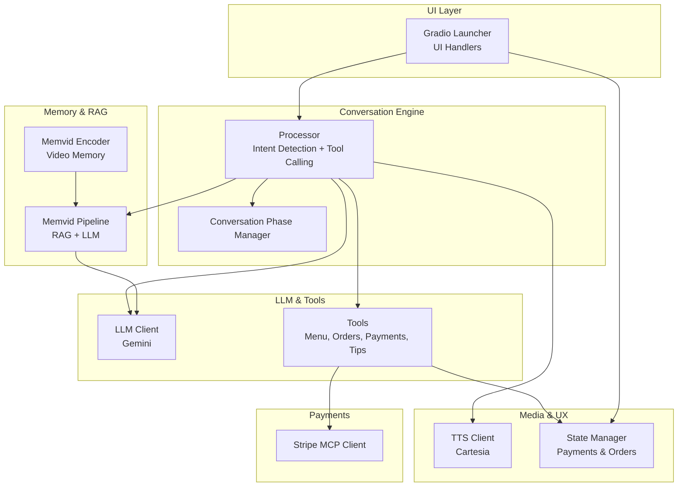
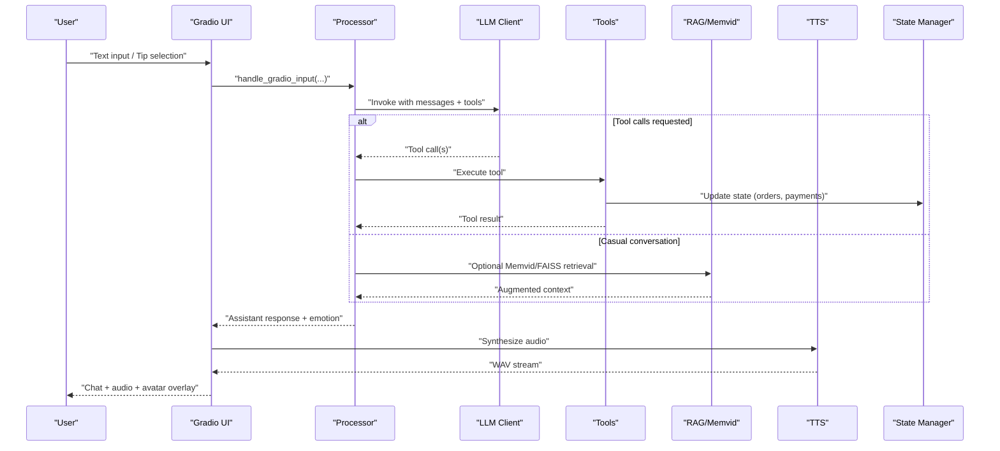
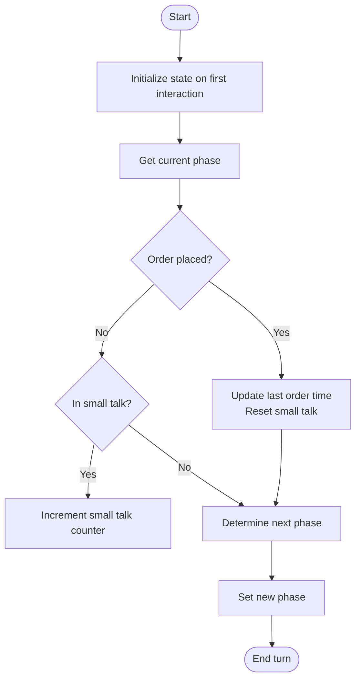
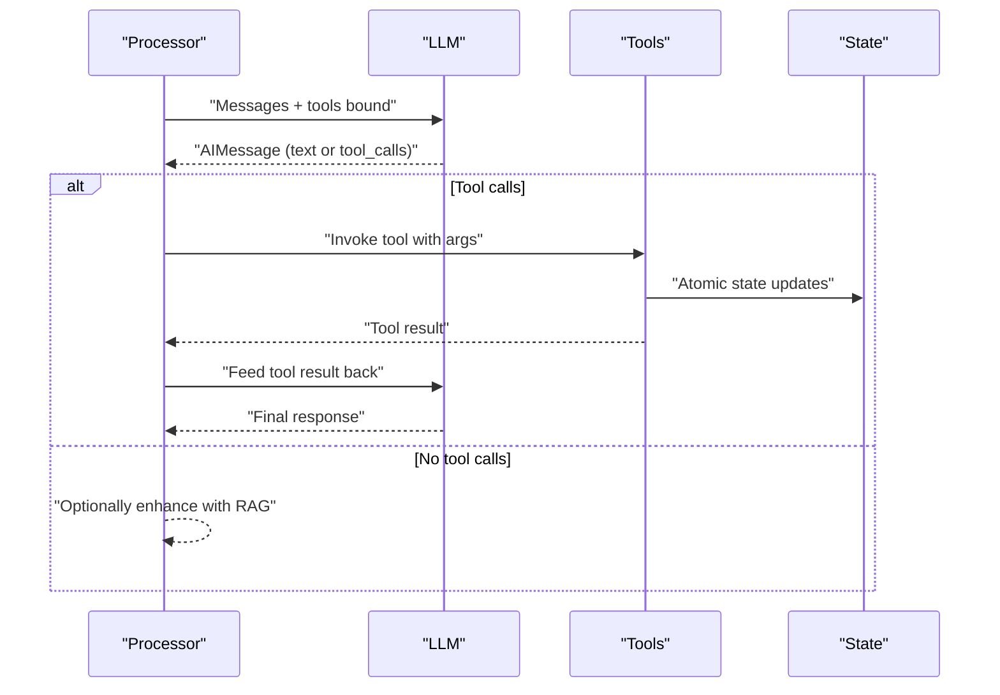
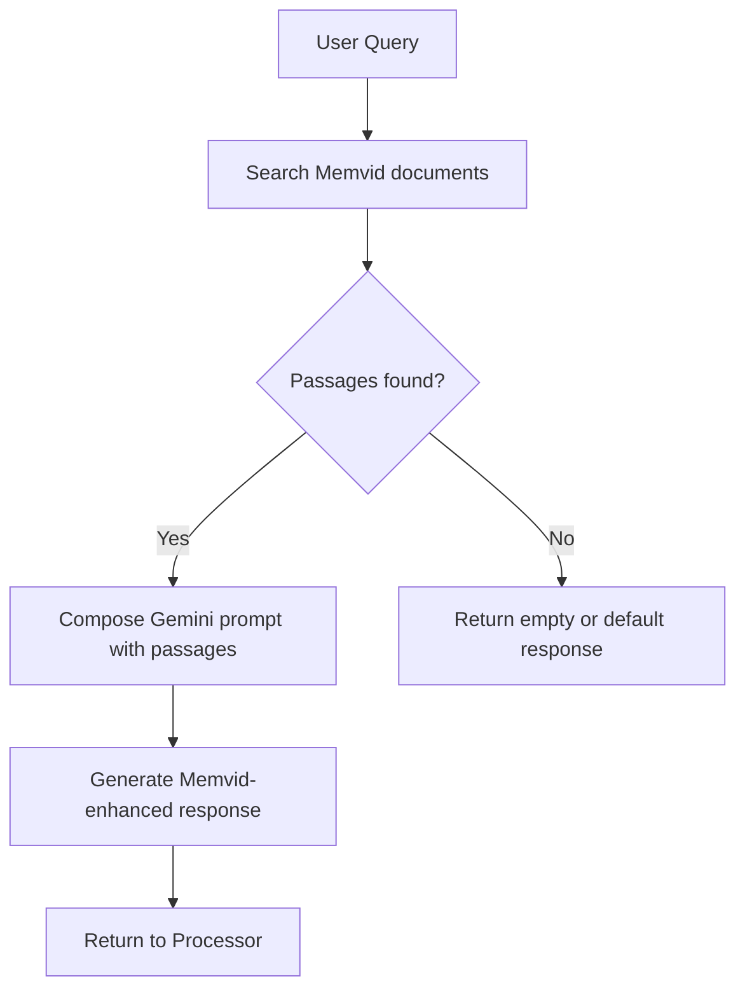
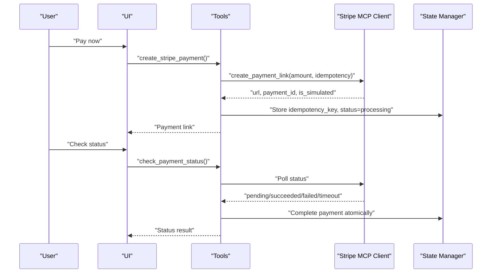
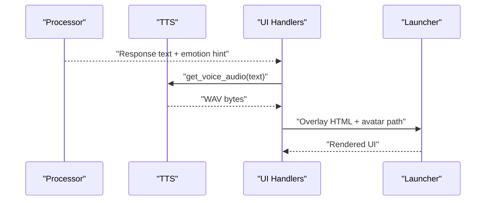
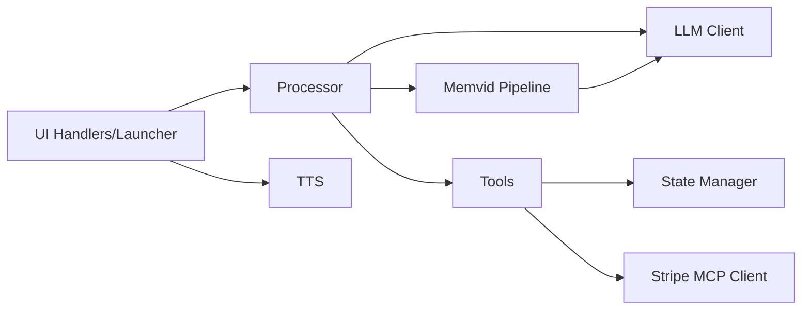

# Project Overview

<cite>
**Referenced Files in This Document**
- [README.md](file://README.md)
- [src/__init__.py](file://src/__init__.py)
- [src/conversation/phase_manager.py](file://src/conversation/phase_manager.py)
- [src/conversation/processor.py](file://src/conversation/processor.py)
- [src/llm/client.py](file://src/llm/client.py)
- [src/llm/tools.py](file://src/llm/tools.py)
- [src/rag/memvid_pipeline.py](file://src/rag/memvid_pipeline.py)
- [src/memvid/encoder.py](file://src/memvid/encoder.py)
- [src/ui/launcher.py](file://src/ui/launcher.py)
- [src/ui/handlers.py](file://src/ui/handlers.py)
- [src/payments/stripe_mcp.py](file://src/payments/stripe_mcp.py)
- [src/voice/tts.py](file://src/voice/tts.py)
- [src/utils/state_manager.py](file://src/utils/state_manager.py)
</cite>

## Table of Contents
1. [Introduction](#introduction)
2. [Project Structure](#project-structure)
3. [Core Components](#core-components)
4. [Architecture Overview](#architecture-overview)
5. [Detailed Component Analysis](#detailed-component-analysis)
6. [Dependency Analysis](#dependency-analysis)
7. [Performance Considerations](#performance-considerations)
8. [Troubleshooting Guide](#troubleshooting-guide)
9. [Conclusion](#conclusion)

## Introduction
MayaMCP is an AI-powered bartending assistant that transforms traditional bar ordering into an immersive, conversational experience. It combines natural language understanding, Retrieval-Augmented Generation (RAG), secure payment orchestration, and real-time audio-visual feedback to bring a lifelike bartender to your browser.

Key value propositions:
- Conversational ordering with context-aware “conversation phases” that evolve as users interact
- RAG-powered personality and knowledge augmentation via Memvid (video-based memory) and text-based retrieval
- Integrated, resilient payment processing with Stripe MCP and graceful fallbacks
- Emotionally expressive avatar with animated tab and balance overlays
- Streaming voice synthesis for natural audio responses

MayaMCP originated as the Kaggle Gen AI Intensive Course Q1 2025 capstone and evolved to embrace the MCP protocol, expanding beyond Google’s Gemini to integrate broader AI agent ecosystems while retaining a focus on practical, real-time interactions.

## Project Structure
The project is organized into modular packages that cleanly separate concerns:
- Configuration and logging
- LLM orchestration and tooling
- RAG and Memvid memory systems
- Payment processing with Stripe MCP
- Voice synthesis with Cartesia
- UI and event handlers with Gradio
- State management for payments, orders, and conversations
- Assets for avatar animations and personality videos

**Diagram sources**
- [src/ui/launcher.py](file://src/ui/launcher.py#L49-L354)
- [src/ui/handlers.py](file://src/ui/handlers.py#L23-L392)
- [src/conversation/phase_manager.py](file://src/conversation/phase_manager.py#L10-L92)
- [src/conversation/processor.py](file://src/conversation/processor.py#L1-L456)
- [src/llm/client.py](file://src/llm/client.py#L91-L211)
- [src/llm/tools.py](file://src/llm/tools.py#L221-L800)
- [src/rag/memvid_pipeline.py](file://src/rag/memvid_pipeline.py#L65-L108)
- [src/memvid/encoder.py](file://src/memvid/encoder.py#L18-L201)
- [src/voice/tts.py](file://src/voice/tts.py#L140-L200)
- [src/utils/state_manager.py](file://src/utils/state_manager.py#L48-L814)
- [src/payments/stripe_mcp.py](file://src/payments/stripe_mcp.py#L66-L475)

**Section sources**
- [README.md](file://README.md#L34-L41)
- [src/__init__.py](file://src/__init__.py#L1-L9)

## Core Components
- Conversation phases and state transitions: Maya adapts her personality and prompts based on structured “conversation phases,” evolving from greeting to small talk to order-focused interactions.
- LLM orchestration with tool calling: The system uses a Gemini-backed LLM to interpret user intents, call domain tools (menu lookup, order management, payments), and optionally enhance responses with RAG.
- Memvid and text-based RAG: Personality and contextual knowledge are retrieved from both video-encoded memory and text corpora to enrich responses.
- Payment lifecycle: Maya coordinates tab accumulation, tip selection, and payment initiation via Stripe MCP with robust fallbacks and idempotent state updates.
- Voice and visuals: Cartesia TTS generates streaming audio; emotion-driven avatar animations reflect the agent’s internal state and user interactions.
- UI and overlays: Gradio provides a responsive chat interface with animated tab and balance displays, integrated tip controls, and avatar state persistence.

**Section sources**
- [src/conversation/phase_manager.py](file://src/conversation/phase_manager.py#L10-L92)
- [src/conversation/processor.py](file://src/conversation/processor.py#L1-L456)
- [src/llm/client.py](file://src/llm/client.py#L91-L211)
- [src/llm/tools.py](file://src/llm/tools.py#L221-L800)
- [src/rag/memvid_pipeline.py](file://src/rag/memvid_pipeline.py#L65-L108)
- [src/memvid/encoder.py](file://src/memvid/encoder.py#L18-L201)
- [src/payments/stripe_mcp.py](file://src/payments/stripe_mcp.py#L66-L475)
- [src/voice/tts.py](file://src/voice/tts.py#L140-L200)
- [src/ui/launcher.py](file://src/ui/launcher.py#L49-L354)
- [src/ui/handlers.py](file://src/ui/handlers.py#L23-L392)
- [src/utils/state_manager.py](file://src/utils/state_manager.py#L48-L814)

## Architecture Overview
MayaMCP integrates multiple subsystems around a central conversation processor:
- UI layer (Gradio) captures user input, renders chat and avatar overlays, and streams audio.
- Processor orchestrates intent detection, tool invocation, optional RAG enhancement, and state updates.
- LLM client wraps Gemini for model selection, generation configs, and tool binding.
- Tools encapsulate menu, order, tip, and payment operations with strict validation and idempotency.
- Memvid pipeline retrieves video-memory passages and augments LLM responses with personality context.
- Voice client synthesizes speech with retry logic; state manager tracks balances, tabs, and payment statuses.

**Diagram sources**
- [src/ui/handlers.py](file://src/ui/handlers.py#L23-L184)
- [src/conversation/processor.py](file://src/conversation/processor.py#L275-L443)
- [src/llm/client.py](file://src/llm/client.py#L91-L211)
- [src/llm/tools.py](file://src/llm/tools.py#L221-L800)
- [src/rag/memvid_pipeline.py](file://src/rag/memvid_pipeline.py#L65-L108)
- [src/voice/tts.py](file://src/voice/tts.py#L140-L200)
- [src/utils/state_manager.py](file://src/utils/state_manager.py#L48-L814)

## Detailed Component Analysis

### Conversation Phases and State Transitions
Maya’s conversation evolves through structured phases, tracked per-session with turn counts and small talk accumulators. The phase manager determines whether casual or order-related interactions warrant RAG augmentation and updates state after each turn and order placement.

**Diagram sources**
- [src/conversation/phase_manager.py](file://src/conversation/phase_manager.py#L18-L67)

**Section sources**
- [src/conversation/phase_manager.py](file://src/conversation/phase_manager.py#L10-L92)
- [src/conversation/processor.py](file://src/conversation/processor.py#L412-L425)

### LLM Orchestration and Tool Calling
The processor builds LangChain-style messages, invokes the Gemini LLM, and executes tool calls when requested. It supports both explicit speech-act-based confirmation and traditional intent detection, with security scanning and RAG enhancement for casual conversation.

**Diagram sources**
- [src/conversation/processor.py](file://src/conversation/processor.py#L275-L406)
- [src/llm/client.py](file://src/llm/client.py#L91-L211)
- [src/llm/tools.py](file://src/llm/tools.py#L221-L800)

**Section sources**
- [src/conversation/processor.py](file://src/conversation/processor.py#L1-L456)
- [src/llm/client.py](file://src/llm/client.py#L91-L211)
- [src/llm/tools.py](file://src/llm/tools.py#L221-L800)

### Memvid and RAG Enhancement
Maya augments responses using Memvid video memory and/or FAISS-based text retrieval. The Memvid pipeline retrieves relevant video frames’ textual content and composes a Gemini-augmented answer, preserving personality context and thematic coherence.

**Diagram sources**
- [src/rag/memvid_pipeline.py](file://src/rag/memvid_pipeline.py#L65-L108)
- [src/memvid/encoder.py](file://src/memvid/encoder.py#L18-L201)

**Section sources**
- [src/rag/memvid_pipeline.py](file://src/rag/memvid_pipeline.py#L1-L108)
- [src/memvid/encoder.py](file://src/memvid/encoder.py#L18-L201)

### Payment Lifecycle with Stripe MCP
Maya manages a simulated bar tab with balance tracking, tip selection, and payment initiation. The Stripe MCP client creates idempotent payment links, polls status, and falls back to mock payments when unavailable. Atomic state updates ensure correctness under concurrent access.

**Diagram sources**
- [src/llm/tools.py](file://src/llm/tools.py#L358-L472)
- [src/payments/stripe_mcp.py](file://src/payments/stripe_mcp.py#L183-L441)
- [src/utils/state_manager.py](file://src/utils/state_manager.py#L780-L814)

**Section sources**
- [src/llm/tools.py](file://src/llm/tools.py#L358-L472)
- [src/payments/stripe_mcp.py](file://src/payments/stripe_mcp.py#L66-L475)
- [src/utils/state_manager.py](file://src/utils/state_manager.py#L535-L814)

### Voice Synthesis and Emotion-Driven Avatars
Maya speaks via Cartesia TTS with retry logic and text cleaning. The UI resolves emotion-based avatar states from the agent’s response and animates tab/balance overlays for a cohesive, expressive experience.

**Diagram sources**
- [src/conversation/processor.py](file://src/conversation/processor.py#L172-L202)
- [src/voice/tts.py](file://src/voice/tts.py#L140-L200)
- [src/ui/handlers.py](file://src/ui/handlers.py#L120-L184)
- [src/ui/launcher.py](file://src/ui/launcher.py#L13-L47)

**Section sources**
- [src/voice/tts.py](file://src/voice/tts.py#L1-L200)
- [src/ui/handlers.py](file://src/ui/handlers.py#L140-L184)
- [src/ui/launcher.py](file://src/ui/launcher.py#L13-L47)

## Dependency Analysis
MayaMCP exhibits clear separation of concerns with low coupling between UI, conversation, LLM, tools, memory, and media layers. Key dependencies:
- UI depends on processor, TTS, and state manager
- Processor depends on LLM client, tools, RAG/Memvid, and security helpers
- Tools depend on state manager and Stripe MCP client
- Memvid pipeline depends on retriever and LLM client
- Voice client depends on Cartesia SDK and configuration

**Diagram sources**
- [src/ui/handlers.py](file://src/ui/handlers.py#L23-L392)
- [src/ui/launcher.py](file://src/ui/launcher.py#L49-L354)
- [src/conversation/processor.py](file://src/conversation/processor.py#L1-L456)
- [src/llm/client.py](file://src/llm/client.py#L91-L211)
- [src/llm/tools.py](file://src/llm/tools.py#L221-L800)
- [src/rag/memvid_pipeline.py](file://src/rag/memvid_pipeline.py#L65-L108)
- [src/payments/stripe_mcp.py](file://src/payments/stripe_mcp.py#L66-L475)
- [src/voice/tts.py](file://src/voice/tts.py#L140-L200)
- [src/utils/state_manager.py](file://src/utils/state_manager.py#L48-L814)

**Section sources**
- [src/ui/handlers.py](file://src/ui/handlers.py#L23-L392)
- [src/conversation/processor.py](file://src/conversation/processor.py#L1-L456)
- [src/llm/tools.py](file://src/llm/tools.py#L221-L800)
- [src/rag/memvid_pipeline.py](file://src/rag/memvid_pipeline.py#L65-L108)
- [src/payments/stripe_mcp.py](file://src/payments/stripe_mcp.py#L66-L475)
- [src/voice/tts.py](file://src/voice/tts.py#L140-L200)
- [src/utils/state_manager.py](file://src/utils/state_manager.py#L48-L814)

## Performance Considerations
- LLM retries and exponential backoff minimize transient API failures
- RAG fallbacks degrade gracefully: Memvid → FAISS → no enhancement
- TTS uses retry decorators and streaming audio to reduce latency
- State updates are atomic and validated to prevent inconsistent UI overlays
- UI animations compute deltas between previous and current values to reduce redraw overhead

[No sources needed since this section provides general guidance]

## Troubleshooting Guide
Common issues and remedies:
- Missing API keys: Ensure GEMINI_API_KEY and CARTESIA_API_KEY are configured; Stripe MCP is optional for test mode
- Payment unavailability: Stripe MCP client falls back to mock payments; verify MCP server configuration if real payments are required
- RAG failures: The system logs warnings and continues without enhancement; verify Memvid retriever and FAISS index initialization
- TTS failures: The system falls back to text-only responses; check Cartesia credentials and network connectivity
- State inconsistencies: Atomic operations and validation guard against concurrent modifications; inspect session locks and version fields

**Section sources**
- [README.md](file://README.md#L125-L182)
- [src/payments/stripe_mcp.py](file://src/payments/stripe_mcp.py#L130-L181)
- [src/conversation/processor.py](file://src/conversation/processor.py#L338-L361)
- [src/voice/tts.py](file://src/voice/tts.py#L133-L200)
- [src/utils/state_manager.py](file://src/utils/state_manager.py#L680-L756)

## Conclusion
MayaMCP demonstrates a modern AI agent ecosystem that blends conversational AI, secure payments, and expressive UI/UX. By structuring the system around “conversation phases,” integrating RAG with Memvid and text-based retrieval, and leveraging MCP for payment orchestration, Maya delivers a compelling, extensible platform for AI-driven hospitality experiences. Its modular design and robust error handling make it a strong foundation for further enhancements and deployments.