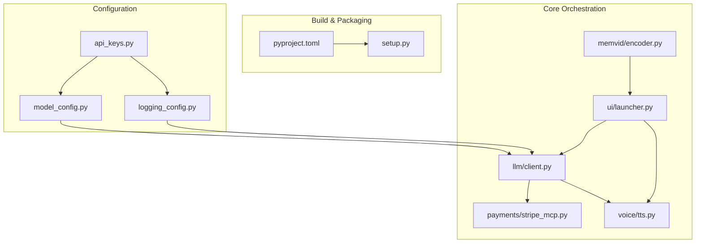
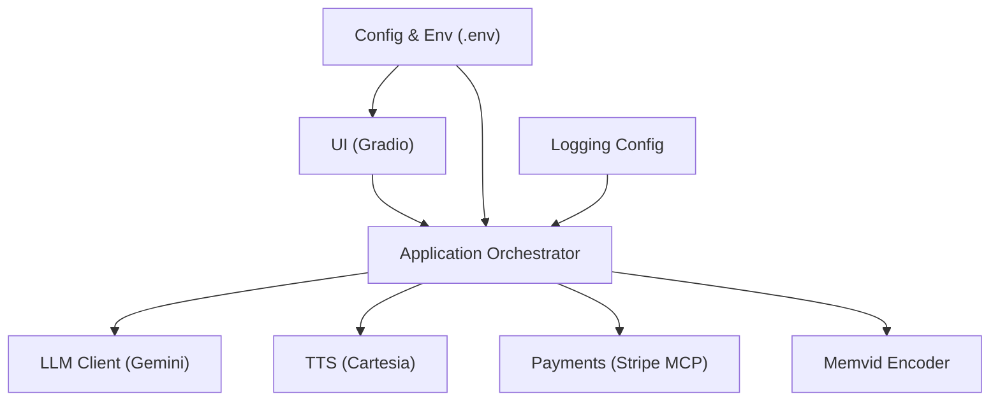
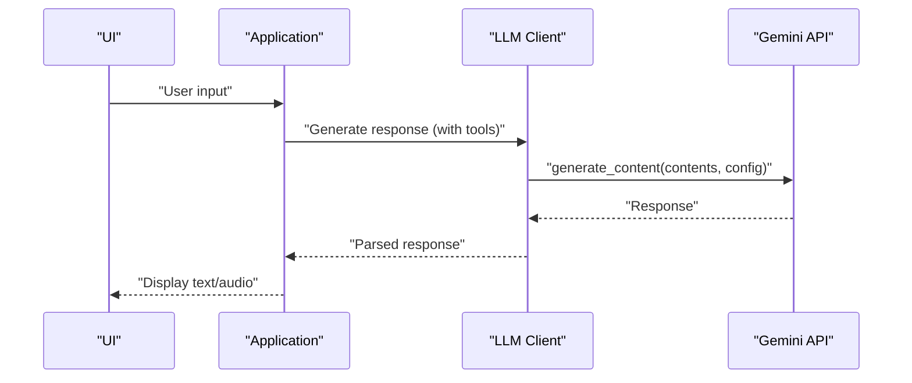
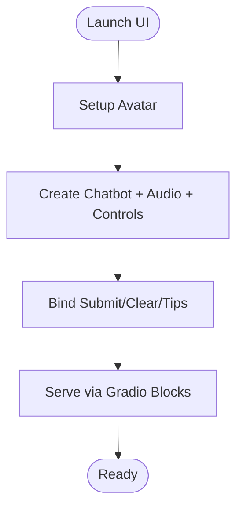
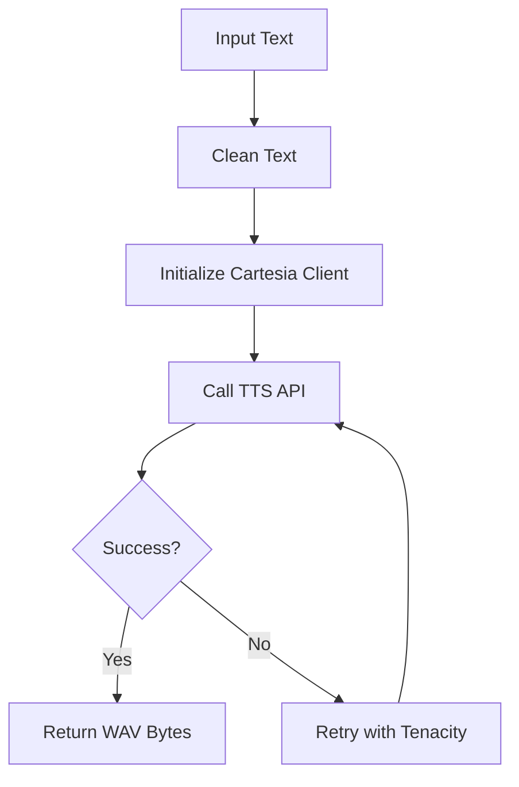
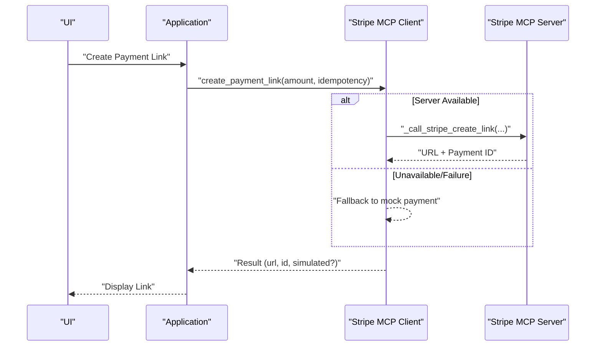
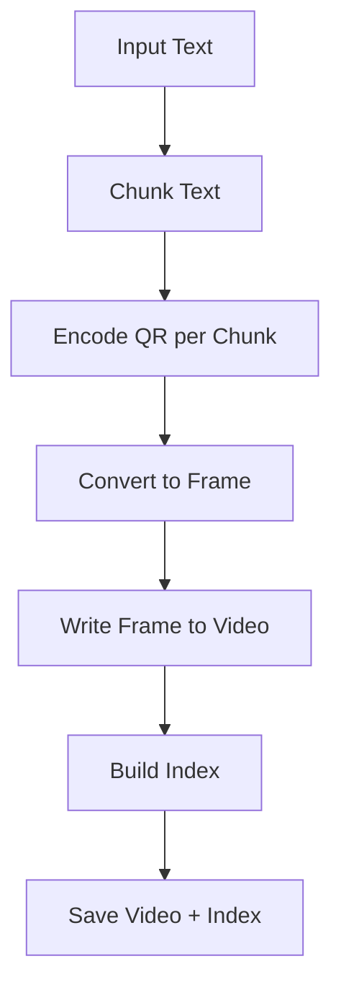
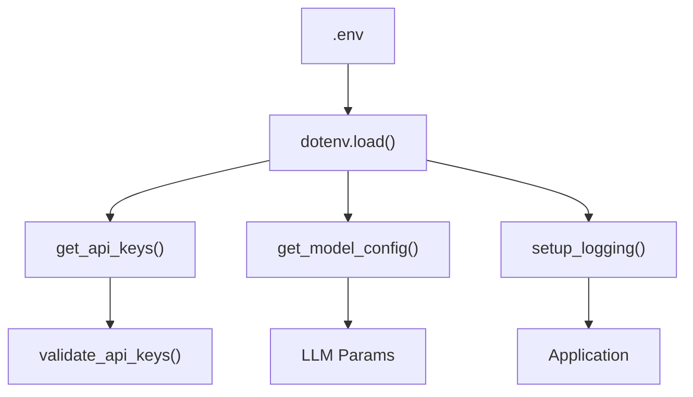
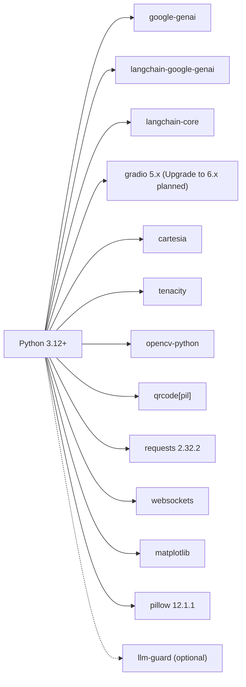

# Technology Stack

<cite>
**Referenced Files in This Document**
- [pyproject.toml](file://pyproject.toml)
- [requirements.txt](file://requirements.txt)
- [.python-version](file://.python-version)
- [.env.example](file://.env.example)
- [setup.py](file://setup.py)
- [src/config/__init__.py](file://src/config/__init__.py)
- [src/config/api_keys.py](file://src/config/api_keys.py)
- [src/config/model_config.py](file://src/config/model_config.py)
- [src/config/logging_config.py](file://src/config/logging_config.py)
- [src/llm/client.py](file://src/llm/client.py)
- [src/payments/stripe_mcp.py](file://src/payments/stripe_mcp.py)
- [src/ui/launcher.py](file://src/ui/launcher.py)
- [src/voice/tts.py](file://src/voice/tts.py)
- [src/memvid/encoder.py](file://src/memvid/encoder.py)
- [src/memvid/config.py](file://src/memvid/config.py)
- [tests/conftest.py](file://tests/conftest.py)
- [README.md](file://README.md)
</cite>

## Update Summary
**Changes Made**
- Updated dependency version requirements to reflect security patches and stability improvements
- Updated requests library requirement from 2.32.0 to 2.32.2 for security patches
- Updated Pillow imaging library requirement from 11.0.0 to 12.1.1 for security patches and stability improvements
- Maintained Gradio UI framework at 5.x for stability while noting the upgrade path to 6.x
- Updated version requirements section to reflect current dependency versions

## Table of Contents
1. [Introduction](#introduction)
2. [Project Structure](#project-structure)
3. [Core Components](#core-components)
4. [Architecture Overview](#architecture-overview)
5. [Detailed Component Analysis](#detailed-component-analysis)
6. [Dependency Analysis](#dependency-analysis)
7. [Performance Considerations](#performance-considerations)
8. [Troubleshooting Guide](#troubleshooting-guide)
9. [Conclusion](#conclusion)
10. [Appendices](#appendices)

## Introduction
This document describes the complete technology stack powering MayaMCP, focusing on the primary technologies, supporting libraries, configuration management, MCP protocol integration, and layered architecture. It consolidates version requirements, dependency relationships, and the rationale behind each choice, and provides guidance for maintaining and updating the stack.

## Project Structure
MayaNCP is organized into feature-focused packages under src/, with configuration, LLM orchestration, payments, UI, voice synthesis, and memory/video modules. The build and packaging system is defined via pyproject.toml and setup.py, while runtime configuration is managed via environment variables and dotenv.

**Diagram sources**
- [pyproject.toml](file://pyproject.toml#L1-L105)
- [setup.py](file://setup.py#L1-L46)
- [src/config/api_keys.py](file://src/config/api_keys.py#L1-L51)
- [src/config/model_config.py](file://src/config/model_config.py#L1-L102)
- [src/config/logging_config.py](file://src/config/logging_config.py#L1-L51)
- [src/llm/client.py](file://src/llm/client.py#L1-L217)
- [src/payments/stripe_mcp.py](file://src/payments/stripe_mcp.py#L1-L475)
- [src/ui/launcher.py](file://src/ui/launcher.py#L1-L354)
- [src/voice/tts.py](file://src/voice/tts.py#L1-L200)
- [src/memvid/encoder.py](file://src/memvid/encoder.py#L1-L201)

**Section sources**
- [pyproject.toml](file://pyproject.toml#L1-L105)
- [setup.py](file://setup.py#L1-L46)
- [src/config/__init__.py](file://src/config/__init__.py#L1-L13)

## Core Components
- Python runtime and packaging
  - Runtime: Python 3.12+ (explicitly set) with broader compatibility declared in packaging metadata.
  - Packaging: pyproject.toml with setuptools backend, dynamic dependencies from requirements.txt, and optional security extras.
- LLM orchestration
  - Google Generative AI (Gemini) via the unified `google-genai` SDK and LangChain integration via `langchain-google-genai`.
  - Robust retry logic via tenacity for resilience against transient failures.
- Web interface
  - **Updated** Gradio 5.x for the chat UI, session state management, and payment overlays. Note: Future upgrades to 6.x are planned for enhanced features and performance.
- Text-to-speech
  - Cartesia 2.x for high-quality voice synthesis with retry logic and text cleaning.
- Payments
  - Stripe MCP client with availability probing, idempotent request keys, and fallback to simulated payments.
- Memory and video
  - Memvid pipeline with QR-based video memory encoding using OpenCV and qrcode.
- Configuration
  - Environment-driven configuration via python-dotenv, with model parameters, logging levels, and API keys.

**Section sources**
- [.python-version](file://.python-version#L1-L1)
- [pyproject.toml](file://pyproject.toml#L5-L27)
- [requirements.txt](file://requirements.txt#L1-L38)
- [src/config/api_keys.py](file://src/config/api_keys.py#L1-L51)
- [src/config/model_config.py](file://src/config/model_config.py#L1-L102)
- [src/config/logging_config.py](file://src/config/logging_config.py#L1-L51)
- [src/llm/client.py](file://src/llm/client.py#L1-L217)
- [src/payments/stripe_mcp.py](file://src/payments/stripe_mcp.py#L1-L475)
- [src/ui/launcher.py](file://src/ui/launcher.py#L1-L354)
- [src/voice/tts.py](file://src/voice/tts.py#L1-L200)
- [src/memvid/encoder.py](file://src/memvid/encoder.py#L1-L201)

## Architecture Overview
MayaNCP follows a layered architecture:
- Presentation Layer: Gradio UI orchestrating chat, audio playback, and payment overlays.
- Application Layer: LLM client, payment client, and TTS orchestration.
- Integration Layer: External APIs (Gemini, Cartesia, Stripe MCP) with retry and fallback strategies.
- Persistence/Processing Layer: Video memory encoding and retrieval using OpenCV and QR codes.
- Configuration and Diagnostics: Environment-driven configuration, logging, and API key validation.

**Diagram sources**
- [src/ui/launcher.py](file://src/ui/launcher.py#L1-L354)
- [src/llm/client.py](file://src/llm/client.py#L1-L217)
- [src/voice/tts.py](file://src/voice/tts.py#L1-L200)
- [src/payments/stripe_mcp.py](file://src/payments/stripe_mcp.py#L1-L475)
- [src/memvid/encoder.py](file://src/memvid/encoder.py#L1-L201)
- [src/config/api_keys.py](file://src/config/api_keys.py#L1-L51)
- [src/config/logging_config.py](file://src/config/logging_config.py#L1-L51)

## Detailed Component Analysis

### LLM Orchestration with Google Generative AI and LangChain
- Migration to unified SDK
  - Now uses `google-genai` (unified SDK) instead of legacy `google-generativeai`.
  - LangChain integration via `langchain-google-genai` v4+ compatible with the new SDK.
  - Direct SDK client access through `google.genai.Client` for advanced operations.
- Initialization and binding
  - Builds ChatGoogleGenerativeAI with model parameters from environment configuration.
  - Supports tool binding for function calling.
- Resiliency
  - Uses tenacity for exponential backoff retries on API calls.
  - Comprehensive error classification and logging for rate limits, auth, and timeouts.
- Configuration
  - Centralized model and generation parameters via environment variables.

**Diagram sources**
- [src/llm/client.py](file://src/llm/client.py#L96-L133)
- [src/llm/client.py](file://src/llm/client.py#L141-L217)
- [src/config/model_config.py](file://src/config/model_config.py#L31-L59)

**Section sources**
- [src/llm/client.py](file://src/llm/client.py#L1-L217)
- [src/config/model_config.py](file://src/config/model_config.py#L1-L102)

### Web Interface with Gradio
- Layout and state
  - Two-column layout with avatar overlay and chatbot.
  - Session state for conversation history, orders, and payment metrics.
- Event wiring
  - Submit and clear actions mapped to handler functions.
  - JavaScript-driven tip buttons integrated via hidden inputs.
- Theming and accessibility
  - Ocean theme and explicit element IDs for overlay styling.

**Diagram sources**
- [src/ui/launcher.py](file://src/ui/launcher.py#L49-L354)

**Section sources**
- [src/ui/launcher.py](file://src/ui/launcher.py#L1-L354)

### Text-to-Speech with Cartesia
- Client initialization
  - Creates Cartesia client from API key.
- Text cleaning
  - Improves pronunciation and readability by sanitizing special characters and formatting money amounts.
- Synthesis
  - Calls Cartesia TTS API with configured voice and output format.
  - Retries on connection and timeout errors.

**Diagram sources**
- [src/voice/tts.py](file://src/voice/tts.py#L112-L200)
- [src/config/model_config.py](file://src/config/model_config.py#L61-L77)

**Section sources**
- [src/voice/tts.py](file://src/voice/tts.py#L1-L200)
- [src/config/model_config.py](file://src/config/model_config.py#L1-L102)

### Payments with Stripe MCP
- Idempotency
  - Generates idempotency keys per session to prevent duplicate payment links.
- Availability and fallback
  - Probes Stripe MCP server with caching; falls back to simulated payment if unavailable.
- Retry and timeout controls
  - Exponential backoff retries with bounded overall timeout and per-poll deadlines.
- Status polling
  - Polls payment status with configurable interval and timeout.

**Diagram sources**
- [src/payments/stripe_mcp.py](file://src/payments/stripe_mcp.py#L183-L347)
- [src/payments/stripe_mcp.py](file://src/payments/stripe_mcp.py#L348-L465)

**Section sources**
- [src/payments/stripe_mcp.py](file://src/payments/stripe_mcp.py#L1-L475)

### Memory and Video Encoding (Memvid)
- Chunking and QR encoding
  - Splits text into overlapping chunks and encodes each as a QR frame.
- Video assembly
  - Writes frames to MP4 using OpenCV with fixed FPS and resolution.
- Indexing
  - Produces JSON index mapping frames to chunk metadata.

**Diagram sources**
- [src/memvid/encoder.py](file://src/memvid/encoder.py#L49-L193)
- [src/memvid/config.py](file://src/memvid/config.py#L25-L49)

**Section sources**
- [src/memvid/encoder.py](file://src/memvid/encoder.py#L1-L201)
- [src/memvid/config.py](file://src/memvid/config.py#L1-L49)

### Configuration Management
- API keys
  - Loaded from .env and exposed via typed getters; validation ensures required keys are present.
- Model and generation parameters
  - Environment-driven model version, temperature, and token limits; safe fallbacks on invalid values.
- Logging
  - Configurable log level with debug override; consistent logger factory.
- Environment variables
  - Comprehensive example covering API keys, model settings, server, and environment modes.

**Diagram sources**
- [src/config/api_keys.py](file://src/config/api_keys.py#L10-L43)
- [src/config/model_config.py](file://src/config/model_config.py#L31-L59)
- [src/config/logging_config.py](file://src/config/logging_config.py#L7-L39)
- [.env.example](file://.env.example#L1-L33)

**Section sources**
- [src/config/api_keys.py](file://src/config/api_keys.py#L1-L51)
- [src/config/model_config.py](file://src/config/model_config.py#L1-L102)
- [src/config/logging_config.py](file://src/config/logging_config.py#L1-L51)
- [.env.example](file://.env.example#L1-L33)

## Dependency Analysis
- Primary dependencies
  - `google-genai` (unified SDK) and `langchain-google-genai` for Gemini integration.
  - `langchain-core` for core orchestration abstractions.
  - **Updated** gradio 5.x for UI (planned upgrade to 6.x for enhanced features).
  - cartesia 2.x for TTS.
  - tenacity for retry logic.
- Supporting libraries
  - opencv-python for video processing.
  - qrcode with PIL for QR encoding.
  - matplotlib and **Updated** pillow 12.1.1 for visualization.
  - **Updated** requests 2.32.2 for HTTP operations with security patches.
  - websockets for WebSocket operations.
- Optional security
  - llm-guard for optional guardrails.

**Diagram sources**
- [requirements.txt](file://requirements.txt#L1-L38)
- [pyproject.toml](file://pyproject.toml#L29-L30)

**Section sources**
- [requirements.txt](file://requirements.txt#L1-L38)
- [pyproject.toml](file://pyproject.toml#L29-L30)

## Performance Considerations
- Retry and backoff
  - tenacity-based retries reduce transient failure impact across LLM, TTS, and payment operations.
- Streaming and blocking
  - TTS returns concatenated bytes; consider streaming audio in future for latency improvements.
- Video encoding
  - OpenCV-based encoding is CPU-bound; consider GPU acceleration or optimized codecs for scale.
- Logging overhead
  - Ensure appropriate log levels in production to minimize I/O overhead.

## Troubleshooting Guide
- Google Generative AI SDK migration
  - The project now uses the unified `google-genai` SDK. If you encounter import errors, ensure `google-genai>=1.10.0` is installed.
  - LangChain integration uses `langchain-google-genai` v4+ which is compatible with the new SDK.
  - Tests include stubs for the new SDK structure to ensure compatibility when the real package is not installed.
- **Updated** Dependency version conflicts
  - Ensure requests 2.32.2 is installed to benefit from latest security patches.
  - Verify pillow 12.1.1 is used for improved stability and security.
  - Confirm gradio 5.x is installed for current UI functionality (plan to upgrade to 6.x).
- Missing or invalid API keys
  - Verify .env contains non-empty keys and that validation passes before startup.
- Model configuration errors
  - Invalid numeric values in environment fall back to defaults; check logs for warnings.
- LLM connectivity
  - Rate limits, auth errors, and timeouts are logged with structured classification; inspect logs for error codes.
- TTS failures
  - Connection and timeout errors are retried; confirm network access and API key validity.
- Payment link creation
  - If Stripe MCP is unavailable, the client falls back to a simulated payment; verify availability cache and retry behavior.
- Video encoding
  - Missing dependencies cause graceful degradation; ensure opencv-python and qrcode are installed.

**Section sources**
- [src/llm/client.py](file://src/llm/client.py#L7-L10)
- [src/llm/client.py](file://src/llm/client.py#L175-L213)
- [src/config/api_keys.py](file://src/config/api_keys.py#L24-L43)
- [src/config/model_config.py](file://src/config/model_config.py#L10-L28)
- [src/voice/tts.py](file://src/voice/tts.py#L133-L139)
- [src/payments/stripe_mcp.py](file://src/payments/stripe_mcp.py#L217-L272)
- [src/memvid/encoder.py](file://src/memvid/encoder.py#L28-L34)
- [tests/conftest.py](file://tests/conftest.py#L19-L129)

## Conclusion
MayaNCP integrates a modern Python stack with robust resiliency and modular design. The migration to the unified `google-genai` SDK provides better performance and compatibility with LangChain v4+. The combination of Gemini for LLM orchestration, Cartesia for TTS, Gradio for UI, and Stripe MCP for payments, backed by environment-driven configuration and tenacity-based retries, provides a scalable and maintainable foundation. Recent security updates including requests 2.32.2, pillow 12.1.1, and continued gradio 5.x stability ensure the system remains secure and reliable. Optional security enhancements and video memory capabilities further tailor the system to immersive, interactive experiences.

## Appendices

### Version Requirements and Compatibility
- Python: 3.12+ runtime; packaging supports 3.8+.
- google-genai: >=1.10.0 (unified SDK replacing google-generativeai).
- langchain-google-genai: >=4.0.0 (LangChain v4+ compatible).
- langchain-core: >=0.3.50,<0.4.0.
- **Updated** gradio: >=5.0.0,<7.0.0 (current 5.x with planned 6.x upgrade).
- cartesia: >=2.0.0,<3.0.0.
- tenacity: >=9.0.0.
- opencv-python: >=4.11.0.
- qrcode[pil]: included for QR encoding.
- **Updated** requests: >=2.32.2,<3.0.0 (security patches).
- **Updated** pillow: >=12.1.1,<13.0.0 (security patches).
- Optional security: llm-guard>=0.3.0.

**Section sources**
- [.python-version](file://.python-version#L1-L1)
- [pyproject.toml](file://pyproject.toml#L15-L26)
- [requirements.txt](file://requirements.txt#L1-L38)

### MCP Protocol Integration Notes
- Stripe MCP client includes placeholders for MCP server probing and tool invocation via kiroPowers; current implementation stubs simulate operations for development.
- Idempotency keys and availability caching are designed to integrate with MCP tool semantics.

**Section sources**
- [src/payments/stripe_mcp.py](file://src/payments/stripe_mcp.py#L167-L181)
- [src/payments/stripe_mcp.py](file://src/payments/stripe_mcp.py#L274-L317)
- [src/payments/stripe_mcp.py](file://src/payments/stripe_mcp.py#L443-L464)

### Maintaining and Updating the Technology Stack
- Pin major versions for core integrations (e.g., google-genai, langchain-google-genai) to avoid breaking changes from SDK migrations.
- **Updated** Monitor dependency updates regularly for security patches and stability improvements.
- Use optional-dependencies for security features (e.g., llm-guard) to keep base installs lean.
- Regularly audit dependencies via pip-tools or equivalent to resolve vulnerabilities.
- Keep environment variable documentation updated alongside new features.
- Monitor for future SDK updates and maintain backward compatibility through proper error handling.
- **Updated** Plan for Gradio 6.x upgrade when stable and tested for enhanced UI capabilities.

### Google Generative AI SDK Migration Details
- The project has migrated from the legacy `google-generativeai` package to the unified `google-genai` SDK.
- LangChain integration now uses `langchain-google-genai` v4+ which is fully compatible with the new SDK structure.
- The LLM client now imports from `google.genai` and uses `google.genai.Client` for direct API access.
- Error handling has been updated to work with the new SDK's error classes and structure.
- Tests include comprehensive stubs for the new SDK to ensure compatibility in development environments.

**Section sources**
- [src/llm/client.py](file://src/llm/client.py#L7-L10)
- [src/llm/client.py](file://src/llm/client.py#L175-L213)
- [tests/conftest.py](file://tests/conftest.py#L19-L129)
- [README.md](file://README.md#L46-L46)

### Dependency Update Summary
- **Updated** requests library: Upgraded from 2.32.0 to 2.32.2 for security patches and improved HTTP handling.
- **Updated** Pillow imaging library: Upgraded from 11.0.0 to 12.1.1 for enhanced security and stability.
- **Maintained** Gradio UI framework: Kept at 5.x for current stability while planning future 6.x upgrade.
- These updates ensure the system benefits from the latest security patches while maintaining compatibility with existing functionality.

**Section sources**
- [requirements.txt](file://requirements.txt#L10-L22)
- [requirements.txt](file://requirements.txt#L14-L15)