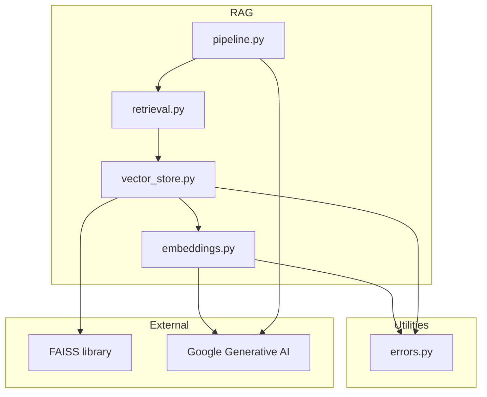
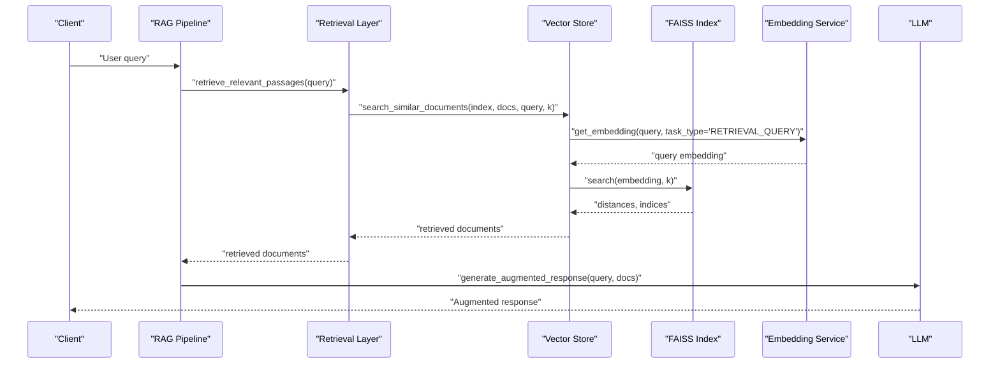
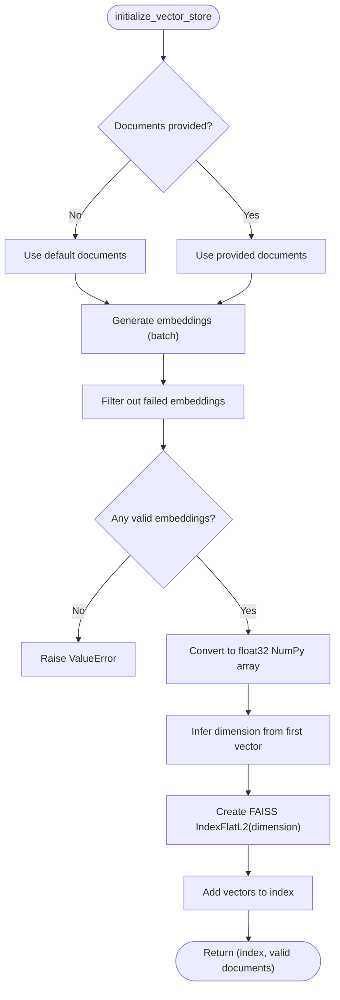
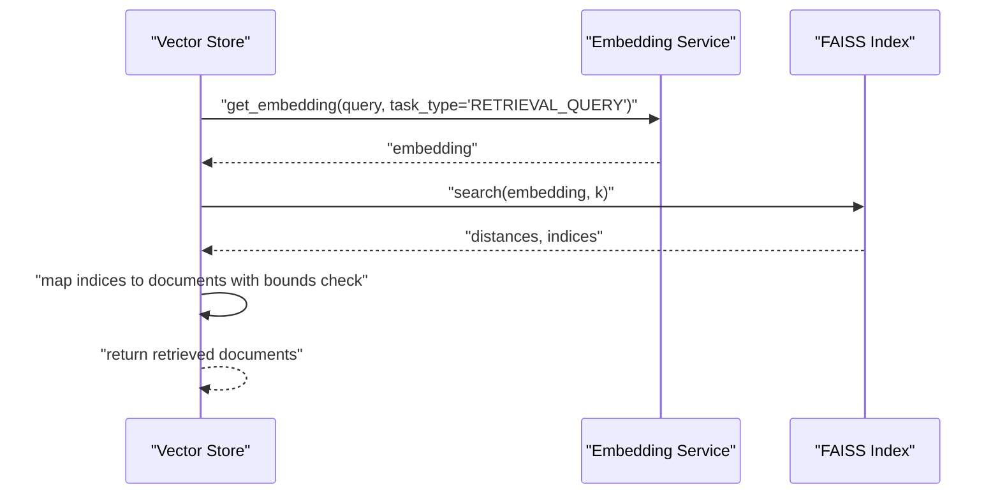
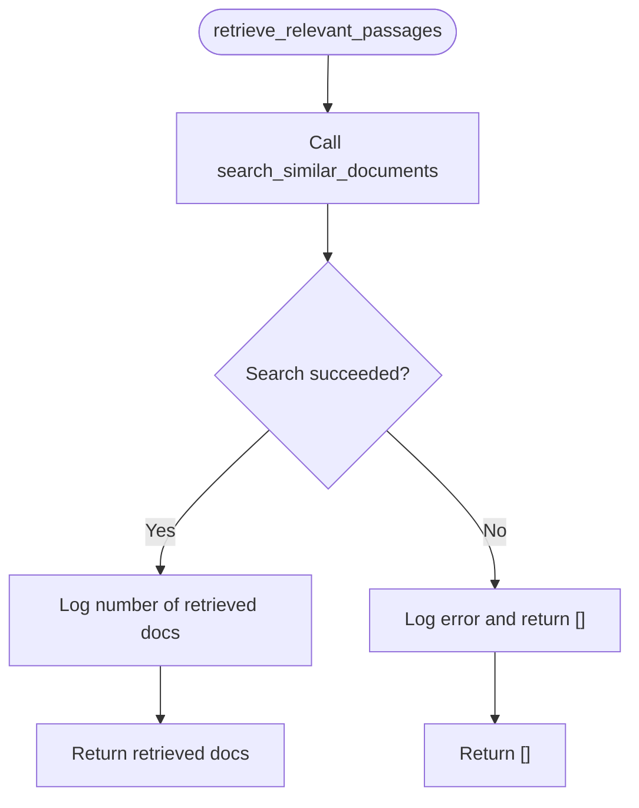
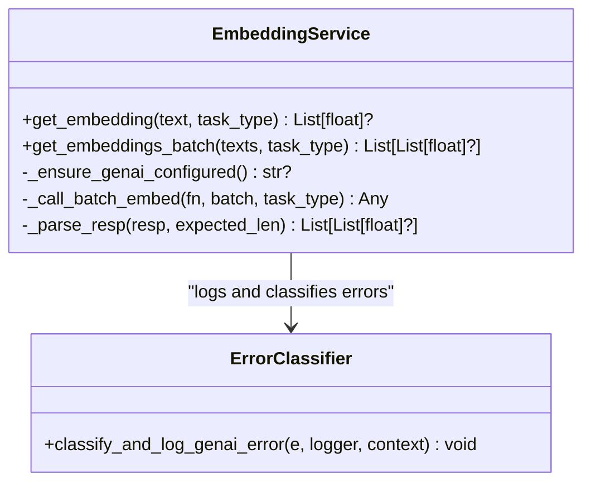
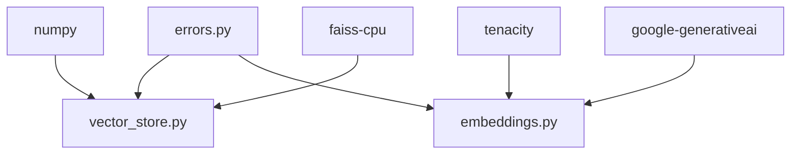

# FAISS Vector Store Implementation

<cite>
**Referenced Files in This Document**
- [vector_store.py](file://src/rag/vector_store.py)
- [embeddings.py](file://src/rag/embeddings.py)
- [retrieval.py](file://src/rag/retrieval.py)
- [pipeline.py](file://src/rag/pipeline.py)
- [errors.py](file://src/utils/errors.py)
- [test_vector_store.py](file://tests/test_vector_store.py)
- [test_embeddings.py](file://tests/test_embeddings.py)
- [test_retrieval.py](file://tests/test_retrieval.py)
- [requirements.txt](file://requirements.txt)
</cite>

## Table of Contents
1. [Introduction](#introduction)
2. [Project Structure](#project-structure)
3. [Core Components](#core-components)
4. [Architecture Overview](#architecture-overview)
5. [Detailed Component Analysis](#detailed-component-analysis)
6. [Dependency Analysis](#dependency-analysis)
7. [Performance Considerations](#performance-considerations)
8. [Troubleshooting Guide](#troubleshooting-guide)
9. [Conclusion](#conclusion)

## Introduction
This document describes the FAISS vector store implementation for traditional text-based document retrieval within the MayaMCP project. It explains how FAISS indices are created from document embeddings, how similarity search is performed, and how the system integrates with the broader Retrieval-Augmented Generation (RAG) pipeline. It also covers embedding model configuration, vector dimensionality, storage optimization strategies, retrieval algorithms, configuration options, and error handling with fallback mechanisms.

## Project Structure
The FAISS vector store resides in the RAG subsystem alongside embedding generation and retrieval orchestration. The key modules are:
- Vector store: FAISS index creation and similarity search
- Embeddings: Google Generative AI-based embedding generation with batching and retry
- Retrieval: High-level retrieval function delegating to vector store
- Pipeline: Orchestration of retrieval and LLM augmentation
- Tests: Unit tests validating behavior under normal and error conditions

**Diagram sources**
- [vector_store.py](file://src/rag/vector_store.py#L1-L107)
- [embeddings.py](file://src/rag/embeddings.py#L1-L217)
- [retrieval.py](file://src/rag/retrieval.py#L1-L40)
- [pipeline.py](file://src/rag/pipeline.py#L1-L105)
- [errors.py](file://src/utils/errors.py#L1-L39)

**Section sources**
- [vector_store.py](file://src/rag/vector_store.py#L1-L107)
- [embeddings.py](file://src/rag/embeddings.py#L1-L217)
- [retrieval.py](file://src/rag/retrieval.py#L1-L40)
- [pipeline.py](file://src/rag/pipeline.py#L1-L105)
- [requirements.txt](file://requirements.txt#L36-L38)

## Core Components
- FAISS Index Creation
  - Generates embeddings for documents using the embedding service
  - Filters out failed embeddings and constructs a float32 NumPy array
  - Initializes an L2-flat index sized to the embedding dimension and adds vectors
- Similarity Search
  - Converts query text to an embedding
  - Performs k-nearest neighbor search against the FAISS index
  - Returns the most similar documents based on Euclidean distance
- Retrieval Orchestration
  - Provides a wrapper around similarity search for higher-level RAG pipelines
- Embedding Generation
  - Configures the Google Generative AI client with a cached API key
  - Supports batch embedding with retry and robust parsing of diverse response formats
  - Applies task-type hints for document vs. query embeddings

**Section sources**
- [vector_store.py](file://src/rag/vector_store.py#L25-L69)
- [vector_store.py](file://src/rag/vector_store.py#L71-L107)
- [embeddings.py](file://src/rag/embeddings.py#L42-L65)
- [embeddings.py](file://src/rag/embeddings.py#L148-L217)
- [retrieval.py](file://src/rag/retrieval.py#L9-L39)

## Architecture Overview
The FAISS vector store sits between the retrieval layer and the LLM generation layer. The flow is:
- Indexing: Documents are embedded and indexed
- Query: Queries are embedded and searched against the index
- Augmentation: Retrieved documents are combined with the query and passed to the LLM

**Diagram sources**
- [pipeline.py](file://src/rag/pipeline.py#L60-L101)
- [retrieval.py](file://src/rag/retrieval.py#L9-L39)
- [vector_store.py](file://src/rag/vector_store.py#L71-L107)
- [embeddings.py](file://src/rag/embeddings.py#L69-L113)

## Detailed Component Analysis

### FAISS Index Creation
- Input documents are embedded using the batch embedding service
- Invalid embeddings are filtered; if none remain, initialization fails early
- Embeddings are converted to float32 and dimension inferred from the first vector
- An L2-flat index is created and populated with the vectors

**Diagram sources**
- [vector_store.py](file://src/rag/vector_store.py#L25-L69)

**Section sources**
- [vector_store.py](file://src/rag/vector_store.py#L25-L69)
- [test_vector_store.py](file://tests/test_vector_store.py#L29-L147)

### Similarity Search Mechanism
- Query is embedded using the embedding service
- Query embedding is converted to a float32 NumPy array
- FAISS performs a k-nearest neighbor search using L2 distance
- Indices are mapped to original documents, with bounds checking

**Diagram sources**
- [vector_store.py](file://src/rag/vector_store.py#L71-L107)
- [embeddings.py](file://src/rag/embeddings.py#L69-L113)

**Section sources**
- [vector_store.py](file://src/rag/vector_store.py#L71-L107)
- [test_vector_store.py](file://tests/test_vector_store.py#L149-L289)

### Retrieval Orchestration
- The retrieval function wraps vector store search and logs results
- It catches exceptions and returns an empty list on failure

**Diagram sources**
- [retrieval.py](file://src/rag/retrieval.py#L9-L39)

**Section sources**
- [retrieval.py](file://src/rag/retrieval.py#L9-L39)
- [test_retrieval.py](file://tests/test_retrieval.py#L15-L110)

### Embedding Generation and Model Configuration
- Embedding service configures the Google Generative AI client once per key change
- Supports both batch and single embedding calls with retry
- Robust parsing accommodates various SDK response shapes
- Task type hints differentiate document and query embeddings

**Diagram sources**
- [embeddings.py](file://src/rag/embeddings.py#L69-L113)
- [embeddings.py](file://src/rag/embeddings.py#L115-L145)
- [embeddings.py](file://src/rag/embeddings.py#L148-L217)
- [errors.py](file://src/utils/errors.py#L11-L38)

**Section sources**
- [embeddings.py](file://src/rag/embeddings.py#L42-L65)
- [embeddings.py](file://src/rag/embeddings.py#L69-L113)
- [embeddings.py](file://src/rag/embeddings.py#L115-L145)
- [embeddings.py](file://src/rag/embeddings.py#L148-L217)
- [test_embeddings.py](file://tests/test_embeddings.py#L18-L70)

## Dependency Analysis
- FAISS is used for fast similarity search on CPU
- Google Generative AI provides embeddings with retry and robust parsing
- NumPy is used for efficient vector operations
- The system gracefully handles missing optional dependencies by falling back to text-only modes in related components

**Diagram sources**
- [requirements.txt](file://requirements.txt#L36-L38)
- [vector_store.py](file://src/rag/vector_store.py#L3-L7)
- [embeddings.py](file://src/rag/embeddings.py#L3-L8)
- [errors.py](file://src/utils/errors.py#L1-L39)

**Section sources**
- [requirements.txt](file://requirements.txt#L36-L38)
- [vector_store.py](file://src/rag/vector_store.py#L3-L7)
- [embeddings.py](file://src/rag/embeddings.py#L3-L8)

## Performance Considerations
- Embedding Batch Size: The embedding service batches requests to reduce API overhead; adjust batch size for throughput vs. latency trade-offs
- Vector Dimensionality: The index dimension is inferred from the first embedding; ensure consistent embedding model output
- Index Type: The implementation uses an L2-flat index suitable for moderate-scale retrieval; for larger datasets, consider quantization or HNSW indices
- Data Types: Using float32 reduces memory usage compared to float64
- Caching: The embedding service caches the API key to avoid repeated configuration calls
- Logging Overhead: Excessive logging can impact performance; tune log levels appropriately

[No sources needed since this section provides general guidance]

## Troubleshooting Guide
Common issues and fallback strategies:
- No Valid Embeddings Generated
  - Symptom: Initialization raises an error indicating no valid embeddings
  - Resolution: Verify API key and network connectivity; ensure documents are non-empty and valid
- Query Embedding Failure
  - Symptom: Query embedding returns None; search returns empty results
  - Resolution: Check API key and rate limits; review error logs for classification
- FAISS Operation Failures
  - Symptom: Exceptions during search or index operations
  - Resolution: Catch exceptions in retrieval wrappers; return empty results and log errors
- Rate Limits and Authentication Errors
  - The error classifier detects common GenAI error patterns and logs appropriate warnings or errors

**Section sources**
- [vector_store.py](file://src/rag/vector_store.py#L54-L55)
- [vector_store.py](file://src/rag/vector_store.py#L94-L96)
- [retrieval.py](file://src/rag/retrieval.py#L38-L40)
- [errors.py](file://src/utils/errors.py#L21-L37)
- [test_vector_store.py](file://tests/test_vector_store.py#L106-L113)
- [test_vector_store.py](file://tests/test_vector_store.py#L181-L194)

## Conclusion
The FAISS vector store implementation provides a straightforward, efficient mechanism for text-based document retrieval. It leverages batched embeddings, robust error handling, and a simple L2-flat index to deliver reliable similarity search. The retrieval pipeline integrates seamlessly with the broader RAG system, and the embedding service offers resilient generation with retry and flexible response parsing. For production deployments, consider scaling the index and optimizing embedding batch sizes and data types to meet performance and memory targets.