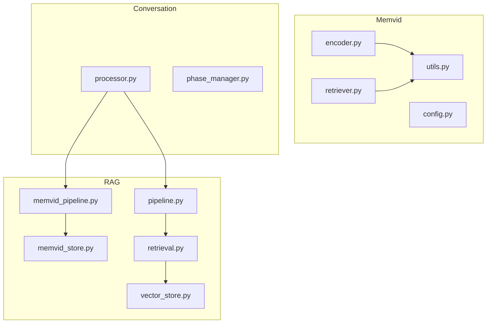
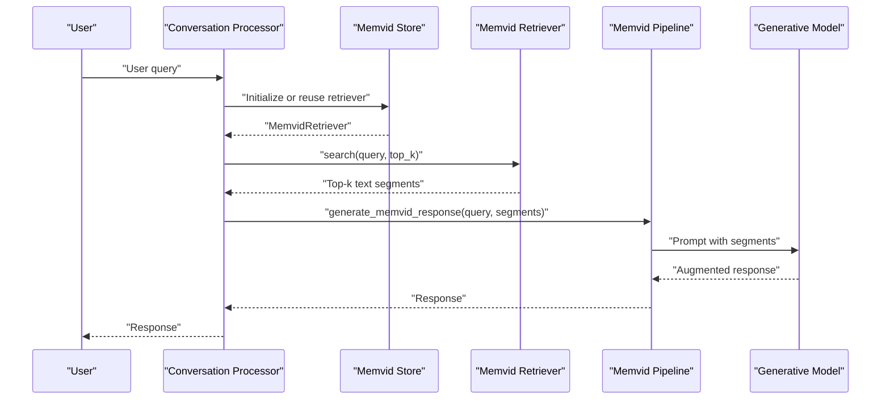
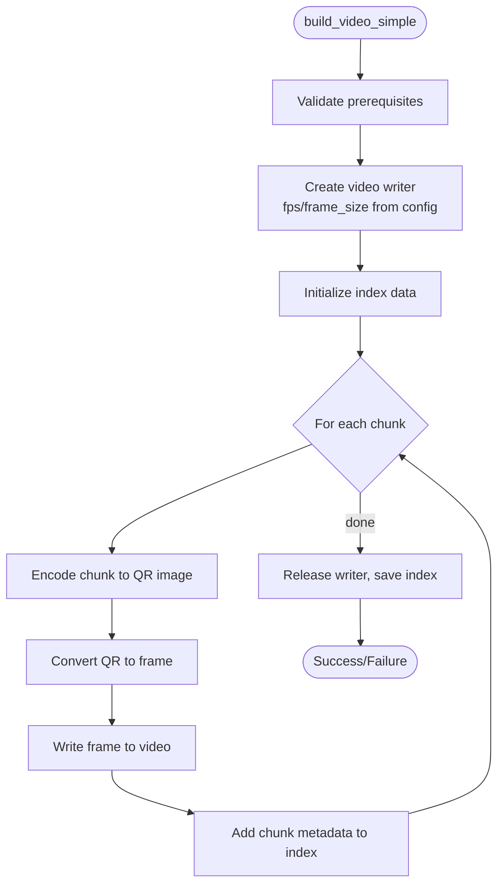
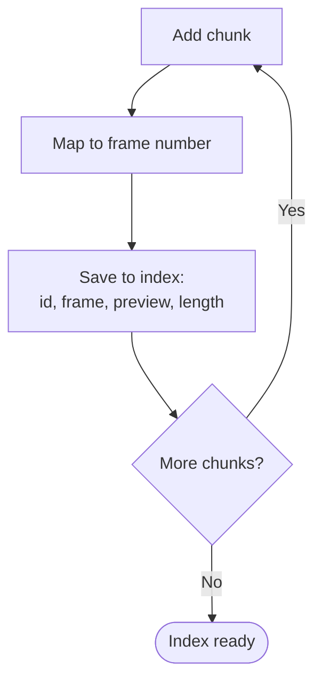
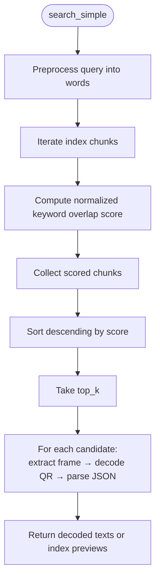
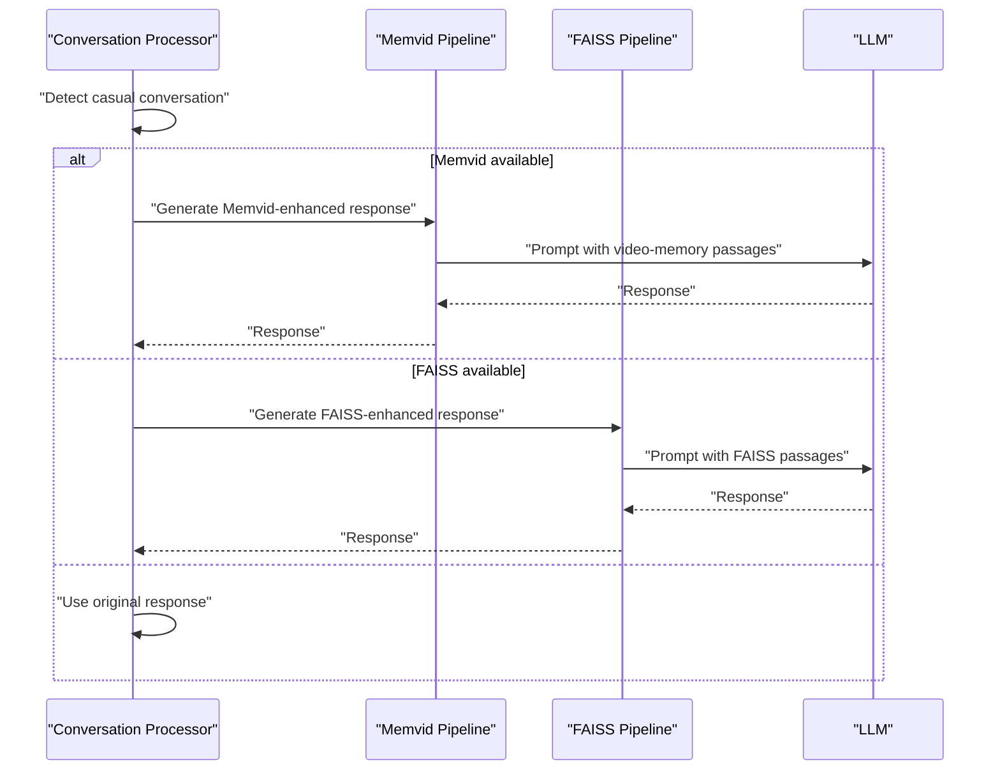
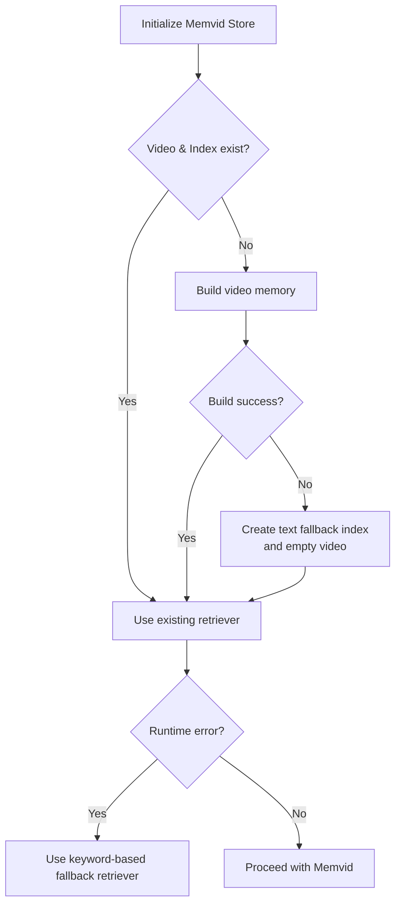
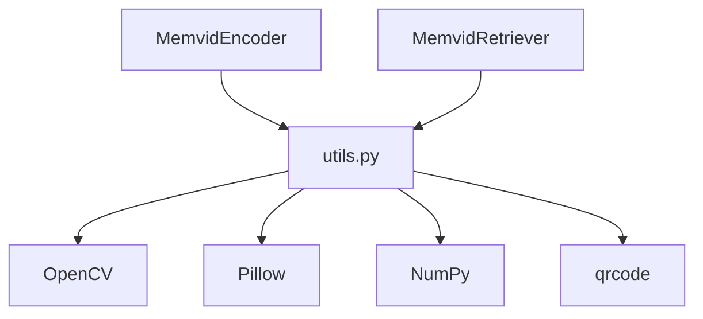

# Memvid Video Memory System

<cite>
**Referenced Files in This Document**
- [src/memvid/__init__.py](file://src/memvid/__init__.py)
- [src/memvid/config.py](file://src/memvid/config.py)
- [src/memvid/encoder.py](file://src/memvid/encoder.py)
- [src/memvid/retriever.py](file://src/memvid/retriever.py)
- [src/memvid/utils.py](file://src/memvid/utils.py)
- [src/rag/memvid_pipeline.py](file://src/rag/memvid_pipeline.py)
- [src/rag/memvid_store.py](file://src/rag/memvid_store.py)
- [src/rag/pipeline.py](file://src/rag/pipeline.py)
- [src/rag/retrieval.py](file://src/rag/retrieval.py)
- [src/rag/vector_store.py](file://src/rag/vector_store.py)
- [src/conversation/processor.py](file://src/conversation/processor.py)
- [src/conversation/phase_manager.py](file://src/conversation/phase_manager.py)
- [tests/test_memvid.py](file://tests/test_memvid.py)
- [tests/test_memvid_config.py](file://tests/test_memvid_config.py)
</cite>

## Table of Contents
1. [Introduction](#introduction)
2. [Project Structure](#project-structure)
3. [Core Components](#core-components)
4. [Architecture Overview](#architecture-overview)
5. [Detailed Component Analysis](#detailed-component-analysis)
6. [Dependency Analysis](#dependency-analysis)
7. [Performance Considerations](#performance-considerations)
8. [Troubleshooting Guide](#troubleshooting-guide)
9. [Conclusion](#conclusion)
10. [Appendices](#appendices)

## Introduction
This document describes the Memvid video memory system integrated into the MayaMCP conversational AI platform. Memvid encodes textual knowledge into a video stream by rendering each text chunk as a QR code frame, enabling a novel visual memory store. The system supports:
- Video encoding pipeline that converts text into a time-sliced visual memory
- Temporal segmentation via per-chunk frame mapping
- Visual feature extraction through QR decoding at retrieval time
- A retrieval system that matches user queries to relevant video segments using keyword-based scoring
- Integration with conversation processing to enhance responses with visual context
- Configuration options for video resolution, encoding parameters, and retrieval thresholds
- Fallback strategies to maintain functionality when video processing is unavailable

## Project Structure
Memvid resides under src/memvid and integrates with the RAG subsystem under src/rag. The conversation processor orchestrates RAG usage depending on conversation phase and availability of components.

**Diagram sources**
- [src/memvid/encoder.py](file://src/memvid/encoder.py#L1-L201)
- [src/memvid/retriever.py](file://src/memvid/retriever.py#L1-L189)
- [src/memvid/utils.py](file://src/memvid/utils.py#L1-L161)
- [src/memvid/config.py](file://src/memvid/config.py#L1-L49)
- [src/rag/memvid_store.py](file://src/rag/memvid_store.py#L1-L159)
- [src/rag/memvid_pipeline.py](file://src/rag/memvid_pipeline.py#L1-L108)
- [src/rag/pipeline.py](file://src/rag/pipeline.py#L1-L105)
- [src/rag/retrieval.py](file://src/rag/retrieval.py#L1-L40)
- [src/rag/vector_store.py](file://src/rag/vector_store.py#L1-L107)
- [src/conversation/processor.py](file://src/conversation/processor.py#L1-L456)
- [src/conversation/phase_manager.py](file://src/conversation/phase_manager.py#L1-L92)

**Section sources**
- [src/memvid/__init__.py](file://src/memvid/__init__.py#L1-L10)
- [src/memvid/config.py](file://src/memvid/config.py#L1-L49)
- [src/rag/memvid_store.py](file://src/rag/memvid_store.py#L1-L159)
- [src/conversation/processor.py](file://src/conversation/processor.py#L1-L456)

## Core Components
- MemvidEncoder: Builds a video memory by encoding text chunks into QR frames and writing them to an MP4 with a JSON index mapping frames to chunks.
- MemvidRetriever: Searches the video memory by scanning frames and decoding QR codes to retrieve relevant text segments.
- Utilities: Provide QR encoding/decoding, frame conversion, and text chunking.
- Config: Centralizes configuration for QR parameters, video frame size/fps, chunk sizes, and retrieval tuning.
- Memvid Store: Initializes the video memory, manages fallbacks, and exposes a unified search interface.
- Memvid Pipeline: Generates LLM-augmented responses using retrieved video-memory passages.
- Conversation Processor: Decides when to use RAG, tries Memvid first, then falls back to FAISS-based RAG.

**Section sources**
- [src/memvid/encoder.py](file://src/memvid/encoder.py#L18-L201)
- [src/memvid/retriever.py](file://src/memvid/retriever.py#L17-L189)
- [src/memvid/utils.py](file://src/memvid/utils.py#L32-L161)
- [src/memvid/config.py](file://src/memvid/config.py#L25-L49)
- [src/rag/memvid_store.py](file://src/rag/memvid_store.py#L28-L159)
- [src/rag/memvid_pipeline.py](file://src/rag/memvid_pipeline.py#L16-L108)
- [src/conversation/processor.py](file://src/conversation/processor.py#L302-L362)

## Architecture Overview
The Memvid system transforms text into a visual memory and retrieves semantically relevant segments by decoding QR codes embedded in video frames. The retrieval is keyword-driven and optimized for speed, while the conversation processor optionally augments LLM responses with these segments.

**Diagram sources**
- [src/conversation/processor.py](file://src/conversation/processor.py#L318-L358)
- [src/rag/memvid_store.py](file://src/rag/memvid_store.py#L28-L76)
- [src/memvid/retriever.py](file://src/memvid/retriever.py#L77-L111)
- [src/rag/memvid_pipeline.py](file://src/rag/memvid_pipeline.py#L65-L108)

## Detailed Component Analysis

### Video Encoding Pipeline
MemvidEncoder builds a video memory by:
- Validating prerequisites (dependencies and presence of chunks)
- Creating a video writer with configured fps and frame size
- Iterating over text chunks, encoding each as a QR image, converting to a frame, writing to video, and recording metadata in an index
- Finalizing by releasing the writer and saving the index

**Diagram sources**
- [src/memvid/encoder.py](file://src/memvid/encoder.py#L49-L169)

**Section sources**
- [src/memvid/encoder.py](file://src/memvid/encoder.py#L49-L169)
- [src/memvid/utils.py](file://src/memvid/utils.py#L38-L116)

### Temporal Segmentation and Indexing
- Each chunk is mapped to a single frame in the video, preserving a strict 1:1 mapping for deterministic retrieval.
- The index stores chunk id, frame number, a text preview, and length, enabling fast lookup and optional fallback to index text if video decoding fails.

**Diagram sources**
- [src/memvid/encoder.py](file://src/memvid/encoder.py#L148-L157)

**Section sources**
- [src/memvid/encoder.py](file://src/memvid/encoder.py#L100-L169)

### Visual Feature Extraction and Retrieval
MemvidRetriever performs:
- Index loading and basic validation
- Frame extraction and QR decoding
- Keyword-based scoring of candidate chunks derived from the index
- Optional caching of decoded frames to reduce repeated extraction

**Diagram sources**
- [src/memvid/retriever.py](file://src/memvid/retriever.py#L77-L111)
- [src/memvid/retriever.py](file://src/memvid/retriever.py#L113-L144)

**Section sources**
- [src/memvid/retriever.py](file://src/memvid/retriever.py#L77-L189)
- [src/memvid/utils.py](file://src/memvid/utils.py#L72-L135)

### Configuration Options
Key configuration areas:
- QR: version, error correction level, box size, border, fill/back colors
- Video: fps, frame width, frame height
- Chunking: chunk size and overlap
- Retrieval: cache size and worker concurrency

These are exposed via a centralized configuration function and used consistently across encoding and retrieval.

**Section sources**
- [src/memvid/config.py](file://src/memvid/config.py#L25-L49)
- [tests/test_memvid_config.py](file://tests/test_memvid_config.py#L62-L190)

### Integration with Conversation Processing
The conversation processor decides when to use RAG:
- For casual conversation, it attempts Memvid RAG first; if unavailable or failing, it falls back to FAISS-based RAG
- It logs decisions and gracefully handles errors, ensuring the agent remains responsive

**Diagram sources**
- [src/conversation/processor.py](file://src/conversation/processor.py#L318-L358)
- [src/rag/memvid_pipeline.py](file://src/rag/memvid_pipeline.py#L65-L108)
- [src/rag/pipeline.py](file://src/rag/pipeline.py#L60-L105)

**Section sources**
- [src/conversation/processor.py](file://src/conversation/processor.py#L299-L362)
- [src/conversation/phase_manager.py](file://src/conversation/phase_manager.py#L69-L83)

### Fallback Strategies and Hybrid Approaches
- Video memory creation fallback: On failure, a minimal index is created and an empty video file is touched to preserve compatibility.
- Runtime fallback: If Memvid retriever fails, a simple keyword-based fallback retriever is used.
- Hybrid retrieval: The system prefers Memvid for casual conversation; otherwise, FAISS-based retrieval is used.

**Diagram sources**
- [src/rag/memvid_store.py](file://src/rag/memvid_store.py#L28-L97)
- [src/rag/memvid_store.py](file://src/rag/memvid_store.py#L133-L159)

**Section sources**
- [src/rag/memvid_store.py](file://src/rag/memvid_store.py#L28-L159)

## Dependency Analysis
Memvid components depend on:
- OpenCV for video I/O and QR decoding
- Pillow/PIL for QR rendering and image conversions
- NumPy for array operations
- qrcode for QR generation

The dependency checks are centralized and enforced early in encoder/retriever initialization.

**Diagram sources**
- [src/memvid/encoder.py](file://src/memvid/encoder.py#L13-L14)
- [src/memvid/retriever.py](file://src/memvid/retriever.py#L12-L13)
- [src/memvid/utils.py](file://src/memvid/utils.py#L13-L26)

**Section sources**
- [src/memvid/utils.py](file://src/memvid/utils.py#L32-L36)
- [src/memvid/encoder.py](file://src/memvid/encoder.py#L28-L34)
- [src/memvid/retriever.py](file://src/memvid/retriever.py#L27-L33)

## Performance Considerations
- Frame size and fps: Lower resolution and fps reduce CPU/GPU load and file size; adjust via configuration.
- Chunk size and overlap: Larger chunks reduce frame count and overhead but may decrease granularity; tune for balance.
- Retrieval cache: The retriever caches decoded frames to avoid repeated extraction; keep cache size reasonable.
- Worker concurrency: Retrieval workers are limited to conserve resources during constrained runs.
- Text chunking: Sentence-aware chunking reduces fragmentation and improves retrieval quality.

[No sources needed since this section provides general guidance]

## Troubleshooting Guide
Common issues and remedies:
- Missing dependencies: Ensure qrcode, opencv-python, pillow, and numpy are installed; initialization will raise ImportError if missing.
- Empty or invalid index: The retriever validates index structure and raises errors if malformed or empty.
- Video verification failures: The retriever verifies video accessibility; check file permissions and codec support.
- Encoding failures: If QR encoding fails, verify data length and compression behavior; large payloads are compressed before encoding.
- Retrieval failures: If frame extraction fails, verify frame numbers and video integrity; consider rebuilding the video memory.

**Section sources**
- [src/memvid/utils.py](file://src/memvid/utils.py#L32-L36)
- [src/memvid/retriever.py](file://src/memvid/retriever.py#L40-L48)
- [src/memvid/retriever.py](file://src/memvid/retriever.py#L57-L76)
- [src/memvid/utils.py](file://src/memvid/utils.py#L68-L70)
- [src/memvid/utils.py](file://src/memvid/utils.py#L125-L135)

## Conclusion
Memvid provides a compact, deterministic, and visually evocative memory system for conversational AI. By encoding text into QR-coded frames and retrieving via keyword scoring, it enables quick, low-latency augmentation of LLM responses. The system’s fallbacks and configuration options ensure robust operation across varied environments, while integration with the conversation processor allows seamless switching between Memvid and FAISS-based retrieval strategies.

[No sources needed since this section summarizes without analyzing specific files]

## Appendices

### Configuration Reference
- QR: version, error_correction, box_size, border, fill_color, back_color
- Video: fps, frame_height, frame_width
- Chunking: chunk_size, overlap
- Retrieval: cache_size, max_workers

**Section sources**
- [src/memvid/config.py](file://src/memvid/config.py#L25-L49)
- [tests/test_memvid_config.py](file://tests/test_memvid_config.py#L62-L190)

### Example Usage Patterns
- Building video memory: Initialize encoder, add documents/chunks, and call the memory file builder.
- Searching: Initialize retriever with video and index, then call search with desired top_k.
- Full pipeline: Initialize Memvid store, run the Memvid RAG pipeline with a query and API key.

**Section sources**
- [src/rag/memvid_store.py](file://src/rag/memvid_store.py#L28-L76)
- [src/memvid/retriever.py](file://src/memvid/retriever.py#L77-L111)
- [src/rag/memvid_pipeline.py](file://src/rag/memvid_pipeline.py#L65-L108)

### Relationship to Traditional Text-Based RAG
- Memvid replaces vector storage with a video-based index; retrieval is keyword-based rather than embedding similarity.
- The conversation processor prefers Memvid for casual conversation and falls back to FAISS-based retrieval otherwise.
- Hybrid approach: Use Memvid for contextual, personality-rich responses and FAISS for precise factual recall.

**Section sources**
- [src/conversation/processor.py](file://src/conversation/processor.py#L318-L358)
- [src/rag/vector_store.py](file://src/rag/vector_store.py#L25-L69)
- [src/rag/retrieval.py](file://src/rag/retrieval.py#L9-L39)