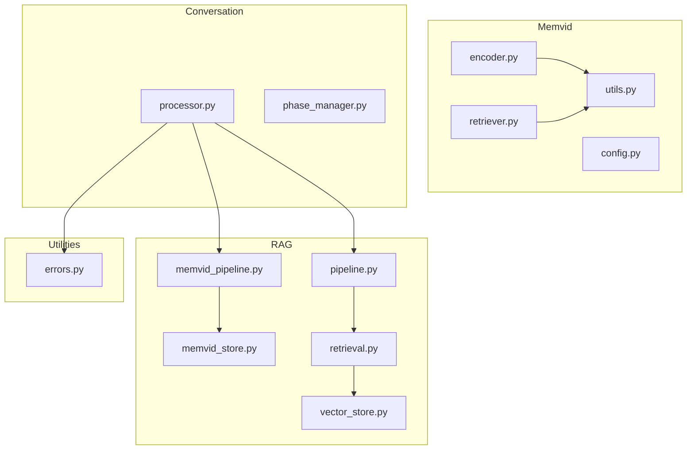
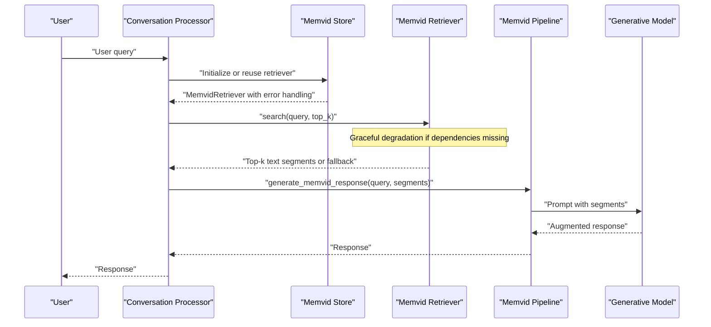
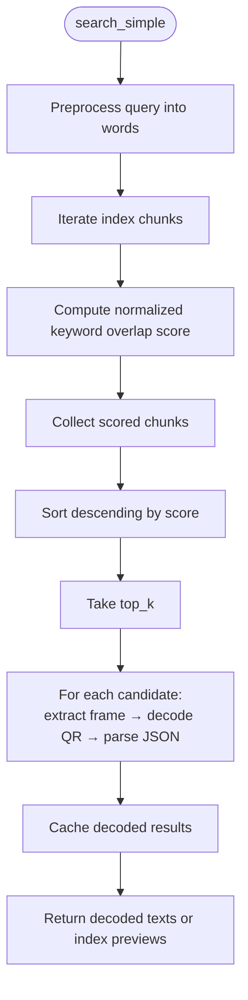
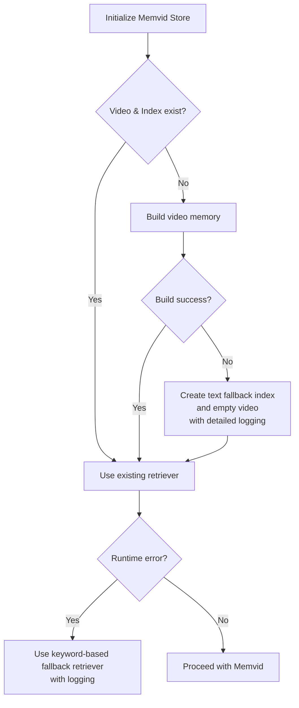
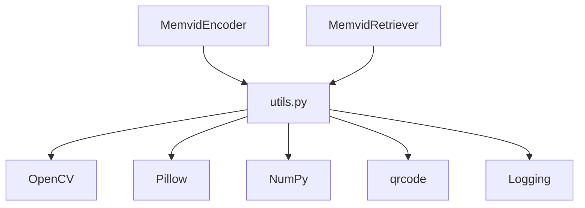

# Memvid Video Memory System

<cite>
**Referenced Files in This Document**
- [src/memvid/__init__.py](file://src/memvid/__init__.py)
- [src/memvid/config.py](file://src/memvid/config.py)
- [src/memvid/encoder.py](file://src/memvid/encoder.py)
- [src/memvid/retriever.py](file://src/memvid/retriever.py)
- [src/memvid/utils.py](file://src/memvid/utils.py)
- [src/rag/memvid_pipeline.py](file://src/rag/memvid_pipeline.py)
- [src/rag/memvid_store.py](file://src/rag/memvid_store.py)
- [src/rag/pipeline.py](file://src/rag/pipeline.py)
- [src/rag/retrieval.py](file://src/rag/retrieval.py)
- [src/rag/vector_store.py](file://src/rag/vector_store.py)
- [src/conversation/processor.py](file://src/conversation/processor.py)
- [src/conversation/phase_manager.py](file://src/conversation/phase_manager.py)
- [src/utils/errors.py](file://src/utils/errors.py)
- [tests/test_memvid.py](file://tests/test_memvid.py)
- [tests/test_memvid_config.py](file://tests/test_memvid_config.py)
- [tests/test_memvid_retriever.py](file://tests/test_memvid_retriever.py)
- [tests/test_memvid_utils.py](file://tests/test_memvid_utils.py)
</cite>

## Update Summary
**Changes Made**
- Enhanced error handling and dependency management in retriever system with comprehensive logging
- Improved validation of video files and index data with robust error recovery mechanisms
- Added graceful degradation when dependencies are unavailable
- Enhanced troubleshooting capabilities with detailed logging for debugging
- Maintained backward compatibility while adding robust error recovery mechanisms

## Table of Contents
1. [Introduction](#introduction)
2. [Project Structure](#project-structure)
3. [Core Components](#core-components)
4. [Architecture Overview](#architecture-overview)
5. [Detailed Component Analysis](#detailed-component-analysis)
6. [Dependency Analysis](#dependency-analysis)
7. [Performance Considerations](#performance-considerations)
8. [Troubleshooting Guide](#troubleshooting-guide)
9. [Conclusion](#conclusion)
10. [Appendices](#appendices)

## Introduction
This document describes the Memvid video memory system integrated into the MayaMCP conversational AI platform. Memvid encodes textual knowledge into a video stream by rendering each text chunk as a QR code frame, enabling a novel visual memory store. The system supports:
- Video encoding pipeline that converts text into a time-sliced visual memory
- Temporal segmentation via per-chunk frame mapping
- Visual feature extraction through QR decoding at retrieval time
- A retrieval system that matches user queries to relevant video segments using keyword-based scoring
- Integration with conversation processing to enhance responses with visual context
- Configuration options for video resolution, encoding parameters, and retrieval thresholds
- Fallback strategies to maintain functionality when video processing is unavailable
- **Enhanced error handling and comprehensive logging for improved troubleshooting**

## Project Structure
Memvid resides under src/memvid and integrates with the RAG subsystem under src/rag. The conversation processor orchestrates RAG usage depending on conversation phase and availability of components.

**Diagram sources**
- [src/memvid/encoder.py](file://src/memvid/encoder.py#L1-L201)
- [src/memvid/retriever.py](file://src/memvid/retriever.py#L1-L199)
- [src/memvid/utils.py](file://src/memvid/utils.py#L1-L161)
- [src/memvid/config.py](file://src/memvid/config.py#L1-L49)
- [src/rag/memvid_store.py](file://src/rag/memvid_store.py#L1-L159)
- [src/rag/memvid_pipeline.py](file://src/rag/memvid_pipeline.py#L1-L108)
- [src/rag/pipeline.py](file://src/rag/pipeline.py#L1-L105)
- [src/rag/retrieval.py](file://src/rag/retrieval.py#L1-L40)
- [src/rag/vector_store.py](file://src/rag/vector_store.py#L1-L107)
- [src/conversation/processor.py](file://src/conversation/processor.py#L1-L480)
- [src/conversation/phase_manager.py](file://src/conversation/phase_manager.py#L1-L92)
- [src/utils/errors.py](file://src/utils/errors.py#L1-L39)

**Section sources**
- [src/memvid/__init__.py](file://src/memvid/__init__.py#L1-L10)
- [src/memvid/config.py](file://src/memvid/config.py#L1-L49)
- [src/rag/memvid_store.py](file://src/rag/memvid_store.py#L1-L159)
- [src/conversation/processor.py](file://src/conversation/processor.py#L1-L480)

## Core Components
- MemvidEncoder: Builds a video memory by encoding text chunks into QR frames and writing them to an MP4 with a JSON index mapping frames to chunks.
- MemvidRetriever: **Enhanced** with comprehensive error handling, dependency validation, and graceful degradation capabilities. Searches the video memory by scanning frames and decoding QR codes to retrieve relevant text segments.
- Utilities: Provide QR encoding/decoding, frame conversion, and text chunking with robust error recovery mechanisms.
- Config: Centralizes configuration for QR parameters, video frame size/fps, chunk sizes, and retrieval tuning.
- Memvid Store: Initializes the video memory, manages fallbacks, and exposes a unified search interface with comprehensive logging.
- Memvid Pipeline: Generates LLM-augmented responses using retrieved video-memory passages.
- Conversation Processor: Decides when to use RAG, tries Memvid first, then falls back to FAISS-based RAG with improved error handling.
- **Error Utilities**: Provides shared error classification and logging helpers for consistent error handling across the system.

**Section sources**
- [src/memvid/encoder.py](file://src/memvid/encoder.py#L18-L201)
- [src/memvid/retriever.py](file://src/memvid/retriever.py#L17-L199)
- [src/memvid/utils.py](file://src/memvid/utils.py#L32-L161)
- [src/memvid/config.py](file://src/memvid/config.py#L25-L49)
- [src/rag/memvid_store.py](file://src/rag/memvid_store.py#L28-L159)
- [src/rag/memvid_pipeline.py](file://src/rag/memvid_pipeline.py#L16-L108)
- [src/conversation/processor.py](file://src/conversation/processor.py#L325-L385)
- [src/utils/errors.py](file://src/utils/errors.py#L11-L39)

## Architecture Overview
The Memvid system transforms text into a visual memory and retrieves semantically relevant segments by decoding QR codes embedded in video frames. The retrieval is keyword-driven and optimized for speed, while the conversation processor optionally augments LLM responses with these segments. **Enhanced error handling ensures graceful degradation when components fail.**

**Diagram sources**
- [src/conversation/processor.py](file://src/conversation/processor.py#L342-L385)
- [src/rag/memvid_store.py](file://src/rag/memvid_store.py#L28-L76)
- [src/memvid/retriever.py](file://src/memvid/retriever.py#L86-L120)
- [src/rag/memvid_pipeline.py](file://src/rag/memvid_pipeline.py#L65-L108)

## Detailed Component Analysis

### Video Encoding Pipeline
MemvidEncoder builds a video memory by:
- Validating prerequisites (dependencies and presence of chunks)
- Creating a video writer with configured fps and frame size
- Iterating over text chunks, encoding each as a QR image, converting to a frame, writing to video, and recording metadata in an index
- Finalizing by releasing the writer and saving the index

**Diagram sources**
- [src/memvid/encoder.py](file://src/memvid/encoder.py#L49-L169)

**Section sources**
- [src/memvid/encoder.py](file://src/memvid/encoder.py#L49-L169)
- [src/memvid/utils.py](file://src/memvid/utils.py#L38-L116)

### Temporal Segmentation and Indexing
- Each chunk is mapped to a single frame in the video, preserving a strict 1:1 mapping for deterministic retrieval.
- The index stores chunk id, frame number, a text preview, and length, enabling fast lookup and optional fallback to index text if video decoding fails.

**Diagram sources**
- [src/memvid/encoder.py](file://src/memvid/encoder.py#L148-L157)

**Section sources**
- [src/memvid/encoder.py](file://src/memvid/encoder.py#L100-L169)

### Visual Feature Extraction and Enhanced Retrieval
**Enhanced** MemvidRetriever performs comprehensive validation and error handling:
- **Dependency validation**: Checks for required libraries (OpenCV, qrcode) and logs detailed errors
- **Index validation**: Validates JSON structure and handles malformed or empty indexes gracefully
- **Video verification**: Confirms video accessibility and logs verification results
- **Frame extraction with caching**: Implements efficient frame caching to reduce repeated extraction
- **Graceful degradation**: Continues operation even when dependencies are unavailable
- **Comprehensive logging**: Provides detailed error messages for troubleshooting

**Diagram sources**
- [src/memvid/retriever.py](file://src/memvid/retriever.py#L86-L120)
- [src/memvid/retriever.py](file://src/memvid/retriever.py#L122-L154)

**Section sources**
- [src/memvid/retriever.py](file://src/memvid/retriever.py#L17-L199)
- [src/memvid/utils.py](file://src/memvid/utils.py#L72-L135)

### Enhanced Error Handling and Logging
**New** The retriever system now includes comprehensive error handling and logging:
- **Dependency Management**: Automatic detection and logging of missing dependencies
- **Index Validation**: Robust handling of malformed JSON and empty indexes
- **Video Verification**: Detailed logging of video file accessibility checks
- **Frame Extraction**: Graceful handling of frame extraction failures with caching
- **Logging Hierarchy**: Structured logging for different error severity levels
- **Fallback Mechanisms**: Automatic fallback to text-based retrieval when video processing fails

**Section sources**
- [src/memvid/retriever.py](file://src/memvid/retriever.py#L27-L55)
- [src/memvid/retriever.py](file://src/memvid/retriever.py#L57-L64)
- [src/memvid/retriever.py](file://src/memvid/retriever.py#L66-L84)
- [src/memvid/retriever.py](file://src/memvid/retriever.py#L122-L154)

### Configuration Options
Key configuration areas:
- QR: version, error correction level, box size, border, fill/back colors
- Video: fps, frame width, frame height
- Chunking: chunk size and overlap
- Retrieval: cache size and worker concurrency

These are exposed via a centralized configuration function and used consistently across encoding and retrieval.

**Section sources**
- [src/memvid/config.py](file://src/memvid/config.py#L25-L49)
- [tests/test_memvid_config.py](file://tests/test_memvid_config.py#L62-L190)

### Integration with Conversation Processing
The conversation processor decides when to use RAG with enhanced error handling:
- For casual conversation, it attempts Memvid RAG first; if unavailable or failing, it falls back to FAISS-based RAG
- **Improved error handling**: Logs specific reasons for RAG failures and continues with original response
- **Graceful degradation**: Continues processing even when RAG systems encounter errors
- It logs decisions and gracefully handles errors, ensuring the agent remains responsive

**Diagram sources**
- [src/conversation/processor.py](file://src/conversation/processor.py#L342-L385)
- [src/rag/memvid_pipeline.py](file://src/rag/memvid_pipeline.py#L65-L108)
- [src/rag/pipeline.py](file://src/rag/pipeline.py#L60-L105)

**Section sources**
- [src/conversation/processor.py](file://src/conversation/processor.py#L325-L385)
- [src/conversation/phase_manager.py](file://src/conversation/phase_manager.py#L69-L83)

### Fallback Strategies and Hybrid Approaches
- **Enhanced video memory creation fallback**: On failure, creates minimal index and empty video file with detailed logging
- **Runtime fallback**: If Memvid retriever fails, uses keyword-based fallback retriever with comprehensive error logging
- **Hybrid retrieval**: Prefers Memvid for casual conversation; otherwise, FAISS-based retrieval is used
- **Graceful degradation**: System continues operating even when individual components fail

**Diagram sources**
- [src/rag/memvid_store.py](file://src/rag/memvid_store.py#L28-L97)
- [src/rag/memvid_store.py](file://src/rag/memvid_store.py#L133-L159)

**Section sources**
- [src/rag/memvid_store.py](file://src/rag/memvid_store.py#L28-L159)

## Dependency Analysis
Memvid components depend on:
- OpenCV for video I/O and QR decoding
- Pillow/PIL for QR rendering and image conversions
- NumPy for array operations
- qrcode for QR generation

**Enhanced** The dependency checks are centralized and enforced early in encoder/retriever initialization with comprehensive error logging.

**Diagram sources**
- [src/memvid/encoder.py](file://src/memvid/encoder.py#L13-L14)
- [src/memvid/retriever.py](file://src/memvid/retriever.py#L12-L13)
- [src/memvid/utils.py](file://src/memvid/utils.py#L13-L26)

**Section sources**
- [src/memvid/utils.py](file://src/memvid/utils.py#L32-L36)
- [src/memvid/encoder.py](file://src/memvid/encoder.py#L28-L34)
- [src/memvid/retriever.py](file://src/memvid/retriever.py#L27-L33)

## Performance Considerations
- Frame size and fps: Lower resolution and fps reduce CPU/GPU load and file size; adjust via configuration.
- Chunk size and overlap: Larger chunks reduce frame count and overhead but may decrease granularity; tune for balance.
- Retrieval cache: The retriever caches decoded frames to avoid repeated extraction; keeps cache size reasonable.
- Worker concurrency: Retrieval workers are limited to conserve resources during constrained runs.
- Text chunking: Sentence-aware chunking reduces fragmentation and improves retrieval quality.
- **Enhanced error handling**: Minimal performance impact from comprehensive logging and validation.

## Troubleshooting Guide
**Enhanced** Common issues and remedies with comprehensive logging:
- **Missing dependencies**: System now logs detailed ImportError messages with specific library requirements; initialization continues with graceful degradation.
- **Empty or invalid index**: The retriever validates index structure and logs warnings for malformed or empty indexes; automatically uses fallback mechanisms.
- **Video verification failures**: Detailed logging of video accessibility issues; checks file permissions and codec support with specific error messages.
- **Encoding failures**: If QR encoding fails, logs detailed error information; large payloads are compressed before encoding with comprehensive error handling.
- **Retrieval failures**: Frame extraction failures are logged with specific frame numbers and video integrity issues; system attempts rebuild of video memory.
- **System-wide errors**: Shared error utilities provide consistent classification of GenAI errors with rate limits, authentication, and timeout handling.

**Section sources**
- [src/memvid/utils.py](file://src/memvid/utils.py#L32-L36)
- [src/memvid/retriever.py](file://src/memvid/retriever.py#L27-L55)
- [src/memvid/retriever.py](file://src/memvid/retriever.py#L57-L84)
- [src/memvid/utils.py](file://src/memvid/utils.py#L68-L70)
- [src/memvid/utils.py](file://src/memvid/utils.py#L125-L135)
- [src/utils/errors.py](file://src/utils/errors.py#L11-L39)

## Conclusion
Memvid provides a compact, deterministic, and visually evocative memory system for conversational AI. By encoding text into QR-coded frames and retrieving via keyword scoring, it enables quick, low-latency augmentation of LLM responses. **The enhanced error handling and comprehensive logging ensure robust operation across varied environments, while graceful degradation mechanisms maintain system reliability.** Integration with the conversation processor allows seamless switching between Memvid and FAISS-based retrieval strategies, with improved error recovery and troubleshooting capabilities.

## Appendices

### Configuration Reference
- QR: version, error_correction, box_size, border, fill_color, back_color
- Video: fps, frame_height, frame_width
- Chunking: chunk_size, overlap
- Retrieval: cache_size, max_workers

**Section sources**
- [src/memvid/config.py](file://src/memvid/config.py#L25-L49)
- [tests/test_memvid_config.py](file://tests/test_memvid_config.py#L62-L190)

### Example Usage Patterns
- Building video memory: Initialize encoder, add documents/chunks, and call the memory file builder.
- Searching: Initialize retriever with video and index, then call search with desired top_k.
- Full pipeline: Initialize Memvid store, run the Memvid RAG pipeline with a query and API key.
- **Error handling**: System automatically handles missing dependencies and degraded conditions with detailed logging.

**Section sources**
- [src/rag/memvid_store.py](file://src/rag/memvid_store.py#L28-L76)
- [src/memvid/retriever.py](file://src/memvid/retriever.py#L86-L120)
- [src/rag/memvid_pipeline.py](file://src/rag/memvid_pipeline.py#L65-L108)

### Relationship to Traditional Text-Based RAG
- Memvid replaces vector storage with a video-based index; retrieval is keyword-based rather than embedding similarity.
- The conversation processor prefers Memvid for casual conversation and falls back to FAISS-based retrieval otherwise.
- **Enhanced hybrid approach**: Uses Memvid for contextual, personality-rich responses and FAISS for precise factual recall, with comprehensive error handling and logging.
- **Improved fallback strategies**: Enhanced error recovery mechanisms ensure system reliability across different deployment scenarios.

**Section sources**
- [src/conversation/processor.py](file://src/conversation/processor.py#L342-L385)
- [src/rag/vector_store.py](file://src/rag/vector_store.py#L25-L69)
- [src/rag/retrieval.py](file://src/rag/retrieval.py#L9-L39)

### Enhanced Error Handling Features
**New** Comprehensive error handling capabilities:
- **Structured logging**: Detailed error messages with context and severity levels
- **Graceful degradation**: System continues operating even when individual components fail
- **Automatic fallbacks**: Intelligent fallback mechanisms for different failure modes
- **Consistent error classification**: Standardized error handling across all system components
- **Debugging support**: Comprehensive logging for troubleshooting and system diagnostics

**Section sources**
- [src/memvid/retriever.py](file://src/memvid/retriever.py#L27-L55)
- [src/memvid/retriever.py](file://src/memvid/retriever.py#L57-L84)
- [src/utils/errors.py](file://src/utils/errors.py#L11-L39)