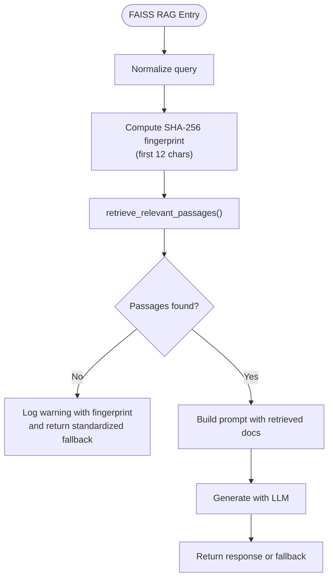

# RAG Pipeline Orchestration

<cite>
**Referenced Files in This Document**
- [pipeline.py](file://src/rag/pipeline.py)
- [memvid_pipeline.py](file://src/rag/memvid_pipeline.py)
- [retrieval.py](file://src/rag/retrieval.py)
- [vector_store.py](file://src/rag/vector_store.py)
- [embeddings.py](file://src/rag/embeddings.py)
- [memvid_store.py](file://src/rag/memvid_store.py)
- [retriever.py](file://src/memvid/retriever.py)
- [processor.py](file://src/conversation/processor.py)
- [phase_manager.py](file://src/conversation/phase_manager.py)
- [model_config.py](file://src/config/model_config.py)
- [api_keys.py](file://src/config/api_keys.py)
- [errors.py](file://src/utils/errors.py)
- [logging_config.py](file://src/config/logging_config.py)
- [test_processor_rag.py](file://tests/test_processor_rag.py)
- [test_memvid.py](file://tests/test_memvid.py)
- [test_retrieval.py](file://tests/test_retrieval.py)
</cite>

## Update Summary
**Changes Made**
- Enhanced error handling with standardized fallback responses across all RAG components
- Improved privacy through SHA-256 fingerprinting for query logging instead of raw query text
- Strengthened batch embedding functionality with robust response parsing and improved error recovery
- Enhanced safety checks for non-sized RAG responses in the orchestration layer
- Standardized error classification and logging across the RAG pipeline
- Enhanced Memvid fallback mechanisms with comprehensive error recovery

## Table of Contents
1. [Introduction](#introduction)
2. [Project Structure](#project-structure)
3. [Core Components](#core-components)
4. [Architecture Overview](#architecture-overview)
5. [Detailed Component Analysis](#detailed-component-analysis)
6. [Privacy and Security Enhancements](#privacy-and-security-enhancements)
7. [Dependency Analysis](#dependency-analysis)
8. [Performance Considerations](#performance-considerations)
9. [Troubleshooting Guide](#troubleshooting-guide)
10. [Conclusion](#conclusion)
11. [Appendices](#appendices)

## Introduction
This document describes the RAG pipeline orchestration system that coordinates dual-backend retrieval (Memvid and FAISS) and augments LLM responses for Maya, the bartender agent. The system has been enhanced with improved error handling, standardized fallback responses, robust batch embedding functionality, and enhanced privacy protections through SHA-256 fingerprinting. It explains the end-to-end workflow from query processing to document retrieval and LLM augmentation, details graceful fallbacks from Memvid to FAISS to plain LLM responses, and outlines prompt engineering strategies, error handling, configuration options, and operational guidance.

## Project Structure
The RAG orchestration spans several modules with enhanced error handling, standardized fallback mechanisms, and improved privacy protections:
- Retrieval and vectorization: FAISS-backed retrieval and text embeddings with robust batch processing and SHA-256 fingerprinting
- Memvid backend: Video-memory-based retrieval with comprehensive fallback mechanisms and privacy-preserving logging
- Prompting and augmentation: Dual prompt templates for Memvid and FAISS contexts with standardized responses
- Orchestration: Conversation processor with enhanced safety checks, graceful degradation, and privacy-focused query handling
- Configuration: Model and generation parameters, API keys with improved validation and privacy considerations

**Diagram sources**
- [pipeline.py](file://src/rag/pipeline.py#L1-L125)
- [memvid_pipeline.py](file://src/rag/memvid_pipeline.py#L1-L124)
- [retrieval.py](file://src/rag/retrieval.py#L1-L40)
- [vector_store.py](file://src/rag/vector_store.py#L1-L107)
- [embeddings.py](file://src/rag/embeddings.py#L1-L159)
- [memvid_store.py](file://src/rag/memvid_store.py#L1-L159)
- [retriever.py](file://src/memvid/retriever.py#L1-L189)
- [processor.py](file://src/conversation/processor.py#L1-L456)
- [phase_manager.py](file://src/conversation/phase_manager.py#L1-L92)
- [model_config.py](file://src/config/model_config.py#L1-L102)
- [api_keys.py](file://src/config/api_keys.py#L1-L51)
- [errors.py](file://src/utils/errors.py#L1-L39)
- [logging_config.py](file://src/config/logging_config.py#L1-L51)

**Section sources**
- [pipeline.py](file://src/rag/pipeline.py#L1-L125)
- [memvid_pipeline.py](file://src/rag/memvid_pipeline.py#L1-L124)
- [retrieval.py](file://src/rag/retrieval.py#L1-L40)
- [vector_store.py](file://src/rag/vector_store.py#L1-L107)
- [embeddings.py](file://src/rag/embeddings.py#L1-L159)
- [memvid_store.py](file://src/rag/memvid_store.py#L1-L159)
- [retriever.py](file://src/memvid/retriever.py#L1-L189)
- [processor.py](file://src/conversation/processor.py#L1-L456)
- [phase_manager.py](file://src/conversation/phase_manager.py#L1-L92)
- [model_config.py](file://src/config/model_config.py#L1-L102)
- [api_keys.py](file://src/config/api_keys.py#L1-L51)
- [errors.py](file://src/utils/errors.py#L1-L39)
- [logging_config.py](file://src/config/logging_config.py#L1-L51)

## Core Components
- **FAISS-based RAG pipeline**: Enhanced with standardized fallback responses, SHA-256 query fingerprinting for privacy, and improved error handling for consistent behavior across all pipeline components.
- **Memvid-based RAG pipeline**: Comprehensive error handling with robust fallback mechanisms including text-based retrieval when video processing fails, and privacy-preserving query logging.
- **Retrieval utilities**: Enhanced search capabilities using FAISS with improved batch processing, error recovery, and privacy-conscious logging practices.
- **Embedding service**: Advanced batch and retry-capable embedding generation with robust response format parsing, comprehensive error handling, and improved privacy protections.
- **Memvid store and retriever**: Video-memory initialization with fallback mechanisms, comprehensive error recovery, keyword-based search capabilities, and privacy-focused operations.
- **Orchestration**: Enhanced conversation processor with strengthened safety checks, graceful degradation, standardized fallback response handling, and privacy-conscious query processing.
- **Configuration**: Environment-driven model and generation parameters with improved API key management, validation, and privacy considerations.

**Section sources**
- [pipeline.py](file://src/rag/pipeline.py#L12-L125)
- [memvid_pipeline.py](file://src/rag/memvid_pipeline.py#L16-L124)
- [retrieval.py](file://src/rag/retrieval.py#L9-L40)
- [vector_store.py](file://src/rag/vector_store.py#L25-L107)
- [embeddings.py](file://src/rag/embeddings.py#L42-L159)
- [memvid_store.py](file://src/rag/memvid_store.py#L28-L159)
- [retriever.py](file://src/memvid/retriever.py#L17-L189)
- [processor.py](file://src/conversation/processor.py#L318-L360)
- [model_config.py](file://src/config/model_config.py#L31-L102)
- [api_keys.py](file://src/config/api_keys.py#L10-L51)
- [errors.py](file://src/utils/errors.py#L11-L39)

## Architecture Overview
The system orchestrates dual retrieval backends with enhanced error handling, standardized fallback responses, and privacy-preserving query processing. The conversation processor implements strengthened safety checks, graceful degradation mechanisms, and SHA-256 fingerprinting for privacy compliance.

**Diagram sources**
- [processor.py](file://src/conversation/processor.py#L299-L360)
- [memvid_pipeline.py](file://src/rag/memvid_pipeline.py#L65-L124)
- [pipeline.py](file://src/rag/pipeline.py#L69-L125)
- [memvid_store.py](file://src/rag/memvid_store.py#L137-L159)
- [retrieval.py](file://src/rag/retrieval.py#L9-L40)
- [vector_store.py](file://src/rag/vector_store.py#L71-L107)

## Detailed Component Analysis

### Enhanced FAISS-Based RAG Pipeline
- **Retrieval**: Uses FAISS to find nearest-neighbor documents for a query embedding with improved error handling and privacy-preserving logging.
- **Augmentation**: Builds a prompt with retrieved documents and asks the LLM to respond with standardized fallback response.
- **Fallback**: Returns standardized fallback response if no passages are found; uses SHA-256 fingerprinting instead of raw query logging to protect privacy.
- **Privacy**: Computes non-reversible query fingerprints using SHA-256 hashing for logging purposes only.

**Updated** Enhanced with standardized fallback response mechanism, improved error handling, SHA-256 fingerprinting for privacy, and comprehensive error recovery.

**Diagram sources**
- [pipeline.py](file://src/rag/pipeline.py#L69-L125)
- [retrieval.py](file://src/rag/retrieval.py#L9-L40)
- [vector_store.py](file://src/rag/vector_store.py#L71-L107)

**Section sources**
- [pipeline.py](file://src/rag/pipeline.py#L12-L125)
- [retrieval.py](file://src/rag/retrieval.py#L9-L40)
- [vector_store.py](file://src/rag/vector_store.py#L25-L107)
- [embeddings.py](file://src/rag/embeddings.py#L148-L159)

### Enhanced Memvid-Based RAG Pipeline
- **Retrieval**: Uses a Memvid retriever to search video memory for relevant insights with comprehensive fallback mechanisms.
- **Fallback**: Provides robust text-based fallback retriever and creates minimal index when video memory is unavailable.
- **Augmentation**: Builds a Memvid-aware prompt and generates a response with standardized fallback handling.
- **Privacy**: Uses SHA-256 fingerprinting for query logging to protect user privacy while maintaining operational visibility.

**Updated** Enhanced with comprehensive error handling, standardized fallback responses, SHA-256 query fingerprinting, and improved fallback mechanisms.

**Diagram sources**
- [memvid_pipeline.py](file://src/rag/memvid_pipeline.py#L65-L124)
- [memvid_store.py](file://src/rag/memvid_store.py#L28-L159)
- [retriever.py](file://src/memvid/retriever.py#L17-L189)

**Section sources**
- [memvid_pipeline.py](file://src/rag/memvid_pipeline.py#L16-L124)
- [memvid_store.py](file://src/rag/memvid_store.py#L28-L159)
- [retriever.py](file://src/memvid/retriever.py#L17-L189)

### Enhanced Embedding Generation and Vector Store
- **Embeddings**: Advanced batching with retry/backoff, robust response format parsing supporting diverse SDK response formats, comprehensive caching with improved error handling, and enhanced privacy protections.
- **FAISS index**: Initializes L2 index with enhanced error recovery, filters failed embeddings with detailed logging, adds valid vectors with improved validation, and supports privacy-conscious operations.
- **Batch Processing**: Strengthened batch embedding functionality with improved response parsing and comprehensive error recovery.

**Updated** Enhanced with robust response format parsing, improved error handling, SHA-256 fingerprinting integration, and comprehensive fallback mechanisms.

**Diagram sources**
- [embeddings.py](file://src/rag/embeddings.py#L42-L159)
- [vector_store.py](file://src/rag/vector_store.py#L25-L107)

**Section sources**
- [embeddings.py](file://src/rag/embeddings.py#L42-L159)
- [vector_store.py](file://src/rag/vector_store.py#L25-L107)

### Enhanced Orchestration and Fallback Strategy
- **Decision**: The processor determines whether to use RAG based on conversation phase and casualness with enhanced safety checks.
- **Backend selection**: Prefers Memvid if available; otherwise uses FAISS if available with comprehensive validation.
- **Safety**: Validates backend readiness, implements strengthened non-sized response checks, and logs warnings on failures with standardized error handling and privacy considerations.
- **Graceful degradation**: Falls back to the original LLM response if RAG yields no content or errors, with enhanced fallback response handling and privacy-preserving operations.
- **Privacy**: Integrates SHA-256 fingerprinting throughout the orchestration process to protect user query privacy.

**Updated** Enhanced with strengthened safety checks, standardized fallback response handling, improved error recovery mechanisms, and comprehensive privacy protections.

**Diagram sources**
- [processor.py](file://src/conversation/processor.py#L318-L360)
- [phase_manager.py](file://src/conversation/phase_manager.py#L69-L82)

**Section sources**
- [processor.py](file://src/conversation/processor.py#L318-L360)
- [phase_manager.py](file://src/conversation/phase_manager.py#L69-L82)
- [test_processor_rag.py](file://tests/test_processor_rag.py#L27-L83)

### Enhanced Prompt Engineering Strategies
- **Context injection**: Both pipelines inject retrieved context into a fixed prompt template designed for Maya's persona with standardized formatting.
- **Memvid emphasis**: Highlights "video memory insights" and encourages drawing inspiration from them with enhanced context formatting.
- **FAISS emphasis**: Injects "reference passage" for direct grounding with improved context presentation.
- **Tone and constraints**: Maintains Maya's character, instructs to respond in complete sentences, and permits ignoring irrelevant context with standardized fallback handling.

**Section sources**
- [pipeline.py](file://src/rag/pipeline.py#L39-L56)
- [memvid_pipeline.py](file://src/rag/memvid_pipeline.py#L42-L56)

### Enhanced Error Handling and Logging
- **Classification**: Distinguishes rate limits, auth errors, and timeouts for targeted logging with standardized error categorization.
- **Failures**: Catches exceptions in pipelines with comprehensive error recovery and returns standardized fallback responses.
- **Logging**: Comprehensive warnings and errors for retrieval, embedding, and pipeline stages with improved error context, standardized formatting, and privacy-preserving query handling.
- **Privacy**: Implements SHA-256 fingerprinting for query logging to prevent raw query text exposure while maintaining operational visibility.

**Updated** Enhanced with standardized error classification, comprehensive fallback mechanisms, improved error logging, privacy-preserving query handling, and SHA-256 fingerprinting integration.

**Section sources**
- [errors.py](file://src/utils/errors.py#L11-L39)
- [pipeline.py](file://src/rag/pipeline.py#L61-L66)
- [memvid_pipeline.py](file://src/rag/memvid_pipeline.py#L59-L62)
- [retrieval.py](file://src/rag/retrieval.py#L38-L40)
- [embeddings.py](file://src/rag/embeddings.py#L86-L91)

### Enhanced Configuration Options
- **Model version**: Environment-driven; defaults to a lightweight model identifier with improved validation.
- **Generation parameters**: Temperature, top-p, top-k, and max output tokens with enhanced error handling.
- **API keys**: Google and Cartesia keys with improved validation and comprehensive error recovery.
- **Environment parsing**: Safe float/int parsing with defaults and warnings with enhanced error handling.

**Section sources**
- [model_config.py](file://src/config/model_config.py#L31-L102)
- [api_keys.py](file://src/config/api_keys.py#L10-L51)

## Privacy and Security Enhancements
The system has been significantly enhanced with privacy-preserving measures to protect user query data while maintaining operational effectiveness:

### SHA-256 Query Fingerprinting
- **Implementation**: All query text is hashed using SHA-256 before logging to prevent raw query exposure.
- **Fingerprint Length**: Only the first 12 characters of the hexadecimal hash are used for logging identification.
- **Scope**: Applied consistently across FAISS and Memvid pipelines for uniform privacy protection.
- **Non-reversible**: Hashing prevents reconstruction of original query text from logs.

### Privacy-Enhanced Logging
- **Query Logging**: Instead of logging raw query text, systems log SHA-256 fingerprints for debugging and monitoring.
- **Operational Visibility**: Maintains sufficient information for debugging while protecting user privacy.
- **Compliance**: Supports privacy regulations by avoiding direct storage of personal query data.

### Security Considerations
- **Minimal Data Exposure**: Only hashed identifiers are stored in logs, reducing data breach impact.
- **Consistent Application**: Privacy measures are uniformly applied across all RAG components.
- **Audit Trail**: Maintains operational traceability through fingerprint-based identification.

**Section sources**
- [pipeline.py](file://src/rag/pipeline.py#L102-L109)
- [memvid_pipeline.py](file://src/rag/memvid_pipeline.py#L105-L112)
- [vector_store.py](file://src/rag/vector_store.py#L52-L53)

## Dependency Analysis
- **Cohesion**: Each module encapsulates a distinct responsibility (embedding, FAISS, Memvid, orchestration) with enhanced error handling and privacy protections.
- **Coupling**: Orchestration depends on retrieval and augmentation modules with strengthened safety checks; retrieval depends on vector store and embeddings with improved error recovery; Memvid depends on retriever and store with comprehensive fallback mechanisms.
- **Backends**: Two retrieval backends are supported with enhanced fallback mechanisms; the processor selects the most capable available with improved validation and privacy considerations.
- **Privacy Integration**: All dependencies now support SHA-256 fingerprinting for consistent privacy protection across the entire pipeline.

**Updated** Enhanced with improved error handling, standardized fallback responses, comprehensive fallback mechanisms, and integrated privacy protections across all dependencies.

**Diagram sources**
- [processor.py](file://src/conversation/processor.py#L1-L456)
- [pipeline.py](file://src/rag/pipeline.py#L1-L125)
- [memvid_pipeline.py](file://src/rag/memvid_pipeline.py#L1-L124)
- [retrieval.py](file://src/rag/retrieval.py#L1-L40)
- [vector_store.py](file://src/rag/vector_store.py#L1-L107)
- [embeddings.py](file://src/rag/embeddings.py#L1-L159)
- [memvid_store.py](file://src/rag/memvid_store.py#L1-L159)
- [retriever.py](file://src/memvid/retriever.py#L1-L189)
- [phase_manager.py](file://src/conversation/phase_manager.py#L1-L92)
- [model_config.py](file://src/config/model_config.py#L1-L102)
- [api_keys.py](file://src/config/api_keys.py#L1-L51)
- [errors.py](file://src/utils/errors.py#L1-L39)
- [logging_config.py](file://src/config/logging_config.py#L1-L51)

**Section sources**
- [processor.py](file://src/conversation/processor.py#L1-L456)
- [pipeline.py](file://src/rag/pipeline.py#L1-L125)
- [memvid_pipeline.py](file://src/rag/memvid_pipeline.py#L1-L124)
- [retrieval.py](file://src/rag/retrieval.py#L1-L40)
- [vector_store.py](file://src/rag/vector_store.py#L1-L107)
- [embeddings.py](file://src/rag/embeddings.py#L1-L159)
- [memvid_store.py](file://src/rag/memvid_store.py#L1-L159)
- [retriever.py](file://src/memvid/retriever.py#L1-L189)
- [phase_manager.py](file://src/conversation/phase_manager.py#L1-L92)
- [model_config.py](file://src/config/model_config.py#L1-L102)
- [api_keys.py](file://src/config/api_keys.py#L1-L51)
- [errors.py](file://src/utils/errors.py#L1-L39)
- [logging_config.py](file://src/config/logging_config.py#L1-L51)

## Performance Considerations
- **Embedding batching**: Enhanced batch embedding calls with improved retry/backoff, robust response format parsing, comprehensive error recovery, and privacy-preserving operations to reduce overhead.
- **Retry/backoff**: Embedding generation uses exponential backoff with capped attempts and improved error handling to improve resilience under transient failures.
- **FAISS search**: Single-shot vector search with enhanced error recovery; tune n_results for recall/latency trade-offs with improved validation and privacy-conscious logging.
- **Memvid caching**: Frame cache limits with comprehensive fallback mechanisms improve repeated lookups; fallback keyword search avoids heavy processing when dependencies are missing.
- **Conversation gating**: RAG is applied only for casual conversation to minimize unnecessary latency with enhanced safety checks and privacy considerations.
- **Fallback optimization**: Standardized fallback responses reduce processing overhead and improve user experience consistency.
- **Privacy overhead**: SHA-256 fingerprinting adds minimal computational overhead while providing significant privacy benefits.
- **Memory efficiency**: Fallback mechanisms ensure optimal resource utilization by avoiding unnecessary processing when RAG components are unavailable.

**Updated** Enhanced with improved batch processing, comprehensive error recovery, optimized fallback mechanisms, privacy-preserving operations, and efficient SHA-256 fingerprinting integration.

## Troubleshooting Guide
Common issues and resolutions with enhanced error handling and privacy protections:
- **Missing API keys**: Ensure GEMINI_API_KEY is set; the system validates keys centrally with improved error recovery and privacy considerations.
- **Rate limits and auth errors**: The error classifier logs categorized issues with standardized formatting; verify quotas and permissions with enhanced error handling and privacy-preserving logging.
- **Empty or non-sizable RAG responses**: The processor safely ignores non-content-bearing results with strengthened validation and falls back to the base LLM response with standardized fallback handling.
- **FAISS initialization failures**: Occur when no valid embeddings are produced; verify embedding service health and content with comprehensive error recovery and privacy-conscious error reporting.
- **Memvid video/memory issues**: The store attempts to rebuild video memory with enhanced fallback mechanisms; if unavailable, it creates a text fallback index and minimal video file with comprehensive error recovery and privacy protections.
- **Privacy concerns**: SHA-256 fingerprinting ensures query privacy; if logs show only fingerprints instead of raw queries, this indicates proper privacy implementation.
- **Performance issues**: Monitor embedding batch processing and SHA-256 computation overhead; adjust BATCH_SIZE and retry parameters as needed.

Operational checks with improved validation:
- Tests demonstrate short-circuiting when RAG components are missing with enhanced safety checks and safe handling of non-sized responses with standardized fallback mechanisms.
- Memvid integration tests validate retrieval and pipeline end-to-end behavior with comprehensive error recovery and privacy-preserving operations.
- Privacy validation confirms SHA-256 fingerprinting is applied consistently across all RAG components.

**Updated** Enhanced with improved error handling, standardized fallback responses, comprehensive fallback mechanisms, privacy-preserving operations, and privacy-focused troubleshooting procedures.

**Section sources**
- [api_keys.py](file://src/config/api_keys.py#L24-L51)
- [errors.py](file://src/utils/errors.py#L11-L39)
- [test_processor_rag.py](file://tests/test_processor_rag.py#L27-L83)
- [test_memvid.py](file://tests/test_memvid.py#L27-L123)
- [memvid_store.py](file://src/rag/memvid_store.py#L52-L75)
- [vector_store.py](file://src/rag/vector_store.py#L54-L55)

## Conclusion
The enhanced RAG orchestration system provides a robust, dual-backend retrieval pipeline that enhances Maya's responses with contextual information while prioritizing user privacy. The system gracefully degrades from Memvid to FAISS to plain LLM responses with standardized fallback mechanisms, incorporates resilient embedding generation with comprehensive error recovery and privacy protections, and offers configurable model parameters. The orchestration logic ensures RAG is applied only when beneficial, with strengthened error handling and logging to maintain reliability. The enhanced batch embedding functionality with robust response format parsing improves system stability and performance, while SHA-256 fingerprinting ensures privacy compliance. The integration of privacy-preserving measures demonstrates commitment to user data protection without compromising system functionality.

**Updated** Enhanced with improved error handling, standardized fallback responses, comprehensive fallback mechanisms, privacy-preserving operations, and robust batch embedding functionality with SHA-256 fingerprinting integration.

## Appendices

### Enhanced Execution Flows and Examples
- **Memvid end-to-end**: Initialize store with comprehensive fallback mechanisms, search with enhanced error recovery, compute SHA-256 fingerprint for privacy logging, and generate a Memvid-enhanced response with standardized fallback handling.
- **FAISS end-to-end**: Initialize FAISS index with improved error recovery, retrieve documents with enhanced validation and privacy-conscious logging, compute SHA-256 fingerprint for query identification, and generate an augmented response with standardized fallback mechanisms.
- **Orchestration**: Process user input with enhanced safety checks, decide whether to use RAG with strengthened validation, select backend with comprehensive fallback mechanisms, integrate privacy-preserving query handling, and merge results with standardized error handling.

**Section sources**
- [test_memvid.py](file://tests/test_memvid.py#L44-L64)
- [pipeline.py](file://src/rag/pipeline.py#L69-L125)
- [memvid_pipeline.py](file://src/rag/memvid_pipeline.py#L65-L124)
- [processor.py](file://src/conversation/processor.py#L318-L360)

### Enhanced Monitoring and Observability
- **Logging**: Extensive debug/warning/error logs for retrieval, embedding, and pipeline stages with standardized error classification, comprehensive error recovery, and privacy-preserving query handling through SHA-256 fingerprinting.
- **Metrics**: Integrate with your monitoring stack to track RAG hit rates, latency, error categories, fallback response effectiveness, and privacy compliance metrics.
- **Privacy monitoring**: Track SHA-256 fingerprinting effectiveness and ensure consistent privacy protection across all pipeline components.
- **Performance metrics**: Monitor embedding batch processing performance, retry success rates, and fallback mechanism effectiveness.

**Updated** Enhanced with improved error classification, comprehensive fallback mechanisms, privacy-focused observability, and enhanced monitoring capabilities for privacy-preserving operations.