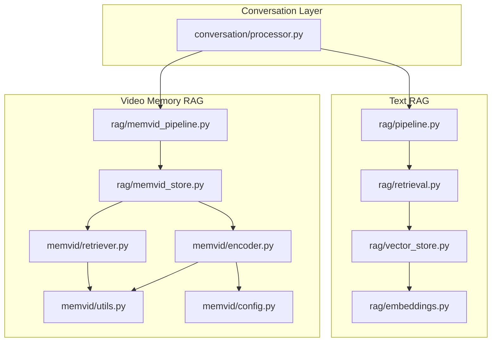
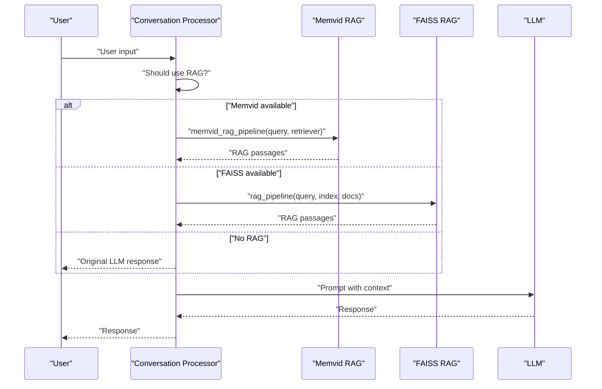
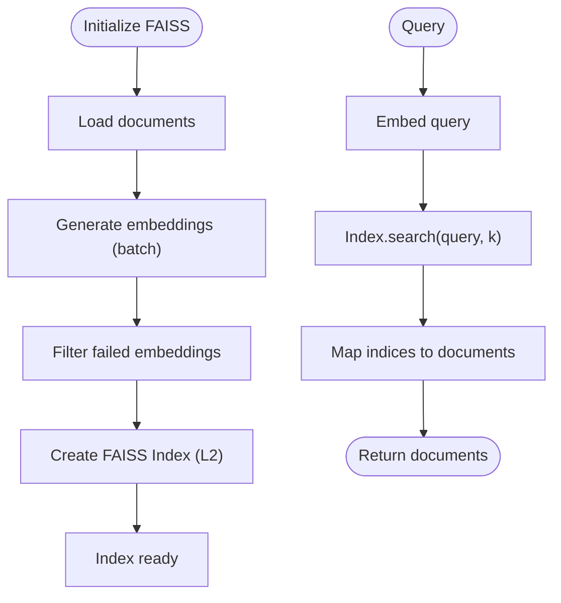
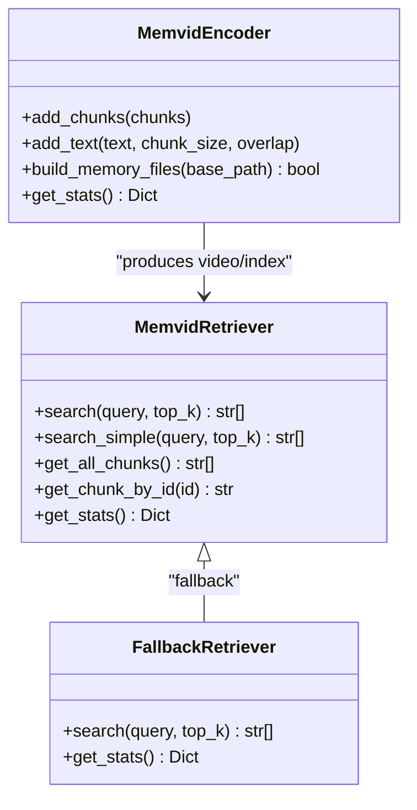
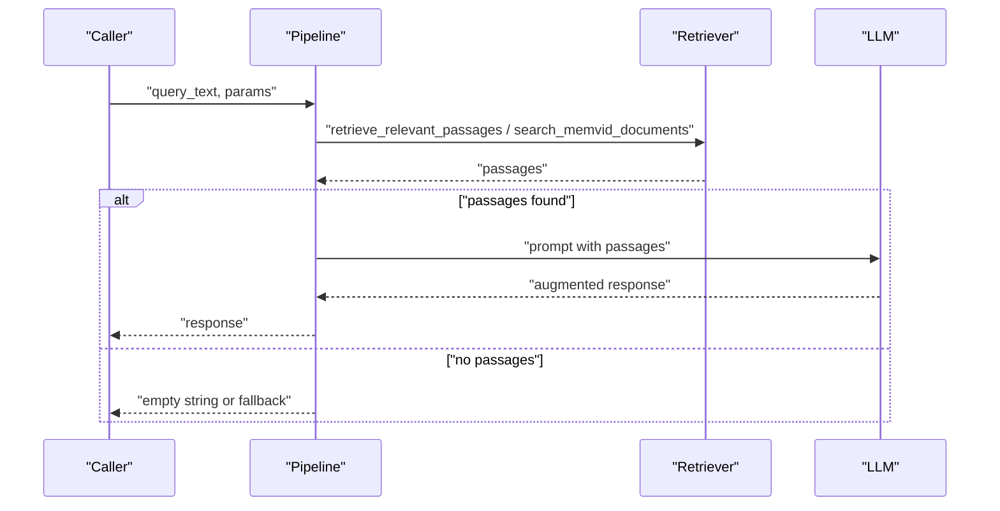
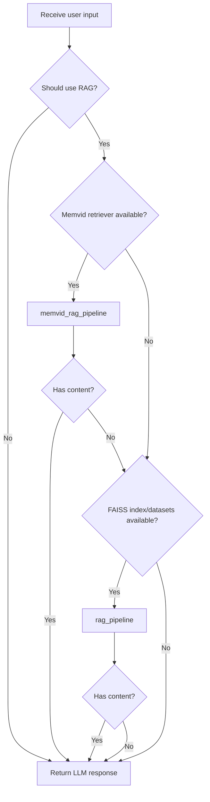
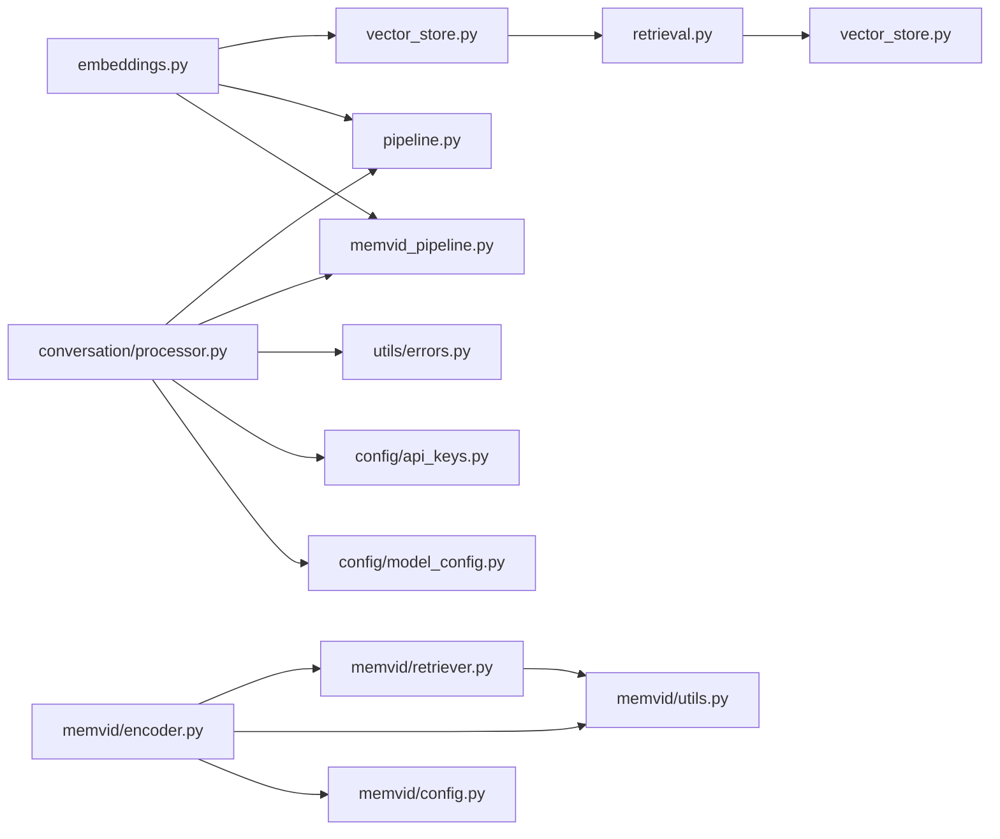

# Retrieval-Augmented Generation (RAG)

<cite>
**Referenced Files in This Document**
- [pipeline.py](file://src/rag/pipeline.py)
- [memvid_pipeline.py](file://src/rag/memvid_pipeline.py)
- [retrieval.py](file://src/rag/retrieval.py)
- [vector_store.py](file://src/rag/vector_store.py)
- [memvid_store.py](file://src/rag/memvid_store.py)
- [embeddings.py](file://src/rag/embeddings.py)
- [processor.py](file://src/conversation/processor.py)
- [model_config.py](file://src/config/model_config.py)
- [api_keys.py](file://src/config/api_keys.py)
- [errors.py](file://src/utils/errors.py)
- [__init__.py](file://src/memvid/__init__.py)
- [config.py](file://src/memvid/config.py)
- [encoder.py](file://src/memvid/encoder.py)
- [retriever.py](file://src/memvid/retriever.py)
- [utils.py](file://src/memvid/utils.py)
</cite>

## Table of Contents
1. [Introduction](#introduction)
2. [Project Structure](#project-structure)
3. [Core Components](#core-components)
4. [Architecture Overview](#architecture-overview)
5. [Detailed Component Analysis](#detailed-component-analysis)
6. [Dependency Analysis](#dependency-analysis)
7. [Performance Considerations](#performance-considerations)
8. [Troubleshooting Guide](#troubleshooting-guide)
9. [Conclusion](#conclusion)
10. [Appendices](#appendices)

## Introduction
This document explains MayaMCP’s dual-backend Retrieval-Augmented Generation (RAG) system that enhances conversational responses with contextual information. It covers:
- FAISS vector store for traditional text-based retrieval
- Memvid video memory system for visual context
- Pipeline architecture that processes user queries, retrieves relevant content, and augments LLM prompts
- Encoding strategies, similarity search, and ranking
- Fallback behavior that degrades gracefully from Memvid to FAISS to no RAG
- Configuration options, performance tips, troubleshooting, and integration with conversation processing

## Project Structure
The RAG system spans two primary modules:
- Traditional text RAG: FAISS-backed retrieval and augmentation
- Video-memory RAG: Memvid-based retrieval and augmentation

**Diagram sources**
- [processor.py](file://src/conversation/processor.py#L300-L362)
- [pipeline.py](file://src/rag/pipeline.py#L60-L105)
- [memvid_pipeline.py](file://src/rag/memvid_pipeline.py#L65-L108)
- [retrieval.py](file://src/rag/retrieval.py#L9-L40)
- [vector_store.py](file://src/rag/vector_store.py#L25-L107)
- [embeddings.py](file://src/rag/embeddings.py#L69-L217)
- [memvid_store.py](file://src/rag/memvid_store.py#L28-L159)
- [encoder.py](file://src/memvid/encoder.py#L18-L201)
- [retriever.py](file://src/memvid/retriever.py#L17-L189)
- [utils.py](file://src/memvid/utils.py#L32-L161)
- [config.py](file://src/memvid/config.py#L25-L49)

**Section sources**
- [processor.py](file://src/conversation/processor.py#L300-L362)
- [pipeline.py](file://src/rag/pipeline.py#L60-L105)
- [memvid_pipeline.py](file://src/rag/memvid_pipeline.py#L65-L108)
- [vector_store.py](file://src/rag/vector_store.py#L25-L107)
- [memvid_store.py](file://src/rag/memvid_store.py#L28-L159)

## Core Components
- Text RAG pipeline
  - Orchestrates retrieval from FAISS and LLM augmentation
  - Implements robust error handling and fallbacks
- Memvid RAG pipeline
  - Orchestrates retrieval from video memory and LLM augmentation
  - Provides graceful degradation to text fallback when video memory is unavailable
- Retrieval utilities
  - FAISS-based similarity search
  - Memvid-based keyword scoring and frame extraction
- Embedding engine
  - Batch and single embedding generation with retry and caching
- Conversation integration
  - Conditional RAG enhancement for casual conversation turns
  - Dual-path fallback: Memvid → FAISS → none

**Section sources**
- [pipeline.py](file://src/rag/pipeline.py#L12-L105)
- [memvid_pipeline.py](file://src/rag/memvid_pipeline.py#L16-L108)
- [retrieval.py](file://src/rag/retrieval.py#L9-L40)
- [vector_store.py](file://src/rag/vector_store.py#L25-L107)
- [embeddings.py](file://src/rag/embeddings.py#L69-L217)
- [processor.py](file://src/conversation/processor.py#L300-L362)

## Architecture Overview
The RAG system integrates with the conversation processor to optionally enhance responses with context:
- For casual conversation, the processor decides whether to apply RAG
- Two backends are supported:
  - Memvid: video memory with keyword-based retrieval and frame decoding
  - FAISS: dense vector retrieval with cosine distance approximations via L2 search
- Both pipelines produce a list of relevant passages that augment the LLM prompt

**Diagram sources**
- [processor.py](file://src/conversation/processor.py#L300-L362)
- [memvid_pipeline.py](file://src/rag/memvid_pipeline.py#L65-L108)
- [pipeline.py](file://src/rag/pipeline.py#L60-L105)

## Detailed Component Analysis

### FAISS Vector Store and Retrieval
- Initialization
  - Generates embeddings for all documents using the embedding engine
  - Filters out failed embeddings and constructs a FAISS index with L2 distance
- Similarity search
  - Embeds the query and performs a fixed-K search on the index
  - Returns the most similar documents

**Diagram sources**
- [vector_store.py](file://src/rag/vector_store.py#L25-L107)
- [embeddings.py](file://src/rag/embeddings.py#L148-L217)

**Section sources**
- [vector_store.py](file://src/rag/vector_store.py#L25-L107)
- [embeddings.py](file://src/rag/embeddings.py#L69-L217)
- [retrieval.py](file://src/rag/retrieval.py#L9-L40)

### Memvid Video Memory System
- Encoding
  - Splits text into overlapping chunks
  - Encodes each chunk into a QR code and writes frames to a video
  - Builds an index mapping frames to chunk metadata
- Retrieval
  - Keyword-based scoring over indexed chunk previews
  - Optional full-text extraction by decoding QR frames on demand
  - Fallback retriever for degraded modes

**Diagram sources**
- [encoder.py](file://src/memvid/encoder.py#L18-L201)
- [retriever.py](file://src/memvid/retriever.py#L17-L189)
- [memvid_store.py](file://src/rag/memvid_store.py#L98-L135)

**Section sources**
- [encoder.py](file://src/memvid/encoder.py#L18-L201)
- [retriever.py](file://src/memvid/retriever.py#L17-L189)
- [memvid_store.py](file://src/rag/memvid_store.py#L28-L159)
- [utils.py](file://src/memvid/utils.py#L32-L161)
- [config.py](file://src/memvid/config.py#L25-L49)

### RAG Pipelines and Prompt Augmentation
- Text RAG pipeline
  - Retrieves top-k documents from FAISS
  - Constructs a prompt with the reference passage and asks the LLM to respond
- Memvid RAG pipeline
  - Retrieves top-k insights from video memory
  - Constructs a prompt with the retrieved insights and asks the LLM to respond
- Both pipelines include error handling and fallback responses

**Diagram sources**
- [pipeline.py](file://src/rag/pipeline.py#L60-L105)
- [memvid_pipeline.py](file://src/rag/memvid_pipeline.py#L65-L108)
- [retrieval.py](file://src/rag/retrieval.py#L9-L40)
- [memvid_store.py](file://src/rag/memvid_store.py#L137-L159)

**Section sources**
- [pipeline.py](file://src/rag/pipeline.py#L12-L105)
- [memvid_pipeline.py](file://src/rag/memvid_pipeline.py#L16-L108)
- [retrieval.py](file://src/rag/retrieval.py#L9-L40)
- [memvid_store.py](file://src/rag/memvid_store.py#L137-L159)

### Conversation Integration and Fallback Behavior
- The conversation processor conditionally applies RAG for casual conversation turns
- Priority order: Memvid → FAISS → no RAG
- Robust error handling and logging ensure graceful degradation

**Diagram sources**
- [processor.py](file://src/conversation/processor.py#L300-L362)

**Section sources**
- [processor.py](file://src/conversation/processor.py#L300-L362)

## Dependency Analysis
- External libraries
  - FAISS for dense vector indexing and search
  - OpenCV/PIL/qrcode for video/frame/QR operations
  - Google Generative AI for embeddings and text generation
- Internal dependencies
  - Embedding engine shared by both backends
  - Logging and error classification utilities
  - Configuration for models and API keys

**Diagram sources**
- [embeddings.py](file://src/rag/embeddings.py#L69-L217)
- [vector_store.py](file://src/rag/vector_store.py#L25-L107)
- [pipeline.py](file://src/rag/pipeline.py#L1-L105)
- [memvid_pipeline.py](file://src/rag/memvid_pipeline.py#L1-L108)
- [retriever.py](file://src/memvid/retriever.py#L17-L189)
- [encoder.py](file://src/memvid/encoder.py#L18-L201)
- [utils.py](file://src/memvid/utils.py#L32-L161)
- [config.py](file://src/memvid/config.py#L25-L49)
- [processor.py](file://src/conversation/processor.py#L300-L362)
- [errors.py](file://src/utils/errors.py#L11-L39)
- [api_keys.py](file://src/config/api_keys.py#L10-L51)
- [model_config.py](file://src/config/model_config.py#L31-L102)

**Section sources**
- [embeddings.py](file://src/rag/embeddings.py#L69-L217)
- [vector_store.py](file://src/rag/vector_store.py#L25-L107)
- [pipeline.py](file://src/rag/pipeline.py#L1-L105)
- [memvid_pipeline.py](file://src/rag/memvid_pipeline.py#L1-L108)
- [retriever.py](file://src/memvid/retriever.py#L17-L189)
- [encoder.py](file://src/memvid/encoder.py#L18-L201)
- [utils.py](file://src/memvid/utils.py#L32-L161)
- [config.py](file://src/memvid/config.py#L25-L49)
- [processor.py](file://src/conversation/processor.py#L300-L362)
- [errors.py](file://src/utils/errors.py#L11-L39)
- [api_keys.py](file://src/config/api_keys.py#L10-L51)
- [model_config.py](file://src/config/model_config.py#L31-L102)

## Performance Considerations
- Embedding batching
  - Batch embedding requests to reduce overhead and improve throughput
  - Single embedding calls are retried with exponential backoff
- Indexing and search
  - FAISS uses L2 distance; dimensionality and index type influence speed and accuracy
  - Limit number of results (k) to balance latency and relevance
- Memvid retrieval
  - Keyword scoring avoids heavy OCR until needed
  - Frame cache limits memory usage during retrieval
- Concurrency and retries
  - Retries with exponential backoff for transient failures
  - API key caching prevents repeated configuration calls

[No sources needed since this section provides general guidance]

## Troubleshooting Guide
Common issues and resolutions:
- Missing API keys
  - Ensure the Google API key is set; otherwise embedding generation fails
- Rate limits and timeouts
  - Errors are classified and logged; consider reducing request rate or increasing backoff
- Video memory unavailability
  - Encoder/decoder dependencies must be installed; otherwise, a text fallback is created
- Empty or invalid index
  - Retriever validates index and video presence; rebuild memory if corrupted
- Degradation path
  - If Memvid fails, the system falls back to FAISS; if FAISS fails, responses proceed without RAG

**Section sources**
- [api_keys.py](file://src/config/api_keys.py#L10-L51)
- [errors.py](file://src/utils/errors.py#L11-L39)
- [memvid_store.py](file://src/rag/memvid_store.py#L52-L97)
- [retriever.py](file://src/memvid/retriever.py#L57-L76)
- [processor.py](file://src/conversation/processor.py#L318-L361)

## Conclusion
MayaMCP’s dual-backend RAG system combines FAISS and Memvid to deliver contextual, multimodal responses. The pipelines are designed for resilience: Memvid-first, then FAISS, and finally plain LLM responses when retrieval fails. The embedding engine, configuration, and error-handling utilities support reliable operation across varied environments.

[No sources needed since this section summarizes without analyzing specific files]

## Appendices

### Configuration Options
- Embedding model and task type
  - Embedding model identifier and optional task type are forwarded to the embedding API
- Retrieval parameters
  - FAISS: number of results (k) for similarity search
  - Memvid: top-k for keyword-based retrieval
- Model selection
  - Gemini model version and generation parameters are configurable via environment variables

**Section sources**
- [embeddings.py](file://src/rag/embeddings.py#L78-L84)
- [retrieval.py](file://src/rag/retrieval.py#L13-L13)
- [memvid_pipeline.py](file://src/rag/memvid_pipeline.py#L88-L88)
- [model_config.py](file://src/config/model_config.py#L31-L102)

### Example Workflows
- Text RAG
  - User asks a general question
  - FAISS retrieves relevant documents
  - LLM generates a response augmented with the documents
- Memvid RAG
  - User asks about a past event
  - Memvid retrieves relevant insights from video memory
  - LLM generates a response enriched with the insights
- Fallback
  - If retrieval fails, the system returns a plain LLM response

**Section sources**
- [pipeline.py](file://src/rag/pipeline.py#L60-L105)
- [memvid_pipeline.py](file://src/rag/memvid_pipeline.py#L65-L108)
- [processor.py](file://src/conversation/processor.py#L318-L361)