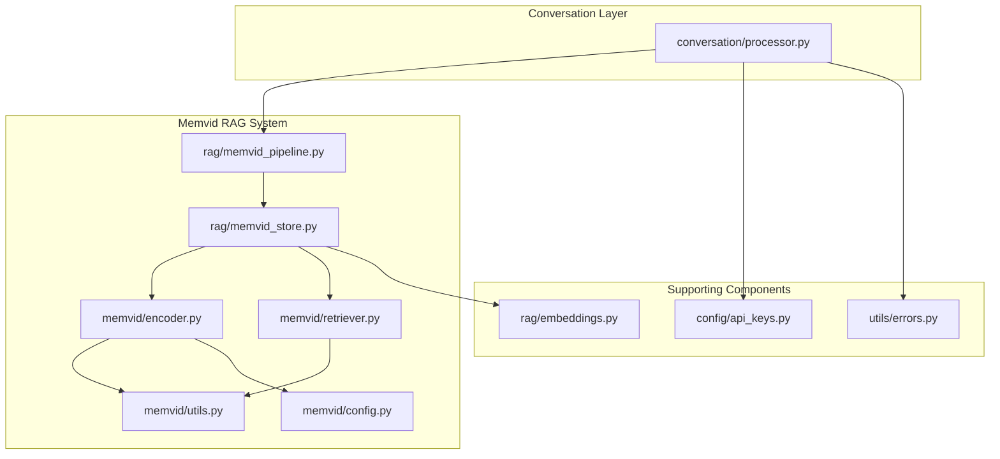
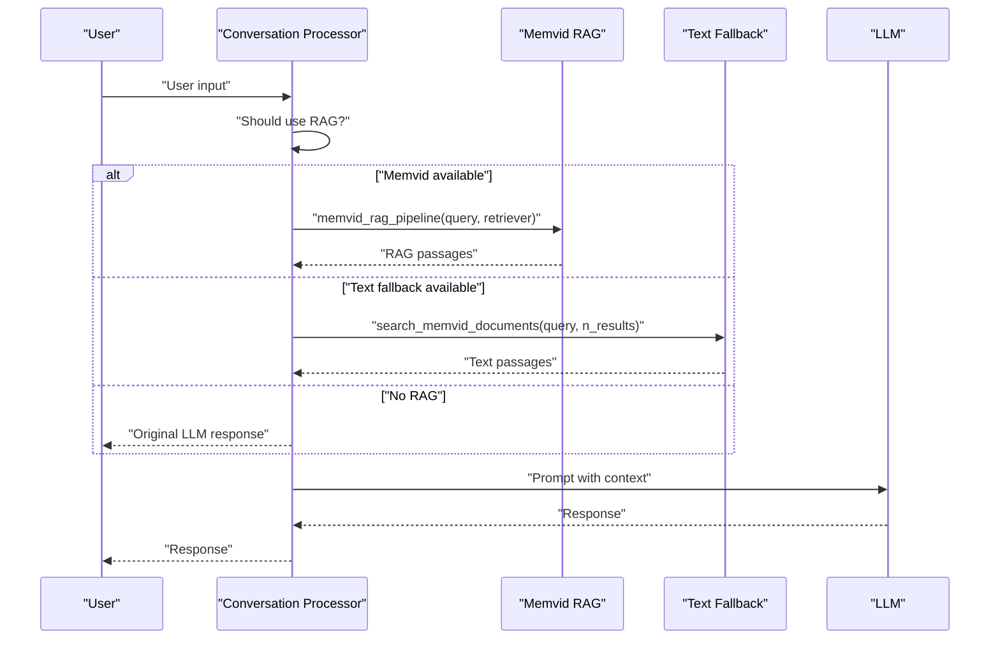
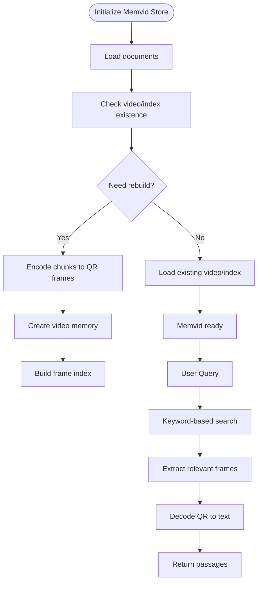
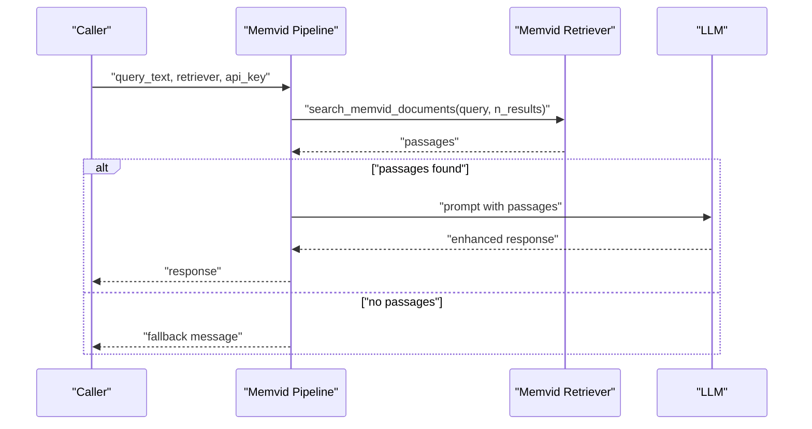
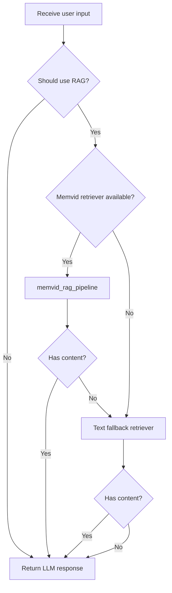
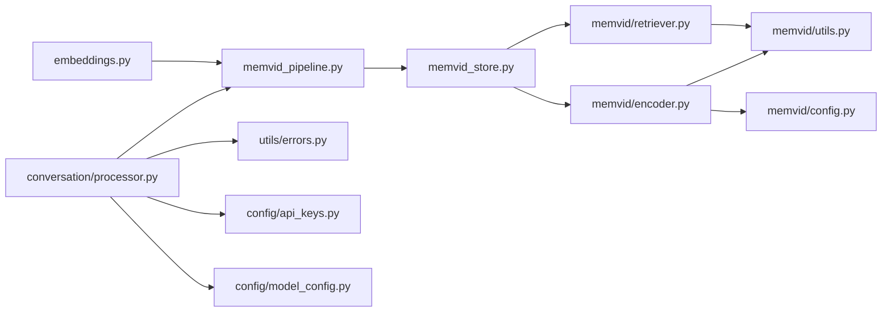

# Retrieval-Augmented Generation (RAG)

<cite>
**Referenced Files in This Document**
- [__init__.py](file://src/rag/__init__.py)
- [memvid_pipeline.py](file://src/rag/memvid_pipeline.py)
- [memvid_store.py](file://src/rag/memvid_store.py)
- [embeddings.py](file://src/rag/embeddings.py)
- [processor.py](file://src/conversation/processor.py)
- [model_config.py](file://src/config/model_config.py)
- [api_keys.py](file://src/config/api_keys.py)
- [errors.py](file://src/utils/errors.py)
- [__init__.py](file://src/memvid/__init__.py)
- [config.py](file://src/memvid/config.py)
- [encoder.py](file://src/memvid/encoder.py)
- [retriever.py](file://src/memvid/retriever.py)
- [utils.py](file://src/memvid/utils.py)
</cite>

## Update Summary
**Changes Made**
- Removed all references to FAISS vector store and traditional text-based RAG
- Simplified architecture to Memvid-only approach with fallback capabilities
- Updated pipeline documentation to reflect single-backend design
- Revised fallback system to focus on Memvid → text fallback instead of Memvid → FAISS → none
- Updated configuration and integration examples to match simplified implementation

## Table of Contents
1. [Introduction](#introduction)
2. [Project Structure](#project-structure)
3. [Core Components](#core-components)
4. [Architecture Overview](#architecture-overview)
5. [Detailed Component Analysis](#detailed-component-analysis)
6. [Dependency Analysis](#dependency-analysis)
7. [Performance Considerations](#performance-considerations)
8. [Troubleshooting Guide](#troubleshooting-guide)
9. [Conclusion](#conclusion)
10. [Appendices](#appendices)

## Introduction
This document explains MayaMCP's simplified Retrieval-Augmented Generation (RAG) system that focuses exclusively on video-based memory retrieval through the Memvid system. The system has been streamlined from a dual-backend approach to a Memvid-only implementation that enhances conversational responses with contextual information stored in video memory. Key features include:
- Memvid video memory system for visual and textual context storage
- Keyword-based retrieval with QR code encoding for efficient memory encoding
- Fallback mechanism that gracefully degrades to text-based retrieval when video memory is unavailable
- Streaming RAG pipeline integration with conversation processing
- Configuration options for embedding models, similarity thresholds, and retrieval parameters

## Project Structure
The RAG system now operates as a unified Memvid-based architecture with fallback capabilities:

**Diagram sources**
- [processor.py](file://src/conversation/processor.py#L320-L348)
- [memvid_pipeline.py](file://src/rag/memvid_pipeline.py#L73-L124)
- [memvid_store.py](file://src/rag/memvid_store.py#L28-L79)
- [encoder.py](file://src/memvid/encoder.py#L18-L201)
- [retriever.py](file://src/memvid/retriever.py#L17-L199)
- [embeddings.py](file://src/rag/embeddings.py#L1-L159)

**Section sources**
- [processor.py](file://src/conversation/processor.py#L320-L348)
- [memvid_pipeline.py](file://src/rag/memvid_pipeline.py#L73-L124)
- [memvid_store.py](file://src/rag/memvid_store.py#L28-L79)

## Core Components
- Memvid RAG pipeline
  - Orchestrates retrieval from video memory and LLM augmentation
  - Implements robust error handling and fallback to text-based retrieval
- Memvid store and initialization
  - Creates video memory from personality documents using QR encoding
  - Provides fallback mechanism when video creation fails
- Memvid retriever system
  - Keyword-based scoring over indexed chunk previews
  - Frame extraction and caching for performance optimization
- Embedding engine (retained for compatibility)
  - Batch and single embedding generation with retry and caching
- Conversation integration
  - Conditional RAG enhancement for casual conversation turns
  - Priority: Memvid → text fallback → no enhancement

**Section sources**
- [memvid_pipeline.py](file://src/rag/memvid_pipeline.py#L22-L124)
- [memvid_store.py](file://src/rag/memvid_store.py#L28-L164)
- [retriever.py](file://src/memvid/retriever.py#L17-L199)
- [embeddings.py](file://src/rag/embeddings.py#L63-L159)
- [processor.py](file://src/conversation/processor.py#L320-L348)

## Architecture Overview
The simplified RAG system integrates with the conversation processor to optionally enhance responses with video memory context:
- For casual conversation, the processor decides whether to apply RAG
- Primary backend: Memvid video memory with keyword-based retrieval
- Fallback mechanism: automatic transition to text-based retrieval when video memory is unavailable
- Both pipelines produce a list of relevant passages that augment the LLM prompt

**Diagram sources**
- [processor.py](file://src/conversation/processor.py#L320-L348)
- [memvid_pipeline.py](file://src/rag/memvid_pipeline.py#L73-L124)
- [memvid_store.py](file://src/rag/memvid_store.py#L142-L164)

## Detailed Component Analysis

### Memvid Video Memory System
The Memvid system creates video-based memory from text documents using QR code encoding:

- **Encoding Process**
  - Splits text into overlapping chunks using configurable chunk size and overlap
  - Encodes each chunk as JSON data containing chunk id, text, and frame position
  - Converts encoded data to QR codes and writes frames to video
  - Builds index mapping frames to chunk metadata for efficient retrieval

- **Retrieval Mechanism**
  - Keyword-based scoring over indexed chunk previews
  - Frame cache limits memory usage during retrieval
  - Fallback to text-only mode when video creation fails

**Diagram sources**
- [memvid_store.py](file://src/rag/memvid_store.py#L28-L79)
- [encoder.py](file://src/memvid/encoder.py#L170-L193)
- [retriever.py](file://src/memvid/retriever.py#L86-L121)

**Section sources**
- [memvid_store.py](file://src/rag/memvid_store.py#L28-L164)
- [encoder.py](file://src/memvid/encoder.py#L18-L201)
- [retriever.py](file://src/memvid/retriever.py#L17-L199)
- [config.py](file://src/memvid/config.py#L25-L49)

### Memvid RAG Pipeline and Prompt Enhancement
The Memvid RAG pipeline processes user queries through video memory retrieval and LLM augmentation:

- **Pipeline Flow**
  - Retrieves top-k documents from Memvid video memory
  - Constructs a prompt with the retrieved insights and asks the LLM to respond
  - Includes comprehensive error handling and fallback responses
  - Supports timeout protection for streaming scenarios

- **Fallback Mechanism**
  - Automatic detection of video memory availability
  - Graceful degradation to text-based retrieval when video fails
  - Text fallback uses keyword matching algorithm for document selection

**Diagram sources**
- [memvid_pipeline.py](file://src/rag/memvid_pipeline.py#L73-L124)
- [memvid_store.py](file://src/rag/memvid_store.py#L142-L164)

**Section sources**
- [memvid_pipeline.py](file://src/rag/memvid_pipeline.py#L22-L124)
- [memvid_store.py](file://src/rag/memvid_store.py#L142-L164)

### Conversation Integration and Fallback Behavior
The conversation processor conditionally applies Memvid RAG for casual conversation turns with streamlined fallback:

- **Priority Order**: Memvid → text fallback → no enhancement
- **Streaming Support**: Timeout protection (RAG_TIMEOUT) prevents blocking during streaming
- **Robust Error Handling**: Comprehensive logging and graceful degradation
- **Conditional Application**: RAG only applied for casual conversation, not order-related interactions

**Diagram sources**
- [processor.py](file://src/conversation/processor.py#L320-L348)
- [processor.py](file://src/conversation/processor.py#L504-L530)

**Section sources**
- [processor.py](file://src/conversation/processor.py#L320-L348)
- [processor.py](file://src/conversation/processor.py#L504-L530)

## Dependency Analysis
The simplified architecture reduces external dependencies while maintaining core functionality:

- **External Libraries**
  - OpenCV/PIL/qrcode for video/frame/QR operations
  - Google Generative AI for embeddings and text generation
  - Concurrent futures for timeout protection in streaming scenarios

- **Internal Dependencies**
  - Memvid encoder and retriever classes
  - Fallback retriever for text-based search
  - Configuration management for video settings
  - Error handling and logging utilities

**Diagram sources**
- [embeddings.py](file://src/rag/embeddings.py#L1-L159)
- [memvid_pipeline.py](file://src/rag/memvid_pipeline.py#L1-L124)
- [memvid_store.py](file://src/rag/memvid_store.py#L1-L164)
- [encoder.py](file://src/memvid/encoder.py#L1-L201)
- [retriever.py](file://src/memvid/retriever.py#L1-L199)
- [processor.py](file://src/conversation/processor.py#L320-L348)

**Section sources**
- [embeddings.py](file://src/rag/embeddings.py#L1-L159)
- [memvid_pipeline.py](file://src/rag/memvid_pipeline.py#L1-L124)
- [memvid_store.py](file://src/rag/memvid_store.py#L1-L164)
- [encoder.py](file://src/memvid/encoder.py#L1-L201)
- [retriever.py](file://src/memvid/retriever.py#L1-L199)
- [processor.py](file://src/conversation/processor.py#L320-L348)

## Performance Considerations
- **Video Memory Optimization**
  - QR code encoding reduces storage requirements for text content
  - Frame cache limits memory usage during retrieval operations
  - Configurable chunk size balances retrieval precision and memory usage

- **Fallback Performance**
  - Text-based fallback uses optimized keyword matching algorithm
  - Pre-processing query words improves search efficiency
  - Cache-based frame extraction minimizes video I/O operations

- **Streaming Integration**
  - Timeout protection prevents blocking during streaming responses
  - Thread pool execution enables non-blocking RAG processing
  - Batch embedding support maintained for compatibility

## Troubleshooting Guide
Common issues and resolutions for the simplified Memvid-only system:

- **Missing Dependencies**
  - Ensure OpenCV, Pillow, and qrcode packages are installed
  - Video memory creation requires proper codec support

- **Video Memory Issues**
  - Check video file and index file accessibility
  - Verify frame count and FPS configuration in index
  - Rebuild video memory if corruption detected

- **Fallback Mechanism**
  - Automatic text fallback when video creation fails
  - Text-based retrieval uses keyword matching algorithm
  - Fallback mode indicated by fallback flag in index

- **Streaming Integration**
  - Monitor RAG timeout settings to prevent blocking
  - Check thread pool configuration for concurrent operations
  - Verify API key availability for LLM generation

**Section sources**
- [memvid_store.py](file://src/rag/memvid_store.py#L52-L79)
- [memvid_store.py](file://src/rag/memvid_store.py#L80-L100)
- [retriever.py](file://src/memvid/retriever.py#L66-L85)
- [processor.py](file://src/conversation/processor.py#L512-L524)

## Conclusion
MayaMCP's simplified Memvid-only RAG system provides a streamlined approach to contextual conversation enhancement. By focusing exclusively on video-based memory retrieval with robust fallback capabilities, the system maintains reliability while reducing architectural complexity. The integration with conversation processing ensures timely response generation through streaming support and timeout protection.

## Appendices

### Configuration Options
- **Memvid Settings**
  - QR code configuration: version, error correction, box size, border
  - Video settings: FPS, frame dimensions, encoding parameters
  - Chunking parameters: chunk size, overlap for text splitting

- **Retrieval Parameters**
  - Top-k results for keyword-based retrieval
  - Frame cache size for performance optimization
  - Fallback mode activation criteria

- **Model Selection**
  - Gemini model version and generation parameters
  - Embedding model configuration for compatibility
  - API key management for service access

**Section sources**
- [config.py](file://src/memvid/config.py#L25-L49)
- [memvid_store.py](file://src/rag/memvid_store.py#L142-L164)
- [model_config.py](file://src/config/model_config.py#L31-L102)

### Example Workflows
- **Memvid RAG Workflow**
  - User asks about past events or personal experiences
  - Memvid retrieves relevant insights from video memory
  - LLM generates response enriched with video-stored context

- **Fallback Workflow**
  - Video memory unavailable or corrupted
  - Automatic transition to text-based retrieval
  - Keyword matching provides basic context enhancement

- **Streaming Integration**
  - Real-time conversation enhancement
  - Timeout protection prevents blocking
  - Non-blocking execution for responsive UI

**Section sources**
- [memvid_pipeline.py](file://src/rag/memvid_pipeline.py#L73-L124)
- [memvid_store.py](file://src/rag/memvid_store.py#L142-L164)
- [processor.py](file://src/conversation/processor.py#L504-L530)