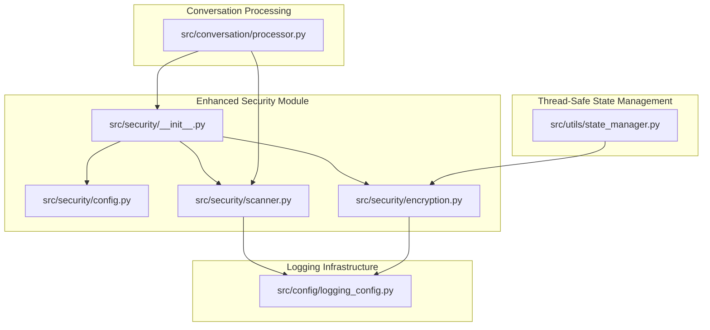
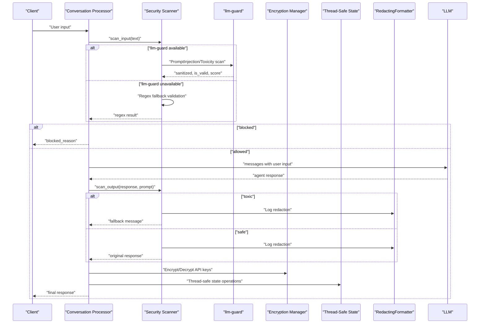
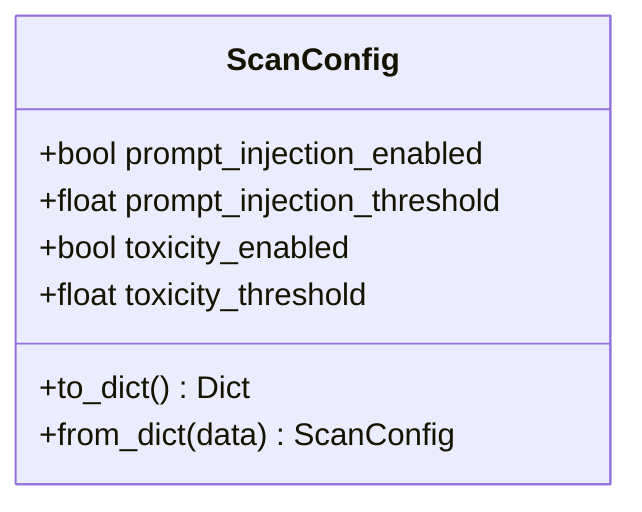
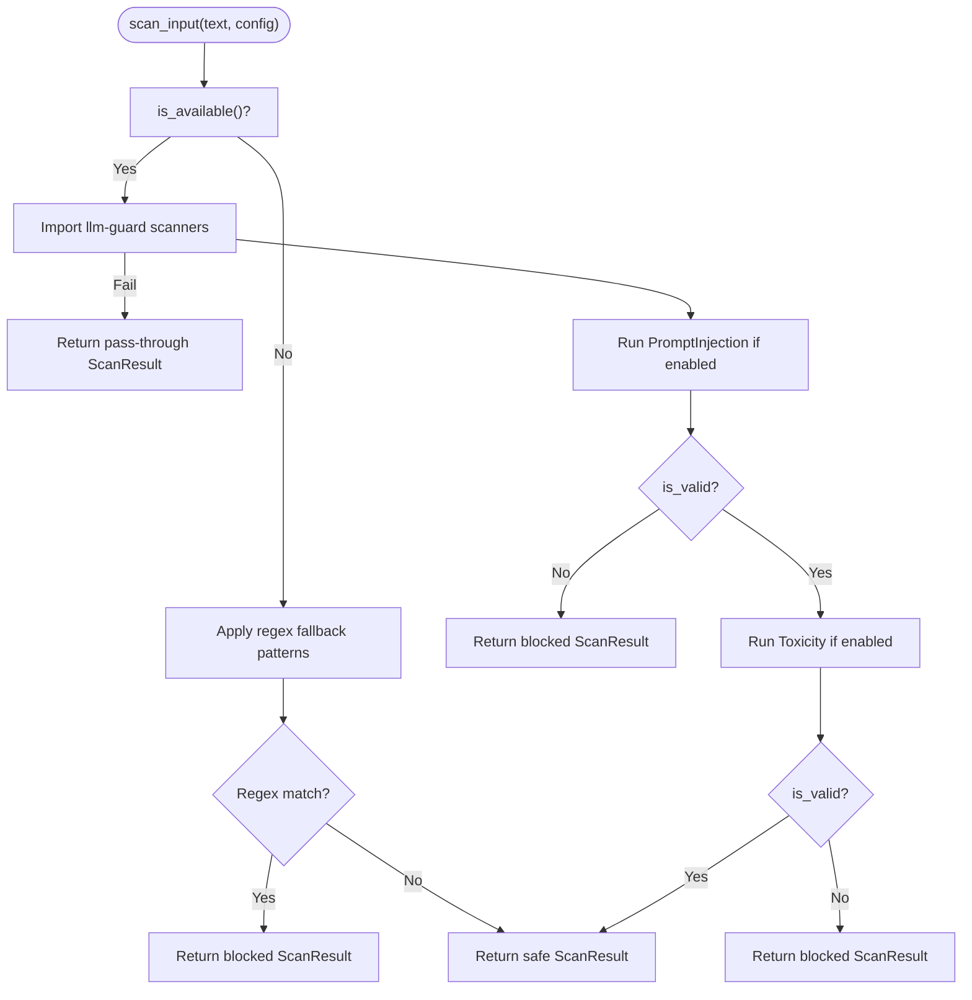
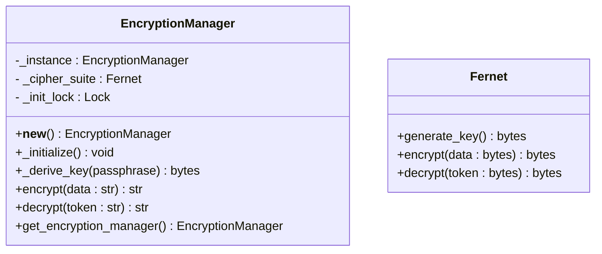
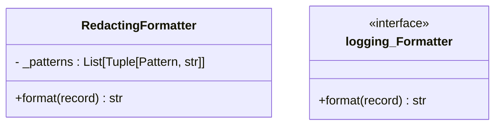
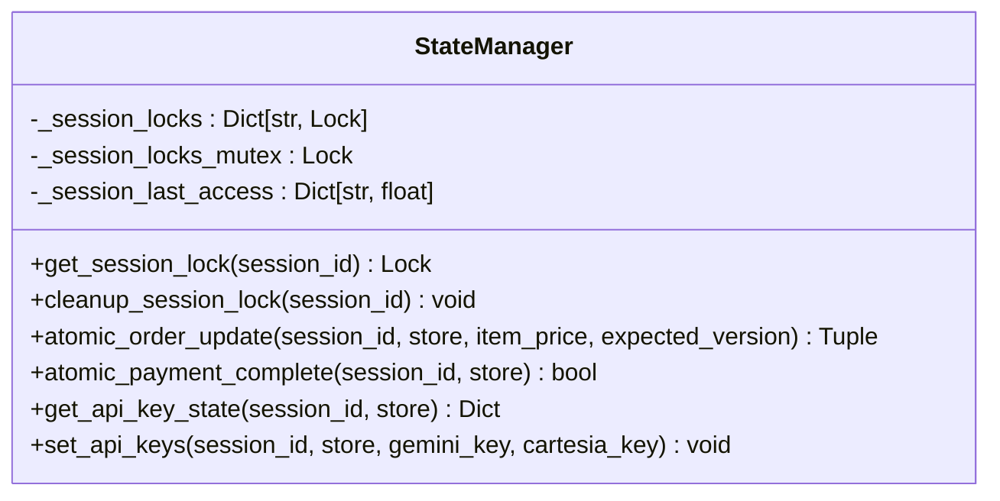
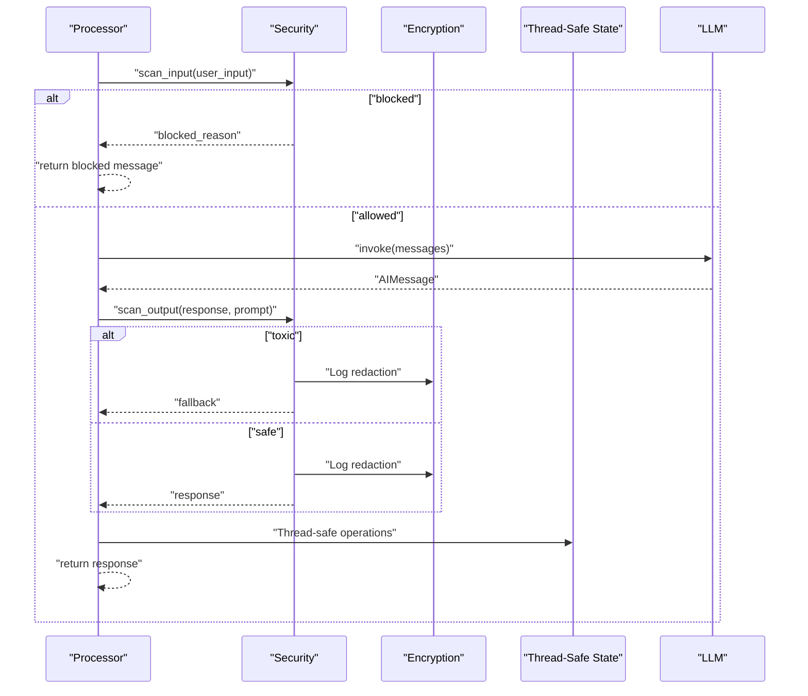
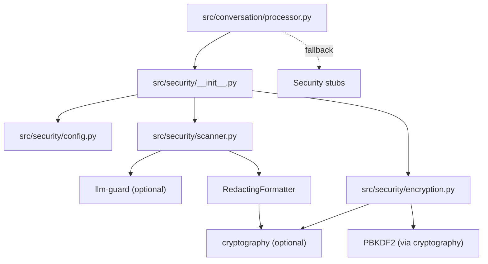

# Security & Safety Framework

<cite>
**Referenced Files in This Document**
- [src/security/__init__.py](file://src/security/__init__.py)
- [src/security/config.py](file://src/security/config.py)
- [src/security/scanner.py](file://src/security/scanner.py)
- [src/security/encryption.py](file://src/security/encryption.py)
- [src/config/logging_config.py](file://src/config/logging_config.py)
- [src/utils/state_manager.py](file://src/utils/state_manager.py)
- [src/conversation/processor.py](file://src/conversation/processor.py)
- [tests/security/test_security.py](file://tests/security/test_security.py)
- [tests/test_security_scanner.py](file://tests/test_security_scanner.py)
- [tests/test_security_config.py](file://tests/test_security_config.py)
- [tests/test_processor_security.py](file://tests/test_processor_security.py)
- [SECURITY_HARDENING_BYOK.md](file://SECURITY_HARDENING_BYOK.md)
- [.kiro/specs/llm-guard-security/design.md](file://.kiro/specs/llm-guard-security/design.md)
- [.kiro/specs/llm-guard-security/requirements.md](file://.kiro/specs/llm-guard-security/requirements.md)
- [requirements.txt](file://requirements.txt)
- [.env.example](file://.env.example)
</cite>

## Update Summary
**Changes Made**
- Enhanced encryption system with double-checked locking for thread-safe singleton initialization
- Implemented unique salt persistence with PBKDF2 key derivation using 600,000 iterations
- Added comprehensive thread-safe state management functions for session locking and atomic operations
- Improved encryption key management with passphrase-to-key derivation and salt file handling
- Enhanced API key state functions with secure encryption and decryption

## Table of Contents
1. [Introduction](#introduction)
2. [Project Structure](#project-structure)
3. [Core Components](#core-components)
4. [Architecture Overview](#architecture-overview)
5. [Detailed Component Analysis](#detailed-component-analysis)
6. [Dependency Analysis](#dependency-analysis)
7. [Performance Considerations](#performance-considerations)
8. [Troubleshooting Guide](#troubleshooting-guide)
9. [Conclusion](#conclusion)
10. [Appendices](#appendices)

## Introduction
MayaMCP's security framework provides comprehensive input and output protection against prompt injection and toxicity using the llm-guard library. The framework has been significantly enhanced with a new encryption management system using Fernet symmetric encryption, an advanced logging framework with sensitive data redaction, and a robust fallback input validation system with regex-based scanning capabilities. The latest enhancements include double-checked locking for thread-safe singleton initialization, unique salt persistence with PBKDF2 key derivation, and comprehensive thread-safe state management functions. It follows a fail-open design philosophy to preserve system availability: when security services are unavailable or encounter errors, content passes through safely with minimal disruption. The framework integrates seamlessly with conversation processing to automatically scan user inputs and agent responses, and exposes configuration options for thresholds and feature toggles. This document explains the enhanced design, integration, configuration, and operational guidance for maintaining a strong security posture while preserving a smooth user experience.

## Project Structure
The security framework is organized under src/security with four primary modules plus enhanced logging infrastructure:
- __init__.py: Public exports for configuration, scanning functions, and availability checks
- config.py: ScanConfig dataclass defining security thresholds and toggles
- scanner.py: Core scanning logic for input and output, with fail-open error handling and regex fallback
- encryption.py: Enhanced Fernet symmetric encryption management system with double-checked locking, unique salt persistence, and PBKDF2 key derivation
- logging_config.py: Enhanced logging configuration with RedactingFormatter for sensitive data protection

Integration with conversation processing is implemented in src/conversation/processor.py, which calls scan_input before LLM invocation and scan_output after generating agent responses. The encryption system is integrated into the state manager for secure API key storage with thread-safe operations.

**Diagram sources**
- [src/security/__init__.py](file://src/security/__init__.py#L1-L5)
- [src/security/config.py](file://src/security/config.py#L1-L24)
- [src/security/scanner.py](file://src/security/scanner.py#L1-L160)
- [src/security/encryption.py](file://src/security/encryption.py#L1-L149)
- [src/config/logging_config.py](file://src/config/logging_config.py#L1-L77)
- [src/utils/state_manager.py](file://src/utils/state_manager.py)
- [src/conversation/processor.py](file://src/conversation/processor.py#L1-L480)

**Section sources**
- [src/security/__init__.py](file://src/security/__init__.py#L1-L5)
- [src/security/config.py](file://src/security/config.py#L1-L24)
- [src/security/scanner.py](file://src/security/scanner.py#L1-L160)
- [src/security/encryption.py](file://src/security/encryption.py#L1-L149)
- [src/config/logging_config.py](file://src/config/logging_config.py#L1-L77)
- [src/utils/state_manager.py](file://src/utils/state_manager.py)
- [src/conversation/processor.py](file://src/conversation/processor.py#L1-L480)

## Core Components
- ScanConfig: Defines security feature toggles and thresholds for prompt injection and toxicity detection. Includes serialization and deserialization helpers for persistence and configuration updates.
- ScanResult: Encapsulates the outcome of a scan, including validity, sanitized text, reason for blocking, and scanner scores.
- is_available(): Checks whether llm-guard is installed and importable, enabling graceful degradation when unavailable.
- scan_input(): Scans user input for prompt injection and toxicity using llm-guard scanners with regex fallback, with fail-open behavior on errors.
- scan_output(): Scans agent output for toxicity and replaces toxic content with a safe fallback message, also with fail-open behavior.
- EncryptionManager: Enhanced singleton class managing Fernet symmetric encryption for secure API key storage with BYOK (Bring Your Own Key) support, double-checked locking, unique salt persistence, and PBKDF2 key derivation with 600,000 iterations.
- RedactingFormatter: Enhanced logging formatter that automatically redacts sensitive information like API keys and bearer tokens from log output.
- Thread-Safe State Management: Comprehensive session locking, atomic operations, and concurrent access control for secure state management.

These components collectively implement the fail-open design, provide comprehensive encryption for sensitive data with enhanced security measures, and integrate with conversation processing to protect user interactions without compromising availability.

**Section sources**
- [src/security/config.py](file://src/security/config.py#L1-L24)
- [src/security/scanner.py](file://src/security/scanner.py#L1-L160)
- [src/security/encryption.py](file://src/security/encryption.py#L1-L149)
- [src/config/logging_config.py](file://src/config/logging_config.py#L8-L28)
- [src/utils/state_manager.py](file://src/utils/state_manager.py#L206-L255)
- [src/conversation/processor.py](file://src/conversation/processor.py#L113-L114)
- [src/conversation/processor.py](file://src/conversation/processor.py#L190-L196)
- [src/conversation/processor.py](file://src/conversation/processor.py#L231-L237)
- [src/conversation/processor.py](file://src/conversation/processor.py#L434-L440)

## Architecture Overview
The enhanced security framework sits between the conversation processor and the llm-guard library, with integrated encryption and logging systems. The processor invokes scan_input before sending user input to the LLM and scan_output after receiving the agent response. When llm-guard is unavailable, scanning falls back to regex-based validation. The enhanced encryption system manages secure storage of API keys using Fernet symmetric encryption with double-checked locking, unique salt persistence, and PBKDF2 key derivation. The logging system automatically redacts sensitive information from all log output. Thread-safe state management ensures concurrent access control and atomic operations across multiple sessions.

**Diagram sources**
- [src/conversation/processor.py](file://src/conversation/processor.py#L113-L114)
- [src/conversation/processor.py](file://src/conversation/processor.py#L190-L196)
- [src/conversation/processor.py](file://src/conversation/processor.py#L231-L237)
- [src/conversation/processor.py](file://src/conversation/processor.py#L434-L440)
- [src/security/scanner.py](file://src/security/scanner.py#L45-L119)
- [src/security/scanner.py](file://src/security/scanner.py#L121-L159)
- [src/security/encryption.py](file://src/security/encryption.py#L17-L38)
- [src/utils/state_manager.py](file://src/utils/state_manager.py#L206-L255)
- [src/config/logging_config.py](file://src/config/logging_config.py#L8-L28)

## Detailed Component Analysis

### Enhanced Security Configuration (ScanConfig)
ScanConfig defines:
- prompt_injection_enabled: Toggle for prompt injection detection
- prompt_injection_threshold: Threshold for prompt injection score
- toxicity_enabled: Toggle for toxicity detection
- toxicity_threshold: Threshold for toxicity score

It supports serialization to a dictionary and deserialization from a dictionary, ignoring unknown keys for forward compatibility.

**Diagram sources**
- [src/security/config.py](file://src/security/config.py#L4-L24)

**Section sources**
- [src/security/config.py](file://src/security/config.py#L1-L24)
- [tests/test_security_config.py](file://tests/test_security_config.py#L1-L27)

### Enhanced Security Scanning (scanner.py)
Key behaviors:
- Availability check: is_available() attempts to import llm-guard and logs warnings if unavailable
- Input scanning: scan_input() runs PromptInjection and Toxicity scanners based on configuration, collects scores, and blocks on threshold exceedance. Includes regex fallback for prompt injection detection when llm-guard is unavailable.
- Output scanning: scan_output() runs Toxicity on prompt+response, replaces output with a safe fallback on threshold exceedance
- Fail-open semantics: On import errors, scanner initialization failures, or runtime exceptions, scanning continues or passes through with logging
- Regex fallback: Comprehensive regex patterns detect common prompt injection attempts including system prompts, roleplay commands, and bypass modes

**Diagram sources**
- [src/security/scanner.py](file://src/security/scanner.py#L21-L119)

**Section sources**
- [src/security/scanner.py](file://src/security/scanner.py#L1-L160)
- [tests/security/test_security.py](file://tests/security/test_security.py#L138-L156)
- [tests/test_security_scanner.py](file://tests/test_security_scanner.py#L36-L41)

### Enhanced Encryption Management System (encryption.py)
The EncryptionManager provides secure storage for sensitive data using Fernet symmetric encryption with significant enhancements:
- Double-checked locking pattern ensures thread-safe singleton initialization with minimal lock contention
- BYOK (Bring Your Own Key) support with MAYA_MASTER_KEY environment variable
- Automatic key generation when no master key is provided (temporary, session-only encryption)
- Unique salt persistence with PBKDF2 key derivation using 600,000 iterations for enhanced security
- Comprehensive error handling for invalid key formats and encryption/decryption failures
- Thread-safe operations with proper logging for security events
- Salt file management with restrictive permissions (owner read/write only)

**Updated** Enhanced with double-checked locking for thread safety, unique salt persistence, and increased PBKDF2 iterations for improved security.

**Diagram sources**
- [src/security/encryption.py](file://src/security/encryption.py#L17-L38)
- [src/security/encryption.py](file://src/security/encryption.py#L67-L100)

**Section sources**
- [src/security/encryption.py](file://src/security/encryption.py#L1-L149)
- [tests/security/test_security.py](file://tests/security/test_security.py#L46-L92)
- [SECURITY_HARDENING_BYOK.md](file://SECURITY_HARDENING_BYOK.md#L13-L21)

### Enhanced Logging Framework (logging_config.py)
The RedactingFormatter enhances security by automatically redacting sensitive information from log output:
- Pattern-based redaction for Google API Keys (AIza...)
- Pattern-based redaction for Bearer tokens
- Pattern-based redaction for Stripe secret keys (sk_live_, sk_test_)
- Configurable format string support
- Integration with basicConfig for application-wide logging setup

**Diagram sources**
- [src/config/logging_config.py](file://src/config/logging_config.py#L8-L28)

**Section sources**
- [src/config/logging_config.py](file://src/config/logging_config.py#L1-L77)
- [tests/security/test_security.py](file://tests/security/test_security.py#L93-L137)

### Thread-Safe State Management (state_manager.py)
The state manager provides comprehensive thread-safe operations for secure state management:
- Thread-safe session locking with mutex protection for concurrent access control
- Double-checked locking pattern for session lock management
- Atomic operations with optimistic locking using version checks
- Concurrent modification detection and handling
- Session expiration tracking and cleanup
- API key state functions with secure encryption and decryption

**Updated** Enhanced with comprehensive thread-safe state management functions including session locking, atomic operations, and concurrent access control.

**Diagram sources**
- [src/utils/state_manager.py](file://src/utils/state_manager.py#L206-L255)
- [src/utils/state_manager.py](file://src/utils/state_manager.py#L683-L755)
- [src/utils/state_manager.py](file://src/utils/state_manager.py#L798-L885)

**Section sources**
- [src/utils/state_manager.py](file://src/utils/state_manager.py#L206-L255)
- [src/utils/state_manager.py](file://src/utils/state_manager.py#L683-L755)
- [src/utils/state_manager.py](file://src/utils/state_manager.py#L798-L885)
- [SECURITY_HARDENING_BYOK.md](file://SECURITY_HARDENING_BYOK.md#L13-L21)

### API Key State Functions with Enhanced Security
The API key state functions provide secure storage and management of sensitive authentication credentials:
- Automatic encryption of API keys before storage in session state using EncryptionManager
- Transparent decryption when API keys are needed for external services
- BYOK encryption key management through MAYA_MASTER_KEY environment variable
- Secure handling of sensitive authentication credentials with error handling for corrupted data
- Thread-safe operations with session locking for concurrent access

**Updated** Enhanced with comprehensive API key state management including secure encryption, decryption, and validation.

**Section sources**
- [src/utils/state_manager.py](file://src/utils/state_manager.py#L798-L885)
- [SECURITY_HARDENING_BYOK.md](file://SECURITY_HARDENING_BYOK.md#L13-L21)

### Conversation Processing Integration
The processor integrates security scanning around user input and agent responses:
- Before LLM invocation: scan_input(user_input_text); if blocked, return blocked_reason immediately
- After LLM response: scan_output(agent_response_text, prompt=user_input_text); if toxic, replace with fallback
- Enhanced logging with redaction for all security-related events
- Graceful fallback is implemented at import time: if the security module is missing or broken, stub functions ensure normal operation

**Diagram sources**
- [src/conversation/processor.py](file://src/conversation/processor.py#L113-L114)
- [src/conversation/processor.py](file://src/conversation/processor.py#L190-L196)
- [src/conversation/processor.py](file://src/conversation/processor.py#L231-L237)
- [src/conversation/processor.py](file://src/conversation/processor.py#L434-L440)

**Section sources**
- [src/conversation/processor.py](file://src/conversation/processor.py#L1-L480)
- [src/conversation/processor.py](file://src/conversation/processor.py#L113-L114)
- [src/conversation/processor.py](file://src/conversation/processor.py#L190-L196)
- [src/conversation/processor.py](file://src/conversation/processor.py#L231-L237)
- [src/conversation/processor.py](file://src/conversation/processor.py#L434-L440)
- [tests/test_processor_security.py](file://tests/test_processor_security.py#L1-L81)

### Design Principles and Requirements
- Fail-open design: Security scanning never blocks the main conversation flow; errors are logged and scanning continues or passes through
- Graceful degradation: When llm-guard is unavailable, regex-based fallback scanning is automatically activated
- Enhanced encryption: Fernet symmetric encryption provides secure storage of sensitive API keys with BYOK support, double-checked locking, unique salt persistence, and PBKDF2 key derivation
- Sensitive data protection: RedactingFormatter automatically removes API keys, tokens, and other credentials from log output
- Thread-safe operations: Comprehensive session locking, atomic operations, and concurrent access control ensure data integrity
- Centralized configuration: ScanConfig provides a single source of truth for thresholds and toggles
- Integration simplicity: Minimal coupling with conversation processing via public exports
- Enhanced security measures: Double-checked locking, unique salt persistence, and increased PBKDF2 iterations provide enterprise-grade security

**Updated** Enhanced with comprehensive thread-safe operations, double-checked locking, unique salt persistence, and increased PBKDF2 iterations for improved security.

**Section sources**
- [.kiro/specs/llm-guard-security/design.md](file://.kiro/specs/llm-guard-security/design.md#L1-L10)
- [.kiro/specs/llm-guard-security/design.md](file://.kiro/specs/llm-guard-security/design.md#L139-L174)
- [.kiro/specs/llm-guard-security/requirements.md](file://.kiro/specs/llm-guard-security/requirements.md#L32-L64)
- [SECURITY_HARDENING_BYOK.md](file://SECURITY_HARDENING_BYOK.md#L5-L26)

## Dependency Analysis
The security module depends on llm-guard for scanners and cryptography for encryption. The processor conditionally imports security functions with a graceful fallback to ensure robustness. The llm-guard and cryptography dependencies are declared as optional. The enhanced encryption system adds PBKDF2 key derivation and salt file management as additional dependencies.

**Diagram sources**
- [src/conversation/processor.py](file://src/conversation/processor.py#L18-L24)
- [src/security/__init__.py](file://src/security/__init__.py#L1-L5)
- [src/security/scanner.py](file://src/security/scanner.py#L21-L31)
- [src/security/encryption.py](file://src/security/encryption.py#L9-L12)
- [src/config/logging_config.py](file://src/config/logging_config.py#L8-L28)
- [requirements.txt](file://requirements.txt#L38-L39)

**Section sources**
- [src/conversation/processor.py](file://src/conversation/processor.py#L18-L24)
- [src/security/__init__.py](file://src/security/__init__.py#L1-L5)
- [src/security/scanner.py](file://src/security/scanner.py#L21-L31)
- [src/security/encryption.py](file://src/security/encryption.py#L9-L12)
- [src/config/logging_config.py](file://src/config/logging_config.py#L8-L28)
- [requirements.txt](file://requirements.txt#L38-L39)

## Performance Considerations
- Optional dependency: llm-guard and cryptography are optional, reducing startup overhead when not needed
- Fail-open minimizes latency impact: Errors are caught and logged without blocking the conversation
- Scanners are invoked only when enabled and available; otherwise, regex fallback provides minimal overhead
- Enhanced encryption operations with double-checked locking minimize lock contention while ensuring thread safety
- PBKDF2 key derivation with 600,000 iterations provides enhanced security but increases computational overhead
- Unique salt persistence adds minimal overhead for initial setup but provides long-term security benefits
- Thread-safe state management operations use efficient locking mechanisms with minimal performance impact
- RedactingFormatter adds minimal overhead to logging operations
- Consider caching scanner instances in production deployments to reduce repeated initialization overhead (current implementation notes indicate potential reuse opportunity)
- Fernet encryption/decryption is efficient for typical API key sizes

**Updated** Enhanced with performance considerations for double-checked locking, PBKDF2 key derivation, and thread-safe state management operations.

## Troubleshooting Guide
Common scenarios and resolutions:
- llm-guard not installed: is_available() logs a warning and scanning falls back to regex-based validation. Install the dependency to enable full protection.
- Import errors for scanners: Logging captures the error and scanning continues with regex fallback.
- Runtime scanner errors: Errors are logged and the system returns a pass-through ScanResult to maintain availability.
- Invalid encryption key format: EncryptionManager raises ValueError with specific error message for malformed MAYA_MASTER_KEY.
- Missing encryption key: System generates temporary key for session but warns that encrypted data will be lost on restart.
- Salt file issues: EncryptionManager validates salt file integrity and raises RuntimeError for inaccessible or corrupted salt files.
- Thread safety issues: Double-checked locking pattern prevents race conditions during singleton initialization.
- PBKDF2 performance: 600,000 iterations provide enhanced security but may impact performance on slower systems.
- Logging redaction issues: RedactingFormatter automatically handles sensitive data patterns; verify format string configuration if redaction is not working.
- Configuration drift: Use ScanConfig.to_dict() and ScanConfig.from_dict() to persist and restore settings reliably.
- Thread-safe state issues: Session locks are managed automatically; use cleanup_session_lock() to prevent memory leaks.

**Updated** Enhanced troubleshooting guide covering new encryption system issues, thread safety concerns, and PBKDF2 performance considerations.

**Section sources**
- [src/security/scanner.py](file://src/security/scanner.py#L21-L31)
- [src/security/scanner.py](file://src/security/scanner.py#L67-L71)
- [src/security/encryption.py](file://src/security/encryption.py#L46-L57)
- [src/security/encryption.py](file://src/security/encryption.py#L38-L43)
- [src/security/encryption.py](file://src/security/encryption.py#L86-L91)
- [src/utils/state_manager.py](file://src/utils/state_manager.py#L206-L255)
- [src/config/logging_config.py](file://src/config/logging_config.py#L8-L28)
- [tests/security/test_security.py](file://tests/security/test_security.py#L46-L92)
- [tests/security/test_security.py](file://tests/security/test_security.py#L138-L156)
- [tests/test_security_scanner.py](file://tests/test_security_scanner.py#L36-L41)
- [tests/test_processor_security.py](file://tests/test_processor_security.py#L26-L81)

## Conclusion
MayaMCP's enhanced security framework provides comprehensive input and output protections using llm-guard with robust fail-open design, supplemented by Fernet symmetric encryption with double-checked locking, unique salt persistence, and PBKDF2 key derivation for secure API key storage and advanced logging with sensitive data redaction. The addition of regex-based fallback scanning ensures security coverage even when external dependencies are unavailable. The enhanced encryption system provides enterprise-grade security with thread-safe operations, while the comprehensive thread-safe state management ensures data integrity across concurrent access. By integrating scanning into conversation processing, offering configurable thresholds, and implementing comprehensive logging redaction, the system balances strong safety controls with high availability. The modular configuration, graceful fallback mechanisms, extensive testing, and enhanced security measures ensure reliable operation even when external dependencies are unavailable, while property-based and unit tests validate correctness and resilience.

**Updated** Enhanced conclusion reflecting the comprehensive improvements to the encryption system, thread-safe state management, and security measures.

## Appendices

### Configuration Options
- prompt_injection_enabled: Enable/disable prompt injection detection
- prompt_injection_threshold: Threshold for prompt injection score
- toxicity_enabled: Enable/disable toxicity detection
- toxicity_threshold: Threshold for toxicity score

Persistence and loading:
- Serialize configuration with to_dict()
- Deserialize with from_dict(), ignoring unknown keys for forward compatibility

**Section sources**
- [src/security/config.py](file://src/security/config.py#L1-L24)
- [tests/test_security_config.py](file://tests/test_security_config.py#L1-L27)

### Security Events and Examples
- Input blocked due to prompt injection: scan_input returns is_valid=False with a predefined blocked reason
- Input blocked due to toxicity: scan_input returns is_valid=False with a predefined blocked reason
- Output replaced due to toxicity: scan_output returns a safe fallback message
- Unavailable security service: is_available() logs a warning and scanning passes through
- Regex fallback activation: Automatic regex-based validation when llm-guard is unavailable
- Encryption key validation failure: ValueError raised for invalid MAYA_MASTER_KEY format
- Salt file corruption: RuntimeError raised for inaccessible or corrupted salt files
- Thread safety enhancement: Double-checked locking prevents race conditions during initialization
- PBKDF2 key derivation: 600,000 iterations provide enhanced security
- Sensitive data exposure prevention: RedactingFormatter automatically removes API keys and tokens from logs

**Updated** Enhanced with new encryption system events and thread safety considerations.

**Section sources**
- [src/security/scanner.py](file://src/security/scanner.py#L8-L12)
- [src/security/scanner.py](file://src/security/scanner.py#L45-L119)
- [src/security/scanner.py](file://src/security/scanner.py#L121-L159)
- [src/security/encryption.py](file://src/security/encryption.py#L46-L57)
- [src/security/encryption.py](file://src/security/encryption.py#L86-L91)
- [src/utils/state_manager.py](file://src/utils/state_manager.py#L206-L255)
- [src/config/logging_config.py](file://src/config/logging_config.py#L8-L28)
- [tests/security/test_security.py](file://tests/security/test_security.py#L93-L137)
- [tests/security/test_security.py](file://tests/security/test_security.py#L138-L156)
- [tests/test_security_scanner.py](file://tests/test_security_scanner.py#L36-L41)

### Monitoring Security Events
- Use the logging configuration pattern to capture security-related warnings and errors
- Monitor logs for blocked reasons, scanner scores, and encryption events
- Verify sensitive data redaction by checking that API keys and tokens are not visible in log output
- Track encryption key usage and validation events for security auditing
- Monitor regex fallback activation to identify potential prompt injection attempts
- Monitor thread-safe state operations for concurrent access patterns
- Track PBKDF2 key derivation performance and salt file access patterns

**Updated** Enhanced monitoring guidance for new encryption system and thread-safe operations.

**Section sources**
- [.kiro/specs/llm-guard-security/design.md](file://.kiro/specs/llm-guard-security/design.md#L147-L148)
- [.env.example](file://.env.example#L27-L31)
- [src/config/logging_config.py](file://src/config/logging_config.py#L8-L28)

### Enhanced Encryption Management Guide
- Generate master key: Run `python -c "from cryptography.fernet import Fernet; print(Fernet.generate_key().decode())"`
- Set environment variable: Add generated key to `.env` as `MAYA_MASTER_KEY`
- BYOK implementation: EncryptionManager automatically uses MAYA_MASTER_KEY for persistent encryption
- Key rotation: Replace MAYA_MASTER_KEY to invalidate old encrypted data and generate new encryption keys
- Salt file management: Unique salt is automatically generated and persisted with restrictive permissions
- PBKDF2 iterations: 600,000 iterations provide enhanced security against brute-force attacks
- Thread safety: Double-checked locking ensures safe singleton initialization across threads
- Security considerations: Store master key in secure environment configuration, not in source code

**Updated** Enhanced encryption guide reflecting the comprehensive improvements to the encryption system.

**Section sources**
- [SECURITY_HARDENING_BYOK.md](file://SECURITY_HARDENING_BYOK.md#L41-L43)
- [src/security/encryption.py](file://src/security/encryption.py#L36-L59)
- [src/security/encryption.py](file://src/security/encryption.py#L67-L100)
- [tests/security/test_security.py](file://tests/security/test_security.py#L58-L92)

### Thread-Safe State Management Guide
- Session locking: Automatic session lock creation with mutex protection
- Atomic operations: Optimistic locking with version checks for concurrent modifications
- Concurrent access: Thread-safe operations prevent race conditions and data corruption
- Session cleanup: Proper cleanup prevents memory leaks and resource exhaustion
- Error handling: Graceful handling of concurrent modification and insufficient funds scenarios

**Updated** New section documenting the comprehensive thread-safe state management capabilities.

**Section sources**
- [src/utils/state_manager.py](file://src/utils/state_manager.py#L206-L255)
- [src/utils/state_manager.py](file://src/utils/state_manager.py#L683-L755)
- [src/utils/state_manager.py](file://src/utils/state_manager.py#L798-L885)

### Regex Fallback Patterns
The regex fallback scanner detects common prompt injection patterns:
- "ignore previous instructions" - Direct instruction bypass attempts
- "you are now" - Role assumption commands
- "system prompt" - System-level command injection
- "roleplay as" - Character impersonation attempts
- "bypass mode" - Security bypass commands

These patterns provide comprehensive coverage of common prompt injection techniques while maintaining minimal false positive rates.

**Section sources**
- [src/security/scanner.py](file://src/security/scanner.py#L33-L43)
- [tests/security/test_security.py](file://tests/security/test_security.py#L138-L156)