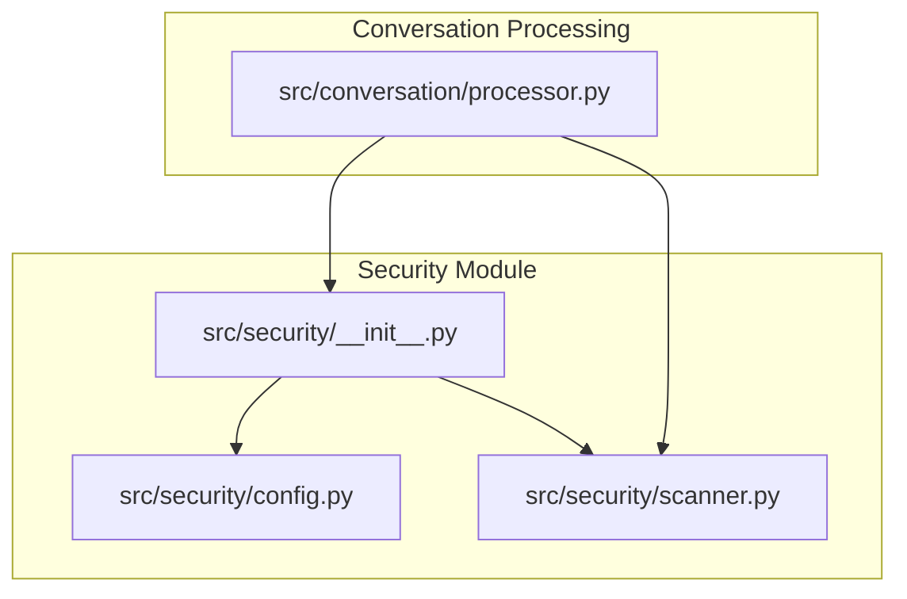
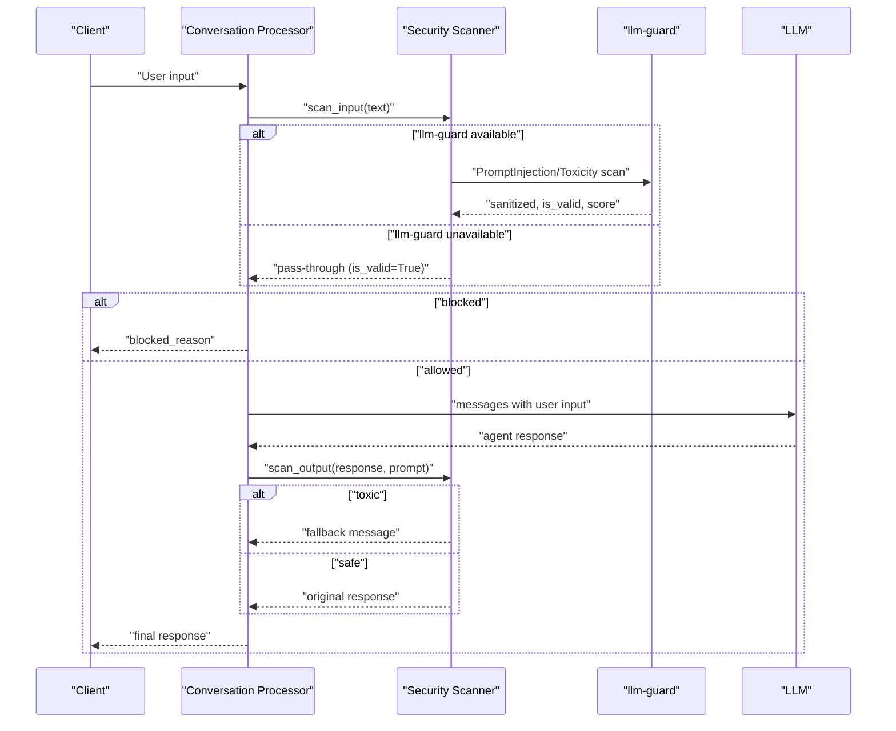
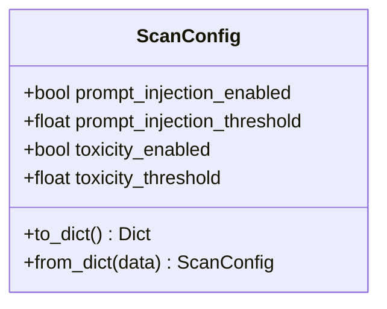
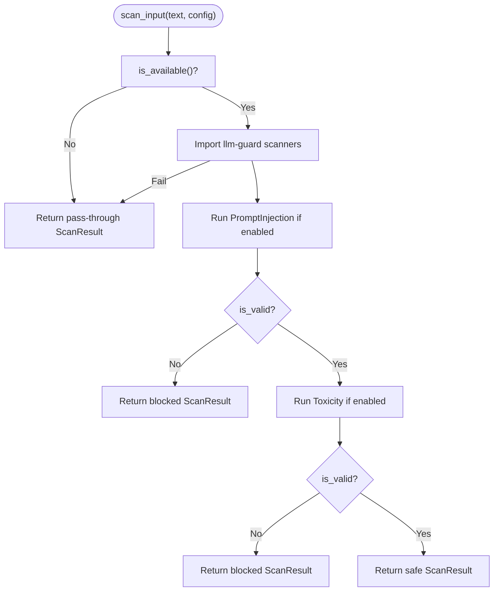
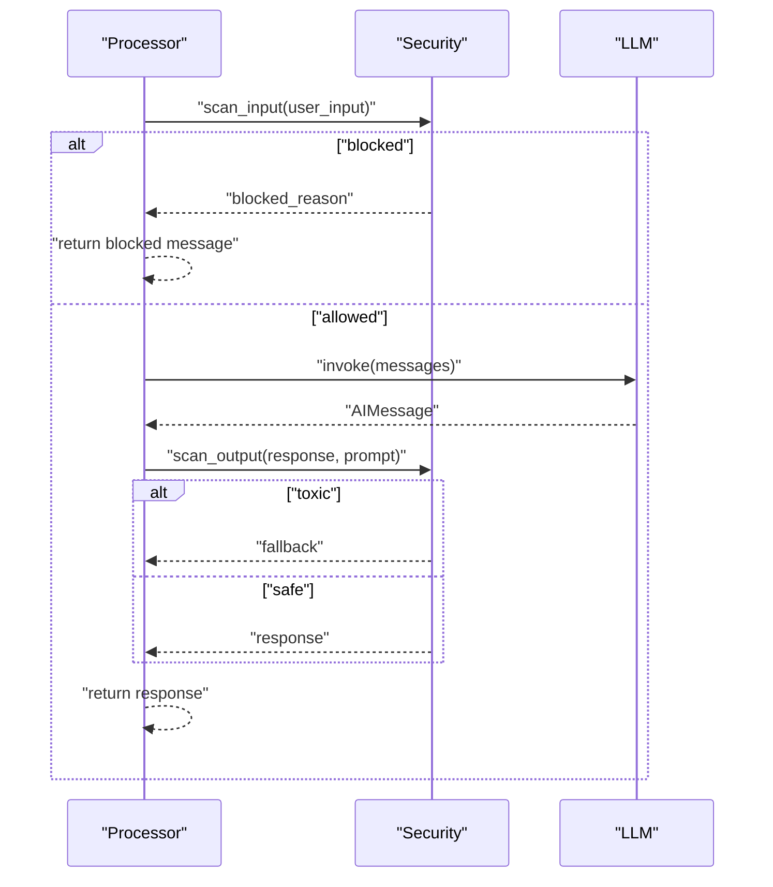
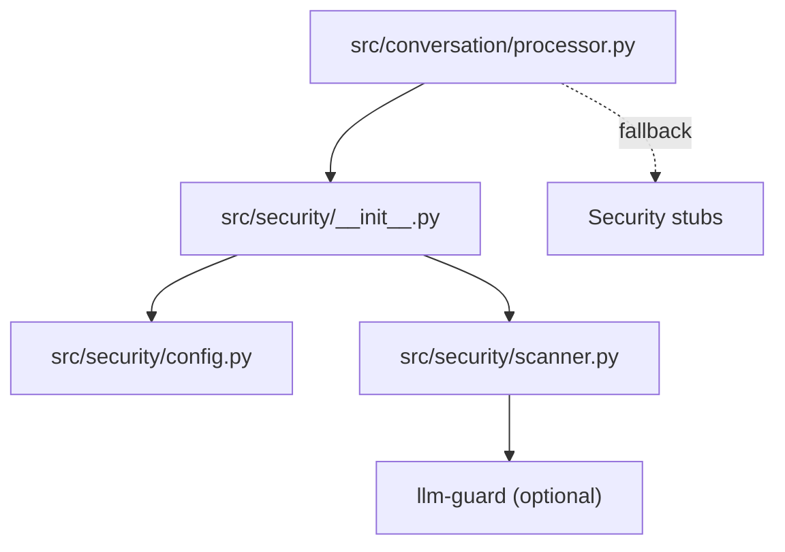

# Security & Safety Framework

<cite>
**Referenced Files in This Document**
- [src/security/__init__.py](file://src/security/__init__.py)
- [src/security/config.py](file://src/security/config.py)
- [src/security/scanner.py](file://src/security/scanner.py)
- [src/conversation/processor.py](file://src/conversation/processor.py)
- [tests/test_security_scanner.py](file://tests/test_security_scanner.py)
- [tests/test_security_config.py](file://tests/test_security_config.py)
- [tests/test_processor_security.py](file://tests/test_processor_security.py)
- [.kiro/specs/llm-guard-security/design.md](file://.kiro/specs/llm-guard-security/design.md)
- [.kiro/specs/llm-guard-security/requirements.md](file://.kiro/specs/llm-guard-security/requirements.md)
- [requirements.txt](file://requirements.txt)
- [.env.example](file://.env.example)
</cite>

## Table of Contents
1. [Introduction](#introduction)
2. [Project Structure](#project-structure)
3. [Core Components](#core-components)
4. [Architecture Overview](#architecture-overview)
5. [Detailed Component Analysis](#detailed-component-analysis)
6. [Dependency Analysis](#dependency-analysis)
7. [Performance Considerations](#performance-considerations)
8. [Troubleshooting Guide](#troubleshooting-guide)
9. [Conclusion](#conclusion)
10. [Appendices](#appendices)

## Introduction
MayaMCP’s security framework provides input and output protection against prompt injection and toxicity using the llm-guard library. It follows a fail-open design philosophy to preserve system availability: when security services are unavailable or encounter errors, content passes through safely with minimal disruption. The framework integrates seamlessly with conversation processing to automatically scan user inputs and agent responses, and exposes configuration options for thresholds and feature toggles. This document explains the design, integration, configuration, and operational guidance for maintaining a strong security posture while preserving a smooth user experience.

## Project Structure
The security framework is organized under src/security with three primary modules:
- __init__.py: Public exports for configuration, scanning functions, and availability checks
- config.py: ScanConfig dataclass defining security thresholds and toggles
- scanner.py: Core scanning logic for input and output, with fail-open error handling

Integration with conversation processing is implemented in src/conversation/processor.py, which calls scan_input before LLM invocation and scan_output after generating agent responses.

**Diagram sources**
- [src/security/__init__.py](file://src/security/__init__.py#L1-L5)
- [src/security/config.py](file://src/security/config.py#L1-L24)
- [src/security/scanner.py](file://src/security/scanner.py#L1-L137)
- [src/conversation/processor.py](file://src/conversation/processor.py#L1-L456)

**Section sources**
- [src/security/__init__.py](file://src/security/__init__.py#L1-L5)
- [src/security/config.py](file://src/security/config.py#L1-L24)
- [src/security/scanner.py](file://src/security/scanner.py#L1-L137)
- [src/conversation/processor.py](file://src/conversation/processor.py#L1-L456)

## Core Components
- ScanConfig: Defines security feature toggles and thresholds for prompt injection and toxicity detection. Includes serialization and deserialization helpers for persistence and configuration updates.
- ScanResult: Encapsulates the outcome of a scan, including validity, sanitized text, reason for blocking, and scanner scores.
- is_available(): Checks whether llm-guard is installed and importable, enabling graceful degradation when unavailable.
- scan_input(): Scans user input for prompt injection and toxicity using llm-guard scanners, with fail-open behavior on errors.
- scan_output(): Scans agent output for toxicity and replaces toxic content with a safe fallback message, also with fail-open behavior.

These components collectively implement the fail-open design and integrate with conversation processing to protect user interactions without compromising availability.

**Section sources**
- [src/security/config.py](file://src/security/config.py#L1-L24)
- [src/security/scanner.py](file://src/security/scanner.py#L1-L137)
- [src/conversation/processor.py](file://src/conversation/processor.py#L103-L114)
- [src/conversation/processor.py](file://src/conversation/processor.py#L190-L196)
- [src/conversation/processor.py](file://src/conversation/processor.py#L231-L237)
- [src/conversation/processor.py](file://src/conversation/processor.py#L434-L440)

## Architecture Overview
The security framework sits between the conversation processor and the llm-guard library. The processor invokes scan_input before sending user input to the LLM and scan_output after receiving the agent response. When llm-guard is unavailable, scanning falls back to pass-through behavior, ensuring continuous operation.

**Diagram sources**
- [src/conversation/processor.py](file://src/conversation/processor.py#L103-L114)
- [src/conversation/processor.py](file://src/conversation/processor.py#L190-L196)
- [src/conversation/processor.py](file://src/conversation/processor.py#L231-L237)
- [src/conversation/processor.py](file://src/conversation/processor.py#L434-L440)
- [src/security/scanner.py](file://src/security/scanner.py#L32-L96)
- [src/security/scanner.py](file://src/security/scanner.py#L98-L137)

## Detailed Component Analysis

### Security Configuration (ScanConfig)
ScanConfig defines:
- prompt_injection_enabled: Toggle for prompt injection detection
- prompt_injection_threshold: Threshold for prompt injection score
- toxicity_enabled: Toggle for toxicity detection
- toxicity_threshold: Threshold for toxicity score

It supports serialization to a dictionary and deserialization from a dictionary, ignoring unknown keys for forward compatibility.

**Diagram sources**
- [src/security/config.py](file://src/security/config.py#L4-L24)

**Section sources**
- [src/security/config.py](file://src/security/config.py#L1-L24)
- [tests/test_security_config.py](file://tests/test_security_config.py#L1-L27)

### Security Scanning (scanner.py)
Key behaviors:
- Availability check: is_available() attempts to import llm-guard and logs warnings if unavailable
- Input scanning: scan_input() runs PromptInjection and Toxicity scanners based on configuration, collects scores, and blocks on threshold exceedance
- Output scanning: scan_output() runs Toxicity on prompt+response, replaces output with a safe fallback on threshold exceedance
- Fail-open semantics: On import errors, scanner initialization failures, or runtime exceptions, scanning continues or passes through with logging

**Diagram sources**
- [src/security/scanner.py](file://src/security/scanner.py#L20-L96)

**Section sources**
- [src/security/scanner.py](file://src/security/scanner.py#L1-L137)
- [tests/test_security_scanner.py](file://tests/test_security_scanner.py#L1-L156)

### Conversation Processing Integration
The processor integrates security scanning around user input and agent responses:
- Before LLM invocation: scan_input(user_input_text); if blocked, return blocked_reason immediately
- After LLM response: scan_output(agent_response_text, prompt=user_input_text); if toxic, replace with fallback

Graceful fallback is implemented at import time: if the security module is missing or broken, stub functions ensure normal operation.

**Diagram sources**
- [src/conversation/processor.py](file://src/conversation/processor.py#L103-L114)
- [src/conversation/processor.py](file://src/conversation/processor.py#L190-L196)
- [src/conversation/processor.py](file://src/conversation/processor.py#L231-L237)
- [src/conversation/processor.py](file://src/conversation/processor.py#L434-L440)

**Section sources**
- [src/conversation/processor.py](file://src/conversation/processor.py#L17-L22)
- [src/conversation/processor.py](file://src/conversation/processor.py#L103-L114)
- [src/conversation/processor.py](file://src/conversation/processor.py#L190-L196)
- [src/conversation/processor.py](file://src/conversation/processor.py#L231-L237)
- [src/conversation/processor.py](file://src/conversation/processor.py#L434-L440)
- [tests/test_processor_security.py](file://tests/test_processor_security.py#L1-L41)

### Design Principles and Requirements
- Fail-open design: Security scanning never blocks the main conversation flow; errors are logged and scanning continues or passes through
- Graceful degradation: When llm-guard is unavailable, scanning is disabled and content is passed through
- Centralized configuration: ScanConfig provides a single source of truth for thresholds and toggles
- Integration simplicity: Minimal coupling with conversation processing via public exports

**Section sources**
- [.kiro/specs/llm-guard-security/design.md](file://.kiro/specs/llm-guard-security/design.md#L1-L10)
- [.kiro/specs/llm-guard-security/design.md](file://.kiro/specs/llm-guard-security/design.md#L139-L174)
- [.kiro/specs/llm-guard-security/requirements.md](file://.kiro/specs/llm-guard-security/requirements.md#L32-L64)

## Dependency Analysis
The security module depends on llm-guard for scanners. The processor conditionally imports security functions with a graceful fallback to ensure robustness. The llm-guard dependency is declared as optional.

**Diagram sources**
- [src/conversation/processor.py](file://src/conversation/processor.py#L17-L22)
- [src/security/__init__.py](file://src/security/__init__.py#L1-L5)
- [src/security/scanner.py](file://src/security/scanner.py#L20-L31)
- [requirements.txt](file://requirements.txt#L40-L41)

**Section sources**
- [src/conversation/processor.py](file://src/conversation/processor.py#L17-L22)
- [src/security/__init__.py](file://src/security/__init__.py#L1-L5)
- [src/security/scanner.py](file://src/security/scanner.py#L20-L31)
- [requirements.txt](file://requirements.txt#L40-L41)

## Performance Considerations
- Optional dependency: llm-guard is optional, reducing startup overhead when not needed
- Fail-open minimizes latency impact: Errors are caught and logged without blocking the conversation
- Scanners are invoked only when enabled and available; otherwise, pass-through avoids computation
- Consider caching scanner instances in production deployments to reduce repeated initialization overhead (current implementation notes indicate potential reuse opportunity)

[No sources needed since this section provides general guidance]

## Troubleshooting Guide
Common scenarios and resolutions:
- llm-guard not installed: is_available() logs a warning and scanning falls back to pass-through. Install the dependency to enable full protection.
- Import errors for scanners: Logging captures the error and scanning continues in pass-through mode.
- Runtime scanner errors: Errors are logged and the system returns a pass-through ScanResult to maintain availability.
- Configuration drift: Use ScanConfig.to_dict() and ScanConfig.from_dict() to persist and restore settings reliably.

Validation and testing:
- Unit tests confirm pass-through behavior when llm-guard is unavailable
- Property-based tests validate blocking behavior for prompt injection and toxicity
- Processor integration tests verify that blocked inputs and toxic outputs are handled correctly

**Section sources**
- [src/security/scanner.py](file://src/security/scanner.py#L20-L31)
- [src/security/scanner.py](file://src/security/scanner.py#L44-L48)
- [src/security/scanner.py](file://src/security/scanner.py#L75-L78)
- [src/security/scanner.py](file://src/security/scanner.py#L93-L95)
- [tests/test_security_scanner.py](file://tests/test_security_scanner.py#L29-L41)
- [tests/test_security_scanner.py](file://tests/test_security_scanner.py#L55-L81)
- [tests/test_security_scanner.py](file://tests/test_security_scanner.py#L129-L137)
- [tests/test_processor_security.py](file://tests/test_processor_security.py#L26-L41)

## Conclusion
MayaMCP’s security framework provides essential input and output protections using llm-guard with a robust fail-open design. By integrating scanning into conversation processing and offering configurable thresholds, the system balances strong safety controls with high availability. The modular configuration and graceful fallback mechanisms ensure reliable operation even when external dependencies are unavailable, while property-based and unit tests validate correctness and resilience.

[No sources needed since this section summarizes without analyzing specific files]

## Appendices

### Configuration Options
- prompt_injection_enabled: Enable/disable prompt injection detection
- prompt_injection_threshold: Threshold for prompt injection score
- toxicity_enabled: Enable/disable toxicity detection
- toxicity_threshold: Threshold for toxicity score

Persistence and loading:
- Serialize configuration with to_dict()
- Deserialize with from_dict(), ignoring unknown keys for forward compatibility

**Section sources**
- [src/security/config.py](file://src/security/config.py#L1-L24)
- [tests/test_security_config.py](file://tests/test_security_config.py#L1-L27)

### Security Events and Examples
- Input blocked due to prompt injection: scan_input returns is_valid=False with a predefined blocked reason
- Input blocked due to toxicity: scan_input returns is_valid=False with a predefined blocked reason
- Output replaced due to toxicity: scan_output returns a safe fallback message
- Unavailable security service: is_available() logs a warning and scanning passes through

**Section sources**
- [src/security/scanner.py](file://src/security/scanner.py#L8-L11)
- [src/security/scanner.py](file://src/security/scanner.py#L32-L96)
- [src/security/scanner.py](file://src/security/scanner.py#L98-L137)
- [tests/test_security_scanner.py](file://tests/test_security_scanner.py#L55-L81)
- [tests/test_security_scanner.py](file://tests/test_security_scanner.py#L129-L137)

### Monitoring Security Events
- Use the logging configuration pattern to capture security-related warnings and errors
- Monitor logs for blocked reasons and scanner scores to track security events and tune thresholds

**Section sources**
- [.kiro/specs/llm-guard-security/design.md](file://.kiro/specs/llm-guard-security/design.md#L147-L148)
- [.env.example](file://.env.example#L27-L31)