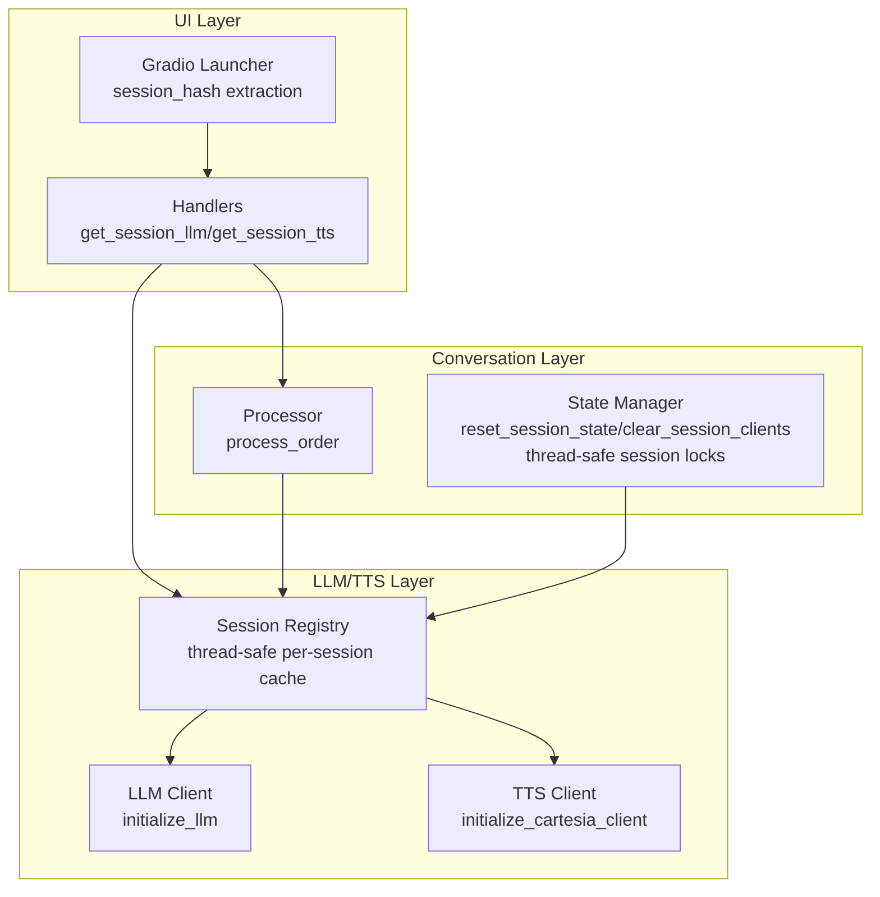
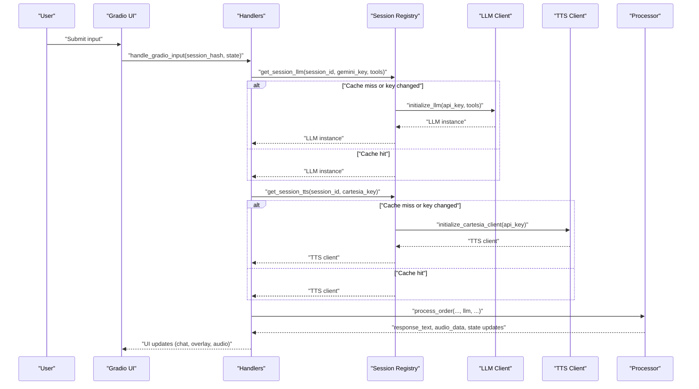
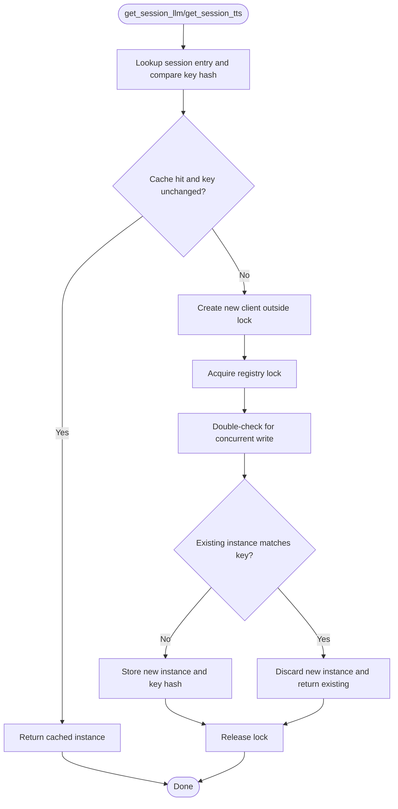
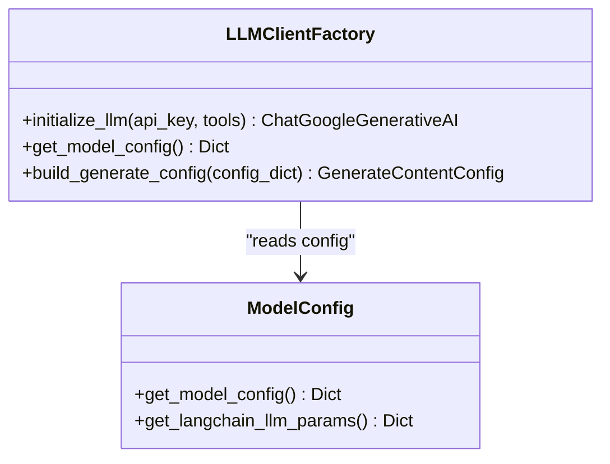
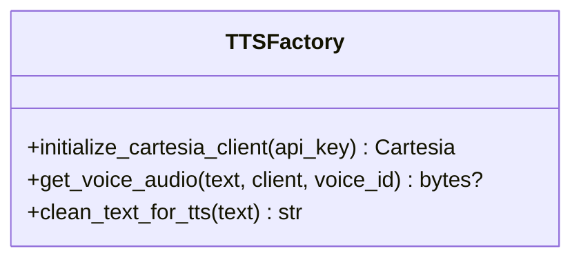
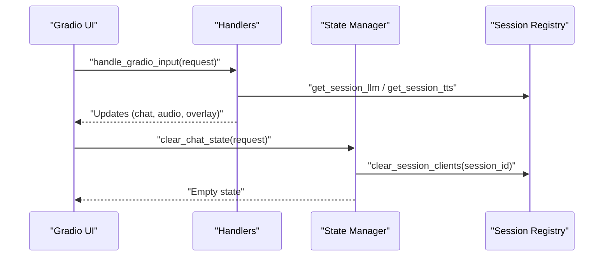
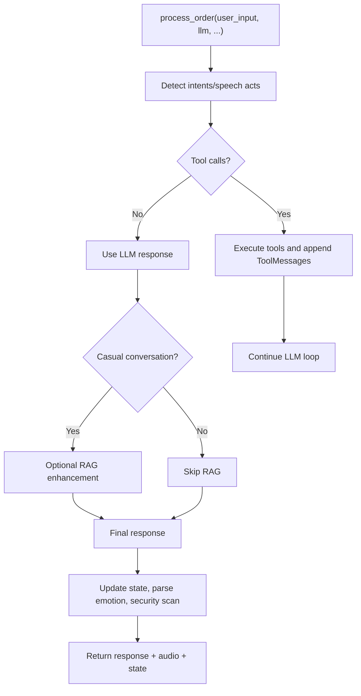
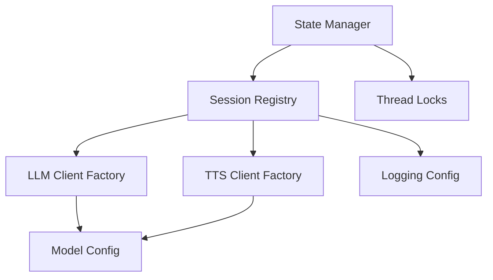

# Session Registry

<cite>
**Referenced Files in This Document**
- [session_registry.py](file://src/llm/session_registry.py)
- [client.py](file://src/llm/client.py)
- [handlers.py](file://src/ui/handlers.py)
- [processor.py](file://src/conversation/processor.py)
- [state_manager.py](file://src/utils/state_manager.py)
- [tts.py](file://src/voice/tts.py)
- [launcher.py](file://src/ui/launcher.py)
- [mayamcp_cli.py](file://src/mayamcp_cli.py)
- [logging_config.py](file://src/config/logging_config.py)
- [model_config.py](file://src/config/model_config.py)
</cite>

## Update Summary
**Changes Made**
- Enhanced thread-safe session handling with double-checked locking pattern
- Improved client reuse detection to prevent redundant instance creation
- Added automatic API key rotation support with proper resource cleanup
- Strengthened resource management for TTS clients with connection pool handling
- Addressed concurrency issues across the session management system

## Table of Contents
1. [Introduction](#introduction)
2. [Project Structure](#project-structure)
3. [Core Components](#core-components)
4. [Architecture Overview](#architecture-overview)
5. [Detailed Component Analysis](#detailed-component-analysis)
6. [Dependency Analysis](#dependency-analysis)
7. [Performance Considerations](#performance-considerations)
8. [Troubleshooting Guide](#troubleshooting-guide)
9. [Conclusion](#conclusion)

## Introduction
This document explains the Session Registry system that manages per-user LLM and TTS client instances in the MayaMCP bartending agent. The registry enables BYOK (Bring Your Own Key) mode by associating separate API credentials with each Gradio session, caching client instances per session, and safely rotating credentials without downtime. It also ensures resource cleanup on session reset and integrates with the broader conversation processing pipeline.

**Updated** Enhanced with advanced thread-safe session management, proper client reuse detection, API key rotation support, and improved resource management to address concurrency issues and automatic connection pool management.

## Project Structure
The Session Registry spans several modules:
- LLM and TTS client creation and caching with thread-safe access patterns
- Gradio UI integration and session lifecycle management
- Conversation processing that uses cached clients with proper error handling
- State management for session cleanup, resource release, and thread-safe operations

**Diagram sources**
- [launcher.py](file://src/ui/launcher.py#L104-L107)
- [handlers.py](file://src/ui/handlers.py#L135-L137)
- [session_registry.py](file://src/llm/session_registry.py#L21-L60)
- [client.py](file://src/llm/client.py#L96-L133)
- [tts.py](file://src/voice/tts.py#L112-L131)
- [processor.py](file://src/conversation/processor.py#L146-L156)
- [state_manager.py](file://src/utils/state_manager.py#L493-L509)

**Section sources**
- [session_registry.py](file://src/llm/session_registry.py#L1-L160)
- [handlers.py](file://src/ui/handlers.py#L71-L229)
- [processor.py](file://src/conversation/processor.py#L83-L480)
- [state_manager.py](file://src/utils/state_manager.py#L493-L509)

## Core Components
- **Session Registry**: Thread-safe cache keyed by Gradio session hash, storing LLM and TTS client instances along with hashed API keys for change detection. Features double-checked locking pattern to prevent redundant instances and handle concurrent access safely.
- **LLM Client Factory**: Creates ChatGoogleGenerativeAI instances bound with tools and configured model parameters, with proper error handling and logging.
- **TTS Client Factory**: Creates Cartesia clients with retry logic, connection pool management, and automatic cleanup on key rotation.
- **UI Handlers**: Extract session IDs from Gradio requests, fetch cached clients with thread-safe access, and orchestrate conversation processing and TTS synthesis.
- **Processor**: Drives conversation flow, invokes LLM with tool-calling, and optionally enhances responses with RAG when appropriate.
- **State Manager**: Provides thread-safe session reset and cleanup hooks that trigger registry clearing and proper resource management.

**Updated** Enhanced with comprehensive thread-safe access patterns, proper client reuse detection, and automatic resource cleanup mechanisms.

**Section sources**
- [session_registry.py](file://src/llm/session_registry.py#L11-L13)
- [client.py](file://src/llm/client.py#L96-L133)
- [tts.py](file://src/voice/tts.py#L112-L131)
- [handlers.py](file://src/ui/handlers.py#L135-L137)
- [processor.py](file://src/conversation/processor.py#L275-L430)
- [state_manager.py](file://src/utils/state_manager.py#L493-L509)

## Architecture Overview
The Session Registry sits between the UI and the LLM/TTS factories. UI handlers obtain a session ID from the request, then request cached clients from the registry. If a client is absent or the API key has changed, the registry creates a new instance, caches it, and returns it. On session reset, the registry is explicitly cleared to release resources, with proper connection pool cleanup for TTS clients.

**Updated** Enhanced with advanced thread-safe patterns including double-checked locking, proper client reuse detection, and automatic resource management for concurrent access scenarios.

**Diagram sources**
- [handlers.py](file://src/ui/handlers.py#L135-L156)
- [session_registry.py](file://src/llm/session_registry.py#L21-L60)
- [client.py](file://src/llm/client.py#L96-L133)
- [tts.py](file://src/voice/tts.py#L112-L131)
- [processor.py](file://src/conversation/processor.py#L146-L156)

## Detailed Component Analysis

### Session Registry
The registry maintains a thread-safe dictionary mapping session IDs to cached client entries. Each entry stores:
- LLM instance and a hash of the Gemini API key
- TTS client and a hash of the Cartesia API key

**Updated** Enhanced with advanced thread-safe patterns including double-checked locking, proper client reuse detection, and automatic resource cleanup.

Key behaviors:
- Hash-based key comparison prevents accidental logging of raw keys
- Creation outside the lock avoids blocking other sessions
- **Double-checked locking pattern** prevents redundant instances and handles key rotation safely
- **Automatic connection pool management** for TTS clients with proper cleanup on key changes
- **Proper client reuse detection** to prevent wasted resource allocation
- TTS clients expose a close method to release HTTP pools; LLM instances are stateless and do not require closing

**Diagram sources**
- [session_registry.py](file://src/llm/session_registry.py#L21-L60)
- [session_registry.py](file://src/llm/session_registry.py#L63-L128)

**Section sources**
- [session_registry.py](file://src/llm/session_registry.py#L11-L18)
- [session_registry.py](file://src/llm/session_registry.py#L21-L60)
- [session_registry.py](file://src/llm/session_registry.py#L63-L128)
- [session_registry.py](file://src/llm/session_registry.py#L131-L159)

### LLM Client Factory
The LLM factory constructs ChatGoogleGenerativeAI with model parameters from configuration and binds tools if provided. It logs initialization outcomes and propagates exceptions for upstream handling.

**Diagram sources**
- [client.py](file://src/llm/client.py#L96-L133)
- [model_config.py](file://src/config/model_config.py#L47-L64)

**Section sources**
- [client.py](file://src/llm/client.py#L96-L133)
- [model_config.py](file://src/config/model_config.py#L47-L64)

### TTS Client Factory
The TTS factory initializes a Cartesia client and synthesizes speech with retry logic. Text cleaning improves pronunciation and removes problematic punctuation. **Updated** Enhanced with automatic connection pool management and proper cleanup on key rotation.

**Diagram sources**
- [tts.py](file://src/voice/tts.py#L112-L131)
- [tts.py](file://src/voice/tts.py#L140-L200)

**Section sources**
- [tts.py](file://src/voice/tts.py#L112-L131)
- [tts.py](file://src/voice/tts.py#L140-L200)

### UI Integration and Session Lifecycle
The UI extracts the Gradio session hash and passes it to handlers. Handlers request cached clients from the registry, then delegate to the processor. On clear/reset, the state manager triggers registry cleanup with proper thread-safe access patterns.

**Updated** Enhanced with comprehensive thread-safe session management and proper resource cleanup mechanisms.

**Diagram sources**
- [handlers.py](file://src/ui/handlers.py#L103-L107)
- [handlers.py](file://src/ui/handlers.py#L135-L137)
- [state_manager.py](file://src/utils/state_manager.py#L493-L509)
- [session_registry.py](file://src/llm/session_registry.py#L131-L159)

**Section sources**
- [handlers.py](file://src/ui/handlers.py#L71-L229)
- [launcher.py](file://src/ui/launcher.py#L104-L107)
- [mayamcp_cli.py](file://src/mayamcp_cli.py#L86-L94)
- [state_manager.py](file://src/utils/state_manager.py#L493-L509)

### Conversation Processing Integration
The processor uses the cached LLM instance to generate responses, optionally invoking tools and enhancing responses with RAG when appropriate. It parses emotion states from responses and coordinates UI updates.

**Diagram sources**
- [processor.py](file://src/conversation/processor.py#L146-L156)
- [processor.py](file://src/conversation/processor.py#L275-L430)

**Section sources**
- [processor.py](file://src/conversation/processor.py#L83-L480)

## Dependency Analysis
The Session Registry depends on:
- LLM client initialization for creating ChatGoogleGenerativeAI instances
- TTS client initialization for creating Cartesia clients with connection pool management
- Logging configuration for safe key hashing and error reporting
- Model configuration for LLM parameterization
- **Thread-safe state management** for proper session lifecycle control

**Updated** Enhanced with comprehensive thread-safe state management and proper resource cleanup dependencies.

**Diagram sources**
- [session_registry.py](file://src/llm/session_registry.py#L42-L44)
- [session_registry.py](file://src/llm/session_registry.py#L88-L90)
- [client.py](file://src/llm/client.py#L96-L133)
- [tts.py](file://src/voice/tts.py#L112-L131)
- [logging_config.py](file://src/config/logging_config.py#L67-L77)
- [model_config.py](file://src/config/model_config.py#L47-L64)

**Section sources**
- [session_registry.py](file://src/llm/session_registry.py#L1-L160)
- [client.py](file://src/llm/client.py#L1-L217)
- [tts.py](file://src/voice/tts.py#L1-L200)
- [logging_config.py](file://src/config/logging_config.py#L1-L77)
- [model_config.py](file://src/config/model_config.py#L1-L108)

## Performance Considerations
- **Lazy initialization**: Clients are created only when needed, reducing startup overhead.
- **Double-checked locking**: Minimizes contention by performing expensive creation outside the lock and verifying again under lock.
- **Key hashing**: Prevents repeated client recreation when the same key is used, while avoiding logging raw secrets.
- **Resource cleanup**: Explicit clearing of TTS clients releases HTTP connection pools; LLM instances are stateless and dereferenced.
- **Thread-safe access patterns**: Proper synchronization prevents race conditions and resource leaks.
- **Client reuse detection**: Reduces redundant instance creation and improves memory efficiency.

**Updated** Enhanced with advanced thread-safe patterns, proper client reuse detection, and automatic resource management for optimal performance under concurrent access.

## Troubleshooting Guide
Common issues and resolutions:
- **Rate limits/quota errors**: The processor returns a sentinel that handlers translate into user-facing messages and quota overlays.
- **TTS failures**: The UI falls back to silence and logs warnings; ensure Cartesia key is valid and retries are configured. **Updated** Enhanced with automatic connection pool cleanup on key rotation.
- **Session reset**: Verify that state manager calls registry cleanup to avoid stale clients and resource leaks. **Updated** Enhanced with proper thread-safe cleanup mechanisms.
- **Logging safety**: The registry hashes API keys before logging; confirm logging redaction is enabled to avoid exposing secrets.
- **Concurrency issues**: **New** The enhanced thread-safe patterns prevent race conditions and resource leaks in multi-threaded environments.
- **Memory leaks**: **New** Automatic resource cleanup ensures proper release of connection pools and client instances.

**Updated** Enhanced troubleshooting guidance for new thread-safe features and resource management improvements.

**Section sources**
- [handlers.py](file://src/ui/handlers.py#L158-L165)
- [handlers.py](file://src/ui/handlers.py#L194-L202)
- [state_manager.py](file://src/utils/state_manager.py#L493-L509)
- [logging_config.py](file://src/config/logging_config.py#L45-L65)

## Conclusion
The Session Registry provides a robust, thread-safe mechanism for managing per-session LLM and TTS clients in BYOK mode. **Updated** Enhanced with advanced thread-safe session handling, proper client reuse detection, API key rotation support, and improved resource management. It addresses concurrency issues through sophisticated locking patterns, automatically manages connection pools for TTS clients, and ensures safe resource cleanup on session reset. The system integrates seamlessly with the UI, conversation processing, and state management layers while providing reliable performance under concurrent access scenarios.