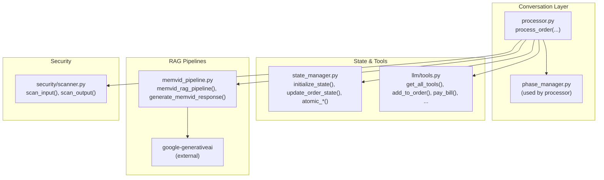
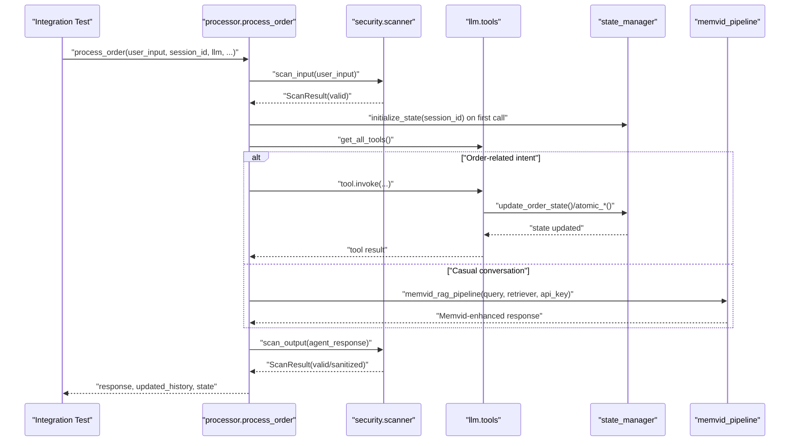
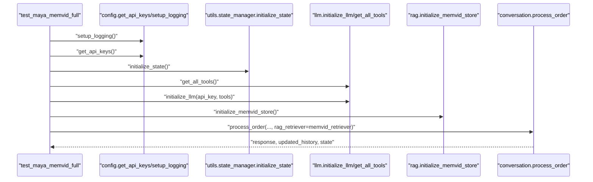
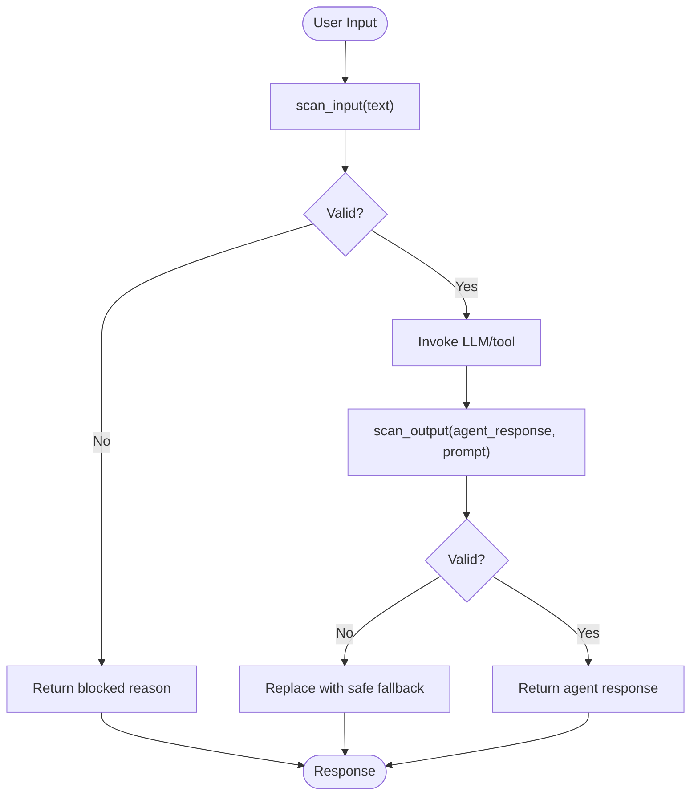
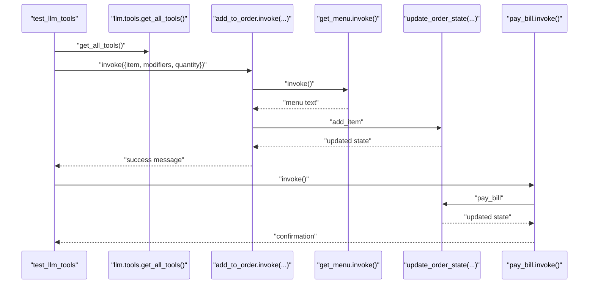
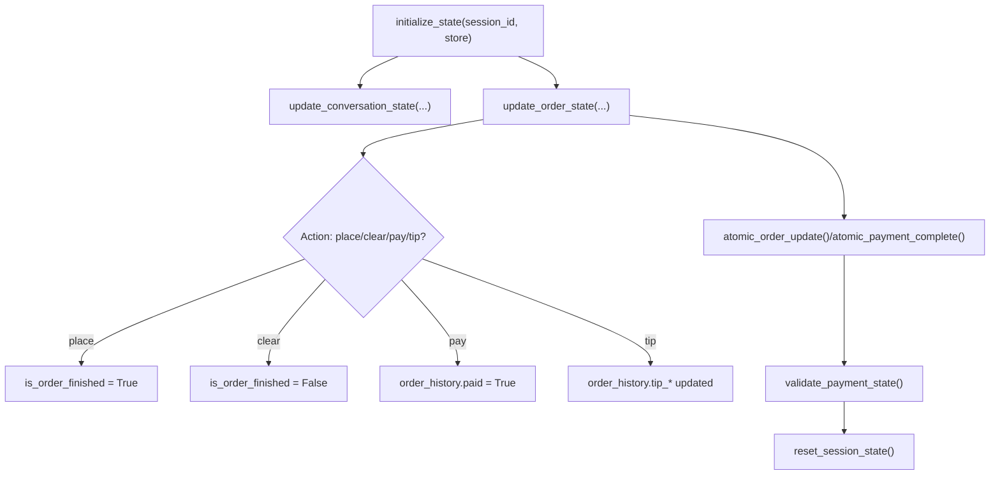
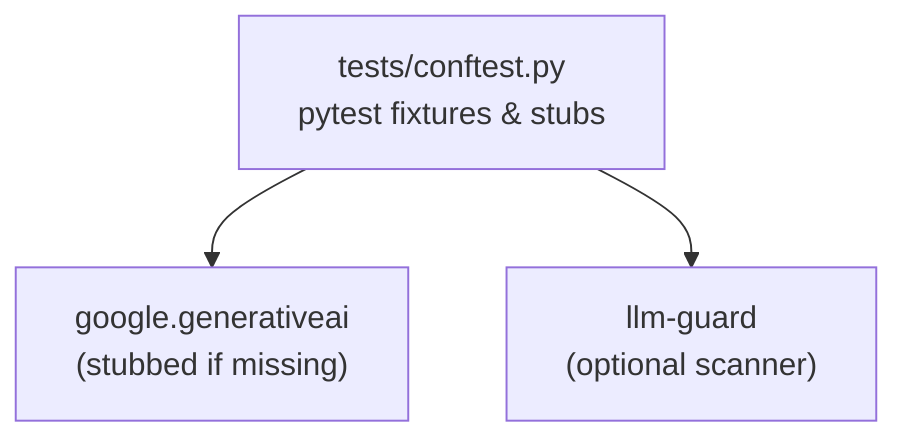

# Integration Testing

<cite>
**Referenced Files in This Document**
- [tests/conftest.py](file://tests/conftest.py)
- [tests/test_maya_memvid_full.py](file://tests/test_maya_memvid_full.py)
- [tests/test_processor_rag.py](file://tests/test_processor_rag.py)
- [tests/test_processor_security.py](file://tests/test_processor_security.py)
- [tests/test_state_manager.py](file://tests/test_state_manager.py)
- [tests/test_memvid.py](file://tests/test_memvid.py)
- [tests/test_llm_tools.py](file://tests/test_llm_tools.py)
- [tests/test_generation.py](file://tests/test_generation.py)
- [tests/test_session_context.py](file://tests/test_session_context.py)
- [tests/test_payment_properties.py](file://tests/test_payment_properties.py)
- [src/conversation/processor.py](file://src/conversation/processor.py)
- [src/utils/state_manager.py](file://src/utils/state_manager.py)
- [src/llm/tools.py](file://src/llm/tools.py)
- [src/rag/memvid_pipeline.py](file://src/rag/memvid_pipeline.py)
- [src/security/scanner.py](file://src/security/scanner.py)
</cite>

## Table of Contents
1. [Introduction](#introduction)
2. [Project Structure](#project-structure)
3. [Core Components](#core-components)
4. [Architecture Overview](#architecture-overview)
5. [Detailed Component Analysis](#detailed-component-analysis)
6. [Dependency Analysis](#dependency-analysis)
7. [Performance Considerations](#performance-considerations)
8. [Troubleshooting Guide](#troubleshooting-guide)
9. [Conclusion](#conclusion)
10. [Appendices](#appendices)

## Introduction
This document describes integration testing in MayaMCP with a focus on validating component interactions across multi-component workflows. It covers:
- Conversation-RAG integration and Memvid coordination
- Security scanning pipelines
- LLM tool execution and payment processing workflows
- State management across components
- Test setup for external services, API keys, and optional third-party SDKs
- Patterns for data persistence, cross-component state synchronization, and error propagation
- Environment configuration, cleanup, and handling of flaky tests

## Project Structure
MayaMCP organizes integration concerns across:
- Conversation processing orchestrating LLM, tools, RAG, and security
- State management for conversation and payment lifecycles
- RAG pipelines (FAISS and Memvid) with Google Generative AI
- Payment tools backed by Stripe MCP
- Security scanning using optional llm-guard

**Diagram sources**
- [src/conversation/processor.py](file://src/conversation/processor.py#L73-L200)
- [src/utils/state_manager.py](file://src/utils/state_manager.py#L1-L200)
- [src/llm/tools.py](file://src/llm/tools.py#L1-L200)
- [src/rag/memvid_pipeline.py](file://src/rag/memvid_pipeline.py#L1-L108)
- [src/security/scanner.py](file://src/security/scanner.py#L1-L137)

**Section sources**
- [tests/conftest.py](file://tests/conftest.py#L1-L130)
- [tests/test_maya_memvid_full.py](file://tests/test_maya_memvid_full.py#L1-L250)
- [tests/test_processor_rag.py](file://tests/test_processor_rag.py#L1-L83)
- [tests/test_processor_security.py](file://tests/test_processor_security.py#L1-L81)
- [tests/test_state_manager.py](file://tests/test_state_manager.py#L1-L370)
- [tests/test_memvid.py](file://tests/test_memvid.py#L1-L123)
- [tests/test_llm_tools.py](file://tests/test_llm_tools.py#L1-L704)
- [tests/test_generation.py](file://tests/test_generation.py#L1-L169)
- [tests/test_session_context.py](file://tests/test_session_context.py#L1-L242)
- [tests/test_payment_properties.py](file://tests/test_payment_properties.py#L1-L800)
- [src/conversation/processor.py](file://src/conversation/processor.py#L1-L200)
- [src/utils/state_manager.py](file://src/utils/state_manager.py#L1-L200)
- [src/llm/tools.py](file://src/llm/tools.py#L1-L200)
- [src/rag/memvid_pipeline.py](file://src/rag/memvid_pipeline.py#L1-L108)
- [src/security/scanner.py](file://src/security/scanner.py#L1-L137)

## Core Components
- Processor orchestration: Validates security, sets session context, detects intents, invokes tools, and manages conversation phases.
- State manager: Provides thread-safe, versioned state for conversation and payment, with atomic operations and validation.
- LLM tools: Encapsulate bartending operations and payment actions, returning structured success/error responses.
- RAG pipelines: Retrieve context from FAISS or Memvid and augment LLM responses.
- Security scanner: Optional input/output scanning with graceful fallbacks.

Key integration points validated by tests:
- Conversation-RAG-Memvid loop with optional FAISS
- Security scanning at input and output
- Payment tool workflows with atomic state updates and error codes
- Session context propagation through tools

**Section sources**
- [src/conversation/processor.py](file://src/conversation/processor.py#L73-L200)
- [src/utils/state_manager.py](file://src/utils/state_manager.py#L1-L200)
- [src/llm/tools.py](file://src/llm/tools.py#L1-L200)
- [src/rag/memvid_pipeline.py](file://src/rag/memvid_pipeline.py#L1-L108)
- [src/security/scanner.py](file://src/security/scanner.py#L1-L137)

## Architecture Overview
The integration flow ties together processor orchestration, state management, RAG augmentation, and security scanning.

**Diagram sources**
- [src/conversation/processor.py](file://src/conversation/processor.py#L73-L200)
- [src/security/scanner.py](file://src/security/scanner.py#L32-L96)
- [src/llm/tools.py](file://src/llm/tools.py#L1-L200)
- [src/utils/state_manager.py](file://src/utils/state_manager.py#L1-L200)
- [src/rag/memvid_pipeline.py](file://src/rag/memvid_pipeline.py#L65-L108)

## Detailed Component Analysis

### Conversation-RAG Integration and Memvid Coordination
- Tests validate that:
  - RAG is short-circuited when components are missing
  - Non-sized RAG responses do not replace base responses
  - Memvid pipeline augments responses with video memory insights
  - Full Maya-Memvid workflow initializes logging, loads API keys, sets up state, initializes LLM and Memvid store, and executes multi-turn conversations

**Diagram sources**
- [tests/test_maya_memvid_full.py](file://tests/test_maya_memvid_full.py#L16-L182)
- [src/conversation/processor.py](file://src/conversation/processor.py#L73-L200)
- [src/utils/state_manager.py](file://src/utils/state_manager.py#L1-L200)
- [src/llm/tools.py](file://src/llm/tools.py#L1-L200)
- [src/rag/memvid_pipeline.py](file://src/rag/memvid_pipeline.py#L65-L108)

**Section sources**
- [tests/test_processor_rag.py](file://tests/test_processor_rag.py#L27-L82)
- [tests/test_maya_memvid_full.py](file://tests/test_maya_memvid_full.py#L16-L182)
- [tests/test_memvid.py](file://tests/test_memvid.py#L27-L117)
- [tests/test_generation.py](file://tests/test_generation.py#L49-L169)

### Security Scanning Pipelines
- Tests verify:
  - Injection attempts are blocked and return a safe message
  - Toxic outputs are sanitized and replaced with a safe fallback
  - Valid interactions pass through both input and output scanners

**Diagram sources**
- [src/security/scanner.py](file://src/security/scanner.py#L32-L96)
- [src/security/scanner.py](file://src/security/scanner.py#L98-L136)
- [tests/test_processor_security.py](file://tests/test_processor_security.py#L26-L80)

**Section sources**
- [tests/test_processor_security.py](file://tests/test_processor_security.py#L1-L81)
- [src/security/scanner.py](file://src/security/scanner.py#L1-L137)

### LLM Tool Execution and Payment Workflows
- Tests validate:
  - Tool discovery and invocation
  - Menu retrieval, recommendations, and order operations
  - Atomic payment operations with error handling and state resets
  - Property-based tests for balance deduction, insufficient funds, tab accumulation, and completion state reset

**Diagram sources**
- [tests/test_llm_tools.py](file://tests/test_llm_tools.py#L652-L677)
- [tests/test_llm_tools.py](file://tests/test_llm_tools.py#L127-L157)
- [tests/test_llm_tools.py](file://tests/test_llm_tools.py#L494-L544)
- [src/llm/tools.py](file://src/llm/tools.py#L1-L200)

**Section sources**
- [tests/test_llm_tools.py](file://tests/test_llm_tools.py#L1-L704)
- [tests/test_payment_properties.py](file://tests/test_payment_properties.py#L59-L263)
- [src/llm/tools.py](file://src/llm/tools.py#L1-L200)

### State Management Across Components
- Tests validate:
  - Initialization, copying semantics, and reset behavior
  - Order updates (add item, place order, clear order, add tip, pay bill)
  - Atomic payment operations and error propagation
  - Thread-local session context isolation and processor lifecycle

**Diagram sources**
- [tests/test_state_manager.py](file://tests/test_state_manager.py#L53-L370)
- [src/utils/state_manager.py](file://src/utils/state_manager.py#L66-L167)

**Section sources**
- [tests/test_state_manager.py](file://tests/test_state_manager.py#L1-L370)
- [tests/test_session_context.py](file://tests/test_session_context.py#L118-L209)
- [src/utils/state_manager.py](file://src/utils/state_manager.py#L1-L200)

## Dependency Analysis
- Optional third-party SDKs are stubbed to enable local testing without external dependencies.
- Global fixtures configure flags for expensive resource rebuilds.
- Tests isolate and mock external integrations (LLM, RAG, security) to validate internal flows.

**Diagram sources**
- [tests/conftest.py](file://tests/conftest.py#L1-L130)

**Section sources**
- [tests/conftest.py](file://tests/conftest.py#L1-L130)

## Performance Considerations
- Prefer session-scoped fixtures for shared resources (e.g., LLM clients) to reduce repeated initialization overhead.
- Use the force-rebuild flag to control expensive Memvid store rebuilds in development vs. CI.
- Avoid unnecessary retries in integration tests; rely on deterministic mocking and controlled environments.
- Keep RAG retrievers and pipelines initialized once per test session when feasible.

[No sources needed since this section provides general guidance]

## Troubleshooting Guide
Common issues and resolutions:
- Missing API keys or external service credentials:
  - Tests skip when keys are absent; ensure environment variables are set or use stubs.
- Flaky external service calls:
  - Use mocks and stubs to simulate service behavior; validate error handling paths.
- State inconsistencies:
  - Ensure session context is cleared after processing; use atomic operations for payment updates.
- Cleanup failures:
  - Tests include best-effort cleanup for LLM clients, retrievers, loggers, and state resets.

**Section sources**
- [tests/test_maya_memvid_full.py](file://tests/test_maya_memvid_full.py#L196-L247)
- [tests/test_processor_security.py](file://tests/test_processor_security.py#L26-L80)
- [tests/test_generation.py](file://tests/test_generation.py#L49-L169)
- [tests/test_session_context.py](file://tests/test_session_context.py#L118-L209)

## Conclusion
MayaMCP’s integration tests validate end-to-end workflows spanning conversation orchestration, RAG augmentation (including Memvid), security scanning, payment processing, and state synchronization. By leveraging mocks, stubs, and controlled fixtures, the suite ensures robustness, reproducibility, and maintainability across component boundaries.

[No sources needed since this section summarizes without analyzing specific files]

## Appendices

### Test Environment Configuration
- Optional third-party SDKs are stubbed to allow local execution without installation.
- A force-rebuild flag controls expensive resource initialization for development vs. CI.

**Section sources**
- [tests/conftest.py](file://tests/conftest.py#L1-L130)
- [tests/test_memvid.py](file://tests/test_memvid.py#L27-L64)

### Example Integration Test Patterns
- Full Maya-Memvid workflow: initialize logging, load API keys, set state, initialize LLM and Memvid, execute multi-turn conversations, validate responses and order state, and perform cleanup.
- RAG short-circuit and resilience: verify behavior when RAG components are missing or return non-sized results.
- Security scanning: verify blocking of injections and sanitization of toxic outputs.
- Payment workflows: validate atomic updates, insufficient funds handling, tab accumulation, and completion state reset.

**Section sources**
- [tests/test_maya_memvid_full.py](file://tests/test_maya_memvid_full.py#L16-L182)
- [tests/test_processor_rag.py](file://tests/test_processor_rag.py#L27-L82)
- [tests/test_processor_security.py](file://tests/test_processor_security.py#L26-L80)
- [tests/test_payment_properties.py](file://tests/test_payment_properties.py#L59-L263)