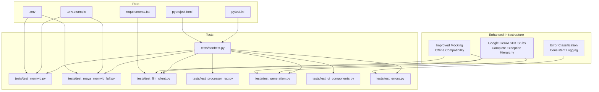
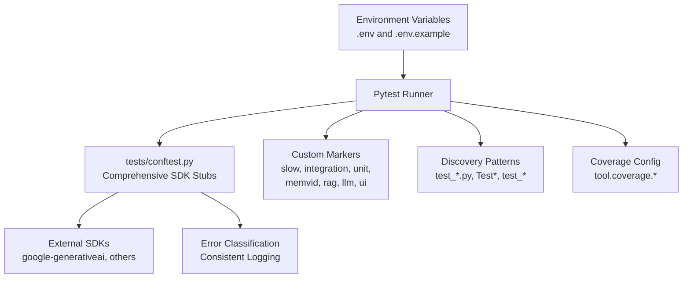
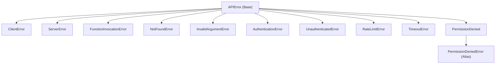
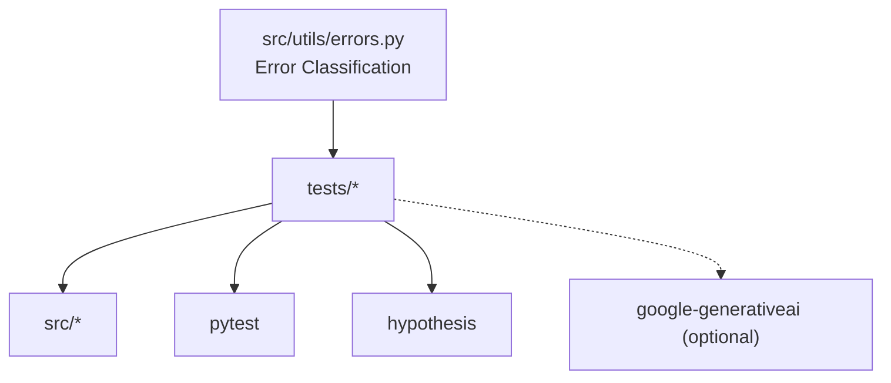

# Test Infrastructure

<cite>
**Referenced Files in This Document**
- [pytest.ini](file://pytest.ini)
- [pyproject.toml](file://pyproject.toml)
- [tests/conftest.py](file://tests/conftest.py)
- [tests/test_memvid.py](file://tests/test_memvid.py)
- [tests/test_maya_memvid_full.py](file://tests/test_maya_memvid_full.py)
- [tests/test_llm_client.py](file://tests/test_llm_client.py)
- [tests/test_processor_rag.py](file://tests/test_processor_rag.py)
- [tests/test_generation.py](file://tests/test_generation.py)
- [tests/test_ui_components.py](file://tests/test_ui_components.py)
- [tests/test_errors.py](file://tests/test_errors.py)
- [src/llm/client.py](file://src/llm/client.py)
- [src/utils/errors.py](file://src/utils/errors.py)
- [.env.example](file://.env.example)
- [.env](file://.env)
- [requirements.txt](file://requirements.txt)
</cite>

## Update Summary
**Changes Made**
- Enhanced documentation of comprehensive Google GenAI SDK stubs with complete exception class hierarchy
- Added detailed coverage of improved mocking capabilities for offline testing
- Updated exception class hierarchies documentation for better offline testing compatibility
- Expanded error handling and classification testing documentation
- Improved test infrastructure architecture overview with enhanced stubbing mechanisms

## Table of Contents
1. [Introduction](#introduction)
2. [Project Structure](#project-structure)
3. [Core Components](#core-components)
4. [Architecture Overview](#architecture-overview)
5. [Detailed Component Analysis](#detailed-component-analysis)
6. [Dependency Analysis](#dependency-analysis)
7. [Performance Considerations](#performance-considerations)
8. [Troubleshooting Guide](#troubleshooting-guide)
9. [Conclusion](#conclusion)
10. [Appendices](#appendices)

## Introduction
This document explains MayaMCP's test infrastructure and configuration management. It covers pytest configuration, custom markers, test discovery patterns, fixtures and environment setup via conftest.py, test execution workflow, coverage reporting, and CI considerations. The infrastructure now features comprehensive Google GenAI SDK stubs with complete exception class hierarchies, improved mocking capabilities, and better offline testing compatibility. It provides practical guidance on test configuration options, environment variable management, test data organization, performance optimization, parallel execution strategies, debugging failures, and maintaining consistent test execution across environments.

## Project Structure
MayaMCP organizes tests under the tests/ directory with a dedicated conftest.py for global fixtures and shims. Configuration is split between pytest.ini and pyproject.toml. Environment variables are managed via .env and .env.example, while dependencies are declared in requirements.txt. The enhanced testing infrastructure includes comprehensive Google GenAI SDK stubs with complete exception hierarchies for offline compatibility.

**Diagram sources**
- [pytest.ini](file://pytest.ini#L1-L27)
- [pyproject.toml](file://pyproject.toml#L48-L64)
- [tests/conftest.py](file://tests/conftest.py#L1-L173)
- [tests/test_memvid.py](file://tests/test_memvid.py#L1-L123)
- [tests/test_maya_memvid_full.py](file://tests/test_maya_memvid_full.py#L1-L250)
- [tests/test_llm_client.py](file://tests/test_llm_client.py#L1-L442)
- [tests/test_processor_rag.py](file://tests/test_processor_rag.py#L1-L83)
- [tests/test_generation.py](file://tests/test_generation.py#L1-L178)
- [tests/test_ui_components.py](file://tests/test_ui_components.py#L1-L334)
- [tests/test_errors.py](file://tests/test_errors.py#L1-L69)
- [src/llm/client.py](file://src/llm/client.py#L1-L217)
- [src/utils/errors.py](file://src/utils/errors.py#L1-L39)
- [.env.example](file://.env.example#L1-L33)
- [.env](file://.env#L1-L12)
- [requirements.txt](file://requirements.txt#L1-L41)

**Section sources**
- [pytest.ini](file://pytest.ini#L1-L27)
- [pyproject.toml](file://pyproject.toml#L48-L64)
- [tests/conftest.py](file://tests/conftest.py#L1-L173)
- [.env.example](file://.env.example#L1-L33)
- [.env](file://.env#L1-L12)
- [requirements.txt](file://requirements.txt#L1-L41)

## Core Components
- Pytest configuration and discovery:
  - Discovery patterns: test files, classes, and functions are matched by configured patterns.
  - Strict options enforce marker and config discipline.
  - Custom markers define categories for selective execution.
- Coverage configuration:
  - Coverage source and omission rules are defined centrally.
- Global fixtures and environment shims:
  - Comprehensive Google GenAI SDK stubbing ensures tests run even when external SDKs are not installed.
  - Complete exception class hierarchy mirrors real SDK structure for offline compatibility.
  - Session-scoped flag controls expensive resource rebuilds.
- Environment variables:
  - API keys and model/runtime settings are documented in .env.example and populated in .env.
- Enhanced error handling:
  - Consistent error classification and logging across all test scenarios.
  - Comprehensive error type coverage for authentication, authorization, rate limiting, and timeout scenarios.

Key configuration anchors:
- pytest.ini: test discovery, strictness, warnings, and markers.
- pyproject.toml: pytest options and coverage configuration.
- tests/conftest.py: global fixtures, CLI options, comprehensive SDK stubs, and exception hierarchies.
- src/llm/client.py: enhanced error handling with SDK-specific exception mapping.
- src/utils/errors.py: shared error classification and logging utilities.
- tests/test_errors.py: comprehensive error classification testing.

**Section sources**
- [pytest.ini](file://pytest.ini#L1-L27)
- [pyproject.toml](file://pyproject.toml#L48-L83)
- [tests/conftest.py](file://tests/conftest.py#L1-L173)
- [src/llm/client.py](file://src/llm/client.py#L1-L217)
- [src/utils/errors.py](file://src/utils/errors.py#L1-L39)
- [tests/test_errors.py](file://tests/test_errors.py#L1-L69)
- [.env.example](file://.env.example#L1-L33)
- [.env](file://.env#L1-L12)

## Architecture Overview
The test architecture centers on pytest with centralized configuration and shared fixtures. Tests leverage comprehensive Google GenAI SDK stubs with complete exception hierarchies to isolate dependencies. Enhanced mocking capabilities ensure offline compatibility while maintaining realistic error scenarios. Environment variables feed configuration for LLM clients and RAG components. Coverage is configured to measure source code only. Error classification and logging provide consistent behavior across all test scenarios.

**Diagram sources**
- [pytest.ini](file://pytest.ini#L4-L26)
- [pyproject.toml](file://pyproject.toml#L48-L83)
- [tests/conftest.py](file://tests/conftest.py#L1-L173)
- [src/llm/client.py](file://src/llm/client.py#L1-L217)
- [src/utils/errors.py](file://src/utils/errors.py#L1-L39)
- [.env.example](file://.env.example#L1-L33)
- [.env](file://.env#L1-L12)

## Detailed Component Analysis

### Pytest Configuration and Discovery
- Discovery patterns:
  - testpaths, python_files, python_classes, python_functions define how tests are discovered.
- Strictness:
  - strict-markers and strict-config ensure markers and configuration are validated.
- Output and warnings:
  - disable-warnings and short traceback improve readability.
  - color output enhances terminal UX.
- Custom markers:
  - slow, integration, unit, memvid, rag, llm, ui enable targeted selection and categorization.

Execution examples:
- Run all tests: pytest
- Run only unit tests: pytest -m unit
- Skip slow tests: pytest -m "not slow"

**Section sources**
- [pytest.ini](file://pytest.ini#L3-L26)

### Coverage Reporting Setup
- Source inclusion and omission:
  - Coverage runs against src and omits tests and caches.
- Report exclusions:
  - Lines such as __repr__, NotImplementedError, and main guards are excluded from coverage reports.
- Tool configuration:
  - Coverage settings are defined under tool.coverage.* in pyproject.toml.

Usage:
- Run coverage: coverage run -m pytest && coverage report
- HTML report: coverage html

**Section sources**
- [pyproject.toml](file://pyproject.toml#L66-L83)

### Conftest Configuration: Enhanced Fixtures, Stubs, and CLI Options
- Comprehensive SDK stubbing:
  - Ensures tests can run even if google-generativeai is not installed by creating complete stubs for required APIs.
  - Provides complete exception class hierarchy mirroring real SDK structure.
  - Includes Client, types, and errors modules with realistic API signatures.
- Enhanced exception class hierarchy:
  - Base APIError class with specialized subclasses for different error types.
  - Complete coverage of authentication, authorization, rate limiting, and timeout scenarios.
  - Common aliases for SDK compatibility (e.g., PermissionDeniedError).
- Autouse compatibility fixture:
  - Maintains backward compatibility without side effects.
- CLI option and fixture:
  - --force-rebuild toggles expensive resource rebuilds.
  - force_rebuild_flag fixture resolves priority: CLI flag > environment variable > default.

Enhanced exception hierarchy structure:

**Diagram sources**
- [tests/conftest.py](file://tests/conftest.py#L25-L89)

Priority resolution flow:

**Diagram sources**
- [tests/conftest.py](file://tests/conftest.py#L146-L173)

**Section sources**
- [tests/conftest.py](file://tests/conftest.py#L1-L173)

### Enhanced Error Handling and Classification
- Comprehensive error classification:
  - Shared utility for consistent error logging across all components.
  - Regex-based classification for rate limits, authentication, and timeouts.
  - Fallback to string matching for compatibility with various error formats.
- SDK-specific error mapping:
  - Dynamic mapping of SDK error classes to local exception types.
  - Graceful fallback when SDK is unavailable or error classes differ.
  - Support for both explicit SDK error types and attribute-based detection.
- Offline testing compatibility:
  - Complete exception hierarchy ensures tests work without real SDK installation.
  - Consistent error behavior regardless of SDK availability.

Error classification patterns:
- Rate limit detection: "429" codes or "rate limit" phrases (case-insensitive)
- Authentication detection: "401"/"403" codes or auth-related terms
- Timeout detection: "timeout" phrases or timeout exception types
- Fallback: generic error logging for unclassified exceptions

**Section sources**
- [src/llm/client.py](file://src/llm/client.py#L1-L217)
- [src/utils/errors.py](file://src/utils/errors.py#L1-L39)
- [tests/test_errors.py](file://tests/test_errors.py#L1-L69)

### Test Execution Workflow
- Typical flow:
  - pytest loads configuration and markers.
  - Discover tests per patterns.
  - Execute tests with fixtures applied.
  - Comprehensive SDK stubs handle external dependencies.
  - Collect results and produce coverage reports.
- Selective execution:
  - Use -m to select categories (e.g., unit, memvid).
  - Use --force-rebuild to force rebuilds when needed.
- Enhanced error handling:
  - Consistent error classification across all test scenarios.
  - Comprehensive exception hierarchy for realistic error testing.

Example commands:
- pytest -m unit -v
- pytest tests/test_memvid.py -k "test_memvid_integration" --force-rebuild
- pytest tests/test_errors.py -v

**Section sources**
- [pytest.ini](file://pytest.ini#L3-L26)
- [tests/conftest.py](file://tests/conftest.py#L146-L173)
- [src/llm/client.py](file://src/llm/client.py#L1-L217)

### Environment Variable Management
- Template and defaults:
  - .env.example lists API keys, model settings, FastAPI settings, and environment flags.
- Local overrides:
  - .env provides actual values for local development.
- Usage in tests:
  - Tests read API keys and model parameters from environment-backed configuration modules.

Common variables:
- GEMINI_API_KEY, CARTESIA_API_KEY
- GEMINI_MODEL_VERSION, TEMPERATURE, MAX_OUTPUT_TOKENS
- PYTHON_ENV, DEBUG
- TEST_FORCE_REBUILD (controls rebuild behavior in tests)

**Section sources**
- [.env.example](file://.env.example#L1-L33)
- [.env](file://.env#L1-L12)
- [tests/test_memvid.py](file://tests/test_memvid.py#L1-L123)
- [tests/test_maya_memvid_full.py](file://tests/test_maya_memvid_full.py#L1-L250)

### Test Data Organization
- Test fixtures and mocking:
  - Many tests use monkeypatch and mock to isolate external dependencies.
  - Enhanced mocking capabilities with comprehensive SDK stubs.
- Shared test utilities:
  - conftest.py centralizes comprehensive shims and flags.
  - Error classification utilities for consistent logging.
- Test categories:
  - LLM client tests validate configuration and API calls with enhanced error handling.
  - RAG and Memvid tests validate prompt construction and retrieval.
  - UI tests validate asset provisioning and error handling.
  - Error classification tests validate comprehensive error handling scenarios.

Examples:
- LLM client tests with enhanced error handling: [tests/test_llm_client.py](file://tests/test_llm_client.py#L1-L442)
- RAG and Memvid pipeline tests: [tests/test_generation.py](file://tests/test_generation.py#L1-L178)
- UI avatar setup tests: [tests/test_ui_components.py](file://tests/test_ui_components.py#L1-L334)
- Comprehensive error classification tests: [tests/test_errors.py](file://tests/test_errors.py#L1-L69)

**Section sources**
- [tests/test_llm_client.py](file://tests/test_llm_client.py#L1-L442)
- [tests/test_generation.py](file://tests/test_generation.py#L1-L178)
- [tests/test_ui_components.py](file://tests/test_ui_components.py#L1-L334)
- [tests/test_errors.py](file://tests/test_errors.py#L1-L69)

### Custom Markers for Test Categorization
- Defined markers:
  - slow, integration, unit
  - Additional functional markers used in tests: memvid, rag, llm, ui
- Selection:
  - Use -m to filter by category.
  - Deselect with -m "not <marker>".

Practical usage:
- Run only fast unit tests: pytest -m "unit and not slow"
- Focus on Memvid: pytest -m memvid

Note: While functional markers (memvid, rag, llm, ui) are used in tests, they are not declared in pytest.ini. To ensure strict enforcement, declare them in markers.

**Section sources**
- [pytest.ini](file://pytest.ini#L16-L23)
- [tests/test_memvid.py](file://tests/test_memvid.py#L1-L123)
- [tests/test_maya_memvid_full.py](file://tests/test_maya_memvid_full.py#L1-L250)
- [tests/test_processor_rag.py](file://tests/test_processor_rag.py#L1-L83)

### Enhanced Test Fixtures and Shared Utilities
- force_rebuild_flag:
  - Resolves rebuild policy from CLI or environment.
- Comprehensive SDK stubs:
  - google-generativeai and google.genai stubs ensure tests run without installed SDKs.
  - Complete exception hierarchy with realistic error types.
  - Client, types, and errors modules with proper API signatures.
- Enhanced error classification utilities:
  - Shared error classification and logging across all components.
  - Comprehensive testing of error handling scenarios.
- Monkeypatches and mocks:
  - Used extensively to simulate external systems (HTTP, LLM APIs, image processing).

Enhanced example patterns:
- Using force_rebuild_flag in Memvid tests: [tests/test_memvid.py](file://tests/test_memvid.py#L27-L64)
- Mocking LLM client calls with enhanced error handling: [tests/test_llm_client.py](file://tests/test_llm_client.py#L26-L442)
- Comprehensive error classification validation: [tests/test_errors.py](file://tests/test_errors.py#L1-L69)
- Prompt construction validation: [tests/test_generation.py](file://tests/test_generation.py#L30-L178)

**Section sources**
- [tests/conftest.py](file://tests/conftest.py#L1-L173)
- [tests/test_memvid.py](file://tests/test_memvid.py#L1-L123)
- [tests/test_llm_client.py](file://tests/test_llm_client.py#L1-L442)
- [tests/test_generation.py](file://tests/test_generation.py#L1-L178)
- [tests/test_errors.py](file://tests/test_errors.py#L1-L69)

### Continuous Integration Considerations
- CI-friendly defaults:
  - force_rebuild defaults to False to speed up CI runs.
  - Strict markers and config reduce flakiness.
  - Comprehensive SDK stubs ensure CI stability without external dependencies.
- Recommended CI steps:
  - Install dependencies from requirements.txt.
  - Optionally set TEST_FORCE_REBUILD=1 for full rebuilds in CI stages that require it.
  - Run pytest with selected markers to partition jobs.
  - Generate coverage and publish reports.
  - Enhanced error handling ensures consistent CI behavior across different environments.

**Section sources**
- [tests/conftest.py](file://tests/conftest.py#L146-L173)
- [pytest.ini](file://pytest.ini#L8-L13)
- [requirements.txt](file://requirements.txt#L1-L41)

## Dependency Analysis
- Internal dependencies:
  - Tests depend on src modules for LLM, RAG, UI, and utilities.
  - conftest.py depends on pytest and optionally on google-generativeai.
  - Enhanced error handling utilities provide shared functionality.
- External dependencies:
  - google-generativeai and related packages are optional for tests.
  - Testing libraries include pytest and hypothesis.
  - Enhanced error classification utilities support comprehensive error handling.

**Diagram sources**
- [tests/test_llm_client.py](file://tests/test_llm_client.py#L1-L442)
- [tests/test_generation.py](file://tests/test_generation.py#L1-L178)
- [tests/conftest.py](file://tests/conftest.py#L1-L173)
- [src/utils/errors.py](file://src/utils/errors.py#L1-L39)
- [requirements.txt](file://requirements.txt#L1-L41)

**Section sources**
- [tests/test_llm_client.py](file://tests/test_llm_client.py#L1-L442)
- [tests/test_generation.py](file://tests/test_generation.py#L1-L178)
- [tests/conftest.py](file://tests/conftest.py#L1-L173)
- [src/utils/errors.py](file://src/utils/errors.py#L1-L39)
- [requirements.txt](file://requirements.txt#L1-L41)

## Performance Considerations
- Skip expensive operations in CI:
  - Use force_rebuild_flag to avoid rebuilding Memvid stores unless necessary.
- Selective execution:
  - Use -m unit and -m "not slow" to focus on fast tests.
- Enhanced mocking reduces external dependencies:
  - Comprehensive SDK stubs eliminate network latency and flakiness.
  - Realistic exception hierarchies provide accurate error simulation.
- Coverage overhead:
  - Keep coverage enabled for PR checks; consider parallel coverage collection in CI.
- Error handling efficiency:
  - Shared error classification utilities reduce code duplication.
  - Comprehensive error testing ensures reliable error handling without performance impact.

## Troubleshooting Guide
- Missing optional SDK:
  - Tests should still run due to comprehensive stubs; if they fail, verify stubs are active.
  - Enhanced exception hierarchy ensures realistic error simulation without SDK.
- API key issues:
  - Ensure .env contains valid keys; tests skip when keys are missing.
- Slow or flaky tests:
  - Use -m "not slow" to exclude heavy tests.
  - For Memvid tests, use --force-rebuild to refresh data.
  - Enhanced error handling provides consistent behavior across environments.
- Debugging test failures:
  - Use -v and --tb=short for concise traces.
  - Add logging to tests to capture runtime behavior.
  - Enhanced error classification provides detailed error context.
- Coverage gaps:
  - Confirm tool.coverage settings and omit patterns.
  - Comprehensive error handling ensures thorough coverage of error scenarios.
- Offline testing compatibility:
  - Enhanced SDK stubs ensure tests run without external dependencies.
  - Complete exception hierarchy provides realistic error simulation.

**Section sources**
- [tests/conftest.py](file://tests/conftest.py#L1-L173)
- [.env](file://.env#L1-L12)
- [pytest.ini](file://pytest.ini#L8-L13)
- [pyproject.toml](file://pyproject.toml#L66-L83)
- [src/llm/client.py](file://src/llm/client.py#L1-L217)
- [src/utils/errors.py](file://src/utils/errors.py#L1-L39)

## Conclusion
MayaMCP's enhanced test infrastructure combines centralized pytest configuration, comprehensive fixtures, and environment-driven behavior to support reliable, maintainable, and efficient testing. The new comprehensive Google GenAI SDK stubs with complete exception hierarchies, improved mocking capabilities, and better offline testing compatibility provide robust foundation for testing. By leveraging markers, selective execution, enhanced error handling, and coverage configuration, teams can ensure consistent test outcomes across development and CI environments. The enhanced error classification utilities and comprehensive exception hierarchy ensure reliable error handling while maintaining test performance. Adopting the recommended practices and maintaining configuration parity will keep the test suite scalable, dependable, and compatible across different environments.

## Appendices

### Appendix A: Enhanced Example Commands
- Run unit tests only: pytest -m unit -v
- Exclude slow tests: pytest -m "not slow"
- Force Memvid rebuilds: pytest --force-rebuild tests/test_memvid.py
- Generate coverage: coverage run -m pytest && coverage report
- Test error classification: pytest tests/test_errors.py -v
- Test with comprehensive SDK stubs: pytest tests/test_llm_client.py -k "error" -v

**Section sources**
- [pytest.ini](file://pytest.ini#L8-L13)
- [tests/conftest.py](file://tests/conftest.py#L146-L173)
- [pyproject.toml](file://pyproject.toml#L66-L83)
- [tests/test_errors.py](file://tests/test_errors.py#L1-L69)

### Appendix B: Enhanced Environment Variables Reference
- API keys: GEMINI_API_KEY, CARTESIA_API_KEY
- Model settings: GEMINI_MODEL_VERSION, TEMPERATURE, MAX_OUTPUT_TOKENS
- Runtime: PYTHON_ENV, DEBUG
- Test control: TEST_FORCE_REBUILD
- Enhanced error handling: Comprehensive error classification and logging

**Section sources**
- [.env.example](file://.env.example#L1-L33)
- [.env](file://.env#L1-L12)
- [tests/conftest.py](file://tests/conftest.py#L146-L173)
- [src/utils/errors.py](file://src/utils/errors.py#L1-L39)

### Appendix C: Enhanced Exception Class Hierarchy Reference
- Base APIError class with specialized subclasses:
  - ClientError, ServerError, FunctionInvocationError
  - NotFoundError, InvalidArgumentError
  - AuthenticationError, UnauthenticatedError
  - RateLimitError, TimeoutError
  - PermissionDenied with PermissionDeniedError alias
- Common aliases for SDK compatibility
- Realistic exception signatures for comprehensive testing

**Section sources**
- [tests/conftest.py](file://tests/conftest.py#L25-L89)
- [src/llm/client.py](file://src/llm/client.py#L33-L41)
- [tests/test_errors.py](file://tests/test_errors.py#L1-L69)