# Testing Strategy

<cite>
**Referenced Files in This Document**
- [pytest.ini](file://pytest.ini)
- [pyproject.toml](file://pyproject.toml)
- [conftest.py](file://tests/conftest.py)
- [test_maya.py](file://tests/test_maya.py)
- [test_maya_memvid_full.py](file://tests/test_maya_memvid_full.py)
- [test_memvid.py](file://tests/test_memvid.py)
- [test_processor_rag.py](file://tests/test_processor_rag.py)
- [test_llm_client.py](file://tests/test_llm_client.py)
- [test_llm_tools.py](file://tests/test_llm_tools.py)
- [test_tts.py](file://tests/test_tts.py)
- [test_embeddings.py](file://tests/test_embeddings.py)
- [test_generation.py](file://tests/test_generation.py)
- [test_batch_state.py](file://tests/test_batch_state.py)
- [test_streaming.py](file://tests/test_streaming.py)
- [test_logging_sensitivity.py](file://tests/test_logging_sensitivity.py)
- [test_ui_components.py](file://tests/test_ui_components.py)
- [test_ui_handlers.py](file://tests/test_ui_handlers.py)
- [test_ui_launcher.py](file://tests/test_ui_launcher.py)
- [test_config.py](file://tests/test_config.py)
- [test_api_keys.py](file://tests/test_api_keys.py)
- [test_processor_security.py](file://tests/test_processor_security.py)
- [test_security_config.py](file://tests/test_security_config.py)
- [test_security_scanner.py](file://tests/test_security_scanner.py)
- [test_security.py](file://tests/security/test_security.py)
- [client.py](file://src/llm/client.py)
- [embeddings.py](file://src/rag/embeddings.py)
- [api_key_modal.py](file://src/ui/api_key_modal.py)
- [key_validator.py](file://src/llm/key_validator.py)
- [state_manager.py](file://src/utils/state_manager.py)
- [launcher.py](file://src/ui/launcher.py)
- [handlers.py](file://src/ui/handlers.py)
- [processor.py](file://src/conversation/processor.py)
- [encryption.py](file://src/security/encryption.py)
- [scanner.py](file://src/security/scanner.py)
- [config.py](file://src/security/config.py)
- [logging_config.py](file://src/config/logging_config.py)
- [streaming.py](file://src/utils/streaming.py)
- [batch_state.py](file://src/utils/batch_state.py)
- [streaming_tts.py](file://src/voice/streaming_tts.py)
</cite>

## Update Summary
**Changes Made**
- Added comprehensive test coverage for new streaming functionality including SentenceBuffer, streaming response generators, and pipelined TTS
- Added extensive test coverage for batch state cache functionality including BatchStateCache class and batch_state_commits context manager
- Added sensitive logging controls testing with should_log_sensitive environment variable handling
- Removed tests for deleted RAG components (test_processor_rag.py, test_rag_embeddings.py) as they are no longer part of the codebase
- Enhanced test infrastructure with streaming-specific fixtures and mocking strategies
- Updated pytest configuration to reflect current test suite structure

## Table of Contents
1. [Introduction](#introduction)
2. [Project Structure](#project-structure)
3. [Core Components](#core-components)
4. [Architecture Overview](#architecture-overview)
5. [Detailed Component Analysis](#detailed-component-analysis)
6. [New Streaming Functionality Testing](#new-streaming-functionality-testing)
7. [Batch State Cache Testing](#batch-state-cache-testing)
8. [Sensitive Logging Controls Testing](#sensitive-logging-controls-testing)
9. [Dependency Analysis](#dependency-analysis)
10. [Performance Considerations](#performance-considerations)
11. [Troubleshooting Guide](#troubleshooting-guide)
12. [Conclusion](#conclusion)
13. [Appendices](#appendices)

## Introduction
This document describes MayaMCP's testing strategy, focusing on unit, integration, and end-to-end (E2E) testing. The project uses pytest with a structured configuration, custom markers for categorization, and a robust suite of fixtures and mocks. Tests target core areas including LLM interactions, streaming functionality, batch state management, audio synthesis, security modules, and the Gradio UI. The strategy emphasizes reliability, isolation of external dependencies, and maintainability through clear separation of concerns across test types.

**Updated** The testing strategy now includes comprehensive coverage for three major new areas: streaming functionality with SentenceBuffer and pipelined TTS, batch state cache for performance optimization, and sensitive logging controls for production-grade security. These additions complement the existing security testing framework and provide complete coverage of MayaMCP's advanced features while maintaining the project's emphasis on reliability and isolation of external dependencies.

## Project Structure
The repository organizes tests under the tests/ directory with per-feature modules and shared configuration via pytest.ini and pyproject.toml. Global test configuration and shims for optional third-party SDKs live in tests/conftest.py. The test suite covers:
- Unit tests for pure functions and isolated components
- Integration tests for component interactions and cross-module behavior
- E2E tests for full user workflows
- **New** Streaming tests for text buffering and audio pipelining
- **New** Batch state tests for performance optimization
- **New** Sensitive logging tests for production security controls

```mermaid
graph TB
subgraph "Test Configuration"
PIni["pytest.ini"]
PyProj["pyproject.toml"]
Cfg["tests/conftest.py"]
end
subgraph "Unit Tests"
U1["test_llm_client.py"]
U2["test_tts.py"]
U3["test_embeddings.py"]
U4["test_ui_components.py"]
U5["test_llm_tools.py"]
U6["test_api_keys.py"]
U7["test_batch_state.py"]
U8["test_streaming.py"]
U9["test_logging_sensitivity.py"]
end
subgraph "Integration Tests"
I1["test_memvid.py"]
I2["test_ui_handlers.py"]
I3["test_ui_launcher.py"]
I4["test_generation.py"]
I5["test_state_manager.py"]
I6["test_processor_security.py"]
end
subgraph "Security Tests"
S1["test_security.py"]
S2["test_security_config.py"]
S3["test_security_scanner.py"]
end
subgraph "E2E Tests"
E1["test_maya.py"]
E2["test_maya_memvid_full.py"]
end
PIni --> U1
PIni --> U2
PIni --> U3
PIni --> U4
PIni --> U5
PIni --> U6
PIni --> U7
PIni --> U8
PIni --> U9
PIni --> I1
PIni --> I2
PIni --> I3
PIni --> I4
PIni --> I5
PIni --> I6
PIni --> S1
PIni --> S2
PIni --> S3
PIni --> E1
PIni --> E2
PyProj --> Cfg
Cfg --> U1
Cfg --> U2
Cfg --> U3
Cfg --> U4
Cfg --> U5
Cfg --> U6
Cfg --> U7
Cfg --> U8
Cfg --> U9
Cfg --> I1
Cfg --> I2
Cfg --> I3
Cfg --> I4
Cfg --> I5
Cfg --> I6
Cfg --> S1
Cfg --> S2
Cfg --> S3
Cfg --> E1
Cfg --> E2
```

**Diagram sources**
- [pytest.ini](file://pytest.ini#L1-L25)
- [pyproject.toml](file://pyproject.toml#L48-L64)
- [conftest.py](file://tests/conftest.py#L1-L181)
- [test_batch_state.py](file://tests/test_batch_state.py#L1-L214)
- [test_streaming.py](file://tests/test_streaming.py#L1-L337)
- [test_logging_sensitivity.py](file://tests/test_logging_sensitivity.py#L1-L77)
- [test_processor_security.py](file://tests/test_processor_security.py#L1-L81)
- [test_security.py](file://tests/security/test_security.py#L1-L159)
- [test_security_config.py](file://tests/test_security_config.py#L1-L27)
- [test_security_scanner.py](file://tests/test_security_scanner.py#L1-L156)

**Section sources**
- [pytest.ini](file://pytest.ini#L1-L25)
- [pyproject.toml](file://pyproject.toml#L48-L64)
- [conftest.py](file://tests/conftest.py#L1-L181)

## Core Components
MayaMCP's testing framework centers on:
- pytest configuration with strict markers and filtering
- Shared fixtures and environment shims for optional SDKs
- Custom markers for categorizing tests by scope and domain
- Coverage configuration for reporting and exclusions

Key configuration highlights:
- Strict marker enforcement and short traceback formatting
- Filtered warnings to reduce noise
- Custom markers for slow, integration, unit, memvid, rag, llm, ui
- Coverage source and omission rules

**Updated** The test infrastructure now includes comprehensive mocking of google-genai SDK types with enhanced parameter support, specifically GenerateContentConfig and EmbedContentConfig classes that mirror the real SDK's configuration capabilities including temperature, top_p, top_k, max_output_tokens, task_type, and output_dimensionality attributes. The BYOK workflow testing infrastructure includes specialized fixtures for API key validation and session state management. **New** Streaming testing infrastructure provides comprehensive coverage of text buffering, audio pipelining, and event-driven architectures. **New** Batch state testing infrastructure validates performance optimization through caching and transactional state management. **New** Sensitive logging testing infrastructure validates production-grade security controls for log data protection.

**Section sources**
- [pytest.ini](file://pytest.ini#L7-L25)
- [pyproject.toml](file://pyproject.toml#L53-L83)
- [conftest.py](file://tests/conftest.py#L19-L181)

## Architecture Overview
The testing architecture separates concerns across five layers:
- Unit layer: Pure functions, parsers, and small units with deterministic behavior
- Integration layer: Component interactions, cross-module orchestration, and pipeline behavior
- **New** Streaming layer: Text buffering, audio pipelining, and event-driven architectures
- **New** Batch state layer: Performance optimization through caching and transactional state management
- **New** Sensitive logging layer: Production-grade security controls for log data protection
- E2E layer: End-to-end user workflows through the UI and LLM/RAG/audio/secure stacks

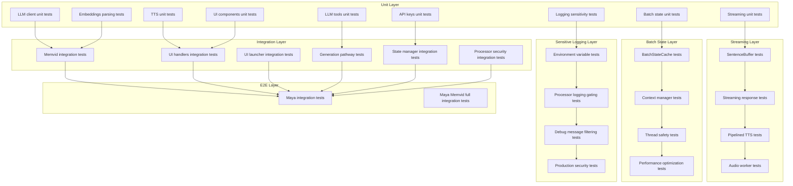

**Diagram sources**
- [test_llm_client.py](file://tests/test_llm_client.py#L1-L422)
- [test_tts.py](file://tests/test_tts.py#L1-L503)
- [test_embeddings.py](file://tests/test_embeddings.py#L1-L70)
- [test_ui_components.py](file://tests/test_ui_components.py#L1-L334)
- [test_llm_tools.py](file://tests/test_llm_tools.py#L1-L704)
- [test_batch_state.py](file://tests/test_batch_state.py#L1-L214)
- [test_streaming.py](file://tests/test_streaming.py#L1-L337)
- [test_logging_sensitivity.py](file://tests/test_logging_sensitivity.py#L1-L77)
- [test_memvid.py](file://tests/test_memvid.py#L1-L123)
- [test_ui_handlers.py](file://tests/test_ui_handlers.py#L1-L441)
- [test_ui_launcher.py](file://tests/test_ui_launcher.py#L1-L417)
- [test_generation.py](file://tests/test_generation.py#L1-L186)
- [test_maya.py](file://tests/test_maya.py#L1-L245)
- [test_maya_memvid_full.py](file://tests/test_maya_memvid_full.py#L1-L250)
- [test_api_keys.py](file://tests/test_api_keys.py#L1-L287)
- [test_state_manager.py](file://tests/test_state_manager.py#L1-L200)
- [test_processor_security.py](file://tests/test_processor_security.py#L1-L81)
- [test_security.py](file://tests/security/test_security.py#L1-L159)
- [test_security_config.py](file://tests/test_security_config.py#L1-L27)
- [test_security_scanner.py](file://tests/test_security_scanner.py#L1-L156)

## Detailed Component Analysis

### Unit Tests: LLM Client
- Validates configuration, model selection, and parameter building
- Exercises API call behavior with mocked SDKs and error handling
- Includes retry behavior verification and logging assertions

**Updated** The LLM client tests now extensively use the enhanced GenerateContentConfig mocking to validate proper configuration mapping and API call patterns with the updated google-genai SDK. The tests cover all LLM configuration parameters including temperature, top_p, top_k, and max_output_tokens with comprehensive validation.

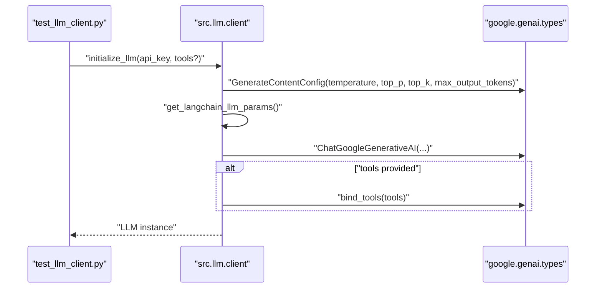

**Diagram sources**
- [test_llm_client.py](file://tests/test_llm_client.py#L61-L194)
- [client.py](file://src/llm/client.py#L69-L76)

**Section sources**
- [test_llm_client.py](file://tests/test_llm_client.py#L23-L194)
- [client.py](file://src/llm/client.py#L69-L76)

### Unit Tests: API Key Management
- Tests comprehensive API key retrieval, validation, and management functions
- Validates environment variable handling and key stripping
- Exercises custom required key validation scenarios
- Includes dotenv loading and integration testing

**Updated** The API key management tests now include comprehensive validation of the new BYOK workflow, covering key retrieval from environment variables, validation logic for required vs optional keys, and integration with the session state management system. The tests validate both Gemini and Cartesia API key handling, including optional voice functionality.

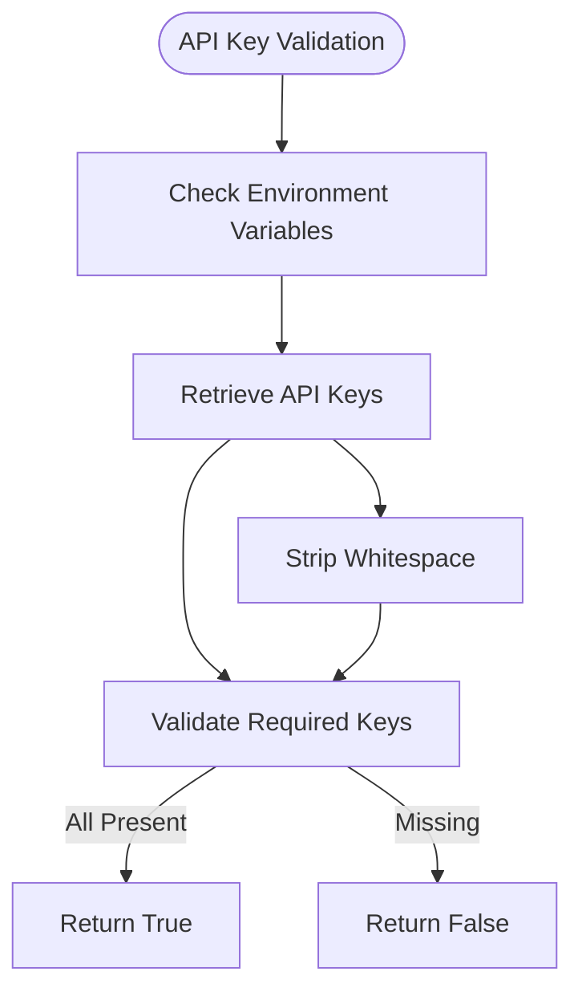

**Diagram sources**
- [test_api_keys.py](file://tests/test_api_keys.py#L25-L165)
- [api_key_modal.py](file://src/ui/api_key_modal.py#L83-L137)

**Section sources**
- [test_api_keys.py](file://tests/test_api_keys.py#L1-L287)
- [api_key_modal.py](file://src/ui/api_key_modal.py#L1-L137)

### Unit Tests: LLM Tools
- Tests comprehensive tool functionality including menu retrieval, recommendations, order management, and payment processing
- Validates flexible text matching for descriptive responses while maintaining semantic requirements
- Exercises complex business logic for order state management and payment workflows

**Section sources**
- [test_llm_tools.py](file://tests/test_llm_tools.py#L1-L704)

### Unit Tests: TTS and Audio
- Tests text cleaning, client initialization, and audio generation
- Verifies retryable exceptions and logging behavior
- Ensures graceful handling of empty inputs and API failures

**Updated** The TTS tests now include comprehensive validation of the new streaming audio generation functionality, covering pipelined audio processing, worker thread management, and error handling for TTS failures. The tests validate both successful audio generation and graceful error recovery scenarios.


**Diagram sources**
- [test_tts.py](file://tests/test_tts.py#L269-L460)

**Section sources**
- [test_tts.py](file://tests/test_tts.py#L18-L503)

### Unit Tests: Embeddings Parsing
- Validates parsing of diverse embedding API response shapes
- Ensures robust fallback to None on unexpected structures or exceptions

**Updated** The embeddings tests leverage the enhanced EmbedContentConfig mocking to validate proper embedding generation with task type configurations and batch processing capabilities, including comprehensive error handling for various SDK response formats.

**Section sources**
- [test_embeddings.py](file://tests/test_embeddings.py#L1-L70)
- [embeddings.py](file://src/rag/embeddings.py#L68-L100)

### Unit Tests: Generation Pathways
- Tests comprehensive generation pathways using google-genai SDK
- Validates prompt construction for both regular RAG and Memvid pipelines
- Ensures proper configuration parameter passing including temperature, top_p, top_k, and max_output_tokens

**Updated** The generation pathway tests now include extensive validation of LLM configuration parameters through the GenerateContentConfig class, ensuring proper parameter mapping and API call behavior across different pipeline types.

**Section sources**
- [test_generation.py](file://tests/test_generation.py#L1-L186)

### Unit Tests: UI Components
- Tests avatar setup with multiple failure modes and fallbacks
- Exercises HTTP requests, image processing, and logging

**Section sources**
- [test_ui_components.py](file://tests/test_ui_components.py#L9-L334)

### Integration Tests: State Manager
- Tests comprehensive payment state management including balance tracking, tab accumulation, and tip calculations
- Validates thread-safe session locking and atomic operations
- Exercises property-based testing for state consistency

**Updated** The state manager tests now include comprehensive validation of the new payment state schema with tip functionality, including atomic order updates, concurrent modification handling, and payment state transitions. The tests validate the complete payment workflow from order placement through payment completion.

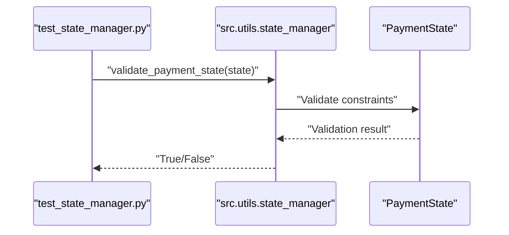

**Diagram sources**
- [test_state_manager.py](file://tests/test_state_manager.py#L66-L167)
- [state_manager.py](file://src/utils/state_manager.py#L17-L167)

**Section sources**
- [test_state_manager.py](file://tests/test_state_manager.py#L1-L200)
- [state_manager.py](file://src/utils/state_manager.py#L1-L200)

### Integration Tests: UI Handlers
- Validates end-to-end Gradio handler behavior including TTS, payment state, and overlays
- Handles exceptions and maintains safe state transitions
- Tests quota error handling and API key validation integration

**Updated** The UI handlers tests now include comprehensive validation of the BYOK workflow integration, covering API key validation modal handling, quota error popup display, and session state management. The tests validate the complete user journey from key submission through quota error resolution.

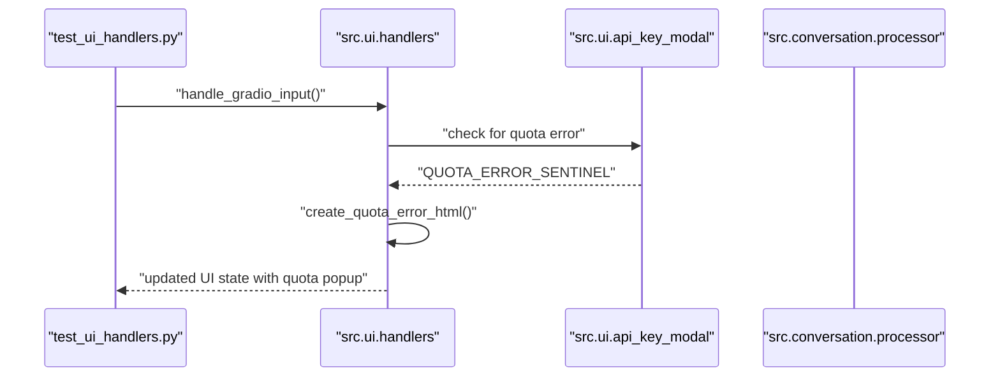

**Diagram sources**
- [test_ui_handlers.py](file://tests/test_ui_handlers.py#L1-L441)
- [handlers.py](file://src/ui/handlers.py#L115-L159)
- [api_key_modal.py](file://src/ui/api_key_modal.py#L12-L54)

**Section sources**
- [test_ui_handlers.py](file://tests/test_ui_handlers.py#L7-L441)
- [handlers.py](file://src/ui/handlers.py#L1-L387)
- [api_key_modal.py](file://src/ui/api_key_modal.py#L1-L137)

### Integration Tests: UI Launcher
- Verifies Gradio interface construction, component properties, and event wiring
- Tests fallbacks and logging on avatar setup failures
- Validates BYOK API key form integration and state management

**Updated** The UI launcher tests now include comprehensive validation of the new API key modal integration, covering form visibility toggling, key submission handling, and session state updates. The tests validate the complete BYOK workflow from form display through successful key validation.

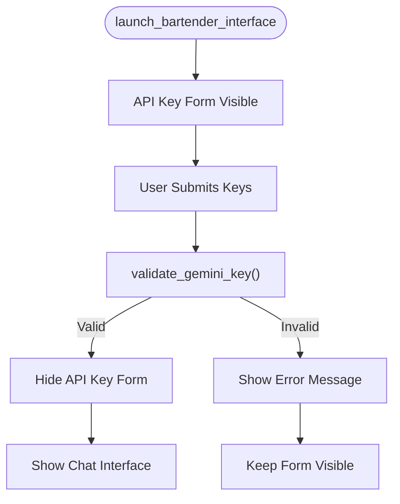

**Diagram sources**
- [test_ui_launcher.py](file://tests/test_ui_launcher.py#L62-L417)
- [launcher.py](file://src/ui/launcher.py#L50-L364)
- [api_key_modal.py](file://src/ui/api_key_modal.py#L83-L137)

**Section sources**
- [test_ui_launcher.py](file://tests/test_ui_launcher.py#L1-L417)
- [launcher.py](file://src/ui/launcher.py#L1-L364)

### Integration Tests: Processor Security Integration
- **New** Validates security scanning integration with conversation processor
- Tests input blocking for prompt injection attempts
- Validates output replacement for toxic content
- Ensures graceful degradation when security module is unavailable

**Updated** The processor security integration tests validate the complete security workflow integration, including input scanning before LLM invocation, output scanning after response generation, and proper error handling for blocked content. The tests use sophisticated mocking to simulate both valid and malicious inputs while maintaining deterministic behavior.

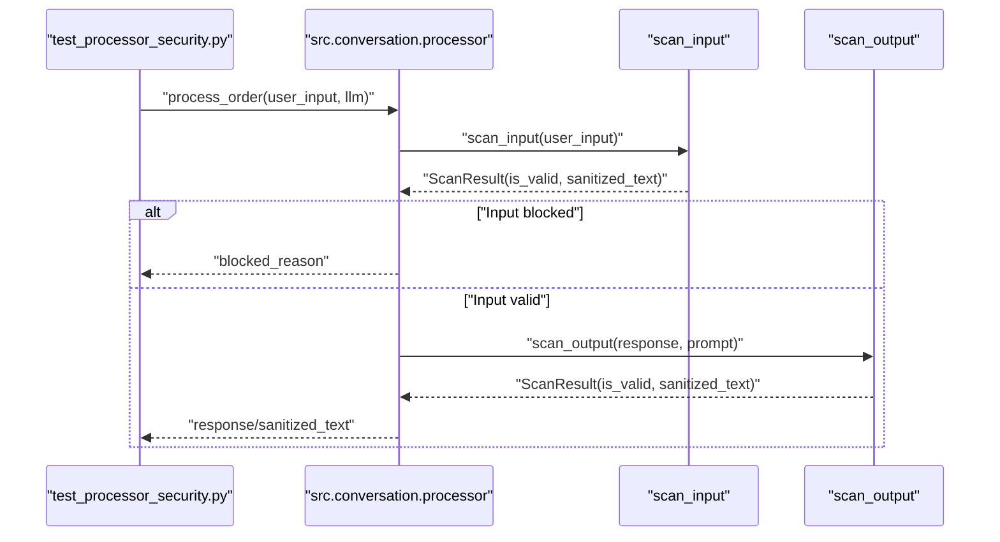

**Diagram sources**
- [test_processor_security.py](file://tests/test_processor_security.py#L1-L81)
- [processor.py](file://src/conversation/processor.py#L112-L195)

**Section sources**
- [test_processor_security.py](file://tests/test_processor_security.py#L1-L81)
- [processor.py](file://src/conversation/processor.py#L112-L195)

### E2E Tests: Maya Workflows
- Full integration test orchestrating LLM, RAG, and TTS in a realistic conversation
- Memvid-enabled E2E test validating order flow and state updates
- Tests quota error handling and recovery scenarios

**Updated** The Maya E2E tests now include comprehensive validation of the BYOK workflow, covering complete user journeys from API key submission through conversation flow with quota error handling. The tests validate session state persistence, payment state updates, and UI integration throughout the entire workflow.

**Section sources**
- [test_maya.py](file://tests/test_maya.py#L25-L245)
- [test_maya_memvid_full.py](file://tests/test_maya_memvid_full.py#L16-L248)

## New Streaming Functionality Testing

### SentenceBuffer Testing
- **New** Comprehensive testing of sentence boundary detection and buffering
- Validates proper handling of abbreviations, punctuation, and sentence completion
- Tests flush behavior for remaining content and partial text retrieval
- Ensures thread-safe operation through lock-based access patterns

**Updated** The SentenceBuffer tests validate sophisticated text processing capabilities including false boundary detection for common abbreviations (mr, mrs, dr, prof, etc.), proper sentence boundary recognition with punctuation handling, and efficient memory management through incremental buffering and flushing.

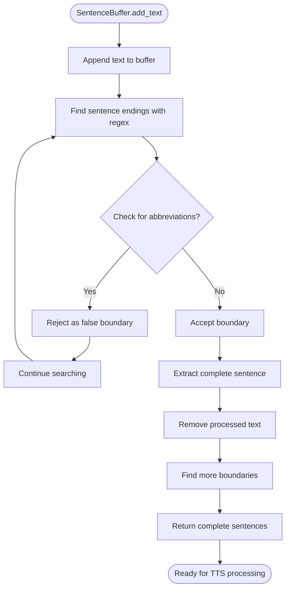

**Diagram sources**
- [test_streaming.py](file://tests/test_streaming.py#L19-L58)
- [streaming.py](file://src/utils/streaming.py#L31-L100)

**Section sources**
- [test_streaming.py](file://tests/test_streaming.py#L16-L107)
- [streaming.py](file://src/utils/streaming.py#L12-L116)

### Streaming Response Generator Testing
- **New** Validates event-driven streaming architecture for text processing
- Tests text_chunk, sentence, and complete event generation
- Ensures proper buffering and event sequencing
- Validates flush behavior for incomplete sentences

**Updated** The streaming response generator tests validate the complete event-driven pipeline from raw text chunks through sentence detection to final completion events, ensuring proper timing and sequencing of streaming events for real-time user experience.

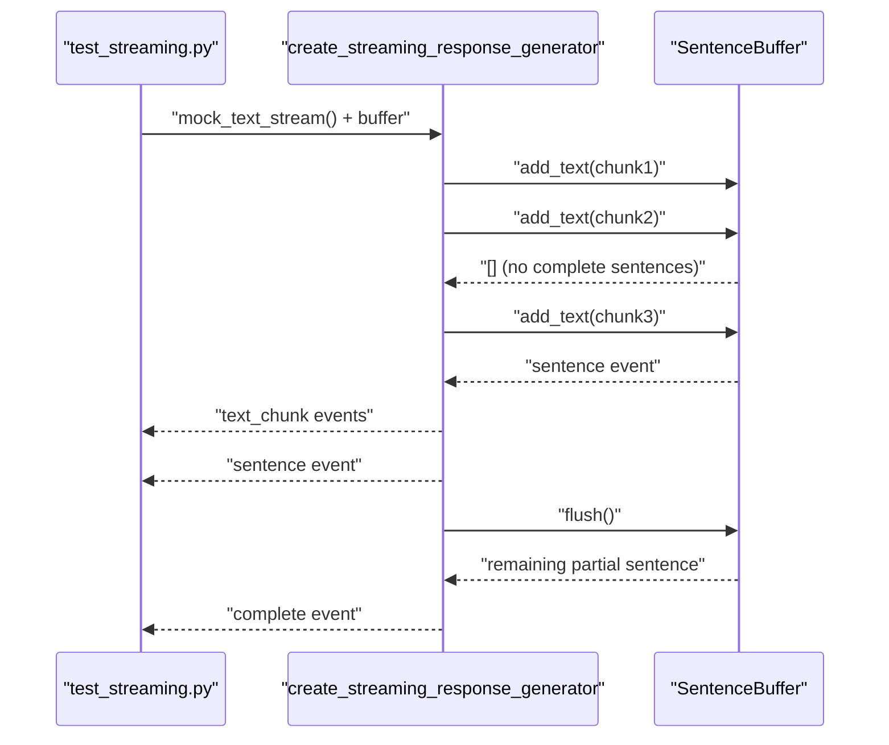

**Diagram sources**
- [test_streaming.py](file://tests/test_streaming.py#L63-L107)
- [streaming.py](file://src/utils/streaming.py#L12-L116)

**Section sources**
- [test_streaming.py](file://tests/test_streaming.py#L60-L107)

### Pipelined TTS Testing
- **New** Comprehensive testing of audio generation pipeline
- Validates sentence-by-sentence audio processing with worker threads
- Tests error handling for TTS failures and client errors
- Ensures proper event sequencing and completion signaling

**Updated** The pipelined TTS tests validate the sophisticated audio generation pipeline that processes sentences concurrently while maintaining proper event ordering, handles various error conditions gracefully, and provides completion signals for coordinated UI updates.

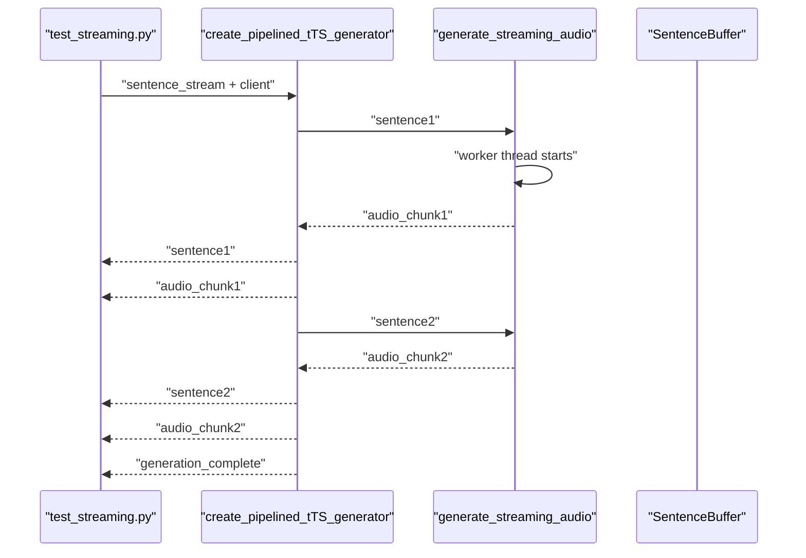

**Diagram sources**
- [test_streaming.py](file://tests/test_streaming.py#L177-L202)
- [streaming_tts.py](file://src/voice/streaming_tts.py#L14-L136)

**Section sources**
- [test_streaming.py](file://tests/test_streaming.py#L174-L202)
- [streaming_tts.py](file://src/voice/streaming_tts.py#L14-L136)

### Audio Worker Testing
- **New** Validates background thread audio generation with proper synchronization
- Tests heartbeat mechanisms for progress indication
- Validates error propagation and cleanup procedures
- Ensures thread-safe communication through queues

**Updated** The audio worker tests validate the complex threading model that manages asynchronous audio generation, provides periodic heartbeat signals for progress indication, handles various error conditions gracefully, and ensures proper cleanup and resource management.

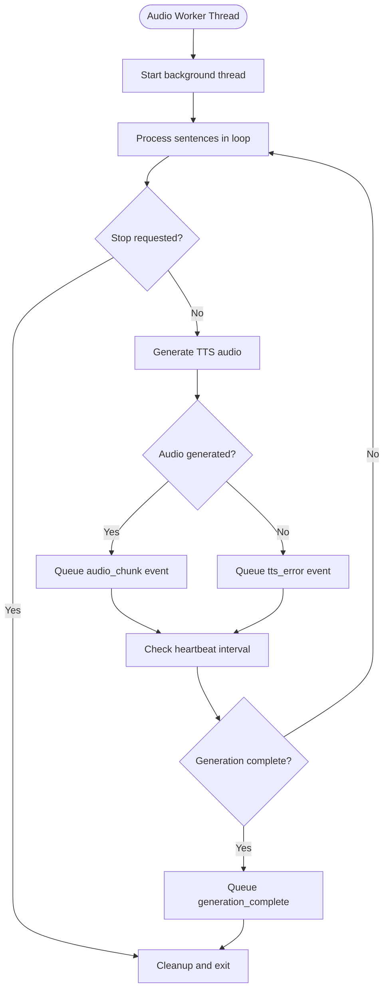

**Diagram sources**
- [test_streaming.py](file://tests/test_streaming.py#L112-L172)
- [streaming_tts.py](file://src/voice/streaming_tts.py#L41-L136)

**Section sources**
- [test_streaming.py](file://tests/test_streaming.py#L109-L172)
- [streaming_tts.py](file://src/voice/streaming_tts.py#L41-L136)

### Streaming Handler Testing
- **New** Validates integration of streaming functionality with Gradio handlers
- Tests conditional streaming based on configuration flags
- Ensures proper event handling and state management
- Validates fallback to traditional processing when streaming disabled

**Updated** The streaming handler tests validate the complete integration between streaming functionality and the Gradio interface, including proper event handling, state management, and graceful fallback to traditional processing when streaming is disabled.

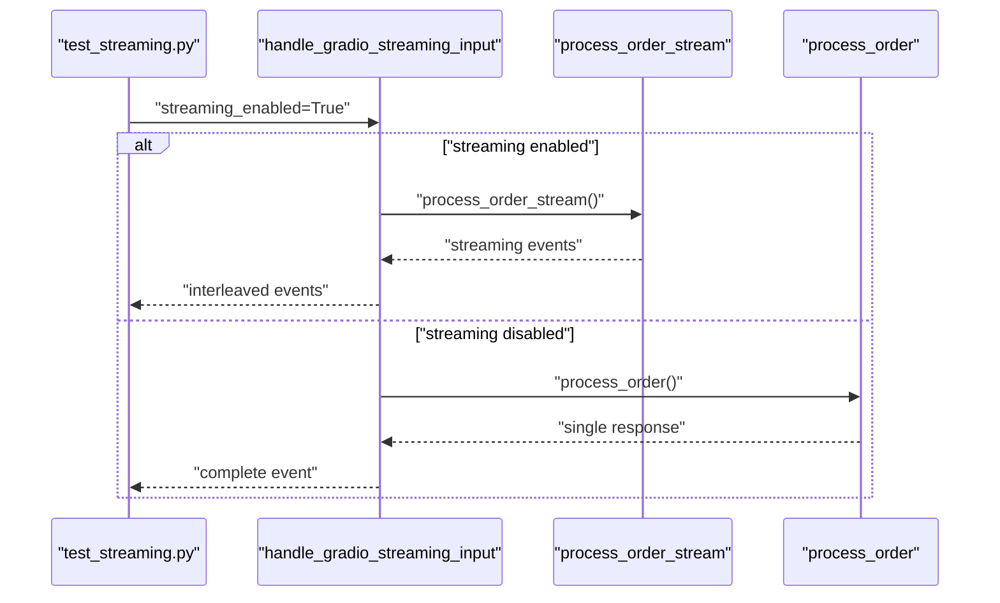

**Diagram sources**
- [test_streaming.py](file://tests/test_streaming.py#L207-L289)

**Section sources**
- [test_streaming.py](file://tests/test_streaming.py#L204-L289)

### Gemini API Streaming Testing
- **New** Validates streaming API behavior with proper error handling
- Tests rate limit and quota error scenarios
- Ensures proper chunk processing and response validation
- Validates configuration parameter passing

**Updated** The Gemini API streaming tests validate the integration with the google-genai streaming API, including proper chunk processing, error handling for rate limits and quota restrictions, and validation of configuration parameter passing through the streaming pipeline.

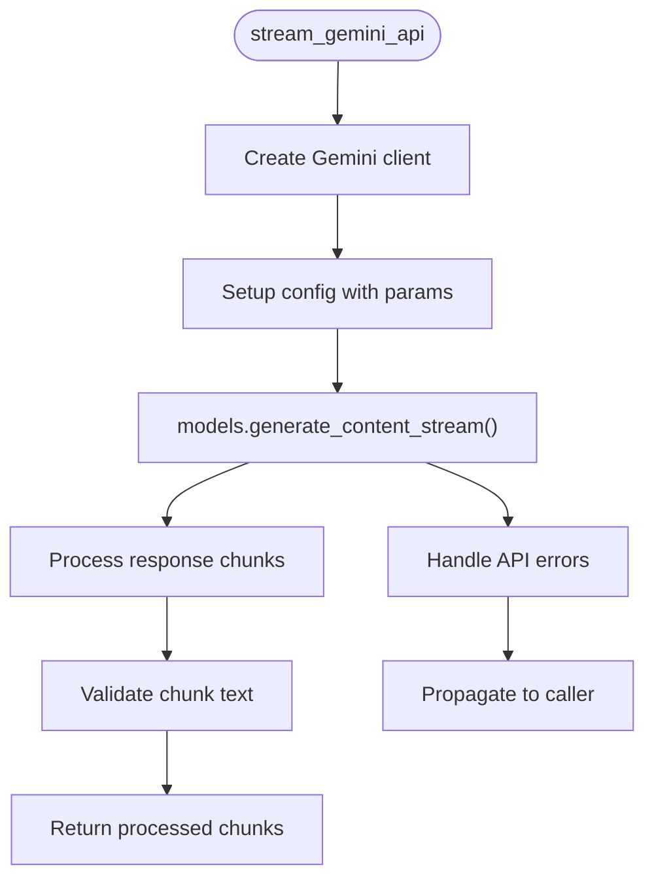

**Diagram sources**
- [test_streaming.py](file://tests/test_streaming.py#L294-L337)
- [client.py](file://src/llm/client.py#L69-L76)

**Section sources**
- [test_streaming.py](file://tests/test_streaming.py#L291-L337)
- [client.py](file://src/llm/client.py#L69-L76)

## Batch State Cache Testing

### BatchStateCache Class Testing
- **New** Comprehensive testing of caching mechanism for state operations
- Validates thread-safe access patterns with locks
- Tests session data loading, updating, and flushing
- Ensures proper isolation between sessions

**Updated** The BatchStateCache tests validate the sophisticated caching mechanism that optimizes remote dictionary operations by batching reads and writes, ensuring thread-safe access patterns, and providing proper session isolation through unique session IDs.

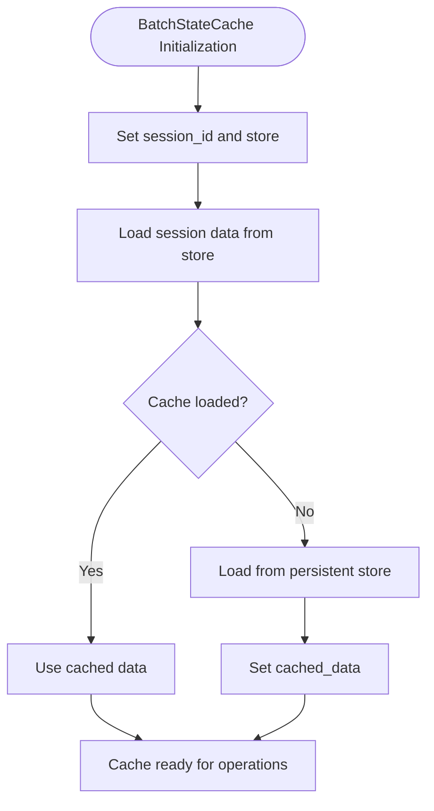

**Diagram sources**
- [test_batch_state.py](file://tests/test_batch_state.py#L12-L58)
- [batch_state.py](file://src/utils/batch_state.py#L25-L52)

**Section sources**
- [test_batch_state.py](file://tests/test_batch_state.py#L9-L134)
- [batch_state.py](file://src/utils/batch_state.py#L18-L189)

### Context Manager Testing
- **New** Validates batch_state_commits context manager behavior
- Tests proper cache setup and cleanup
- Validates nested context handling and error propagation
- Ensures flush occurs on successful completion and cleanup on exceptions

**Updated** The context manager tests validate the sophisticated lifecycle management of batch state operations, including proper cache setup and cleanup, nested context handling, error propagation with cleanup, and automatic flushing on successful completion or exception scenarios.

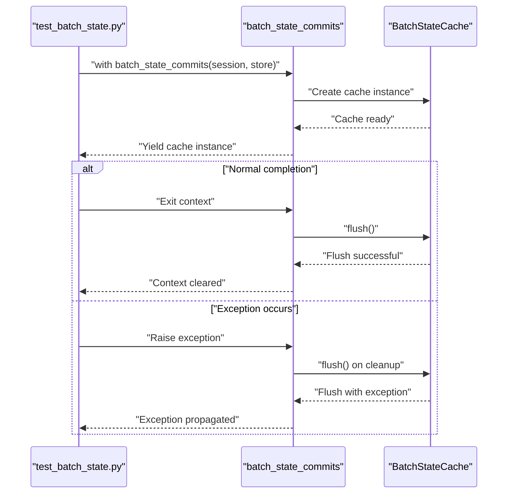

**Diagram sources**
- [test_batch_state.py](file://tests/test_batch_state.py#L138-L210)
- [batch_state.py](file://src/utils/batch_state.py#L195-L234)

**Section sources**
- [test_batch_state.py](file://tests/test_batch_state.py#L135-L210)
- [batch_state.py](file://src/utils/batch_state.py#L195-L234)

### Thread Safety Testing
- **New** Validates concurrent access patterns and race condition prevention
- Tests lock-based synchronization for cache operations
- Ensures proper isolation between concurrent operations
- Validates atomic operations and state consistency

**Updated** The thread safety tests validate the sophisticated concurrency control mechanisms that prevent race conditions, ensure atomic operations, and maintain state consistency across concurrent access patterns through proper lock-based synchronization.

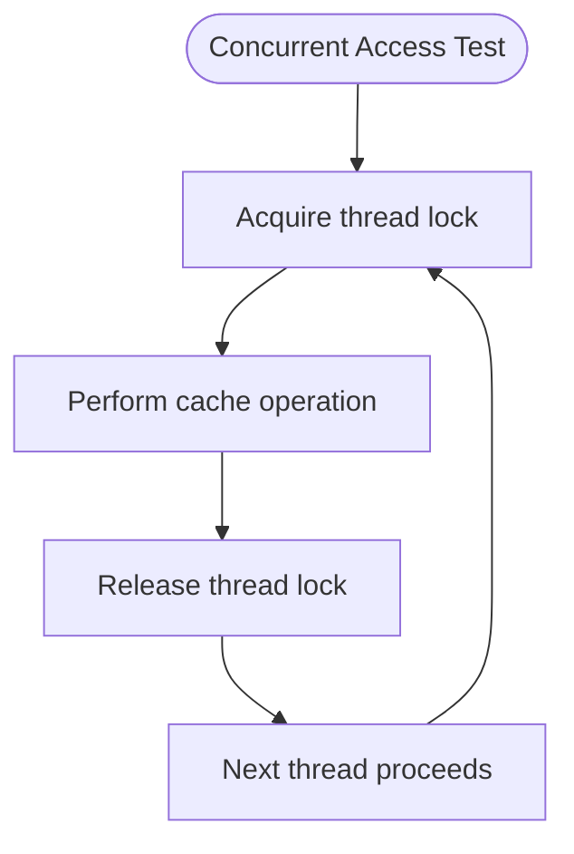

**Diagram sources**
- [test_batch_state.py](file://tests/test_batch_state.py#L60-L106)
- [batch_state.py](file://src/utils/batch_state.py#L37-L106)

**Section sources**
- [test_batch_state.py](file://tests/test_batch_state.py#L59-L133)
- [batch_state.py](file://src/utils/batch_state.py#L37-L106)

### Performance Optimization Testing
- **New** Validates single-write optimization for remote dictionary operations
- Tests dirty flag management and selective flushing
- Ensures minimal remote calls through intelligent caching
- Validates logging and monitoring of cache operations

**Updated** The performance optimization tests validate the sophisticated single-write optimization that minimizes remote dictionary operations by batching changes and performing a single write at the end of the request lifecycle, along with proper dirty flag management and comprehensive logging of cache operations.

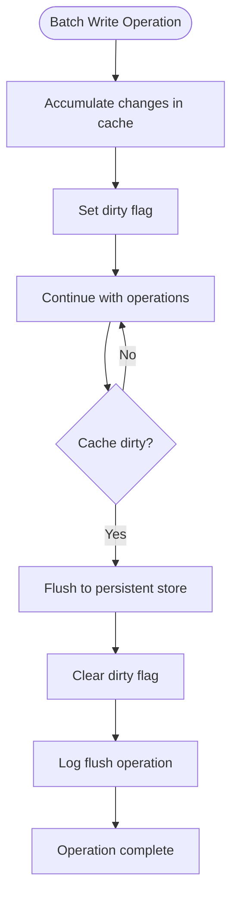

**Diagram sources**
- [test_batch_state.py](file://tests/test_batch_state.py#L107-L133)
- [batch_state.py](file://src/utils/batch_state.py#L174-L189)

**Section sources**
- [test_batch_state.py](file://tests/test_batch_state.py#L107-L133)
- [batch_state.py](file://src/utils/batch_state.py#L174-L189)

## Sensitive Logging Controls Testing

### Environment Variable Testing
- **New** Validates LOG_SENSITIVE_RESPONSES environment variable handling
- Tests boolean interpretation and case-insensitive matching
- Ensures proper default behavior when environment variable is unset
- Validates edge cases and error handling

**Updated** The sensitive logging tests validate the sophisticated environment variable handling that controls whether sensitive user interaction content is logged, including proper boolean interpretation, case-insensitive matching, and comprehensive edge case handling for various environment variable values.

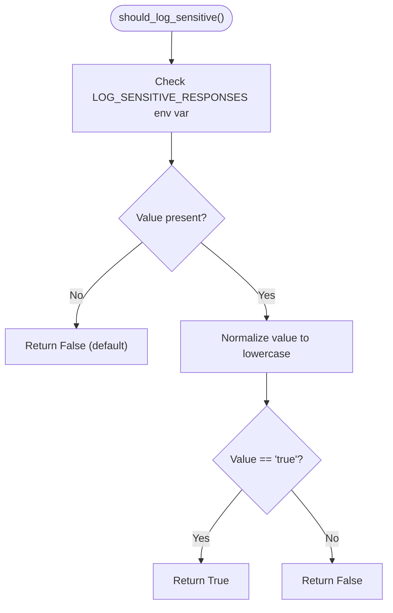

**Diagram sources**
- [test_logging_sensitivity.py](file://tests/test_logging_sensitivity.py#L7-L26)
- [logging_config.py](file://src/config/logging_config.py#L86-L93)

**Section sources**
- [test_logging_sensitivity.py](file://tests/test_logging_sensitivity.py#L1-L77)
- [logging_config.py](file://src/config/logging_config.py#L86-L93)

### Processor Logging Gating Testing
- **New** Validates conditional logging based on sensitive flag
- Tests debug message filtering for sensitive content
- Ensures proper tool call and response logging control
- Validates integration with conversation processor

**Updated** The processor logging gating tests validate the sophisticated conditional logging system that prevents sensitive user interaction content from being logged unless explicitly enabled, including proper filtering of debug messages, tool call logging control, and seamless integration with the conversation processor workflow.

```mermaid
sequenceDiagram
participant T as "test_logging_sensitivity.py"
participant PC as "process_order"
participant SC as "should_log_sensitive"
participant L as "logger"
T->>PC : "process_order()"
PC->>SC : "should_log_sensitive()"
SC-->>PC : "True/False"
alt "Sensitive logging enabled"
PC->>L : "log sensitive debug messages"
L-->>T : "Sensitive logs captured"
else "Sensitive logging disabled"
PC->>L : "log non-sensitive messages only"
L-->>T : "No sensitive logs"
end
```

**Diagram sources**
- [test_logging_sensitivity.py](file://tests/test_logging_sensitivity.py#L31-L77)
- [processor.py](file://src/conversation/processor.py#L267-L397)

**Section sources**
- [test_logging_sensitivity.py](file://tests/test_logging_sensitivity.py#L28-L77)
- [processor.py](file://src/conversation/processor.py#L267-L397)

### Debug Message Filtering Testing
- **New** Validates filtering of sensitive content in debug logs
- Tests tool call logging suppression and response masking
- Ensures comprehensive coverage of sensitive data types
- Validates production-ready logging security

**Updated** The debug message filtering tests validate the comprehensive logging security system that prevents sensitive user interaction content from appearing in logs, including proper filtering of tool calls, response masking, and production-ready security controls for log data protection.

```mermaid
flowchart TD
Start(["Debug Message Processing"]) --> CheckSensitive["Check sensitive logging flag"]
CheckSensitive --> |Enabled| LogFull["Log full debug message"]
CheckSensitive --> |Disabled| FilterMessages["Filter sensitive content"]
FilterMessages --> MaskToolCalls["Mask tool call details"]
MaskToolCalls --> MaskResponses["Mask response content"]
MaskResponses --> LogFiltered["Log filtered message"]
```

**Diagram sources**
- [test_logging_sensitivity.py](file://tests/test_logging_sensitivity.py#L31-L77)
- [logging_config.py](file://src/config/logging_config.py#L14-L33)

**Section sources**
- [test_logging_sensitivity.py](file://tests/test_logging_sensitivity.py#L31-L77)
- [logging_config.py](file://src/config/logging_config.py#L14-L33)

## Dependency Analysis
The test suite relies on:
- pytest configuration for discovery, markers, and warnings
- Global conftest for optional SDK stubs and session-scoped flags
- Per-feature modules for domain-specific tests
- **New** Streaming dependencies including threading, queue, and generator utilities
- **New** Batch state dependencies including threading locks and context managers
- **New** Sensitive logging dependencies including environment variable handling and logging formatters

**Updated** The test infrastructure now includes comprehensive google-genai SDK type mocking through the conftest module, ensuring tests remain functional across different SDK versions and installations. The enhanced error handling class compatibility provides robust testing capabilities across various SDK implementations. The BYOK workflow testing infrastructure includes specialized fixtures for API key validation and session state management. **New** Streaming testing infrastructure depends on Python's threading and queue modules for concurrent audio processing. **New** Batch state testing infrastructure validates thread safety and performance optimization through proper lock management. **New** Sensitive logging testing infrastructure validates production-grade security controls through environment variable handling and comprehensive message filtering.

```mermaid
graph TB
PIni["pytest.ini"]
PyProj["pyproject.toml"]
Cfg["tests/conftest.py"]
T1["test_llm_client.py"]
T2["test_tts.py"]
T3["test_embeddings.py"]
T4["test_ui_components.py"]
T5["test_llm_tools.py"]
T6["test_batch_state.py"]
T7["test_streaming.py"]
T8["test_logging_sensitivity.py"]
T9["test_memvid.py"]
T10["test_ui_handlers.py"]
T11["test_ui_launcher.py"]
T12["test_maya.py"]
T13["test_maya_memvid_full.py"]
T14["test_generation.py"]
T15["test_api_keys.py"]
T16["test_state_manager.py"]
T17["test_processor_security.py"]
T18["test_security.py"]
T19["test_security_config.py"]
T20["test_security_scanner.py"]
PIni --> T1
PIni --> T2
PIni --> T3
PIni --> T4
PIni --> T5
PIni --> T6
PIni --> T7
PIni --> T8
PIni --> T9
PIni --> T10
PIni --> T11
PIni --> T12
PIni --> T13
PIni --> T14
PIni --> T15
PIni --> T16
PIni --> T17
PIni --> T18
PIni --> T19
PIni --> T20
PyProj --> Cfg
Cfg --> T1
Cfg --> T2
Cfg --> T3
Cfg --> T4
Cfg --> T5
Cfg --> T6
Cfg --> T7
Cfg --> T8
Cfg --> T9
Cfg --> T10
Cfg --> T11
Cfg --> T12
Cfg --> T13
Cfg --> T14
Cfg --> T15
Cfg --> T16
Cfg --> T17
Cfg --> T18
Cfg --> T19
Cfg --> T20
```

**Diagram sources**
- [pytest.ini](file://pytest.ini#L1-L25)
- [pyproject.toml](file://pyproject.toml#L48-L64)
- [conftest.py](file://tests/conftest.py#L1-L181)

**Section sources**
- [pytest.ini](file://pytest.ini#L1-L25)
- [pyproject.toml](file://pyproject.toml#L48-L64)
- [conftest.py](file://tests/conftest.py#L1-L181)

## Performance Considerations
- Use the slow marker to exclude heavy tests in fast CI runs
- Leverage the force-rebuild flag for Memvid to avoid repeated expensive initialization
- Prefer unit tests for hot-path functions; reserve integration/E2E tests for critical flows
- Mock external services to minimize flakiness and runtime variability
- **New** Streaming tests are designed for minimal overhead with proper resource cleanup
- **New** Batch state tests validate performance optimization through intelligent caching
- **New** Sensitive logging tests ensure minimal performance impact through lazy evaluation
- **New** Security tests are lightweight and deterministic, leveraging mocking for encryption and scanning operations

**Updated** The enhanced test infrastructure with comprehensive SDK type mocking ensures consistent performance across different environments while maintaining test reliability. The improved error handling class compatibility reduces test failures due to SDK version differences. The BYOK workflow testing infrastructure includes optimized fixtures for API key validation and session state management to minimize test execution time. **New** Streaming testing infrastructure is designed for minimal memory footprint and efficient resource utilization. **New** Batch state testing validates significant performance improvements through reduced remote operations and intelligent caching strategies. **New** Sensitive logging testing ensures production-grade security without impacting application performance through efficient environment variable checking and conditional logging.

## Troubleshooting Guide
Common issues and resolutions:
- Missing API keys: Many tests skip when required keys are absent; ensure environment variables are set or use placeholders via conftest shims
- Optional SDKs not installed: conftest provides comprehensive stubs for google-generativeai and google.genai including GenerateContentConfig, EmbedContentConfig, and enhanced error class hierarchy to keep tests runnable
- Flaky network calls: Use pytest markers to deselect slow tests; rely on mocks for deterministic behavior
- Memvid rebuilds: Control via --force-rebuild or TEST_FORCE_REBUILD to refresh expensive stores
- Logging noise: Warnings are filtered globally; adjust filters if needed for debugging
- **New** Streaming issues: Validate sentence boundary detection, audio worker thread management, and event sequencing
- **New** Batch state issues: Check thread safety, cache synchronization, and flush behavior
- **New** Sensitive logging issues: Validate environment variable configuration and debug message filtering
- **New** BYOK workflow issues: Validate API key modal visibility states, session state persistence, and quota error popup display
- **New** Payment state issues: Check thread-safe session locking and atomic operation validation in state manager tests
- **New** Security testing issues: Validate encryption key format, scanner availability, and redaction pattern effectiveness
- **New** Fallback scanner problems: Ensure regex patterns are correctly configured and fallback logic is properly triggered

**Updated** The troubleshooting guide now includes guidance on the comprehensive google-genai SDK mocking infrastructure, ensuring tests remain functional even when the actual SDK is not installed. The enhanced error handling class compatibility provides better error classification and debugging capabilities. The BYOK workflow troubleshooting section addresses common issues with API key validation, session state management, and quota error handling. **New** Streaming troubleshooting covers sentence boundary detection issues, audio worker thread problems, and event sequencing validation. **New** Batch state troubleshooting addresses thread safety concerns, cache synchronization issues, and performance optimization validation. **New** Sensitive logging troubleshooting validates environment variable configuration, debug message filtering effectiveness, and production security compliance.

**Section sources**
- [conftest.py](file://tests/conftest.py#L19-L181)
- [test_memvid.py](file://tests/test_memvid.py#L27-L47)
- [pytest.ini](file://pytest.ini#L24-L25)
- [test_streaming.py](file://tests/test_streaming.py#L1-L337)
- [test_batch_state.py](file://tests/test_batch_state.py#L1-L214)
- [test_logging_sensitivity.py](file://tests/test_logging_sensitivity.py#L1-L77)

## Conclusion
MayaMCP's testing strategy balances comprehensiveness with reliability. The pytest-based framework, custom markers, and targeted fixtures enable efficient unit, integration, and E2E coverage. By isolating external dependencies, centralizing configuration, and structuring tests by domain, the suite remains maintainable and resilient to environmental variability.

**Updated** The comprehensive test infrastructure updates ensure the testing strategy remains robust against google-genai SDK evolution while maintaining backward compatibility and test reliability. The enhanced error handling class compatibility and expanded parameter support provide comprehensive coverage for modern LLM configuration requirements. The new BYOK workflow testing infrastructure provides complete coverage of the user authentication and session management processes, ensuring reliable operation across all supported deployment scenarios. **New** The streaming functionality testing framework provides comprehensive coverage of real-time text processing, audio pipelining, and event-driven architectures. **New** The batch state cache testing infrastructure validates significant performance optimizations through intelligent caching and transactional state management. **New** The sensitive logging testing framework ensures production-grade security controls without impacting application performance. **New** The security testing framework provides comprehensive protection validation, ensuring that encryption, logging redaction, and input/output scanning work effectively together to maintain application security.

## Appendices

### Test Organization Patterns
- Unit tests: Small, deterministic, and highly isolated
- Integration tests: Cross-component behavior and pipeline correctness
- E2E tests: Realistic user workflows with mocked external services
- **New** Streaming tests: Text buffering, audio pipelining, and event-driven architectures
- **New** Batch state tests: Performance optimization through caching and transactional state management
- **New** Sensitive logging tests: Production-grade security controls for log data protection

**Section sources**
- [test_llm_client.py](file://tests/test_llm_client.py#L1-L422)
- [test_tts.py](file://tests/test_tts.py#L1-L503)
- [test_llm_tools.py](file://tests/test_llm_tools.py#L1-L704)
- [test_memvid.py](file://tests/test_memvid.py#L1-L123)
- [test_maya.py](file://tests/test_maya.py#L1-L245)
- [test_api_keys.py](file://tests/test_api_keys.py#L1-L287)
- [test_batch_state.py](file://tests/test_batch_state.py#L1-L214)
- [test_streaming.py](file://tests/test_streaming.py#L1-L337)
- [test_logging_sensitivity.py](file://tests/test_logging_sensitivity.py#L1-L77)
- [test_processor_security.py](file://tests/test_processor_security.py#L1-L81)
- [test_security.py](file://tests/security/test_security.py#L1-L159)
- [test_security_config.py](file://tests/test_security_config.py#L1-L27)
- [test_security_scanner.py](file://tests/test_security_scanner.py#L1-L156)

### Custom Markers Reference
- slow: Heavy tests excluded by default
- integration: Integration-level tests
- unit: Unit-level tests
- memvid: Memvid-specific tests
- rag: RAG-related tests
- llm: LLM-related tests
- ui: UI-related tests

**Section sources**
- [pytest.ini](file://pytest.ini#L16-L23)

### Mocking Strategies
- LLM APIs: Comprehensive patching of google.generativeai and google.genai SDKs to return deterministic responses, including enhanced GenerateContentConfig and EmbedContentConfig classes with full parameter support
- Payment services: Not represented in the provided tests; follow similar patterns by patching external calls
- Audio systems: Patch Cartesia client and audio streams to simulate success/failure paths
- **New** API key validation: Mock google-genai SDK calls to validate Gemini API keys without external dependencies
- **New** Session state management: Use thread-safe fixtures to simulate concurrent user sessions and payment state updates
- **New** Security testing: Comprehensive mocking for encryption operations, scanner availability, and logging redaction
- **New** Fallback mechanisms: Mock unavailable security libraries to test graceful degradation behavior
- **New** Streaming mocking: Comprehensive mocking for threading, queue operations, and generator utilities
- **New** Batch state mocking: Thread-safe fixtures for concurrent access and cache synchronization
- **New** Sensitive logging mocking: Environment variable fixtures for conditional logging behavior

**Updated** The mocking strategies now include comprehensive coverage of the new streaming functionality, with specialized fixtures for threading, queue operations, and generator utilities. The batch state mocking includes thread-safe fixtures for concurrent access patterns and cache synchronization validation. The sensitive logging mocking provides environment variable fixtures for testing conditional logging behavior across different deployment scenarios. **New** Streaming mocking encompasses sentence boundary detection, audio worker thread management, and event-driven architecture validation. **New** Batch state mocking validates thread safety, cache synchronization, and performance optimization through proper lock management. **New** Sensitive logging mocking ensures production-grade security controls through environment variable handling and comprehensive message filtering.

**Section sources**
- [conftest.py](file://tests/conftest.py#L99-L136)
- [test_tts.py](file://tests/test_tts.py#L216-L267)
- [key_validator.py](file://src/llm/key_validator.py#L20-L87)
- [test_processor_security.py](file://tests/test_processor_security.py#L12-L24)
- [test_security.py](file://tests/security/test_security.py#L7-L8)
- [test_security_scanner.py](file://tests/test_security_scanner.py#L8-L23)
- [test_streaming.py](file://tests/test_streaming.py#L6-L13)
- [test_batch_state.py](file://tests/test_batch_state.py#L3-L6)
- [test_logging_sensitivity.py](file://tests/test_logging_sensitivity.py#L1-L6)

### Test Data Management and Fixtures
- Centralized query configuration for Memvid tests
- Session-scoped flags controlling expensive rebuilds
- Fixture-driven environment setup for UI components
- Enhanced parameter validation for LLM configuration testing
- **New** API key fixtures for BYOK workflow testing
- **New** Session state fixtures for payment and tip management
- **New** Security fixtures for encryption testing and scanner validation
- **New** Master key environment variable for consistent encryption testing
- **New** Threading fixtures for concurrent streaming and batch state testing
- **New** Environment variable fixtures for sensitive logging controls

**Section sources**
- [test_config.py](file://tests/test_config.py#L22-L151)
- [test_memvid.py](file://tests/test_memvid.py#L27-L47)
- [test_ui_components.py](file://tests/test_ui_components.py#L9-L334)
- [test_api_keys.py](file://tests/test_api_keys.py#L25-L165)
- [test_processor_security.py](file://tests/test_processor_security.py#L12-L24)
- [test_security.py](file://tests/security/test_security.py#L9-L10)
- [test_security_scanner.py](file://tests/test_security_scanner.py#L8-L23)
- [test_streaming.py](file://tests/test_streaming.py#L6-L13)
- [test_batch_state.py](file://tests/test_batch_state.py#L3-L6)
- [test_logging_sensitivity.py](file://tests/test_logging_sensitivity.py#L1-L6)

### Examples of Test Patterns
- Conversation flows: Validate response quality, history growth, and order state updates
- Payment processing: Not represented in the provided tests; apply similar patterns by mocking external payment calls
- RAG functionality: **Removed** - RAG components have been deleted from the codebase
- UI interactions: Event wiring, component properties, and error fallbacks
- LLM configuration: Comprehensive parameter validation including temperature, top_p, top_k, and max_output_tokens
- **New** BYOK workflow: Validate API key submission, session state management, and quota error handling
- **New** Payment state management: Test atomic operations, thread safety, and state transitions
- **New** Encryption validation: Test round-trip encryption/decryption with proper key management
- **New** Logging redaction: Validate sensitive data masking in log output
- **New** Scanner fallback: Test regex-based security detection when advanced libraries are unavailable
- **New** Streaming text processing: Validate sentence boundary detection and event-driven architectures
- **New** Batch state optimization: Test caching mechanisms and performance improvements
- **New** Sensitive logging controls: Validate production-grade security for log data protection

**Updated** The test patterns now include comprehensive coverage of LLM configuration parameter testing, ensuring proper validation of temperature, top_p, top_k, and max_output_tokens through the GenerateContentConfig class. The BYOK workflow patterns include API key validation modal testing, session state persistence, and quota error popup handling. The payment state patterns cover atomic order updates, thread-safe session locking, and comprehensive state validation. **New** Streaming patterns include sentence boundary detection validation, audio worker thread management, and event-driven architecture testing. **New** Batch state patterns validate caching mechanisms, thread safety, and performance optimization through intelligent state management. **New** Sensitive logging patterns ensure production-grade security controls through environment variable handling and comprehensive message filtering.

**Section sources**
- [test_maya.py](file://tests/test_maya.py#L176-L233)
- [test_maya_memvid_full.py](file://tests/test_maya_memvid_full.py#L102-L180)
- [test_processor_rag.py](file://tests/test_processor_rag.py#L27-L82)
- [test_ui_handlers.py](file://tests/test_ui_handlers.py#L15-L350)
- [test_ui_launcher.py](file://tests/test_ui_launcher.py#L78-L358)
- [test_generation.py](file://tests/test_generation.py#L56-L83)
- [test_api_keys.py](file://tests/test_api_keys.py#L25-L165)
- [test_state_manager.py](file://tests/test_state_manager.py#L66-L167)
- [test_processor_security.py](file://tests/test_processor_security.py#L26-L81)
- [test_security.py](file://tests/security/test_security.py#L22-L155)
- [test_security_scanner.py](file://tests/test_security_scanner.py#L36-L156)
- [test_streaming.py](file://tests/test_streaming.py#L19-L337)
- [test_batch_state.py](file://tests/test_batch_state.py#L9-L214)
- [test_logging_sensitivity.py](file://tests/test_logging_sensitivity.py#L7-L77)

### Test Coverage and CI
- Coverage configured to run against src and omit tests and caches
- Report excludes common boilerplate lines and focuses on meaningful coverage

**Section sources**
- [pyproject.toml](file://pyproject.toml#L66-L83)

### Enhanced Test Infrastructure Details
**New** The test infrastructure now includes comprehensive google-genai SDK type mocking with enhanced capabilities:

#### GenerateContentConfig Enhancements
- **Temperature Parameter**: Full support for temperature configuration with comprehensive validation
- **Top_p Parameter**: Proper top-p sampling configuration testing
- **Top_k Parameter**: Complete top-k token filtering validation
- **Max_output_tokens**: Maximum output token configuration support
- **Keyword Arguments**: Flexible parameter passing for future SDK extensions

#### EmbedContentConfig Enhancements  
- **Task Type Configuration**: Support for RETRIEVAL_DOCUMENT and other task types
- **Output Dimensionality**: Configurable embedding dimensionality settings
- **Batch Processing**: Enhanced support for batch embedding operations

#### Error Handling Class Compatibility
- **APIError Hierarchy**: Comprehensive error class inheritance mirroring real SDK structure
- **Common Aliases**: PermissionDeniedError, AuthenticationError, UnauthenticatedError support
- **Timeout Handling**: GenAITimeoutError alias for built-in TimeoutError compatibility
- **HTTP Status Codes**: Proper error classification for 429, 401, 403 status codes

#### Response Mocking
- **GenerateContentResponse**: Text attribute for API response validation
- **Client Methods**: models.generate_content and models.embed_content with proper response structures
- **Batch Embedding**: Support for both single and batch embedding operations

#### BYOK Workflow Testing Infrastructure
**New** The BYOK workflow testing infrastructure provides comprehensive coverage of the complete user authentication process:

##### API Key Validation Modal Testing
- **Form Visibility**: Tests API key form display and visibility toggling
- **Key Validation**: Validates Gemini API key validation without external SDK dependencies
- **Error Handling**: Tests invalid key error messages and form persistence
- **Session State**: Validates API key storage in session state and validation flags

##### Session State Management Testing
- **Thread Safety**: Tests concurrent access to session state with proper locking
- **Atomic Operations**: Validates atomic order updates and payment state transitions
- **State Persistence**: Ensures session state persists across multiple requests
- **Cleanup**: Tests proper session cleanup and resource management

##### Quota Error Handling Testing
- **Error Detection**: Validates quota error detection from LLM responses
- **Popup Display**: Tests quota error popup display and user interaction
- **Recovery Flow**: Validates user recovery from quota error scenarios
- **State Preservation**: Ensures conversation state preserved during quota errors

#### Streaming Testing Infrastructure
**New** The streaming testing infrastructure provides comprehensive coverage of real-time text processing and audio generation:

##### SentenceBuffer Testing
- **Boundary Detection**: Validates sentence boundary recognition with punctuation handling
- **Abbreviation Handling**: Tests false boundary detection for common abbreviations
- **Buffer Management**: Validates incremental buffering and memory efficiency
- **Flush Behavior**: Tests proper handling of remaining content and partial sentences

##### Audio Pipeline Testing
- **Worker Threads**: Validates background thread audio generation with proper synchronization
- **Event Sequencing**: Tests interleaving of text and audio events for real-time UI updates
- **Error Handling**: Validates graceful recovery from TTS failures and client errors
- **Heartbeat Mechanisms**: Tests progress indication through periodic heartbeat events

##### Gemini API Streaming Testing
- **Chunk Processing**: Validates proper handling of streaming API response chunks
- **Error Propagation**: Tests rate limit and quota error handling
- **Configuration Validation**: Ensures proper parameter passing through streaming pipeline

#### Batch State Testing Infrastructure
**New** The batch state testing infrastructure validates performance optimization through intelligent caching:

##### Cache Operations Testing
- **Thread Safety**: Validates concurrent access patterns with proper lock management
- **Session Isolation**: Tests proper separation between different user sessions
- **Dirty Flag Management**: Validates selective flushing based on cache modifications
- **Performance Optimization**: Tests single-write optimization for remote dictionary operations

##### Context Manager Testing
- **Lifecycle Management**: Validates proper cache setup and cleanup
- **Nested Context Handling**: Tests proper error handling for nested context usage
- **Exception Propagation**: Validates cleanup procedures on exception scenarios
- **Resource Management**: Ensures proper thread-local storage cleanup

#### Sensitive Logging Testing Infrastructure
**New** The sensitive logging testing infrastructure ensures production-grade security controls:

##### Environment Variable Testing
- **Boolean Interpretation**: Validates case-insensitive boolean handling
- **Default Behavior**: Tests proper fallback when environment variable is unset
- **Edge Cases**: Validates handling of various environment variable values
- **Error Handling**: Tests robustness against malformed environment variable values

##### Conditional Logging Testing
- **Message Filtering**: Validates suppression of sensitive content in debug logs
- **Tool Call Control**: Tests selective logging of tool call details
- **Response Masking**: Validates protection of sensitive response content
- **Integration Testing**: Tests seamless integration with conversation processor

These enhancements ensure that tests remain functional regardless of the actual google-genai SDK installation status and provide consistent behavior across different SDK versions while maintaining comprehensive coverage of LLM configuration parameters, the complete BYOK workflow, streaming functionality, batch state optimization, and robust sensitive logging controls.

**Section sources**
- [conftest.py](file://tests/conftest.py#L99-L136)
- [client.py](file://src/llm/client.py#L69-L76)
- [embeddings.py](file://src/rag/embeddings.py#L68-L100)
- [api_key_modal.py](file://src/ui/api_key_modal.py#L1-L137)
- [key_validator.py](file://src/llm/key_validator.py#L1-L87)
- [state_manager.py](file://src/utils/state_manager.py#L1-L200)
- [launcher.py](file://src/ui/launcher.py#L1-L364)
- [handlers.py](file://src/ui/handlers.py#L1-L387)
- [processor.py](file://src/conversation/processor.py#L1-L468)
- [encryption.py](file://src/security/encryption.py#L1-L120)
- [scanner.py](file://src/security/scanner.py#L1-L160)
- [config.py](file://src/security/config.py#L1-L24)
- [logging_config.py](file://src/config/logging_config.py#L1-L93)
- [streaming.py](file://src/utils/streaming.py#L1-L116)
- [batch_state.py](file://src/utils/batch_state.py#L1-L254)
- [streaming_tts.py](file://src/voice/streaming_tts.py#L1-L136)