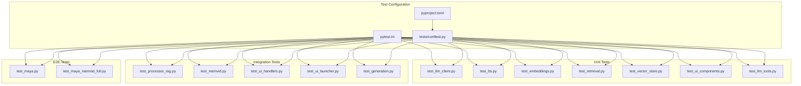
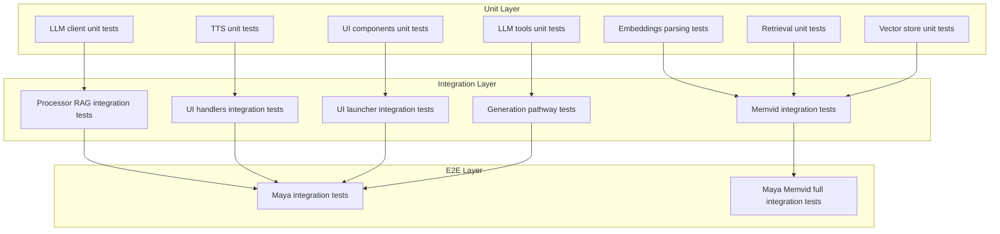
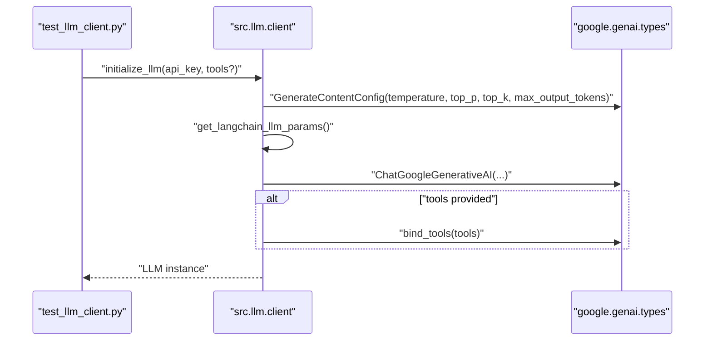
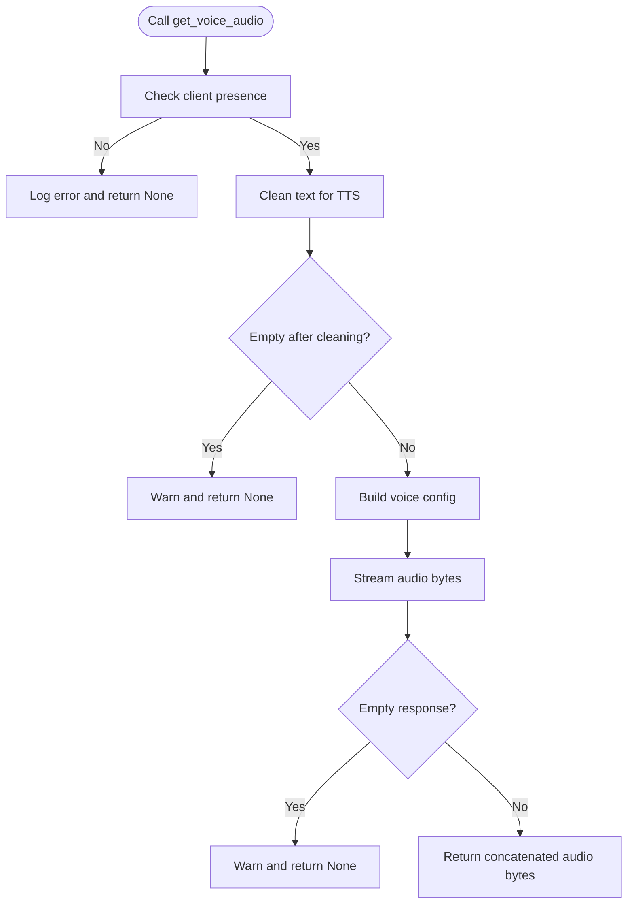
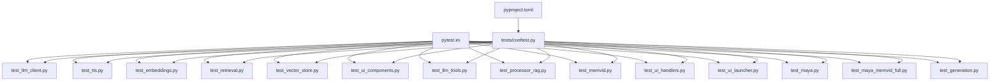

# Testing Strategy

<cite>
**Referenced Files in This Document**
- [pytest.ini](file://pytest.ini)
- [pyproject.toml](file://pyproject.toml)
- [conftest.py](file://tests/conftest.py)
- [test_maya.py](file://tests/test_maya.py)
- [test_maya_memvid_full.py](file://tests/test_maya_memvid_full.py)
- [test_memvid.py](file://tests/test_memvid.py)
- [test_processor_rag.py](file://tests/test_processor_rag.py)
- [test_llm_client.py](file://tests/test_llm_client.py)
- [test_llm_tools.py](file://tests/test_llm_tools.py)
- [test_tts.py](file://tests/test_tts.py)
- [test_embeddings.py](file://tests/test_embeddings.py)
- [test_generation.py](file://tests/test_generation.py)
- [test_retrieval.py](file://tests/test_retrieval.py)
- [test_vector_store.py](file://tests/test_vector_store.py)
- [test_ui_components.py](file://tests/test_ui_components.py)
- [test_ui_handlers.py](file://tests/test_ui_handlers.py)
- [test_ui_launcher.py](file://tests/test_ui_launcher.py)
- [test_config.py](file://tests/test_config.py)
- [client.py](file://src/llm/client.py)
- [embeddings.py](file://src/rag/embeddings.py)
</cite>

## Update Summary
**Changes Made**
- Enhanced test infrastructure section to reflect comprehensive google-genai SDK type mocking improvements
- Updated documentation of GenerateContentConfig and EmbedContentConfig classes with expanded parameter support
- Added detailed coverage of enhanced error handling class compatibility
- Expanded test coverage documentation for LLM configuration parameters including temperature, top_p, top_k, and max_output_tokens
- Updated mocking strategies to accommodate new SDK type configurations and improved error handling

## Table of Contents
1. [Introduction](#introduction)
2. [Project Structure](#project-structure)
3. [Core Components](#core-components)
4. [Architecture Overview](#architecture-overview)
5. [Detailed Component Analysis](#detailed-component-analysis)
6. [Dependency Analysis](#dependency-analysis)
7. [Performance Considerations](#performance-considerations)
8. [Troubleshooting Guide](#troubleshooting-guide)
9. [Conclusion](#conclusion)
10. [Appendices](#appendices)

## Introduction
This document describes MayaMCP's testing strategy, focusing on unit, integration, and end-to-end (E2E) testing. The project uses pytest with a structured configuration, custom markers for categorization, and a robust suite of fixtures and mocks. Tests target core areas including LLM interactions, RAG pipelines, audio synthesis, and the Gradio UI. The strategy emphasizes reliability, isolation of external dependencies, and maintainability through clear separation of concerns across test types.

**Updated** The test infrastructure has been comprehensively enhanced to accommodate new google-genai SDK patterns, specifically improved test fixtures that mock GenerateContentConfig and EmbedContentConfig classes with expanded parameter support for temperature, top_p, top_k, and max_output_tokens. The error handling class compatibility has been strengthened to ensure robust testing across different SDK versions.

## Project Structure
The repository organizes tests under the tests/ directory with per-feature modules and shared configuration via pytest.ini and pyproject.toml. Global test configuration and shims for optional third-party SDKs live in tests/conftest.py. The test suite covers:
- Unit tests for pure functions and isolated components
- Integration tests for component interactions and cross-module behavior
- E2E tests for full user workflows

**Diagram sources**
- [pytest.ini](file://pytest.ini#L1-L27)
- [pyproject.toml](file://pyproject.toml#L48-L64)
- [conftest.py](file://tests/conftest.py#L1-L181)

**Section sources**
- [pytest.ini](file://pytest.ini#L1-L27)
- [pyproject.toml](file://pyproject.toml#L48-L64)
- [conftest.py](file://tests/conftest.py#L1-L181)

## Core Components
MayaMCP's testing framework centers on:
- pytest configuration with strict markers and filtering
- Shared fixtures and environment shims for optional SDKs
- Custom markers for categorizing tests by scope and domain
- Coverage configuration for reporting and exclusions

Key configuration highlights:
- Strict marker enforcement and short traceback formatting
- Filtered warnings to reduce noise
- Custom markers for slow, integration, unit, memvid, rag, llm, ui
- Coverage source and omission rules

**Updated** The test infrastructure now includes comprehensive mocking of google-genai SDK types with enhanced parameter support, specifically GenerateContentConfig and EmbedContentConfig classes that mirror the real SDK's configuration capabilities including temperature, top_p, top_k, max_output_tokens, task_type, and output_dimensionality attributes.

**Section sources**
- [pytest.ini](file://pytest.ini#L7-L27)
- [pyproject.toml](file://pyproject.toml#L53-L83)
- [conftest.py](file://tests/conftest.py#L19-L181)

## Architecture Overview
The testing architecture separates concerns across three layers:
- Unit layer: Pure functions, parsers, and small units with deterministic behavior
- Integration layer: Component interactions, cross-module orchestration, and pipeline behavior
- E2E layer: End-to-end user workflows through the UI and LLM/RAG/audio stacks

**Diagram sources**
- [test_llm_client.py](file://tests/test_llm_client.py#L1-L422)
- [test_tts.py](file://tests/test_tts.py#L1-L503)
- [test_embeddings.py](file://tests/test_embeddings.py#L1-L70)
- [test_retrieval.py](file://tests/test_retrieval.py#L1-L374)
- [test_vector_store.py](file://tests/test_vector_store.py#L1-L318)
- [test_ui_components.py](file://tests/test_ui_components.py#L1-L334)
- [test_llm_tools.py](file://tests/test_llm_tools.py#L1-L704)
- [test_processor_rag.py](file://tests/test_processor_rag.py#L1-L83)
- [test_memvid.py](file://tests/test_memvid.py#L1-L123)
- [test_ui_handlers.py](file://tests/test_ui_handlers.py#L1-L441)
- [test_ui_launcher.py](file://tests/test_ui_launcher.py#L1-L417)
- [test_generation.py](file://tests/test_generation.py#L1-L186)
- [test_maya.py](file://tests/test_maya.py#L1-L245)
- [test_maya_memvid_full.py](file://tests/test_maya_memvid_full.py#L1-L250)

## Detailed Component Analysis

### Unit Tests: LLM Client
- Validates configuration, model selection, and parameter building
- Exercises API call behavior with mocked SDKs and error handling
- Includes retry behavior verification and logging assertions

**Updated** The LLM client tests now extensively use the enhanced GenerateContentConfig mocking to validate proper configuration mapping and API call patterns with the updated google-genai SDK. The tests cover all LLM configuration parameters including temperature, top_p, top_k, and max_output_tokens with comprehensive validation.

**Diagram sources**
- [test_llm_client.py](file://tests/test_llm_client.py#L61-L194)
- [client.py](file://src/llm/client.py#L69-L76)

**Section sources**
- [test_llm_client.py](file://tests/test_llm_client.py#L23-L194)
- [client.py](file://src/llm/client.py#L69-L76)

### Unit Tests: LLM Tools
- Tests comprehensive tool functionality including menu retrieval, recommendations, order management, and payment processing
- Validates flexible text matching for descriptive responses while maintaining semantic requirements
- Exercises complex business logic for order state management and payment workflows

**Section sources**
- [test_llm_tools.py](file://tests/test_llm_tools.py#L1-L704)

### Unit Tests: TTS and Audio
- Tests text cleaning, client initialization, and audio generation
- Verifies retryable exceptions and logging behavior
- Ensures graceful handling of empty inputs and API failures

**Diagram sources**
- [test_tts.py](file://tests/test_tts.py#L269-L460)

**Section sources**
- [test_tts.py](file://tests/test_tts.py#L18-L503)

### Unit Tests: Embeddings Parsing
- Validates parsing of diverse embedding API response shapes
- Ensures robust fallback to None on unexpected structures or exceptions

**Updated** The embeddings tests leverage the enhanced EmbedContentConfig mocking to validate proper embedding generation with task type configurations and batch processing capabilities, including comprehensive error handling for various SDK response formats.

**Section sources**
- [test_embeddings.py](file://tests/test_embeddings.py#L1-L70)
- [embeddings.py](file://src/rag/embeddings.py#L68-L100)

### Unit Tests: Generation Pathways
- Tests comprehensive generation pathways using google-genai SDK
- Validates prompt construction for both regular RAG and Memvid pipelines
- Ensures proper configuration parameter passing including temperature, top_p, top_k, and max_output_tokens

**Updated** The generation pathway tests now include extensive validation of LLM configuration parameters through the GenerateContentConfig class, ensuring proper parameter mapping and API call behavior across different pipeline types.

**Section sources**
- [test_generation.py](file://tests/test_generation.py#L1-L186)

### Unit Tests: Retrieval
- Tests retrieval of relevant passages with varied inputs and edge cases
- Handles exceptions and logs appropriately

**Section sources**
- [test_retrieval.py](file://tests/test_retrieval.py#L12-L374)

### Unit Tests: Vector Store
- Tests vector store initialization and search behavior
- Validates embedding generation, array conversions, and error handling

**Section sources**
- [test_vector_store.py](file://tests/test_vector_store.py#L18-L318)

### Unit Tests: UI Components
- Tests avatar setup with multiple failure modes and fallbacks
- Exercises HTTP requests, image processing, and logging

**Section sources**
- [test_ui_components.py](file://tests/test_ui_components.py#L9-L334)

### Integration Tests: Processor RAG Behavior
- Ensures RAG is short-circuited when components are missing
- Validates safe handling of non-sized RAG responses

**Section sources**
- [test_processor_rag.py](file://tests/test_processor_rag.py#L9-L83)

### Integration Tests: Memvid Pipeline
- Configurable rebuild behavior controlled by a session-scoped fixture
- Multi-query validation with centralized query configuration

**Section sources**
- [test_memvid.py](file://tests/test_memvid.py#L27-L117)
- [test_config.py](file://tests/test_config.py#L22-L151)

### Integration Tests: UI Handlers
- Validates end-to-end Gradio handler behavior including TTS, payment state, and overlays
- Handles exceptions and maintains safe state transitions

**Section sources**
- [test_ui_handlers.py](file://tests/test_ui_handlers.py#L7-L441)

### Integration Tests: UI Launcher
- Verifies Gradio interface construction, component properties, and event wiring
- Tests fallbacks and logging on avatar setup failures

**Section sources**
- [test_ui_launcher.py](file://tests/test_ui_launcher.py#L62-L417)

### E2E Tests: Maya Workflows
- Full integration test orchestrating LLM, RAG, and TTS in a realistic conversation
- Memvid-enabled E2E test validating order flow and state updates

**Section sources**
- [test_maya.py](file://tests/test_maya.py#L25-L245)
- [test_maya_memvid_full.py](file://tests/test_maya_memvid_full.py#L16-L248)

## Dependency Analysis
The test suite relies on:
- pytest configuration for discovery, markers, and warnings
- Global conftest for optional SDK stubs and session-scoped flags
- Per-feature modules for domain-specific tests

**Updated** The test infrastructure now includes comprehensive google-genai SDK type mocking through the conftest module, ensuring tests remain functional across different SDK versions and installations. The enhanced error handling class compatibility provides robust testing capabilities across various SDK implementations.

**Diagram sources**
- [pytest.ini](file://pytest.ini#L1-L27)
- [pyproject.toml](file://pyproject.toml#L48-L64)
- [conftest.py](file://tests/conftest.py#L1-L181)

**Section sources**
- [pytest.ini](file://pytest.ini#L1-L27)
- [pyproject.toml](file://pyproject.toml#L48-L64)
- [conftest.py](file://tests/conftest.py#L1-L181)

## Performance Considerations
- Use the slow marker to exclude heavy tests in fast CI runs
- Leverage the force-rebuild flag for Memvid to avoid repeated expensive initialization
- Prefer unit tests for hot-path functions; reserve integration/E2E tests for critical flows
- Mock external services to minimize flakiness and runtime variability

**Updated** The enhanced test infrastructure with comprehensive SDK type mocking ensures consistent performance across different environments while maintaining test reliability. The improved error handling class compatibility reduces test failures due to SDK version differences.

## Troubleshooting Guide
Common issues and resolutions:
- Missing API keys: Many tests skip when required keys are absent; ensure environment variables are set or use placeholders via conftest shims
- Optional SDKs not installed: conftest provides comprehensive stubs for google-generativeai and google.genai including GenerateContentConfig, EmbedContentConfig, and enhanced error class hierarchy to keep tests runnable
- Flaky network calls: Use pytest markers to deselect slow tests; rely on mocks for deterministic behavior
- Memvid rebuilds: Control via --force-rebuild or TEST_FORCE_REBUILD to refresh expensive stores
- Logging noise: Warnings are filtered globally; adjust filters if needed for debugging

**Updated** The troubleshooting guide now includes guidance on the comprehensive google-genai SDK mocking infrastructure, ensuring tests remain functional even when the actual SDK is not installed. The enhanced error handling class compatibility provides better error classification and debugging capabilities.

**Section sources**
- [conftest.py](file://tests/conftest.py#L19-L181)
- [test_memvid.py](file://tests/test_memvid.py#L27-L47)
- [pytest.ini](file://pytest.ini#L24-L27)

## Conclusion
MayaMCP's testing strategy balances comprehensiveness with reliability. The pytest-based framework, custom markers, and targeted fixtures enable efficient unit, integration, and E2E coverage. By isolating external dependencies, centralizing configuration, and structuring tests by domain, the suite remains maintainable and resilient to environmental variability.

**Updated** The comprehensive test infrastructure updates ensure the testing strategy remains robust against google-genai SDK evolution while maintaining backward compatibility and test reliability. The enhanced error handling class compatibility and expanded parameter support provide comprehensive coverage for modern LLM configuration requirements.

## Appendices

### Test Organization Patterns
- Unit tests: Small, deterministic, and highly isolated
- Integration tests: Cross-component behavior and pipeline correctness
- E2E tests: Realistic user workflows with mocked external services

**Section sources**
- [test_llm_client.py](file://tests/test_llm_client.py#L1-L422)
- [test_tts.py](file://tests/test_tts.py#L1-L503)
- [test_llm_tools.py](file://tests/test_llm_tools.py#L1-L704)
- [test_processor_rag.py](file://tests/test_processor_rag.py#L1-L83)
- [test_maya.py](file://tests/test_maya.py#L1-L245)

### Custom Markers Reference
- slow: Heavy tests excluded by default
- integration: Integration-level tests
- unit: Unit-level tests
- memvid: Memvid-specific tests
- rag: RAG-related tests
- llm: LLM-related tests
- ui: UI-related tests

**Section sources**
- [pytest.ini](file://pytest.ini#L16-L23)

### Mocking Strategies
- LLM APIs: Comprehensive patching of google.generativeai and google.genai SDKs to return deterministic responses, including enhanced GenerateContentConfig and EmbedContentConfig classes with full parameter support
- Payment services: Not represented in the provided tests; follow similar patterns by patching external calls
- Audio systems: Patch Cartesia client and audio streams to simulate success/failure paths

**Updated** The mocking strategies now include comprehensive coverage of the new google-genai SDK patterns, with enhanced test fixtures that mock GenerateContentConfig and EmbedContentConfig types to ensure compatibility with the latest SDK versions. The improved error handling class compatibility provides robust testing across different SDK implementations.

**Section sources**
- [conftest.py](file://tests/conftest.py#L99-L136)
- [test_tts.py](file://tests/test_tts.py#L216-L267)

### Test Data Management and Fixtures
- Centralized query configuration for Memvid tests
- Session-scoped flags controlling expensive rebuilds
- Fixture-driven environment setup for UI components
- Enhanced parameter validation for LLM configuration testing

**Section sources**
- [test_config.py](file://tests/test_config.py#L22-L151)
- [test_memvid.py](file://tests/test_memvid.py#L27-L47)
- [test_ui_components.py](file://tests/test_ui_components.py#L9-L334)

### Examples of Test Patterns
- Conversation flows: Validate response quality, history growth, and order state updates
- Payment processing: Not represented in the provided tests; apply similar patterns by mocking external payment calls
- RAG functionality: Short-circuit behavior, safe handling of non-sized responses, and multi-query validation
- UI interactions: Event wiring, component properties, and error fallbacks
- LLM configuration: Comprehensive parameter validation including temperature, top_p, top_k, and max_output_tokens

**Updated** The test patterns now include comprehensive coverage of LLM configuration parameter testing, ensuring proper validation of temperature, top_p, top_k, and max_output_tokens through the GenerateContentConfig class.

**Section sources**
- [test_maya.py](file://tests/test_maya.py#L176-L233)
- [test_maya_memvid_full.py](file://tests/test_maya_memvid_full.py#L102-L180)
- [test_processor_rag.py](file://tests/test_processor_rag.py#L27-L82)
- [test_ui_handlers.py](file://tests/test_ui_handlers.py#L15-L350)
- [test_ui_launcher.py](file://tests/test_ui_launcher.py#L78-L358)
- [test_generation.py](file://tests/test_generation.py#L56-L83)

### Test Coverage and CI
- Coverage configured to run against src and omit tests and caches
- Report excludes common boilerplate lines and focuses on meaningful coverage

**Section sources**
- [pyproject.toml](file://pyproject.toml#L66-L83)

### Enhanced Test Infrastructure Details
**New** The test infrastructure now includes comprehensive google-genai SDK type mocking with enhanced capabilities:

#### GenerateContentConfig Enhancements
- **Temperature Parameter**: Full support for temperature configuration with comprehensive validation
- **Top_p Parameter**: Proper top-p sampling configuration testing
- **Top_k Parameter**: Complete top-k token filtering validation
- **Max_output_tokens**: Maximum output token configuration support
- **Keyword Arguments**: Flexible parameter passing for future SDK extensions

#### EmbedContentConfig Enhancements  
- **Task Type Configuration**: Support for RETRIEVAL_DOCUMENT and other task types
- **Output Dimensionality**: Configurable embedding dimensionality settings
- **Batch Processing**: Enhanced support for batch embedding operations

#### Error Handling Class Compatibility
- **APIError Hierarchy**: Comprehensive error class inheritance mirroring real SDK structure
- **Common Aliases**: PermissionDeniedError, AuthenticationError, UnauthenticatedError support
- **Timeout Handling**: GenAITimeoutError alias for built-in TimeoutError compatibility
- **HTTP Status Codes**: Proper error classification for 429, 401, 403 status codes

#### Response Mocking
- **GenerateContentResponse**: Text attribute for API response validation
- **Client Methods**: models.generate_content and models.embed_content with proper response structures
- **Batch Embedding**: Support for both single and batch embedding operations

These enhancements ensure that tests remain functional regardless of the actual google-genai SDK installation status and provide consistent behavior across different SDK versions while maintaining comprehensive coverage of LLM configuration parameters.

**Section sources**
- [conftest.py](file://tests/conftest.py#L99-L136)
- [client.py](file://src/llm/client.py#L69-L76)
- [embeddings.py](file://src/rag/embeddings.py#L68-L100)