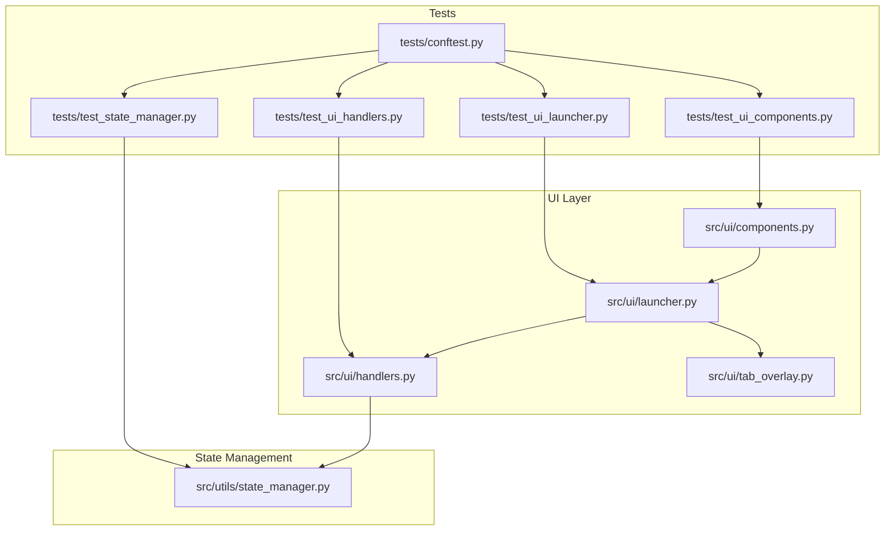
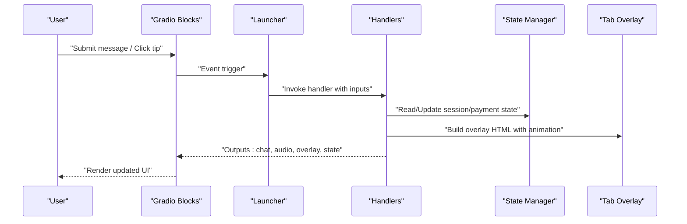
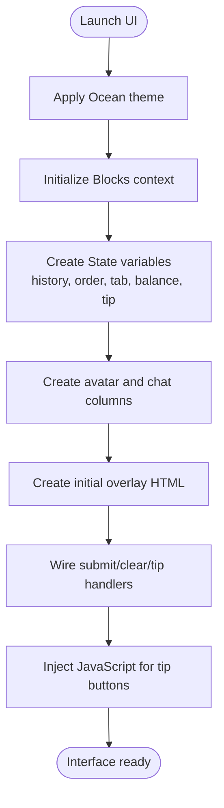
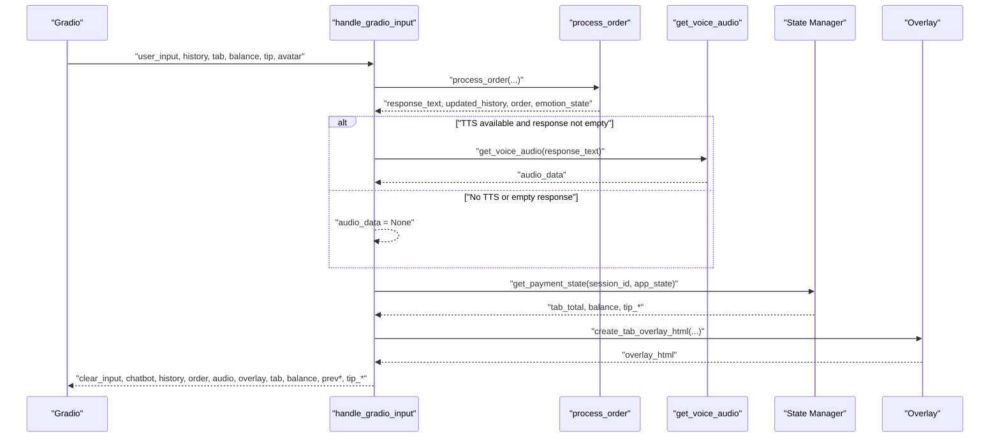
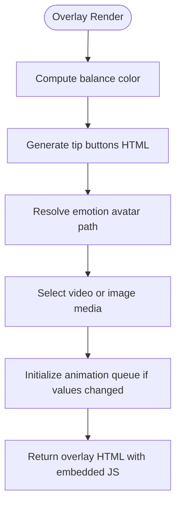
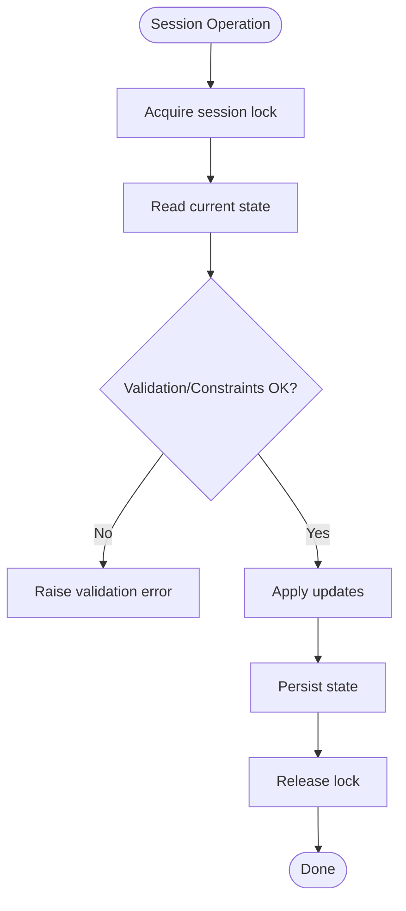
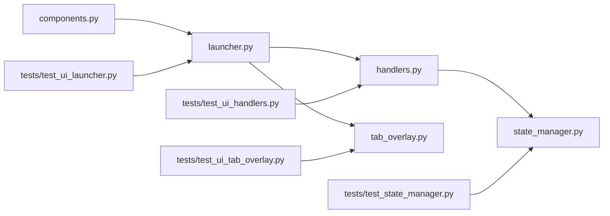

# UI Testing

<cite>
**Referenced Files in This Document**
- [README.md](file://README.md)
- [tests/test_ui_components.py](file://tests/test_ui_components.py)
- [tests/test_ui_handlers.py](file://tests/test_ui_handlers.py)
- [tests/test_ui_launcher.py](file://tests/test_ui_launcher.py)
- [tests/test_state_manager.py](file://tests/test_state_manager.py)
- [tests/conftest.py](file://tests/conftest.py)
- [src/ui/__init__.py](file://src/ui/__init__.py)
- [src/ui/components.py](file://src/ui/components.py)
- [src/ui/handlers.py](file://src/ui/handlers.py)
- [src/ui/launcher.py](file://src/ui/launcher.py)
- [src/ui/tab_overlay.py](file://src/ui/tab_overlay.py)
- [src/utils/state_manager.py](file://src/utils/state_manager.py)
- [docs/EMOTION_SYSTEM.md](file://docs/EMOTION_SYSTEM.md)
- [docs/ADR_001_AVATAR_VIDEO_FORMAT.md](file://docs/ADR_001_AVATAR_VIDEO_FORMAT.md)
</cite>

## Table of Contents
1. [Introduction](#introduction)
2. [Project Structure](#project-structure)
3. [Core Components](#core-components)
4. [Architecture Overview](#architecture-overview)
5. [Detailed Component Analysis](#detailed-component-analysis)
6. [Dependency Analysis](#dependency-analysis)
7. [Performance Considerations](#performance-considerations)
8. [Troubleshooting Guide](#troubleshooting-guide)
9. [Conclusion](#conclusion)
10. [Appendices](#appendices)

## Introduction
This document provides a comprehensive UI testing strategy for MayaMCP’s Gradio interface. It focuses on validating UI components, event handlers, and session context management. It explains test patterns for avatar animations, tab overlay functionality, and conversation flow interactions. It also details testing strategies for user input validation, state updates, and visual feedback mechanisms. Guidance is included for testing UI responsiveness, event handling correctness, and session state preservation, along with challenges specific to audio-visual interfaces, animation timing, and real-time updates. Finally, it offers advice on testing user workflows, validating UI consistency, and ensuring accessibility compliance in automated tests.

## Project Structure
MayaMCP organizes UI logic under src/ui with supporting state management in src/utils. The Gradio interface is constructed in src/ui/launcher.py and driven by event handlers in src/ui/handlers.py. The tab overlay and avatar animation logic live in src/ui/tab_overlay.py, while avatar asset setup is in src/ui/components.py. Tests reside under tests/ and exercise these modules with mocking and fixtures.

**Diagram sources**
- [src/ui/launcher.py](file://src/ui/launcher.py#L49-L354)
- [src/ui/handlers.py](file://src/ui/handlers.py#L23-L392)
- [src/ui/tab_overlay.py](file://src/ui/tab_overlay.py#L151-L485)
- [src/ui/components.py](file://src/ui/components.py#L11-L55)
- [src/utils/state_manager.py](file://src/utils/state_manager.py#L510-L640)
- [tests/test_ui_launcher.py](file://tests/test_ui_launcher.py#L78-L138)
- [tests/test_ui_handlers.py](file://tests/test_ui_handlers.py#L15-L80)
- [tests/test_ui_components.py](file://tests/test_ui_components.py#L15-L50)
- [tests/test_state_manager.py](file://tests/test_state_manager.py#L53-L81)
- [tests/conftest.py](file://tests/conftest.py#L10-L88)

**Section sources**
- [README.md](file://README.md#L1-L40)
- [src/ui/__init__.py](file://src/ui/__init__.py#L1-L12)

## Core Components
- UI Launcher: Builds the Gradio Blocks layout, wires events, and manages overlay HTML and avatar state.
- Handlers: Implement Gradio event callbacks for input submission, clear actions, and tip button interactions.
- Tab Overlay: Generates animated HTML overlays with balance and tab counters, tip buttons, and emotion-based avatar rendering.
- State Manager: Provides thread-safe session state, payment state, and atomic operations for balances and tabs.
- Avatar Components: Handles avatar asset setup and fallbacks.

Key responsibilities for testing:
- Validate UI construction and event wiring.
- Verify state updates and payment calculations.
- Confirm animation queue behavior and visual feedback.
- Ensure error handling preserves UI state and provides graceful fallbacks.

**Section sources**
- [src/ui/launcher.py](file://src/ui/launcher.py#L49-L354)
- [src/ui/handlers.py](file://src/ui/handlers.py#L23-L392)
- [src/ui/tab_overlay.py](file://src/ui/tab_overlay.py#L151-L485)
- [src/utils/state_manager.py](file://src/utils/state_manager.py#L510-L640)
- [src/ui/components.py](file://src/ui/components.py#L11-L55)

## Architecture Overview
The UI architecture centers around Gradio Blocks with stateful components and JavaScript-driven interactions. The launcher composes the layout, binds event handlers, and injects overlay HTML. Handlers orchestrate conversation processing, TTS, and state updates. The tab overlay renders animated UI elements and manages tip selection. State is persisted via a thread-safe store with atomic operations.

**Diagram sources**
- [src/ui/launcher.py](file://src/ui/launcher.py#L155-L230)
- [src/ui/handlers.py](file://src/ui/handlers.py#L23-L184)
- [src/ui/tab_overlay.py](file://src/ui/tab_overlay.py#L151-L485)
- [src/utils/state_manager.py](file://src/utils/state_manager.py#L510-L640)

## Detailed Component Analysis

### UI Launcher Testing
Focus areas:
- Layout construction and component properties.
- Event handler wiring and argument/return shapes.
- Avatar overlay initialization and fallback behavior.
- JavaScript injection for tip button interactions.

Recommended tests:
- Verify Blocks theme, markdown, State variables, Row/Column structure, and component counts.
- Assert component properties (elem_id, label, height, autoplay, streaming, format).
- Validate event handler signatures and output counts for submit/clear/tip events.
- Confirm overlay HTML is generated with correct initial values and fallback paths.

**Diagram sources**
- [src/ui/launcher.py](file://src/ui/launcher.py#L84-L122)
- [src/ui/launcher.py](file://src/ui/launcher.py#L155-L230)
- [src/ui/launcher.py](file://src/ui/launcher.py#L300-L354)

**Section sources**
- [tests/test_ui_launcher.py](file://tests/test_ui_launcher.py#L78-L138)
- [tests/test_ui_launcher.py](file://tests/test_ui_launcher.py#L152-L194)
- [tests/test_ui_launcher.py](file://tests/test_ui_launcher.py#L210-L286)
- [tests/test_ui_launcher.py](file://tests/test_ui_launcher.py#L300-L358)
- [tests/test_ui_launcher.py](file://tests/test_ui_launcher.py#L373-L416)

### Handlers Testing
Focus areas:
- Input processing pipeline and TTS integration.
- Error handling and graceful fallbacks.
- Tip button click behavior and toggle semantics.
- Session and payment state updates.

Recommended tests:
- Validate successful processing with TTS and overlay generation.
- Simulate missing TTS client and empty/whitespace responses.
- Exercise exception paths in processing and TTS generation.
- Verify tip selection toggles and notification messages.
- Confirm state resets on clear and error scenarios.

**Diagram sources**
- [src/ui/handlers.py](file://src/ui/handlers.py#L23-L184)
- [src/ui/handlers.py](file://src/ui/handlers.py#L218-L391)
- [src/utils/state_manager.py](file://src/utils/state_manager.py#L627-L640)
- [src/ui/tab_overlay.py](file://src/ui/tab_overlay.py#L151-L485)

**Section sources**
- [tests/test_ui_handlers.py](file://tests/test_ui_handlers.py#L15-L80)
- [tests/test_ui_handlers.py](file://tests/test_ui_handlers.py#L85-L132)
- [tests/test_ui_handlers.py](file://tests/test_ui_handlers.py#L138-L185)
- [tests/test_ui_handlers.py](file://tests/test_ui_handlers.py#L191-L239)
- [tests/test_ui_handlers.py](file://tests/test_ui_handlers.py#L244-L290)
- [tests/test_ui_handlers.py](file://tests/test_ui_handlers.py#L296-L350)
- [tests/test_ui_handlers.py](file://tests/test_ui_handlers.py#L356-L403)
- [tests/test_ui_handlers.py](file://tests/test_ui_handlers.py#L408-L441)

### Tab Overlay and Avatar Animation Testing
Focus areas:
- Balance color thresholds and tip button visibility.
- Animation queue enqueue/merge/cancel behavior.
- Tip button selection and toggle logic.
- Emotion-based avatar switching and asset validation.

Recommended tests:
- Validate balance color mapping across thresholds.
- Confirm tip buttons HTML generation and selection highlighting.
- Mirror JavaScript AnimationQueue behavior in Python for property-based testing.
- Verify emotion parsing and avatar path resolution with asset existence checks.
- Ensure fallback behavior when assets are missing.

**Diagram sources**
- [src/ui/tab_overlay.py](file://src/ui/tab_overlay.py#L24-L44)
- [src/ui/tab_overlay.py](file://src/ui/tab_overlay.py#L46-L116)
- [src/ui/tab_overlay.py](file://src/ui/tab_overlay.py#L151-L485)
- [src/ui/handlers.py](file://src/ui/handlers.py#L140-L176)

**Section sources**
- [src/ui/tab_overlay.py](file://src/ui/tab_overlay.py#L24-L44)
- [src/ui/tab_overlay.py](file://src/ui/tab_overlay.py#L46-L116)
- [src/ui/tab_overlay.py](file://src/ui/tab_overlay.py#L151-L485)
- [src/ui/handlers.py](file://src/ui/handlers.py#L140-L176)
- [docs/EMOTION_SYSTEM.md](file://docs/EMOTION_SYSTEM.md#L28-L38)
- [docs/ADR_001_AVATAR_VIDEO_FORMAT.md](file://docs/ADR_001_AVATAR_VIDEO_FORMAT.md#L10-L22)

### State Manager and Session Context Testing
Focus areas:
- Thread-safe session locks and cleanup.
- Atomic operations for order updates and payment completion.
- Payment state validation and transitions.
- Legacy backward compatibility and default session handling.

Recommended tests:
- Verify initialize/reset behavior and default state templates.
- Validate atomic_order_update with sufficient funds and version checks.
- Confirm set_tip toggle behavior and tip calculation.
- Test payment state validation and invalid transitions.
- Ensure cleanup_expired_session_locks operates safely.

**Diagram sources**
- [src/utils/state_manager.py](file://src/utils/state_manager.py#L510-L640)
- [src/utils/state_manager.py](file://src/utils/state_manager.py#L685-L757)
- [src/utils/state_manager.py](file://src/utils/state_manager.py#L780-L800)

**Section sources**
- [tests/test_state_manager.py](file://tests/test_state_manager.py#L53-L81)
- [tests/test_state_manager.py](file://tests/test_state_manager.py#L93-L110)
- [tests/test_state_manager.py](file://tests/test_state_manager.py#L111-L158)
- [tests/test_state_manager.py](file://tests/test_state_manager.py#L159-L181)
- [tests/test_state_manager.py](file://tests/test_state_manager.py#L182-L199)
- [src/utils/state_manager.py](file://src/utils/state_manager.py#L510-L640)
- [src/utils/state_manager.py](file://src/utils/state_manager.py#L685-L757)
- [src/utils/state_manager.py](file://src/utils/state_manager.py#L780-L800)

### Avatar Component Testing
Focus areas:
- Avatar download and save behavior with fallbacks.
- Error handling for HTTP failures, image processing errors, and save exceptions.
- Logging behavior across success and failure paths.

Recommended tests:
- Successful download and save with default and custom URLs.
- Fallback to blank avatar on HTTP errors and exceptions.
- Save exceptions and invalid image content handling.
- Logging verification for success and error paths.

**Section sources**
- [tests/test_ui_components.py](file://tests/test_ui_components.py#L15-L50)
- [tests/test_ui_components.py](file://tests/test_ui_components.py#L54-L81)
- [tests/test_ui_components.py](file://tests/test_ui_components.py#L84-L110)
- [tests/test_ui_components.py](file://tests/test_ui_components.py#L113-L137)
- [tests/test_ui_components.py](file://tests/test_ui_components.py#L141-L176)
- [tests/test_ui_components.py](file://tests/test_ui_components.py#L180-L210)
- [tests/test_ui_components.py](file://tests/test_ui_components.py#L214-L244)
- [tests/test_ui_components.py](file://tests/test_ui_components.py#L248-L274)
- [tests/test_ui_components.py](file://tests/test_ui_components.py#L279-L334)

## Dependency Analysis
The UI stack exhibits clear separation of concerns:
- Launcher depends on Handlers, Tab Overlay, and Avatar setup.
- Handlers depend on State Manager and Tab Overlay for UI updates.
- Tab Overlay depends on State Manager for payment values and emotion parsing.
- Tests rely on mocks and fixtures to isolate dependencies.

**Diagram sources**
- [src/ui/launcher.py](file://src/ui/launcher.py#L49-L354)
- [src/ui/handlers.py](file://src/ui/handlers.py#L23-L392)
- [src/ui/tab_overlay.py](file://src/ui/tab_overlay.py#L151-L485)
- [src/ui/components.py](file://src/ui/components.py#L11-L55)
- [src/utils/state_manager.py](file://src/utils/state_manager.py#L510-L640)
- [tests/test_ui_launcher.py](file://tests/test_ui_launcher.py#L78-L138)
- [tests/test_ui_handlers.py](file://tests/test_ui_handlers.py#L15-L80)
- [tests/test_state_manager.py](file://tests/test_state_manager.py#L53-L81)

**Section sources**
- [src/ui/launcher.py](file://src/ui/launcher.py#L49-L354)
- [src/ui/handlers.py](file://src/ui/handlers.py#L23-L392)
- [src/ui/tab_overlay.py](file://src/ui/tab_overlay.py#L151-L485)
- [src/utils/state_manager.py](file://src/utils/state_manager.py#L510-L640)

## Performance Considerations
- Animation queue throttling: The overlay’s AnimationQueue collapses rapid updates within a short window and caps queue depth to prevent UI thrashing.
- TTS latency: Tests should simulate network delays and TTS failures to validate graceful degradation.
- State contention: Atomic operations and session locks minimize race conditions; tests should validate concurrent access behavior.
- Asset loading: Avatar and emotion assets should be cached or preloaded to reduce UI stalls.

[No sources needed since this section provides general guidance]

## Troubleshooting Guide
Common UI testing issues and resolutions:
- Missing avatar assets: Ensure fallback avatar is rendered and overlay remains stable.
- Animation glitches: Validate that the animation queue merges frequent updates and cancels stale animations.
- Tip button state: Confirm toggle behavior and that notifications are generated correctly.
- Session resets: Verify that clear actions reset both UI and backend state consistently.
- Logging and error propagation: Use mock logs to assert correct warning/error messages during failures.

**Section sources**
- [tests/test_ui_components.py](file://tests/test_ui_components.py#L84-L110)
- [tests/test_ui_components.py](file://tests/test_ui_components.py#L113-L137)
- [src/ui/tab_overlay.py](file://src/ui/tab_overlay.py#L307-L483)
- [src/ui/handlers.py](file://src/ui/handlers.py#L186-L216)
- [tests/test_ui_handlers.py](file://tests/test_ui_handlers.py#L408-L441)

## Conclusion
The UI testing strategy leverages targeted unit tests with comprehensive mocking to validate Gradio event flows, state updates, and visual feedback. By focusing on animation queues, session locks, and emotion-based avatar transitions, teams can ensure robustness, responsiveness, and consistency across user interactions. The provided patterns and diagrams offer a blueprint for extending tests to cover new features and edge cases.

[No sources needed since this section summarizes without analyzing specific files]

## Appendices

### Accessibility Compliance Guidance
- Keyboard navigation: Ensure Textbox and Button components are reachable via Tab/Enter.
- Screen reader labels: Use elem_id and label attributes for proper announcements.
- Contrast ratios: Validate balance color thresholds meet WCAG guidelines.
- Autoplay controls: Respect autoplay settings and provide user controls for audio.

[No sources needed since this section provides general guidance]

### Test Execution and Configuration
- Use pytest with coverage and verbose modes for detailed reporting.
- Leverage conftest fixtures to stub optional SDKs and maintain deterministic test runs.
- Run UI-specific tests in isolation to avoid external API dependencies.

**Section sources**
- [README.md](file://README.md#L231-L280)
- [tests/conftest.py](file://tests/conftest.py#L10-L88)