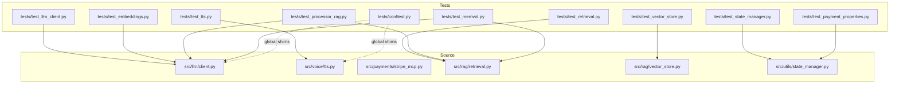
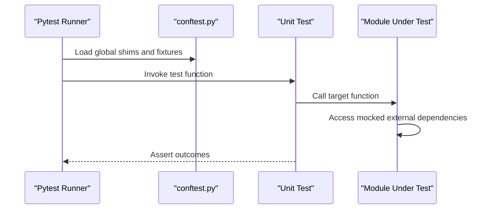
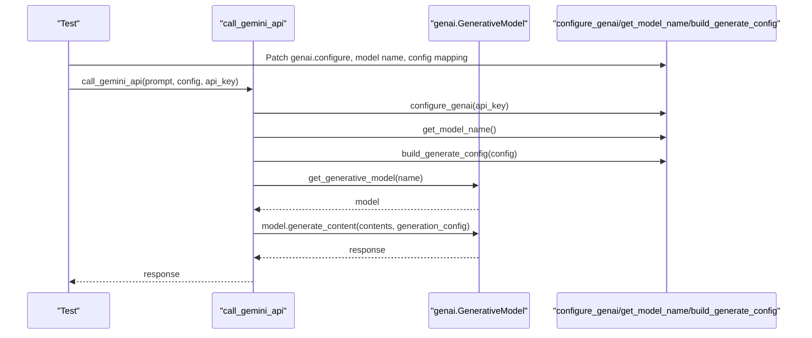
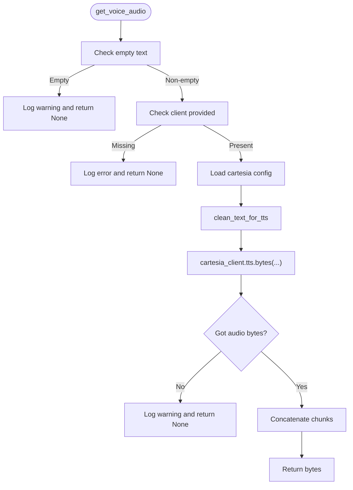
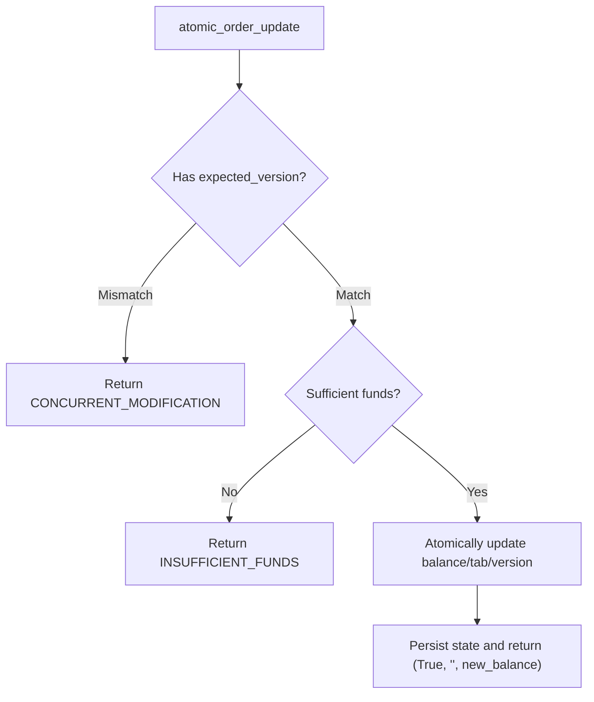
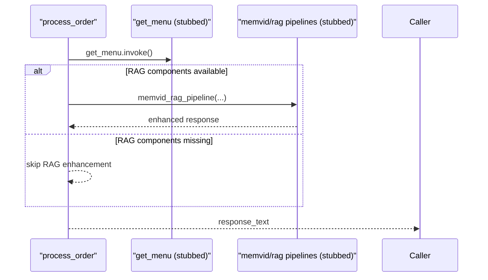
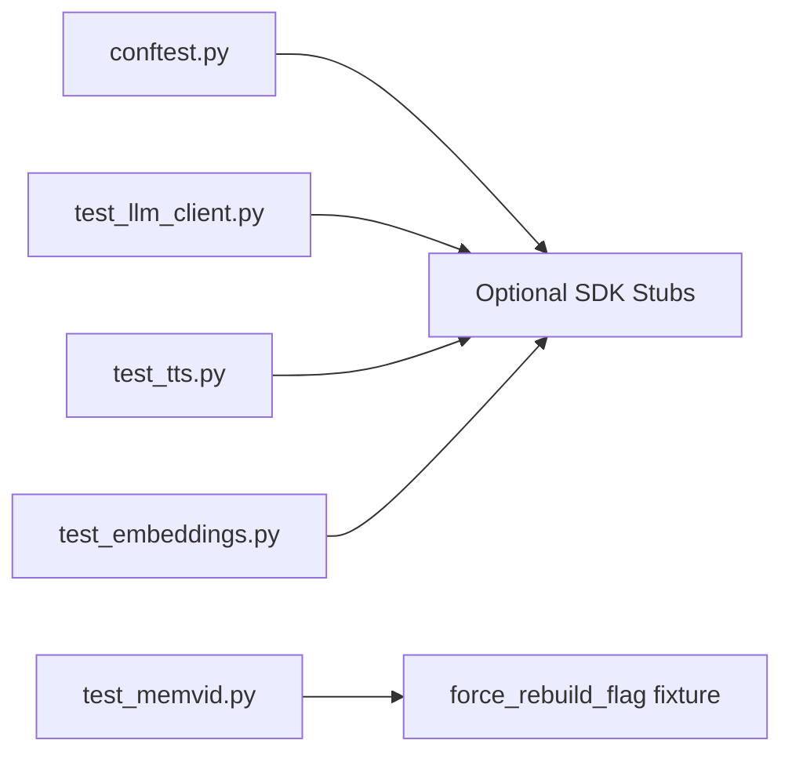

# Unit Testing

<cite>
**Referenced Files in This Document**
- [pytest.ini](file://pytest.ini)
- [conftest.py](file://tests/conftest.py)
- [client.py](file://src/llm/client.py)
- [test_llm_client.py](file://tests/test_llm_client.py)
- [tts.py](file://src/voice/tts.py)
- [test_tts.py](file://tests/test_tts.py)
- [stripe_mcp.py](file://src/payments/stripe_mcp.py)
- [test_embeddings.py](file://tests/test_embeddings.py)
- [retrieval.py](file://src/rag/retrieval.py)
- [test_retrieval.py](file://tests/test_retrieval.py)
- [vector_store.py](file://src/rag/vector_store.py)
- [test_vector_store.py](file://tests/test_vector_store.py)
- [state_manager.py](file://src/utils/state_manager.py)
- [test_state_manager.py](file://tests/test_state_manager.py)
- [test_processor_rag.py](file://tests/test_processor_rag.py)
- [test_memvid.py](file://tests/test_memvid.py)
- [test_payment_properties.py](file://tests/test_payment_properties.py)
</cite>

## Table of Contents
1. [Introduction](#introduction)
2. [Project Structure](#project-structure)
3. [Core Components](#core-components)
4. [Architecture Overview](#architecture-overview)
5. [Detailed Component Analysis](#detailed-component-analysis)
6. [Dependency Analysis](#dependency-analysis)
7. [Performance Considerations](#performance-considerations)
8. [Troubleshooting Guide](#troubleshooting-guide)
9. [Conclusion](#conclusion)

## Introduction
This document describes unit testing practices for MayaMCP with a focus on isolated, repeatable tests for individual components. It covers pytest-based patterns, mock strategies for external dependencies (Google Gemini, Stripe, audio systems), test isolation, fixtures, assertion styles, and robust coverage of conversation processing, LLM client functionality, payment operations, RAG systems, and utility functions. Guidance is included for naming conventions, parameterized testing, and maintaining test independence.

## Project Structure
The repository organizes tests under the tests/ directory and targets modules under src/. Pytest configuration is centralized in pytest.ini, and cross-cutting test infrastructure resides in tests/conftest.py. The tests directory includes:
- LLM client tests
- TTS tests
- Payment and state manager tests
- RAG retrieval and vector store tests
- Memvid integration tests
- Property-based tests for payment state invariants

**Diagram sources**
- [pytest.ini](file://pytest.ini#L1-L27)
- [conftest.py](file://tests/conftest.py#L1-L130)
- [client.py](file://src/llm/client.py#L1-L211)
- [tts.py](file://src/voice/tts.py#L1-L200)
- [stripe_mcp.py](file://src/payments/stripe_mcp.py#L1-L475)
- [retrieval.py](file://src/rag/retrieval.py#L1-L374)
- [vector_store.py](file://src/rag/vector_store.py#L1-L318)
- [state_manager.py](file://src/utils/state_manager.py#L1-L814)

**Section sources**
- [pytest.ini](file://pytest.ini#L1-L27)
- [conftest.py](file://tests/conftest.py#L1-L130)

## Core Components
- LLM client: Google Gemini integration, model configuration, and retryable API calls.
- TTS: Cartesia text-to-speech with retry logic and text cleaning.
- Payments: Stripe MCP client with availability probing, idempotent link creation, and polling.
- RAG: Retrieval and vector store utilities for document search and similarity.
- State manager: Atomic order updates, payment state transitions, and thread-safe locking.
- Processor RAG: Conversation processor integration points and guardrails for missing components.

**Section sources**
- [client.py](file://src/llm/client.py#L1-L211)
- [tts.py](file://src/voice/tts.py#L1-L200)
- [stripe_mcp.py](file://src/payments/stripe_mcp.py#L1-L475)
- [retrieval.py](file://src/rag/retrieval.py#L1-L374)
- [vector_store.py](file://src/rag/vector_store.py#L1-L318)
- [state_manager.py](file://src/utils/state_manager.py#L1-L814)

## Architecture Overview
The tests isolate external dependencies using:
- Monkeypatched imports for optional SDKs (e.g., google.generativeai).
- Mocks for external services (LLM, TTS, Stripe).
- Fixtures for expensive resources (e.g., Memvid store rebuild control).

**Diagram sources**
- [conftest.py](file://tests/conftest.py#L1-L130)
- [test_llm_client.py](file://tests/test_llm_client.py#L1-L442)
- [test_tts.py](file://tests/test_tts.py#L1-L503)

## Detailed Component Analysis

### LLM Client Testing
- Strategy: Patch external SDK calls and configuration functions to avoid network calls.
- Isolation: Use autouse fixtures and monkeypatch to reset global flags.
- Assertions: Validate call signatures, return values, and error propagation.
- Edge cases: Rate limits, authentication errors, timeouts, and retry behavior.

**Diagram sources**
- [client.py](file://src/llm/client.py#L130-L211)
- [test_llm_client.py](file://tests/test_llm_client.py#L196-L383)

**Section sources**
- [client.py](file://src/llm/client.py#L1-L211)
- [test_llm_client.py](file://tests/test_llm_client.py#L1-L442)

### TTS Testing
- Strategy: Mock Cartesia client initialization and TTS generator to avoid network calls.
- Assertions: Validate text cleaning, voice configuration, and audio byte concatenation.
- Edge cases: Empty input, missing client, empty response, retryable exceptions, and logging.

**Diagram sources**
- [tts.py](file://src/voice/tts.py#L140-L200)
- [test_tts.py](file://tests/test_tts.py#L269-L503)

**Section sources**
- [tts.py](file://src/voice/tts.py#L1-L200)
- [test_tts.py](file://tests/test_tts.py#L1-L503)

### Payment Operations Testing
- Strategy: Use property-based tests for state invariants and parameterized tests for edge cases.
- Fixtures: Control expensive Memvid rebuilds via a session-scoped flag.
- Assertions: Validate balance deduction, insufficient funds rejection, state preservation, tab accumulation, and payment completion resets.

**Diagram sources**
- [state_manager.py](file://src/utils/state_manager.py#L685-L757)
- [test_payment_properties.py](file://tests/test_payment_properties.py#L59-L158)

**Section sources**
- [state_manager.py](file://src/utils/state_manager.py#L685-L814)
- [test_state_manager.py](file://tests/test_state_manager.py#L1-L370)
- [test_payment_properties.py](file://tests/test_payment_properties.py#L1-L800)

### RAG Systems Testing
- Strategy: Mock pipelines and retrievers to test conversation processor behavior without external dependencies.
- Assertions: Guardrails for missing components, non-sized pipeline results, and graceful fallbacks.

**Diagram sources**
- [test_processor_rag.py](file://tests/test_processor_rag.py#L17-L83)

**Section sources**
- [test_processor_rag.py](file://tests/test_processor_rag.py#L1-L83)

### Embedding Parsing Paths
- Strategy: Patch google.generativeai.embed_content to return various shapes and error conditions.
- Assertions: Validate parsing of different response structures and error handling.

**Section sources**
- [test_embeddings.py](file://tests/test_embeddings.py#L1-L75)

### Retrieval Utilities Testing
- Strategy: Mock search_similar_documents to validate argument propagation and error handling.
- Assertions: Validate default parameters, exception handling, and logging behavior.

**Section sources**
- [test_retrieval.py](file://tests/test_retrieval.py#L1-L374)

### Vector Store Testing
- Strategy: Mock embedding generation and FAISS index to test initialization and search behavior.
- Assertions: Validate embedding array conversion, out-of-bounds handling, and default parameters.

**Section sources**
- [test_vector_store.py](file://tests/test_vector_store.py#L1-L318)

## Dependency Analysis
- External SDKs: Tests rely on optional third-party SDKs (google.generativeai, cartesia). conftest.py provides minimal stubs when SDKs are absent.
- Internal dependencies: Tests import modules directly and patch only the necessary parts to avoid side effects.
- Fixtures: A session-scoped flag controls expensive resource rebuilds (e.g., Memvid store), enabling fast CI runs and developer overrides.

**Diagram sources**
- [conftest.py](file://tests/conftest.py#L1-L130)
- [test_memvid.py](file://tests/test_memvid.py#L1-L123)

**Section sources**
- [conftest.py](file://tests/conftest.py#L1-L130)
- [test_memvid.py](file://tests/test_memvid.py#L1-L123)

## Performance Considerations
- Minimize external calls: Prefer mocks and stubs to keep tests fast and deterministic.
- Use parameterized tests: Reduce duplication and increase coverage breadth.
- Avoid heavy fixtures: Use lazy initialization and scoped fixtures to reduce startup overhead.
- Logging assertions: Confirm logging behavior without impacting performance.

## Troubleshooting Guide
- Missing SDKs: conftest.py injects stubs for google.generativeai and related types to enable local testing without installing optional packages.
- Flaky network tests: Use tenacity-based retry decorators in production code; in tests, mock or patch to eliminate flakiness.
- Concurrency issues: Use thread-safe session locks and validate optimistic locking behavior in state manager tests.
- Assertion patterns: Prefer asserting call counts and arguments for mocked external calls; assert return values and logs for internal behavior.

**Section sources**
- [conftest.py](file://tests/conftest.py#L1-L130)
- [state_manager.py](file://src/utils/state_manager.py#L194-L283)

## Conclusion
MayaMCP’s unit tests emphasize isolation, determinism, and comprehensive coverage of critical behaviors. By strategically mocking external dependencies, leveraging fixtures, and applying robust assertion patterns, the suite ensures reliable component behavior across conversation processing, LLM interactions, payment operations, RAG pipelines, and utility functions. Adhering to the documented patterns will help maintain test quality and confidence as the system evolves.