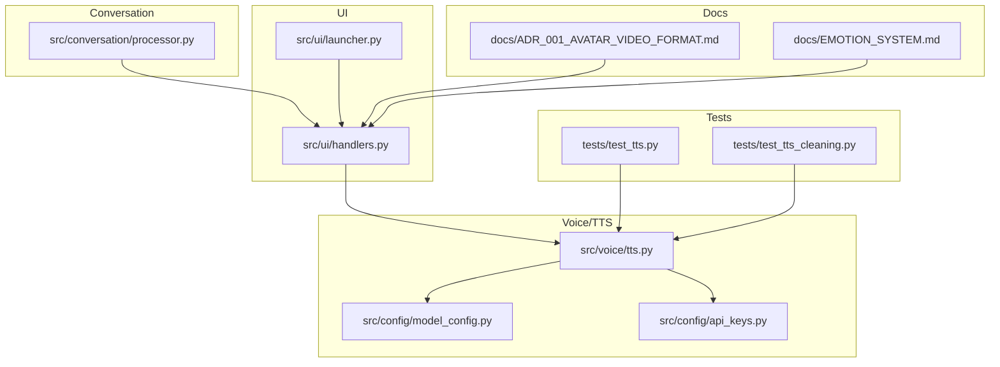
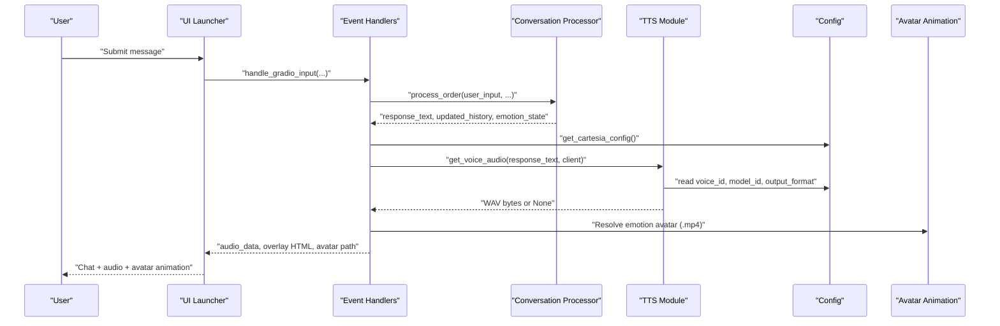
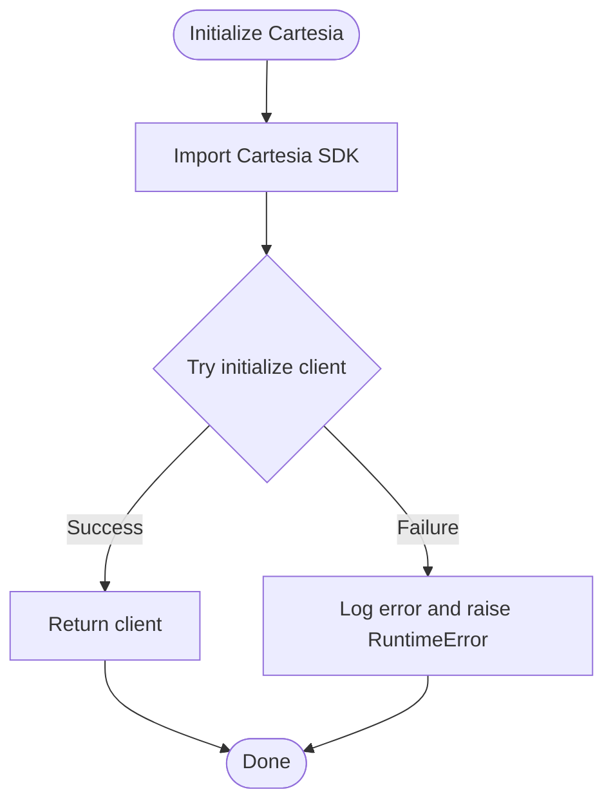
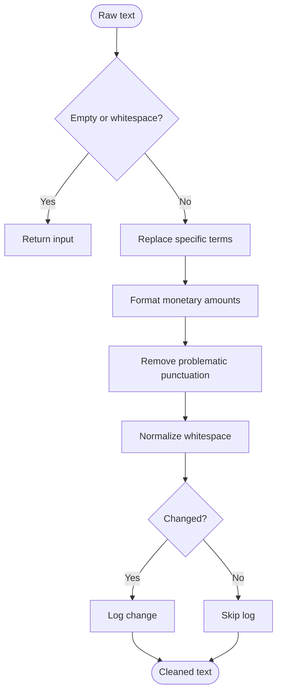
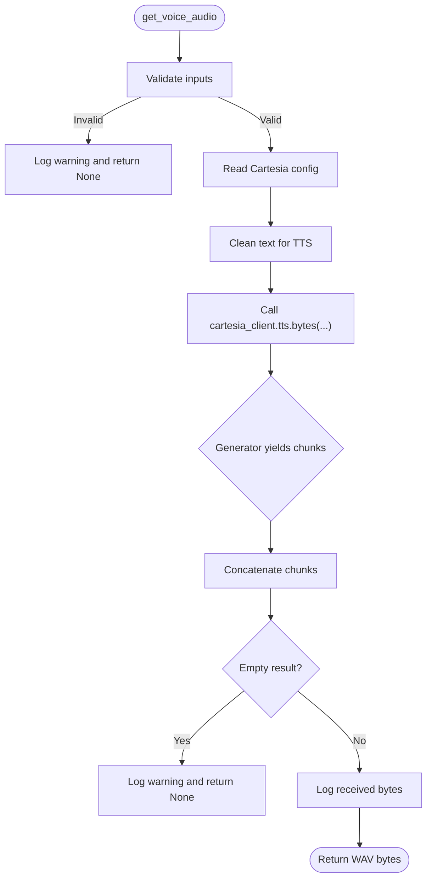
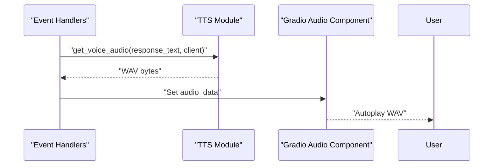
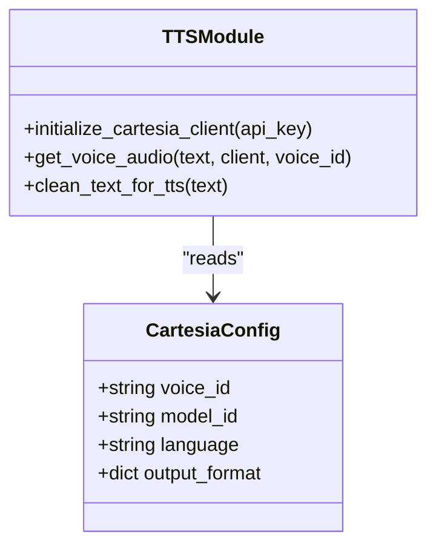
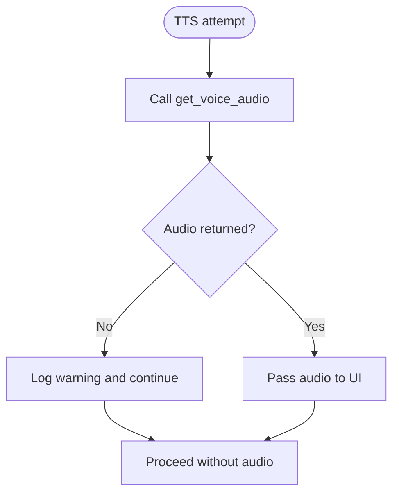
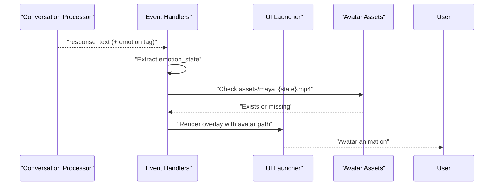
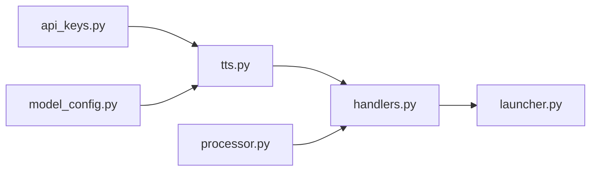

# Text-to-Speech System

<cite>
**Referenced Files in This Document**
- [tts.py](file://src/voice/tts.py)
- [model_config.py](file://src/config/model_config.py)
- [api_keys.py](file://src/config/api_keys.py)
- [handlers.py](file://src/ui/handlers.py)
- [processor.py](file://src/conversation/processor.py)
- [launcher.py](file://src/ui/launcher.py)
- [test_tts.py](file://tests/test_tts.py)
- [test_tts_cleaning.py](file://tests/test_tts_cleaning.py)
- [errors.py](file://src/utils/errors.py)
- [ADR_001_AVATAR_VIDEO_FORMAT.md](file://docs/ADR_001_AVATAR_VIDEO_FORMAT.md)
- [EMOTION_SYSTEM.md](file://docs/EMOTION_SYSTEM.md)
</cite>

## Table of Contents
1. [Introduction](#introduction)
2. [Project Structure](#project-structure)
3. [Core Components](#core-components)
4. [Architecture Overview](#architecture-overview)
5. [Detailed Component Analysis](#detailed-component-analysis)
6. [Dependency Analysis](#dependency-analysis)
7. [Performance Considerations](#performance-considerations)
8. [Troubleshooting Guide](#troubleshooting-guide)
9. [Conclusion](#conclusion)

## Introduction
This document describes MayaMCP’s text-to-speech (TTS) system with a focus on Cartesia integration and audio enhancement. It covers client configuration, voice selection, audio quality settings, streaming audio delivery for real-time conversation, text normalization, prosody control, fallback mechanisms, and the coordination between text responses, audio playback timing, and visual avatar animations.

## Project Structure
The TTS system spans several modules:
- Voice/TTS: Cartesia client initialization, text normalization, audio synthesis, and retry logic
- Config: Cartesia defaults and API key management
- UI: Event handlers that orchestrate LLM processing, TTS generation, and avatar animation
- Conversation: Intent detection and response composition that feeds TTS
- Tests: Unit tests validating text cleaning and TTS behavior
- Docs: Decisions around avatar video format and emotion system state persistence

**Diagram sources**
- [tts.py](file://src/voice/tts.py#L1-L200)
- [model_config.py](file://src/config/model_config.py#L61-L77)
- [api_keys.py](file://src/config/api_keys.py#L10-L51)
- [handlers.py](file://src/ui/handlers.py#L23-L184)
- [processor.py](file://src/conversation/processor.py#L73-L443)
- [launcher.py](file://src/ui/launcher.py#L49-L354)
- [ADR_001_AVATAR_VIDEO_FORMAT.md](file://docs/ADR_001_AVATAR_VIDEO_FORMAT.md#L1-L27)
- [EMOTION_SYSTEM.md](file://docs/EMOTION_SYSTEM.md#L28-L51)
- [test_tts.py](file://tests/test_tts.py#L1-L200)
- [test_tts_cleaning.py](file://tests/test_tts_cleaning.py#L1-L123)

**Section sources**
- [tts.py](file://src/voice/tts.py#L1-L200)
- [model_config.py](file://src/config/model_config.py#L61-L77)
- [api_keys.py](file://src/config/api_keys.py#L10-L51)
- [handlers.py](file://src/ui/handlers.py#L23-L184)
- [processor.py](file://src/conversation/processor.py#L73-L443)
- [launcher.py](file://src/ui/launcher.py#L49-L354)
- [ADR_001_AVATAR_VIDEO_FORMAT.md](file://docs/ADR_001_AVATAR_VIDEO_FORMAT.md#L1-L27)
- [EMOTION_SYSTEM.md](file://docs/EMOTION_SYSTEM.md#L28-L51)
- [test_tts.py](file://tests/test_tts.py#L1-L200)
- [test_tts_cleaning.py](file://tests/test_tts_cleaning.py#L1-L123)

## Core Components
- Cartesia client initialization and configuration
- Text normalization for TTS
- Synchronous audio synthesis with retry policy
- UI orchestration for audio delivery and avatar animation
- Conversation processing that produces text for TTS
- Tests validating text cleaning and TTS behavior

Key responsibilities:
- Voice/TTS: Initialize Cartesia client, normalize text, call TTS API, concatenate audio chunks, and log outcomes
- Config: Provide Cartesia defaults and API keys
- UI: Coordinate LLM processing, TTS generation, audio output, and avatar state transitions
- Conversation: Produce assistant text enriched with optional RAG and emotion tags

**Section sources**
- [tts.py](file://src/voice/tts.py#L112-L200)
- [model_config.py](file://src/config/model_config.py#L61-L77)
- [api_keys.py](file://src/config/api_keys.py#L10-L51)
- [handlers.py](file://src/ui/handlers.py#L23-L184)
- [processor.py](file://src/conversation/processor.py#L73-L443)

## Architecture Overview
The TTS pipeline integrates with the conversation flow and UI:

**Diagram sources**
- [handlers.py](file://src/ui/handlers.py#L23-L184)
- [processor.py](file://src/conversation/processor.py#L73-L443)
- [tts.py](file://src/voice/tts.py#L140-L200)
- [model_config.py](file://src/config/model_config.py#L61-L77)
- [ADR_001_AVATAR_VIDEO_FORMAT.md](file://docs/ADR_001_AVATAR_VIDEO_FORMAT.md#L1-L27)

## Detailed Component Analysis

### Cartesia Client Initialization and Configuration
- Client initialization wraps the Cartesia SDK and raises a runtime error on failure
- Configuration is centralized and includes voice ID, model ID, language, and output format
- API keys are loaded from environment variables

**Diagram sources**
- [tts.py](file://src/voice/tts.py#L112-L132)
- [model_config.py](file://src/config/model_config.py#L61-L77)
- [api_keys.py](file://src/config/api_keys.py#L10-L51)

**Section sources**
- [tts.py](file://src/voice/tts.py#L112-L132)
- [model_config.py](file://src/config/model_config.py#L61-L77)
- [api_keys.py](file://src/config/api_keys.py#L10-L51)

### Text Normalization for TTS
The text cleaning function improves pronunciation and readability:
- Replaces specific terms for accurate pronunciation
- Converts monetary amounts into speech-friendly phrases
- Removes problematic punctuation while preserving sentence-level punctuation
- Normalizes whitespace and logs changes when made

**Diagram sources**
- [tts.py](file://src/voice/tts.py#L16-L111)
- [test_tts_cleaning.py](file://tests/test_tts_cleaning.py#L14-L120)

**Section sources**
- [tts.py](file://src/voice/tts.py#L16-L111)
- [test_tts_cleaning.py](file://tests/test_tts_cleaning.py#L14-L120)

### Audio Synthesis and Retry Policy
- Synchronous generation via the Cartesia SDK returns a generator of audio chunks
- The function concatenates chunks into a single byte buffer
- A retry decorator handles transient network errors with exponential backoff
- Logging tracks request initiation and response size

**Diagram sources**
- [tts.py](file://src/voice/tts.py#L140-L200)
- [test_tts.py](file://tests/test_tts.py#L286-L390)

**Section sources**
- [tts.py](file://src/voice/tts.py#L140-L200)
- [test_tts.py](file://tests/test_tts.py#L286-L390)

### Streaming Audio Delivery and Real-Time Conversation
- The UI defines an audio output component configured for autoplay and WAV format
- The event handler passes audio bytes to the audio component for immediate playback
- The audio component is non-streaming in the UI definition, but the backend synthesizes and returns a complete WAV buffer

**Diagram sources**
- [handlers.py](file://src/ui/handlers.py#L120-L132)
- [launcher.py](file://src/ui/launcher.py#L133-L140)
- [tts.py](file://src/voice/tts.py#L140-L200)

**Section sources**
- [handlers.py](file://src/ui/handlers.py#L120-L132)
- [launcher.py](file://src/ui/launcher.py#L133-L140)
- [tts.py](file://src/voice/tts.py#L140-L200)

### Voice Selection and Audio Quality Settings
- Voice selection uses a voice ID from configuration; callers can override via an optional parameter
- Model ID and language are taken from configuration
- Output format specifies container, encoding, and sample rate

**Diagram sources**
- [model_config.py](file://src/config/model_config.py#L61-L77)
- [tts.py](file://src/voice/tts.py#L112-L200)

**Section sources**
- [model_config.py](file://src/config/model_config.py#L61-L77)
- [tts.py](file://src/voice/tts.py#L166-L185)

### Prosody Control and Voice Synthesis Parameters
- Prosody control is not explicitly implemented in the TTS module; voice characteristics are governed by the selected voice ID and output format
- The system relies on Cartesia’s voice model to apply prosody and voice traits

**Section sources**
- [tts.py](file://src/voice/tts.py#L175-L185)
- [model_config.py](file://src/config/model_config.py#L61-L77)

### Fallback Mechanisms and Error Handling
- If TTS fails, the UI handler logs a warning and proceeds without audio
- The conversation processor returns a safe fallback message on critical errors
- The UI maintains avatar state persistence and gracefully handles missing assets

**Diagram sources**
- [handlers.py](file://src/ui/handlers.py#L120-L132)
- [processor.py](file://src/conversation/processor.py#L97-L118)

**Section sources**
- [handlers.py](file://src/ui/handlers.py#L120-L132)
- [processor.py](file://src/conversation/processor.py#L97-L118)

### Coordination Between Text Responses, Audio Playback, and Avatar Animations
- The conversation processor may embed an emotion state tag in the assistant response
- The UI handler extracts the emotion and switches to the corresponding MP4 avatar if available
- The UI persists avatar state to avoid flickering and handles missing assets gracefully

**Diagram sources**
- [processor.py](file://src/conversation/processor.py#L174-L202)
- [handlers.py](file://src/ui/handlers.py#L140-L175)
- [ADR_001_AVATAR_VIDEO_FORMAT.md](file://docs/ADR_001_AVATAR_VIDEO_FORMAT.md#L1-L27)
- [EMOTION_SYSTEM.md](file://docs/EMOTION_SYSTEM.md#L28-L51)

**Section sources**
- [processor.py](file://src/conversation/processor.py#L174-L202)
- [handlers.py](file://src/ui/handlers.py#L140-L175)
- [ADR_001_AVATAR_VIDEO_FORMAT.md](file://docs/ADR_001_AVATAR_VIDEO_FORMAT.md#L1-L27)
- [EMOTION_SYSTEM.md](file://docs/EMOTION_SYSTEM.md#L28-L51)

## Dependency Analysis
- The TTS module depends on configuration for voice/model/language/format and on API keys for client initialization
- The UI handlers depend on the TTS module and the conversation processor
- The launcher composes the UI and wires audio output and avatar overlay rendering

**Diagram sources**
- [api_keys.py](file://src/config/api_keys.py#L10-L51)
- [model_config.py](file://src/config/model_config.py#L61-L77)
- [tts.py](file://src/voice/tts.py#L1-L200)
- [handlers.py](file://src/ui/handlers.py#L23-L184)
- [processor.py](file://src/conversation/processor.py#L73-L443)
- [launcher.py](file://src/ui/launcher.py#L49-L354)

**Section sources**
- [api_keys.py](file://src/config/api_keys.py#L10-L51)
- [model_config.py](file://src/config/model_config.py#L61-L77)
- [tts.py](file://src/voice/tts.py#L1-L200)
- [handlers.py](file://src/ui/handlers.py#L23-L184)
- [processor.py](file://src/conversation/processor.py#L73-L443)
- [launcher.py](file://src/ui/launcher.py#L49-L354)

## Performance Considerations
- Synchronous audio synthesis returns a complete WAV buffer; this avoids streaming overhead but may increase latency for long texts
- Retry policy mitigates transient network failures
- Text normalization reduces pronunciation issues and improves synthesis quality
- Using MP4 for avatar animations reduces bandwidth and leverages hardware-accelerated playback

[No sources needed since this section provides general guidance]

## Troubleshooting Guide
Common issues and resolutions:
- Cartesia client initialization failures: Check API key availability and installation of the Cartesia SDK
- Empty or missing audio: Validate text input, configuration, and network connectivity; confirm voice ID and output format
- Unexpected errors during TTS: Inspect logs for exceptions and ensure the retry policy is triggered for transient errors
- Authentication or rate-limit errors: Use shared error classification helpers to identify and log service-specific conditions
- Avatar animation glitches: Ensure emotion assets exist and maintain state persistence; fallback to neutral if assets are missing

**Section sources**
- [tts.py](file://src/voice/tts.py#L112-L132)
- [tts.py](file://src/voice/tts.py#L197-L200)
- [errors.py](file://src/utils/errors.py#L11-L39)
- [EMOTION_SYSTEM.md](file://docs/EMOTION_SYSTEM.md#L28-L51)

## Conclusion
MayaMCP’s TTS system integrates Cartesia for high-quality audio synthesis, with robust text normalization, retry logic, and graceful fallbacks. The UI coordinates audio playback and avatar animations, ensuring a cohesive conversational experience. Configuration centralization simplifies voice and audio quality tuning, while tests validate critical behaviors for reliability.