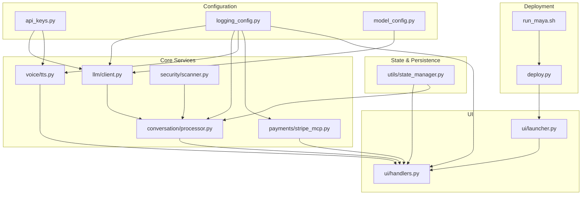
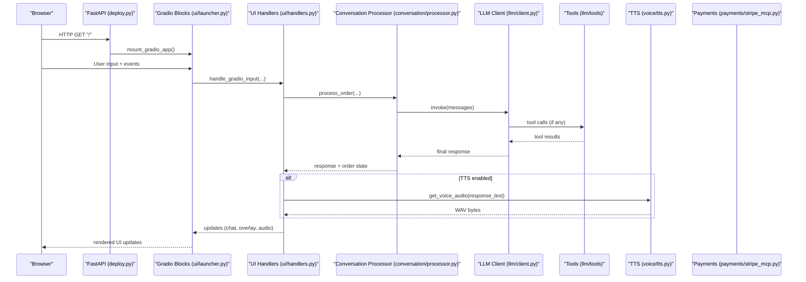
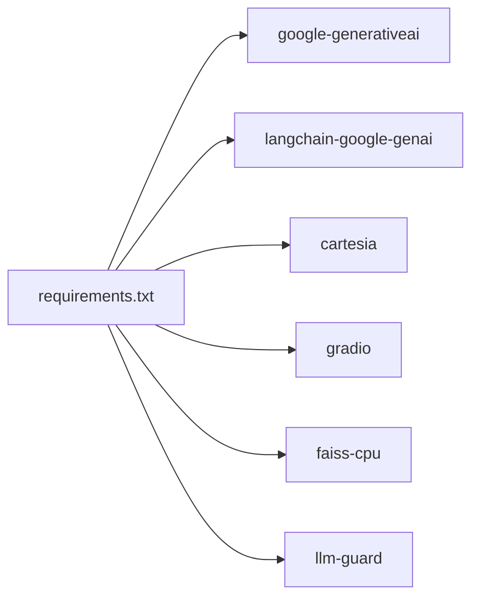
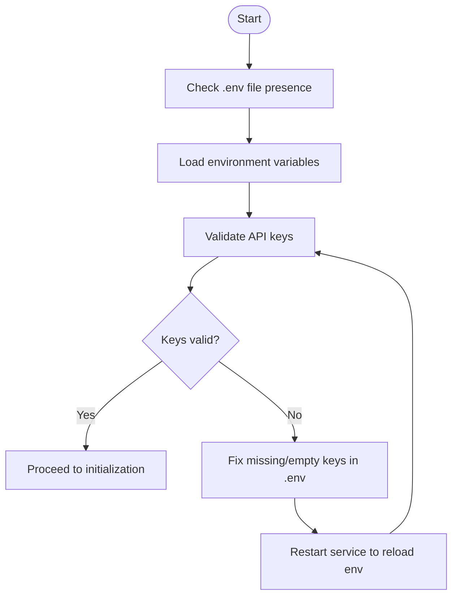
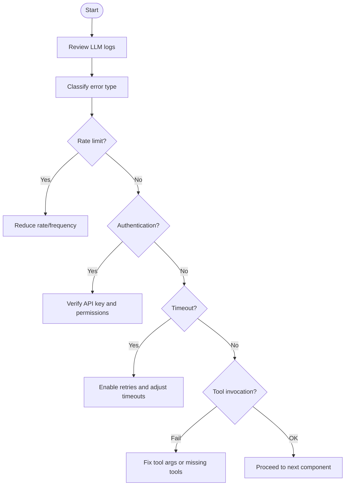
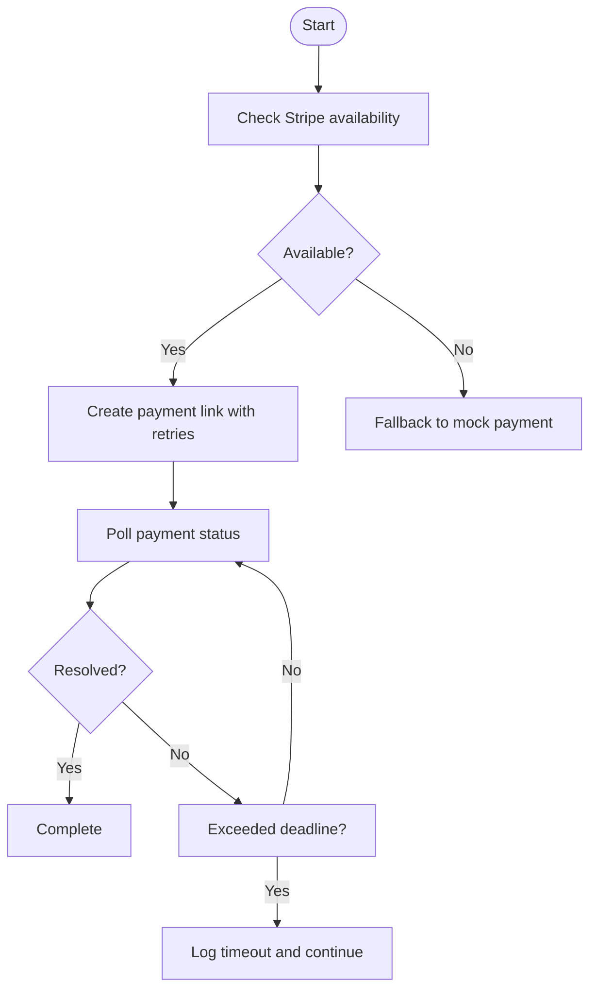

# Troubleshooting Guide

<cite>
**Referenced Files in This Document**
- [src/config/api_keys.py](file://src/config/api_keys.py)
- [src/config/logging_config.py](file://src/config/logging_config.py)
- [src/config/model_config.py](file://src/config/model_config.py)
- [src/llm/client.py](file://src/llm/client.py)
- [src/utils/errors.py](file://src/utils/errors.py)
- [src/conversation/processor.py](file://src/conversation/processor.py)
- [src/voice/tts.py](file://src/voice/tts.py)
- [src/payments/stripe_mcp.py](file://src/payments/stripe_mcp.py)
- [src/ui/handlers.py](file://src/ui/handlers.py)
- [src/ui/launcher.py](file://src/ui/launcher.py)
- [src/utils/state_manager.py](file://src/utils/state_manager.py)
- [src/security/scanner.py](file://src/security/scanner.py)
- [deploy.py](file://deploy.py)
- [run_maya.sh](file://run_maya.sh)
- [.env.example](file://.env.example)
- [requirements.txt](file://requirements.txt)
- [tests/test_errors.py](file://tests/test_errors.py)
- [tests/test_api_keys.py](file://tests/test_api_keys.py)
</cite>

## Table of Contents
1. [Introduction](#introduction)
2. [Project Structure](#project-structure)
3. [Core Components](#core-components)
4. [Architecture Overview](#architecture-overview)
5. [Detailed Component Analysis](#detailed-component-analysis)
6. [Dependency Analysis](#dependency-analysis)
7. [Performance Considerations](#performance-considerations)
8. [Troubleshooting Guide](#troubleshooting-guide)
9. [Conclusion](#conclusion)
10. [Appendices](#appendices)

## Introduction
This guide provides a comprehensive, step-by-step troubleshooting methodology for MayaMCP. It focuses on diagnosing and resolving issues across major components: API key configuration, LLM integration, payment processing, audio synthesis, and UI rendering. It includes log analysis techniques, environment verification, service connectivity tests, error interpretation, recovery procedures, performance diagnostics, escalation paths, and preventive maintenance practices.

## Project Structure
MayaMCP is organized around modular components:
- Configuration: API keys, logging, and model parameters
- LLM integration: client initialization and API calls
- Conversation processing: intent detection, tool orchestration, and RAG enhancement
- Audio synthesis: TTS with Cartesia
- Payments: Stripe MCP client with fallback
- UI: Gradio interface and event handlers
- State management: thread-safe session state and payment state
- Security: input/output scanning
- Deployment: Modal-based ASGI app with metrics and health checks

**Diagram sources**
- [src/config/api_keys.py](file://src/config/api_keys.py#L1-L51)
- [src/config/logging_config.py](file://src/config/logging_config.py#L1-L51)
- [src/config/model_config.py](file://src/config/model_config.py#L1-L102)
- [src/llm/client.py](file://src/llm/client.py#L1-L211)
- [src/conversation/processor.py](file://src/conversation/processor.py#L1-L456)
- [src/voice/tts.py](file://src/voice/tts.py#L1-L200)
- [src/payments/stripe_mcp.py](file://src/payments/stripe_mcp.py#L1-L475)
- [src/security/scanner.py](file://src/security/scanner.py#L1-L137)
- [src/ui/handlers.py](file://src/ui/handlers.py#L1-L392)
- [src/ui/launcher.py](file://src/ui/launcher.py#L1-L354)
- [src/utils/state_manager.py](file://src/utils/state_manager.py#L1-L814)
- [deploy.py](file://deploy.py#L1-L331)
- [run_maya.sh](file://run_maya.sh#L1-L57)

**Section sources**
- [src/config/api_keys.py](file://src/config/api_keys.py#L1-L51)
- [src/config/logging_config.py](file://src/config/logging_config.py#L1-L51)
- [src/config/model_config.py](file://src/config/model_config.py#L1-L102)
- [src/llm/client.py](file://src/llm/client.py#L1-L211)
- [src/conversation/processor.py](file://src/conversation/processor.py#L1-L456)
- [src/voice/tts.py](file://src/voice/tts.py#L1-L200)
- [src/payments/stripe_mcp.py](file://src/payments/stripe_mcp.py#L1-L475)
- [src/ui/handlers.py](file://src/ui/handlers.py#L1-L392)
- [src/ui/launcher.py](file://src/ui/launcher.py#L1-L354)
- [src/utils/state_manager.py](file://src/utils/state_manager.py#L1-L814)
- [src/security/scanner.py](file://src/security/scanner.py#L1-L137)
- [deploy.py](file://deploy.py#L1-L331)
- [run_maya.sh](file://run_maya.sh#L1-L57)

## Core Components
- API key management: loads keys from environment and validates presence
- LLM client: initializes Google Generative AI, binds tools, and handles retries and classification of GenAI errors
- Conversation processor: orchestrates LLM/tool calls, applies security scanning, and optionally enhances responses with RAG
- TTS: initializes Cartesia client and synthesizes audio with retry logic
- Payments: Stripe MCP client with availability probing, idempotent link creation, and polling with timeouts
- UI handlers: process Gradio events, manage state, and render overlays
- State manager: thread-safe session state, payment state validation, and atomic operations
- Security scanner: input/output scanning for prompt injection and toxicity
- Deployment: Modal ASGI app with metrics, health checks, and resource telemetry

**Section sources**
- [src/config/api_keys.py](file://src/config/api_keys.py#L10-L51)
- [src/llm/client.py](file://src/llm/client.py#L47-L211)
- [src/conversation/processor.py](file://src/conversation/processor.py#L73-L456)
- [src/voice/tts.py](file://src/voice/tts.py#L112-L200)
- [src/payments/stripe_mcp.py](file://src/payments/stripe_mcp.py#L66-L475)
- [src/ui/handlers.py](file://src/ui/handlers.py#L23-L392)
- [src/utils/state_manager.py](file://src/utils/state_manager.py#L17-L814)
- [src/security/scanner.py](file://src/security/scanner.py#L32-L137)
- [deploy.py](file://deploy.py#L43-L331)

## Architecture Overview
The system integrates UI, LLM, RAG, TTS, and payment services. The deployment script wires dependencies, initializes logging, and exposes metrics and health endpoints.

**Diagram sources**
- [deploy.py](file://deploy.py#L212-L321)
- [src/ui/launcher.py](file://src/ui/launcher.py#L49-L354)
- [src/ui/handlers.py](file://src/ui/handlers.py#L23-L184)
- [src/conversation/processor.py](file://src/conversation/processor.py#L73-L456)
- [src/llm/client.py](file://src/llm/client.py#L91-L211)
- [src/voice/tts.py](file://src/voice/tts.py#L140-L200)
- [src/payments/stripe_mcp.py](file://src/payments/stripe_mcp.py#L183-L475)

## Detailed Component Analysis

### API Key Management
Common issues:
- Missing or empty keys
- Incorrect environment variable names
- Whitespace-only keys

Diagnostic steps:
- Verify .env file presence and content
- Confirm environment variables are loaded at import time
- Validate keys via validation function

Recovery:
- Populate .env with correct keys
- Restart the service to reload environment
- Use validation function to confirm readiness

**Section sources**
- [src/config/api_keys.py](file://src/config/api_keys.py#L10-L51)
- [tests/test_api_keys.py](file://tests/test_api_keys.py#L25-L287)
- [.env.example](file://.env.example#L1-L33)
- [run_maya.sh](file://run_maya.sh#L11-L18)

### LLM Integration
Common issues:
- Authentication errors (401/403)
- Rate limits (429)
- Timeouts
- Tool invocation failures

Diagnostic steps:
- Inspect logs for rate limit, auth, and timeout warnings
- Validate model configuration and generation parameters
- Confirm tool availability and invocation signatures

Recovery:
- Adjust model parameters or reduce request frequency
- Retry with exponential backoff
- Fix malformed tool arguments or missing tools

**Section sources**
- [src/llm/client.py](file://src/llm/client.py#L130-L211)
- [src/utils/errors.py](file://src/utils/errors.py#L11-L39)
- [src/config/model_config.py](file://src/config/model_config.py#L31-L102)
- [tests/test_errors.py](file://tests/test_errors.py#L23-L69)

### Conversation Processing and RAG Enhancement
Common issues:
- Tool not found or malformed arguments
- Security scanner blocking input/output
- RAG initialization failures

Diagnostic steps:
- Review tool call logs and tool results
- Check security scan results and thresholds
- Verify RAG availability and document counts

Recovery:
- Ensure tools are bound and invoked with correct arguments
- Adjust scanner thresholds or sanitize inputs
- Initialize Memvid or FAISS fallback and rebuild indices

**Section sources**
- [src/conversation/processor.py](file://src/conversation/processor.py#L364-L456)
- [src/security/scanner.py](file://src/security/scanner.py#L32-L137)
- [deploy.py](file://deploy.py#L168-L191)

### Text-to-Speech (TTS)
Common issues:
- Cartesia client initialization failures
- Network timeouts or connection errors
- Empty audio data returned

Diagnostic steps:
- Confirm Cartesia API key and configuration
- Check retry logs and exception types
- Validate audio format and voice settings

Recovery:
- Reinitialize client with valid credentials
- Retry with exponential backoff
- Adjust voice and output format settings

**Section sources**
- [src/voice/tts.py](file://src/voice/tts.py#L112-L200)

### Payments (Stripe MCP)
Common issues:
- Stripe MCP unavailability
- Payment link creation retries exhausted
- Payment status polling timeouts

Diagnostic steps:
- Check availability cache TTL and probe results
- Monitor retry delays and overall timeouts
- Inspect polling intervals and deadlines

Recovery:
- Invalidate availability cache on connection errors
- Fall back to mock payment when unavailable
- Adjust retry and polling configurations

**Section sources**
- [src/payments/stripe_mcp.py](file://src/payments/stripe_mcp.py#L66-L475)

### UI Rendering and State
Common issues:
- Session state corruption
- Payment state validation errors
- UI overlay and avatar rendering anomalies

Diagnostic steps:
- Validate payment state schema and transitions
- Check session locks and cleanup routines
- Inspect Gradio event wiring and overlay HTML

Recovery:
- Reset session state and cleanup locks
- Correct invalid state transitions
- Rebuild overlay HTML and avatar paths

**Section sources**
- [src/utils/state_manager.py](file://src/utils/state_manager.py#L17-L814)
- [src/ui/handlers.py](file://src/ui/handlers.py#L23-L392)
- [src/ui/launcher.py](file://src/ui/launcher.py#L13-L354)

## Dependency Analysis
Key dependencies and their roles:
- google-generativeai and langchain-google-genai for LLM
- cartesia for TTS
- gradio for UI
- faiss and opencv for RAG fallback
- llm-guard for security scanning

**Diagram sources**
- [requirements.txt](file://requirements.txt#L1-L41)

**Section sources**
- [requirements.txt](file://requirements.txt#L1-L41)

## Performance Considerations
- Memory usage: cgroup metrics exposed via /metrics endpoint
- CPU usage: total seconds tracked via /metrics
- Uptime: process uptime gauge for health monitoring
- RAG availability: metrics indicate Memvid/FAISS status and document counts

Operational tips:
- Monitor memory and CPU metrics regularly
- Scale container memory and max containers via environment variables
- Optimize model parameters and output tokens to reduce latency

**Section sources**
- [deploy.py](file://deploy.py#L84-L137)
- [deploy.py](file://deploy.py#L229-L289)

## Troubleshooting Guide

### Step-by-Step Diagnostic Procedures

#### 1) API Key Problems
- Verify .env file exists and contains keys
- Confirm environment variables are loaded at import time
- Validate keys via validation function
- Check for whitespace-only keys and ensure stripping

**Diagram sources**
- [run_maya.sh](file://run_maya.sh#L11-L18)
- [src/config/api_keys.py](file://src/config/api_keys.py#L10-L51)
- [tests/test_api_keys.py](file://tests/test_api_keys.py#L25-L287)

**Section sources**
- [src/config/api_keys.py](file://src/config/api_keys.py#L10-L51)
- [tests/test_api_keys.py](file://tests/test_api_keys.py#L25-L287)
- [.env.example](file://.env.example#L1-L33)
- [run_maya.sh](file://run_maya.sh#L11-L18)

#### 2) LLM Integration Failures
- Inspect logs for rate limit, auth, and timeout warnings
- Validate model configuration and generation parameters
- Confirm tool availability and invocation signatures

**Diagram sources**
- [src/llm/client.py](file://src/llm/client.py#L130-L211)
- [src/utils/errors.py](file://src/utils/errors.py#L11-L39)

**Section sources**
- [src/llm/client.py](file://src/llm/client.py#L130-L211)
- [src/utils/errors.py](file://src/utils/errors.py#L11-L39)
- [src/config/model_config.py](file://src/config/model_config.py#L31-L102)

#### 3) Payment Processing Errors
- Check Stripe MCP availability and cache TTL
- Monitor retry delays and overall timeouts
- Inspect polling intervals and deadlines

**Diagram sources**
- [src/payments/stripe_mcp.py](file://src/payments/stripe_mcp.py#L130-L475)

**Section sources**
- [src/payments/stripe_mcp.py](file://src/payments/stripe_mcp.py#L130-L475)

#### 4) Audio System Issues
- Confirm Cartesia API key and configuration
- Check retry logs and exception types
- Validate audio format and voice settings

**Section sources**
- [src/voice/tts.py](file://src/voice/tts.py#L112-L200)

#### 5) UI Rendering Problems
- Validate payment state schema and transitions
- Check session locks and cleanup routines
- Inspect Gradio event wiring and overlay HTML

**Section sources**
- [src/utils/state_manager.py](file://src/utils/state_manager.py#L17-L814)
- [src/ui/handlers.py](file://src/ui/handlers.py#L23-L392)
- [src/ui/launcher.py](file://src/ui/launcher.py#L13-L354)

### Error Message Interpretation and Recovery

- Rate limit (429)
  - Interpretation: Request throttled by provider
  - Recovery: Reduce request rate or increase quotas
  - Logging: Warning classification

- Authentication/Authorization (401/403)
  - Interpretation: Invalid or missing credentials
  - Recovery: Verify API keys and permissions
  - Logging: Error classification

- Timeout
  - Interpretation: Network or provider latency
  - Recovery: Increase timeouts or retry with exponential backoff
  - Logging: Warning classification

- Tool invocation failures
  - Interpretation: Malformed arguments or missing tools
  - Recovery: Fix tool arguments or ensure tools are bound
  - Logging: Error with tool name and parameters

**Section sources**
- [src/utils/errors.py](file://src/utils/errors.py#L11-L39)
- [src/llm/client.py](file://src/llm/client.py#L170-L208)
- [src/conversation/processor.py](file://src/conversation/processor.py#L364-L405)

### Recovery Procedures

- Failed deployments
  - Validate environment variables and dependencies
  - Rebuild container image and redeploy
  - Check health endpoint for critical dependency status

- Corrupted state data
  - Reset session state and cleanup locks
  - Reinitialize state for affected sessions
  - Validate payment state transitions

- Service outages
  - Invalidate availability cache on connection errors
  - Fall back to mock payment when unavailable
  - Monitor metrics and health endpoints

**Section sources**
- [deploy.py](file://deploy.py#L291-L314)
- [src/utils/state_manager.py](file://src/utils/state_manager.py#L510-L517)
- [src/payments/stripe_mcp.py](file://src/payments/stripe_mcp.py#L466-L475)

### Performance Troubleshooting

- Memory usage analysis
  - Use /metrics endpoint for memory usage and limits
  - Adjust MODAL_MEMORY_MB environment variable

- CPU bottleneck identification
  - Monitor CPU usage seconds via /metrics
  - Optimize model parameters and reduce concurrent requests

- Network latency investigation
  - Inspect LLM and TTS logs for timeouts
  - Increase retry delays and overall timeouts if needed

**Section sources**
- [deploy.py](file://deploy.py#L84-L137)
- [deploy.py](file://deploy.py#L229-L289)
- [src/llm/client.py](file://src/llm/client.py#L130-L211)
- [src/voice/tts.py](file://src/voice/tts.py#L133-L200)

### Escalation Procedures

- Critical issues
  - Capture logs and metrics
  - Verify environment variables and dependencies
  - Open issue with reproduction steps and logs

- Debugging tools
  - Use /metrics and /healthz endpoints
  - Enable debug logging via environment variable
  - Inspect cgroup metrics for container resource usage

- Community support
  - Provide environment details and logs
  - Include dependency versions from requirements.txt
  - Describe steps taken to diagnose the issue

**Section sources**
- [deploy.py](file://deploy.py#L287-L314)
- [src/config/logging_config.py](file://src/config/logging_config.py#L7-L51)
- [requirements.txt](file://requirements.txt#L1-L41)

### Preventive Measures and Monitoring

- Monitoring setup
  - Expose metrics endpoint with memory, CPU, and uptime
  - Health checks for critical dependencies
  - RAG availability and document count metrics

- Proactive maintenance
  - Regularly review logs for rate limit and timeout warnings
  - Validate API keys periodically
  - Monitor container resource usage and scale as needed

**Section sources**
- [deploy.py](file://deploy.py#L229-L314)
- [src/config/logging_config.py](file://src/config/logging_config.py#L7-L51)

## Conclusion
This guide provides a structured approach to diagnosing and resolving MayaMCP issues across API keys, LLM integration, payments, audio, and UI. By following the diagnostic procedures, interpreting error messages, and applying the recovery and performance recommendations, you can minimize downtime and improve system reliability.

## Appendices

### Appendix A: Environment Verification Checklist
- .env file present and populated
- API keys validated
- Dependencies installed per requirements.txt
- Logging level set appropriately
- Health endpoint returns healthy

**Section sources**
- [run_maya.sh](file://run_maya.sh#L11-L18)
- [tests/test_api_keys.py](file://tests/test_api_keys.py#L25-L287)
- [requirements.txt](file://requirements.txt#L1-L41)
- [deploy.py](file://deploy.py#L291-L314)

### Appendix B: Common Error Codes and Meanings
- 429: Rate limit exceeded
- 401/403: Authentication/authorization failure
- Timeout: Network or provider latency
- Tool invocation errors: Malformed arguments or missing tools

**Section sources**
- [src/utils/errors.py](file://src/utils/errors.py#L11-L39)
- [src/llm/client.py](file://src/llm/client.py#L170-L208)
- [src/conversation/processor.py](file://src/conversation/processor.py#L364-L405)