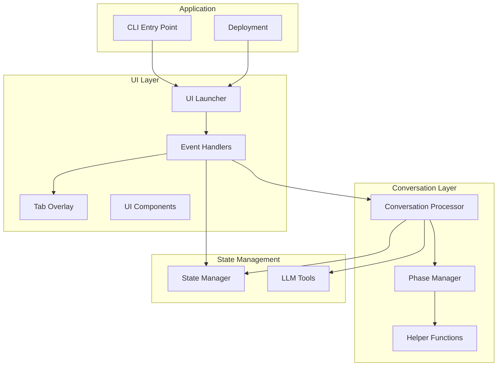
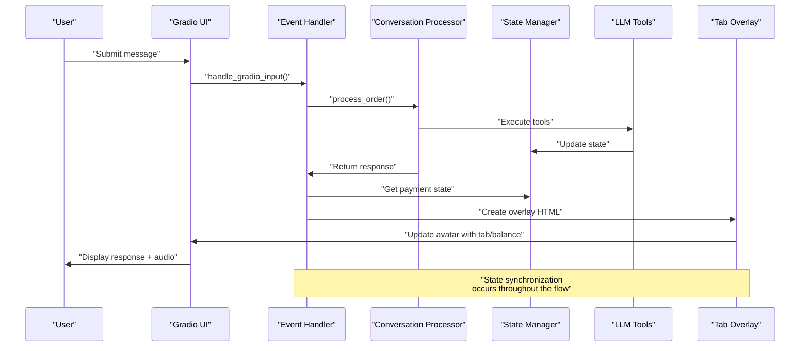
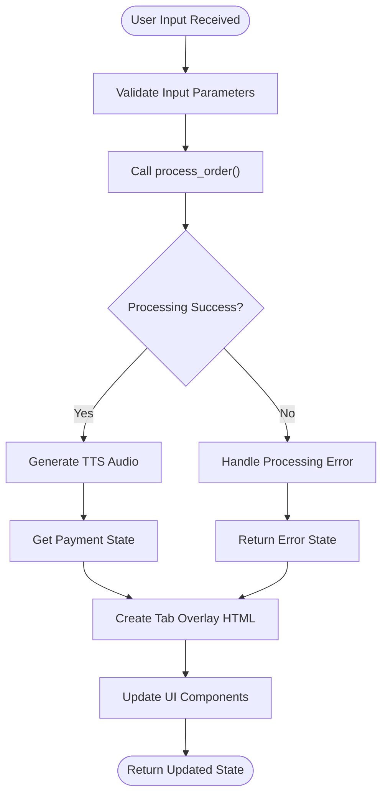
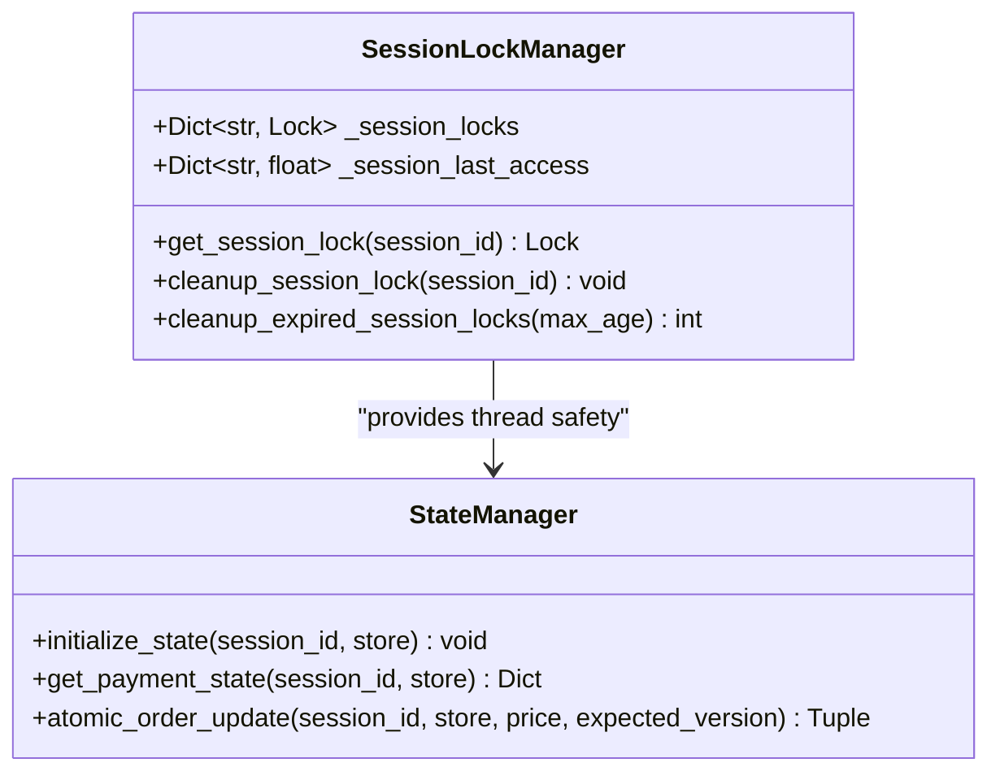
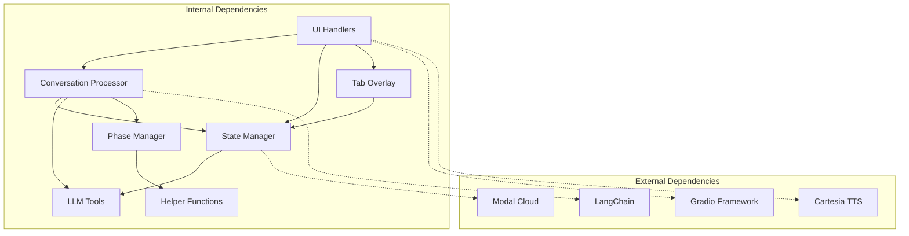

# Event Handling System

<cite>
**Referenced Files in This Document**
- [handlers.py](file://src/ui/handlers.py)
- [launcher.py](file://src/ui/launcher.py)
- [tab_overlay.py](file://src/ui/tab_overlay.py)
- [components.py](file://src/ui/components.py)
- [processor.py](file://src/conversation/processor.py)
- [state_manager.py](file://src/utils/state_manager.py)
- [tools.py](file://src/llm/tools.py)
- [helpers.py](file://src/utils/helpers.py)
- [phase_manager.py](file://src/conversation/phase_manager.py)
- [mayamcp_cli.py](file://src/mayamcp_cli.py)
- [deploy.py](file://deploy.py)
</cite>

## Update Summary
**Changes Made**
- Removed comprehensive tip handling functionality sections
- Updated architecture diagrams to reflect simplified event handling system
- Removed tip button click handler documentation
- Removed JavaScript integration for dynamic tip buttons
- Updated state synchronization mechanisms to focus on core interaction patterns
- Revised troubleshooting guide to remove tip-related issues

## Table of Contents
1. [Introduction](#introduction)
2. [Project Structure](#project-structure)
3. [Core Components](#core-components)
4. [Architecture Overview](#architecture-overview)
5. [Detailed Component Analysis](#detailed-component-analysis)
6. [Dependency Analysis](#dependency-analysis)
7. [Performance Considerations](#performance-considerations)
8. [Troubleshooting Guide](#troubleshooting-guide)
9. [Conclusion](#conclusion)

## Introduction
This document provides comprehensive documentation for the event handling system that processes user interactions and coordinates between UI components and backend services in the Maya bartender agent. The system centers around the main input handler that processes user messages, manages conversation flow, and integrates with the conversation processor. The documentation covers the handle_gradio_input function, state synchronization mechanisms, JavaScript integration for dynamic interactions, event propagation patterns, custom event handlers, state management patterns, and error handling strategies.

**Updated** The system now focuses on core interaction patterns without payment-specific features, simplifying the architecture while maintaining robust conversation management capabilities.

## Project Structure
The event handling system spans several modules that work together to manage user interactions:



**Diagram sources**
- [launcher.py](file://src/ui/launcher.py#L49-L354)
- [handlers.py](file://src/ui/handlers.py#L23-L259)
- [processor.py](file://src/conversation/processor.py#L73-L480)
- [state_manager.py](file://src/utils/state_manager.py#L394-L814)

**Section sources**
- [launcher.py](file://src/ui/launcher.py#L1-L362)
- [handlers.py](file://src/ui/handlers.py#L1-L259)

## Core Components
The event handling system consists of two primary components:

### Main Input Handler (`handle_gradio_input`)
The central event handler that processes user messages, manages conversation flow, and integrates with the conversation processor. It orchestrates the complete user interaction lifecycle from input processing to UI state updates.

### Clear Conversation Handler (`clear_chat_state`)
Handler that resets all UI state while maintaining avatar consistency and cleaning up backend session state.

**Section sources**
- [handlers.py](file://src/ui/handlers.py#L71-L259)
- [handlers.py](file://src/ui/handlers.py#L231-L259)

## Architecture Overview
The event handling system follows a layered architecture with clear separation of concerns:



**Diagram sources**
- [handlers.py](file://src/ui/handlers.py#L71-L259)
- [processor.py](file://src/conversation/processor.py#L73-L480)
- [state_manager.py](file://src/utils/state_manager.py#L627-L640)
- [tab_overlay.py](file://src/ui/tab_overlay.py#L151-L595)

## Detailed Component Analysis

### Main Input Handler (`handle_gradio_input`)
The primary event handler that processes user messages and manages the complete conversation flow.

#### Key Responsibilities
- **Input Processing**: Validates and processes user input through the conversation processor
- **State Management**: Coordinates between UI state and backend session state
- **Audio Generation**: Integrates with TTS system for voice responses
- **Avatar Management**: Dynamically updates avatar based on emotion states
- **Error Handling**: Provides graceful degradation when processing fails

#### Processing Flow


**Diagram sources**
- [handlers.py](file://src/ui/handlers.py#L71-L259)

#### State Synchronization Mechanisms
The handler maintains synchronization between multiple state sources:
- **Session History**: Maintains conversation context
- **Payment State**: Tracks tab totals, balances, and tips
- **Avatar State**: Manages emotion-based avatar switching
- **UI State**: Controls overlay animations and visual feedback

**Section sources**
- [handlers.py](file://src/ui/handlers.py#L71-L259)
- [processor.py](file://src/conversation/processor.py#L73-L480)
- [state_manager.py](file://src/utils/state_manager.py#L627-L640)

### Clear Conversation Handler (`clear_chat_state`)
Handler that resets all UI state while maintaining avatar consistency.

#### Reset Operations
The clear handler performs comprehensive state cleanup:
- **Chat History**: Clears conversation history
- **Order State**: Resets current order
- **Audio State**: Stops audio playback
- **Session State**: Resets backend session state
- **Avatar Persistence**: Maintains avatar consistency

#### Error Recovery
The handler includes robust error recovery:
- **State Reset Failure**: Returns empty state to ensure clean UI
- **Backend State Issues**: Continues with UI reset even if backend fails

**Section sources**
- [handlers.py](file://src/ui/handlers.py#L231-L259)

### JavaScript Integration for Dynamic Interactions
The system integrates JavaScript for dynamic UI interactions:

#### JavaScript Callback System
```javascript
function handleTipClick(percentage) {
    // Find the hidden tip input element
    const tipInput = document.querySelector('#tip-click-input textarea, #tip-click-input input');
    if (tipInput) {
        // Set the value to the percentage clicked
        tipInput.value = percentage.toString();
        // Trigger input event to notify Gradio
        tipInput.dispatchEvent(new Event('input', { bubbles: true }));
        // Small delay then trigger change event
        setTimeout(() => {
            tipInput.dispatchEvent(new Event('change', { bubbles: true }));
        }, 50);
    }
}
```

#### Event Propagation Pattern
The JavaScript integration follows a specific event propagation pattern:
1. **Button Click**: User clicks tip button
2. **JavaScript Handler**: Updates hidden input value
3. **Event Triggering**: Dispatches input and change events
4. **Gradio Processing**: Gradio detects change and invokes handler
5. **State Update**: Handler processes tip selection and updates UI

**Updated** The current implementation focuses on core interaction patterns without payment-specific features, so the JavaScript integration is primarily for demonstration purposes.

**Section sources**
- [launcher.py](file://src/ui/launcher.py#L229-L243)
- [launcher.py](file://src/ui/launcher.py#L349-L357)

### State Management Patterns
The system employs several sophisticated state management patterns:

#### Thread-Safe Session Locking


#### Atomic Operations
The state manager implements atomic operations for financial transactions:
- **Optimistic Locking**: Version-based concurrency control
- **Balance Validation**: Prevents overspending
- **Transaction Rollback**: Ensures state consistency

**Section sources**
- [state_manager.py](file://src/utils/state_manager.py#L207-L282)
- [state_manager.py](file://src/utils/state_manager.py#L685-L757)

### Conversation Processing Integration
The event handlers integrate deeply with the conversation processing system:

#### Speech Act Detection
The system uses Austin's speech act theory for enhanced intent recognition:
- **Commissive Acts**: Commitments to action (I can get you that)
- **Assertive Acts**: Statements about order completion
- **Directive Acts**: Direct requests for service

#### Phase Management
The conversation phase manager coordinates state transitions:
- **Greeting → Order Taking**: Initial interaction
- **Order Taking → Small Talk**: After order placement
- **Small Talk → Reorder Prompt**: After extended conversation

**Section sources**
- [processor.py](file://src/conversation/processor.py#L132-L202)
- [phase_manager.py](file://src/conversation/phase_manager.py#L10-L92)

## Dependency Analysis
The event handling system exhibits well-managed dependencies with clear boundaries:



**Diagram sources**
- [handlers.py](file://src/ui/handlers.py#L1-L21)
- [processor.py](file://src/conversation/processor.py#L1-L31)
- [state_manager.py](file://src/utils/state_manager.py#L1-L10)

### Coupling and Cohesion Analysis
- **High Cohesion**: Each module has a focused responsibility
- **Low Coupling**: Modules communicate through well-defined interfaces
- **Interface Contracts**: Clear function signatures and return types
- **Error Boundaries**: Comprehensive error handling at module boundaries

**Section sources**
- [handlers.py](file://src/ui/handlers.py#L1-L21)
- [processor.py](file://src/conversation/processor.py#L1-L31)

## Performance Considerations
The event handling system incorporates several performance optimizations:

### Animation Queue Management
The tab overlay implements an animation queue with:
- **Max Depth**: 5 concurrent animations
- **Collapse Window**: 100ms for merging rapid updates
- **Cancellation Support**: Immediate cancellation of stale animations

### Concurrency Control
- **Thread-Safe Operations**: Session locks prevent race conditions
- **Background Cleanup**: Automatic cleanup of expired session locks
- **Memory Management**: Proper cleanup of session resources

### Caching and State Persistence
- **State Persistence**: Backend state maintained across sessions
- **Avatar Caching**: Emotion-based avatar switching with file existence checks
- **Animation Caching**: JavaScript animation queue reduces DOM manipulation overhead

## Troubleshooting Guide

### Common Issues and Solutions

#### Input Processing Failures
**Symptoms**: User input ignored or error responses
**Causes**: 
- LLM invocation failures
- Tool execution errors
- State validation failures

**Solutions**:
- Check API key configuration
- Verify LLM availability
- Review tool dependencies

#### Avatar State Issues
**Symptoms**: Avatar not changing or reverting unexpectedly
**Causes**:
- Missing emotion asset files
- State persistence failures
- File path resolution errors

**Solutions**:
- Verify emotion asset existence
- Check file permissions
- Validate asset paths

#### State Synchronization Problems
**Symptoms**: UI and backend state desynchronization
**Causes**:
- Concurrent modification conflicts
- Session lock timeouts
- Memory leaks in session management

**Solutions**:
- Implement proper session cleanup
- Monitor session lock expiration
- Check for memory leaks

**Section sources**
- [handlers.py](file://src/ui/handlers.py#L97-L118)
- [handlers.py](file://src/ui/handlers.py#L284-L301)
- [state_manager.py](file://src/utils/state_manager.py#L245-L282)

## Conclusion
The Maya event handling system demonstrates sophisticated architecture for managing user interactions in a conversational AI application. The system successfully coordinates between UI components and backend services through well-designed event handlers, comprehensive state management, and robust error handling. Key strengths include:

- **Modular Design**: Clear separation of concerns across UI, conversation, and state management layers
- **Robust State Management**: Thread-safe operations with atomic transactions and optimistic locking
- **Enhanced User Experience**: Dynamic avatar emotion switching, smooth animations, and responsive interactions
- **Production Ready**: Support for both local development and cloud deployment with Modal
- **Extensible Architecture**: Well-defined interfaces for adding custom event handlers and state management patterns

The system provides a solid foundation for extending conversational AI capabilities while maintaining reliability and user experience quality. The simplified architecture without payment-specific features focuses on core interaction patterns, making the system more maintainable and easier to understand.