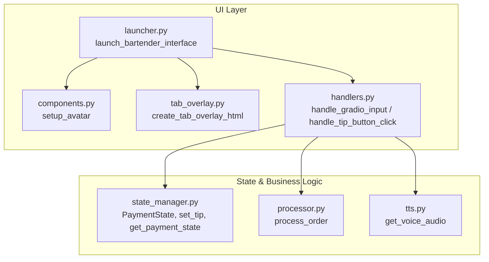
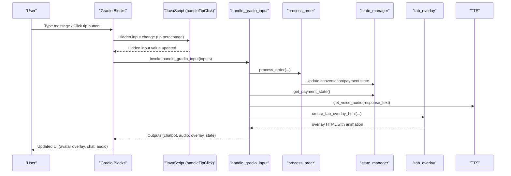
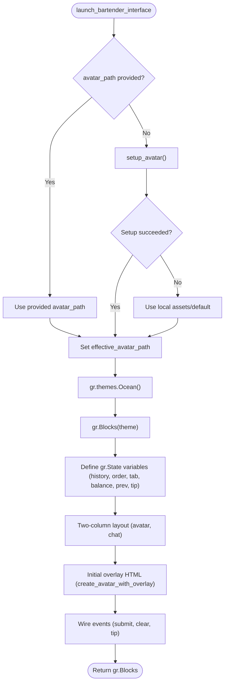
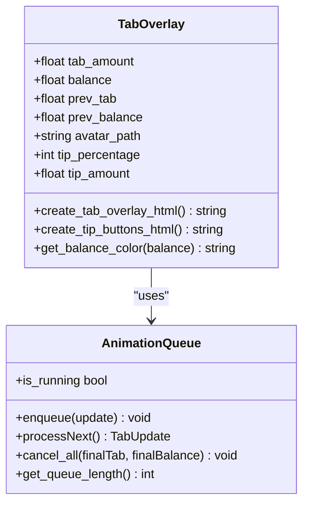
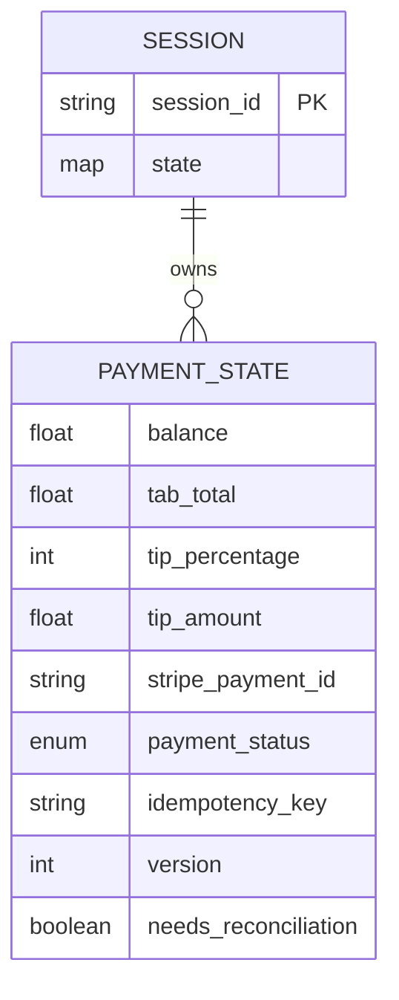
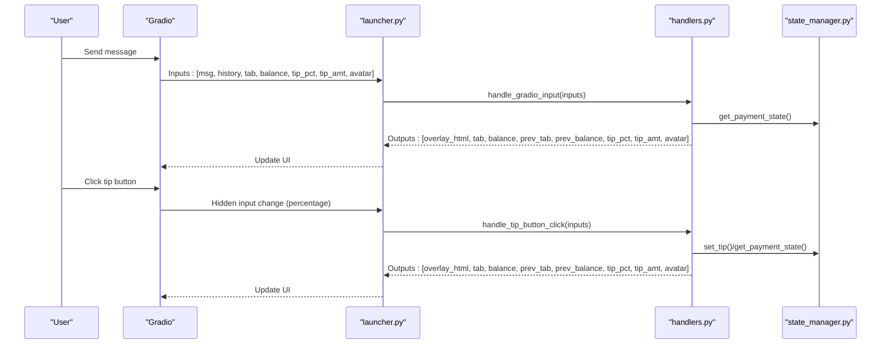
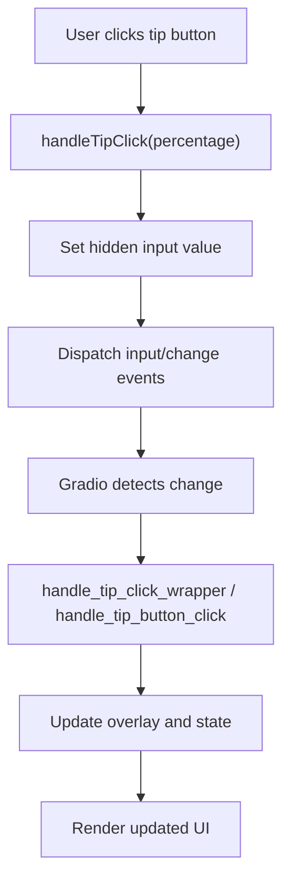
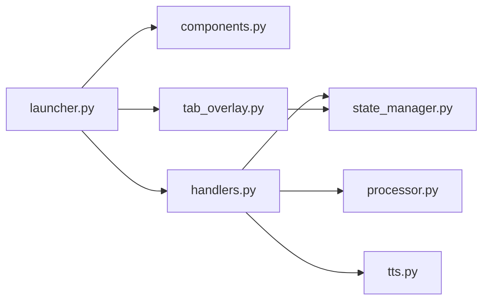

# Interface Launcher

<cite>
**Referenced Files in This Document**
- [launcher.py](file://src/ui/launcher.py)
- [components.py](file://src/ui/components.py)
- [handlers.py](file://src/ui/handlers.py)
- [tab_overlay.py](file://src/ui/tab_overlay.py)
- [state_manager.py](file://src/utils/state_manager.py)
- [processor.py](file://src/conversation/processor.py)
- [tts.py](file://src/voice/tts.py)
- [test_ui_launcher.py](file://tests/test_ui_launcher.py)
- [README.md](file://README.md)
- [EMOTION_SYSTEM.md](file://docs/EMOTION_SYSTEM.md)
- [ADR_001_AVATAR_VIDEO_FORMAT.md](file://docs/ADR_001_AVATAR_VIDEO_FORMAT.md)
</cite>

## Table of Contents
1. [Introduction](#introduction)
2. [Project Structure](#project-structure)
3. [Core Components](#core-components)
4. [Architecture Overview](#architecture-overview)
5. [Detailed Component Analysis](#detailed-component-analysis)
6. [Dependency Analysis](#dependency-analysis)
7. [Performance Considerations](#performance-considerations)
8. [Troubleshooting Guide](#troubleshooting-guide)
9. [Conclusion](#conclusion)
10. [Appendices](#appendices)

## Introduction
This document explains the Gradio interface launcher system that powers MayaMCP’s main UI. It focuses on the launch_bartender_interface function, the avatar overlay integration, state management, event wiring, JavaScript-driven tip buttons, and the fallback avatar setup. It also provides guidance for customization, theming, scaling, and compliance with requirements.

## Project Structure
The UI system is modular and layered:
- UI launcher orchestrates the Gradio Blocks layout, wires events, and manages state.
- Components provide avatar setup and fallback logic.
- Tab overlay composes the avatar with real-time payment information and tip controls.
- Handlers connect UI events to business logic and state updates.
- State manager encapsulates session, order, and payment state with thread-safe operations.
- Processor integrates LLM/tool orchestration and emotion state propagation.
- TTS synthesizes voice responses.

**Diagram sources**
- [launcher.py](file://src/ui/launcher.py#L49-L354)
- [components.py](file://src/ui/components.py#L11-L55)
- [tab_overlay.py](file://src/ui/tab_overlay.py#L151-L485)
- [handlers.py](file://src/ui/handlers.py#L23-L392)
- [state_manager.py](file://src/utils/state_manager.py#L17-L814)
- [processor.py](file://src/conversation/processor.py#L73-L456)
- [tts.py](file://src/voice/tts.py#L140-L200)

**Section sources**
- [launcher.py](file://src/ui/launcher.py#L1-L354)
- [README.md](file://README.md#L15-L33)

## Core Components
- launch_bartender_interface: Creates the Gradio Blocks interface with theme, layout, and event wiring.
- create_avatar_with_overlay: Wraps tab overlay creation for the avatar display.
- setup_avatar: Downloads and saves the default avatar image.
- create_tab_overlay_html: Generates the avatar overlay with animated counters, tip buttons, and JavaScript.
- handle_gradio_input: Orchestrates conversation processing, payment updates, avatar emotion, and TTS.
- handle_tip_button_click: Processes tip selection/removal with toggle behavior and Maya’s response.
- DEFAULT_PAYMENT_STATE: Centralized payment state schema and defaults.

Key requirement references:
- 2.1, 2.2, 2.3, 2.4, 5.1, 5.2, 5.3, 5.4, 6.1, 6.2, 6.3, 6.4, 7.1, 7.2, 7.3, 7.4, 7.5, 7.6, 7.7, 7.8, 7.10, 7.11, 7.12

**Section sources**
- [launcher.py](file://src/ui/launcher.py#L13-L100)
- [components.py](file://src/ui/components.py#L11-L55)
- [tab_overlay.py](file://src/ui/tab_overlay.py#L151-L485)
- [handlers.py](file://src/ui/handlers.py#L23-L392)
- [state_manager.py](file://src/utils/state_manager.py#L48-L814)

## Architecture Overview
The UI is a two-column layout:
- Left column: Avatar with tab/balance/tip overlay and tip buttons.
- Right column: Chatbot, agent audio, text input, and submit/clear buttons.

Event flow:
- User submits text or clicks tip buttons.
- JavaScript updates a hidden input that triggers a Gradio event.
- Handlers call conversation processing and state updates.
- Overlay HTML is regenerated with animated counters and updated tip state.
- Avatar may switch based on emotion state parsed from LLM output.

**Diagram sources**
- [launcher.py](file://src/ui/launcher.py#L170-L349)
- [handlers.py](file://src/ui/handlers.py#L23-L184)
- [processor.py](file://src/conversation/processor.py#L73-L456)
- [state_manager.py](file://src/utils/state_manager.py#L627-L640)
- [tab_overlay.py](file://src/ui/tab_overlay.py#L151-L485)
- [tts.py](file://src/voice/tts.py#L140-L200)

## Detailed Component Analysis

### launch_bartender_interface
Responsibilities:
- Theme configuration using Ocean theme.
- Layout: Two equal-scale columns (avatar + chat).
- State variables: conversation history, order, and payment state (tab, balance, previous values, tip percentage, tip amount).
- Avatar overlay initialization with default payment state.
- Event wiring: text submission, button clicks, and tip button JavaScript bridge.
- Clear conversation wrapper that resets overlay and state.

Key behaviors:
- Avatar fallback: If no avatar provided, downloads and saves default image; falls back to local assets if unavailable.
- Tip button integration: Hidden textbox receives JavaScript-triggered values; handler parses and applies tip state.
- Emotion-based avatar: Avatar path can switch based on emotion state returned by conversation processor.

**Diagram sources**
- [launcher.py](file://src/ui/launcher.py#L49-L354)
- [components.py](file://src/ui/components.py#L11-L55)
- [tab_overlay.py](file://src/ui/tab_overlay.py#L151-L181)

**Section sources**
- [launcher.py](file://src/ui/launcher.py#L49-L354)
- [test_ui_launcher.py](file://tests/test_ui_launcher.py#L78-L194)

### Avatar Overlay Integration
The overlay is composed by create_tab_overlay_html:
- Displays tab, balance, tip, and total with animated count-up when values change.
- Tip buttons (10%, 15%, 20%) with toggle behavior and visual highlighting.
- JavaScript animation queue collapses rapid updates and runs a smooth transition.
- Emotion-based avatar switching with fade-in transition using poster frames.

**Diagram sources**
- [tab_overlay.py](file://src/ui/tab_overlay.py#L151-L485)
- [tab_overlay.py](file://src/ui/tab_overlay.py#L498-L595)

**Section sources**
- [tab_overlay.py](file://src/ui/tab_overlay.py#L151-L485)
- [EMOTION_SYSTEM.md](file://docs/EMOTION_SYSTEM.md#L39-L48)

### State Management Architecture
State is partitioned into conversation, order history, current order, and payment state. PaymentState includes:
- balance, tab_total, tip_percentage, tip_amount
- Stripe identifiers, payment_status, idempotency_key, version, needs_reconciliation

Thread-safe operations:
- Session locks protect concurrent updates.
- Atomic operations for order updates and payment completion.
- Validation ensures state integrity and status transitions.

**Diagram sources**
- [state_manager.py](file://src/utils/state_manager.py#L17-L814)

**Section sources**
- [state_manager.py](file://src/utils/state_manager.py#L48-L814)

### Event Handler Wiring
- Text input submission: msg_input.submit and submit_btn.click both route to handle_gradio_input.
- Tip button click: JavaScript writes to hidden tip_click_input; change event routes to handle_tip_click_wrapper (placeholder) or handle_tip_button_click (real handler).
- Clear conversation: clear_btn.click invokes a wrapper that resets UI and overlay to DEFAULT_PAYMENT_STATE.

**Diagram sources**
- [launcher.py](file://src/ui/launcher.py#L155-L349)
- [handlers.py](file://src/ui/handlers.py#L23-L392)
- [state_manager.py](file://src/utils/state_manager.py#L556-L640)

**Section sources**
- [launcher.py](file://src/ui/launcher.py#L155-L349)
- [handlers.py](file://src/ui/handlers.py#L218-L392)

### JavaScript Integration for Tip Buttons
The launcher injects a global JavaScript function handleTipClick that:
- Sets the hidden tip_click_input value to the clicked percentage.
- Triggers input and change events to notify Gradio.
- Ensures immediate visual feedback and subsequent handler invocation.

**Diagram sources**
- [launcher.py](file://src/ui/launcher.py#L170-L193)
- [handlers.py](file://src/ui/handlers.py#L218-L392)

**Section sources**
- [launcher.py](file://src/ui/launcher.py#L170-L193)

### Fallback Avatar Setup System
- setup_avatar downloads a default avatar image from a URL and saves it locally.
- On failure, it creates a blank fallback image and logs errors.
- launch_bartender_interface falls back to local assets if setup fails.

**Section sources**
- [components.py](file://src/ui/components.py#L11-L55)
- [launcher.py](file://src/ui/launcher.py#L65-L81)

### Emotion-Based Avatar Switching
- LLM responses may include an internal emotion tag; the processor extracts it and returns it alongside the text.
- The handler resolves a matching emotion video asset and updates the avatar path.
- If the asset does not exist, the avatar remains unchanged.

**Section sources**
- [processor.py](file://src/conversation/processor.py#L174-L202)
- [handlers.py](file://src/ui/handlers.py#L140-L165)
- [EMOTION_SYSTEM.md](file://docs/EMOTION_SYSTEM.md#L28-L38)

## Dependency Analysis
- UI launcher depends on components for avatar setup, tab_overlay for overlay composition, and handlers for event logic.
- Handlers depend on processor for conversation orchestration, state_manager for state, and tts for audio synthesis.
- tab_overlay depends on state_manager constants for payment defaults and validation.

**Diagram sources**
- [launcher.py](file://src/ui/launcher.py#L1-L10)
- [handlers.py](file://src/ui/handlers.py#L1-L21)
- [processor.py](file://src/conversation/processor.py#L1-L31)
- [state_manager.py](file://src/utils/state_manager.py#L1-L10)
- [tts.py](file://src/voice/tts.py#L1-L11)

**Section sources**
- [launcher.py](file://src/ui/launcher.py#L1-L10)
- [handlers.py](file://src/ui/handlers.py#L1-L21)

## Performance Considerations
- Animation queue collapses rapid updates to reduce DOM churn and maintain smooth transitions.
- JavaScript animation uses requestAnimationFrame for efficient rendering.
- TTS uses retry logic with exponential backoff to handle transient failures.
- Thread-safe session locks minimize contention for concurrent users.

[No sources needed since this section provides general guidance]

## Troubleshooting Guide
Common issues and resolutions:
- Avatar setup failures: The launcher catches exceptions and continues with fallback assets. Check logs for “Failed to setup avatar”.
- Missing emotion assets: If an emotion video is missing, the avatar remains unchanged; verify assets/maya_{state}.mp4 and companion poster image.
- Tip button not responding: Ensure the hidden tip_click_input is present and the JavaScript function is loaded; verify the change event wiring.
- Payment state anomalies: Validate state transitions and constraints; use get_payment_state to inspect current values.

**Section sources**
- [launcher.py](file://src/ui/launcher.py#L69-L71)
- [handlers.py](file://src/ui/handlers.py#L140-L165)
- [state_manager.py](file://src/utils/state_manager.py#L160-L167)

## Conclusion
The Gradio interface launcher system cleanly separates UI construction from business logic, enabling modular development and robust state management. The avatar overlay provides real-time financial transparency with animated feedback, while JavaScript bridges user interactions to backend handlers. The design supports customization, theming, and compliance with requirements around payment visibility, tip handling, and emotion-based animations.

[No sources needed since this section summarizes without analyzing specific files]

## Appendices

### Interface Customization and Theming
- Theme: The interface uses Ocean theme; you can swap themes by changing the theme instantiation in the launcher.
- Layout scaling: Adjust column scale and min_width to fit different screen sizes.
- Component sizing: Modify chatbot height and other component properties to optimize for your deployment.

**Section sources**
- [launcher.py](file://src/ui/launcher.py#L84-L132)

### Component Scaling Examples
- Equal columns: Both avatar and chat columns use scale=1 for balanced layout.
- Avatar column min_width: Ensures the overlay remains readable on narrow screens.
- Chatbot height: Tuned for comfortable conversation display.

**Section sources**
- [launcher.py](file://src/ui/launcher.py#L102-L132)

### Requirements Compliance Checklist
- Payment visibility: Tab and balance counters with color-coded balance display.
- Tip handling: Three tip buttons with toggle behavior and Maya’s response.
- Emotion animations: Smooth transitions and asset validation.
- State persistence: Avatar remains stable across errors and invalid inputs.
- Fallback avatar: Default image/video fallback when setup fails.

**Section sources**
- [tab_overlay.py](file://src/ui/tab_overlay.py#L18-L44)
- [handlers.py](file://src/ui/handlers.py#L140-L165)
- [ADR_001_AVATAR_VIDEO_FORMAT.md](file://docs/ADR_001_AVATAR_VIDEO_FORMAT.md#L1-L27)