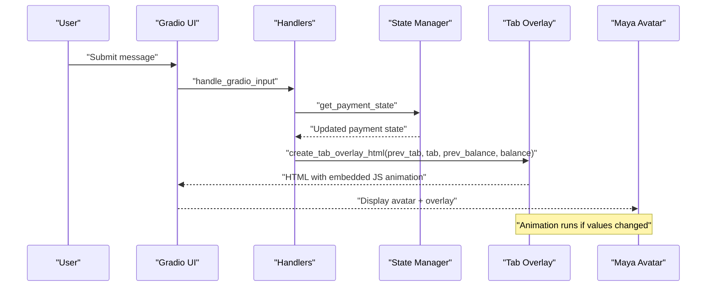
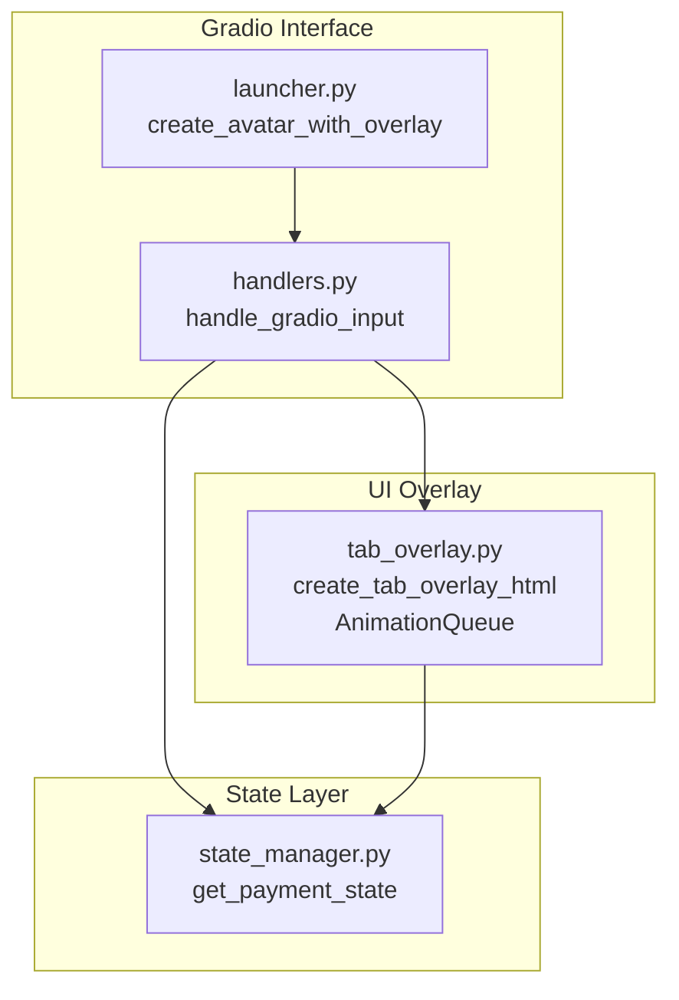
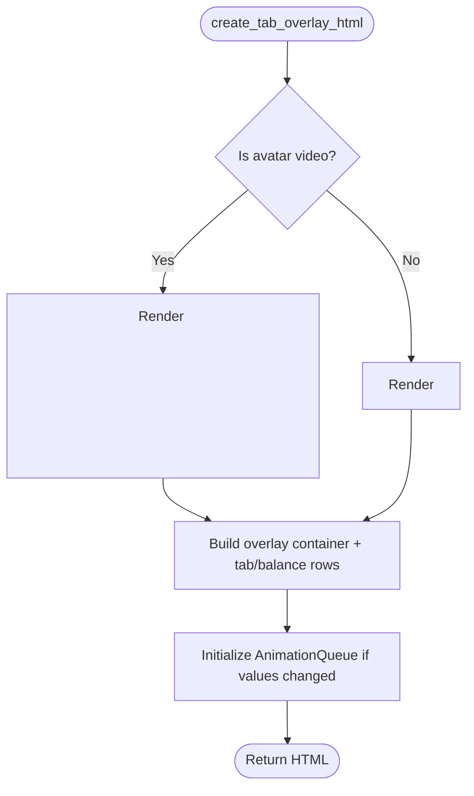
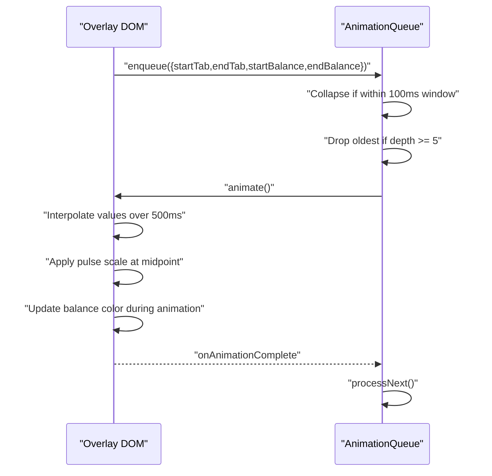
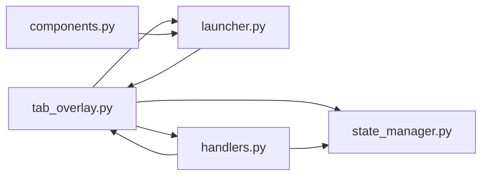

# Tab Overlay System

<cite>
**Referenced Files in This Document**
- [tab_overlay.py](file://src/ui/tab_overlay.py)
- [state_manager.py](file://src/utils/state_manager.py)
- [handlers.py](file://src/ui/handlers.py)
- [launcher.py](file://src/ui/launcher.py)
- [components.py](file://src/ui/components.py)
- [design.md](file://.kiro/specs/stripe-payment/design.md)
- [tasks.md](file://.kiro/specs/stripe-payment/tasks.md)
- [test_payment_properties.py](file://tests/test_payment_properties.py)
</cite>

## Update Summary
**Changes Made**
- Removed all references to tip button integration and tip percentage display system
- Updated core functionality to focus on tab and balance display without payment state management
- Revised architecture diagrams to reflect simplified overlay system
- Updated requirements compliance section to match new scope
- Removed tip-related property tests and validation logic

## Table of Contents
1. [Introduction](#introduction)
2. [Project Structure](#project-structure)
3. [Core Components](#core-components)
4. [Architecture Overview](#architecture-overview)
5. [Detailed Component Analysis](#detailed-component-analysis)
6. [Dependency Analysis](#dependency-analysis)
7. [Performance Considerations](#performance-considerations)
8. [Troubleshooting Guide](#troubleshooting-guide)
9. [Conclusion](#conclusion)

## Introduction
This document describes the tab overlay system that displays real-time payment information superimposed on Maya's avatar. The system has been updated to focus on core tab and balance display functionality without payment state management features. It centers on the create_tab_overlay_html function that generates dynamic HTML overlays showing current tab balance and user balance with smooth animated transitions. The document explains the animation system that smoothly transitions between previous and current payment states for visual feedback, the color-coding system for different payment states, responsive design considerations for different screen sizes, CSS styling approach, and integration with the payment state manager for state validation and persistence.

**Updated** The system now focuses exclusively on displaying tab and balance information without tip functionality or payment state management features.

## Project Structure
The tab overlay system spans several modules:
- UI overlay generation and animation: src/ui/tab_overlay.py
- Payment state management: src/utils/state_manager.py
- Gradio UI handlers: src/ui/handlers.py
- Gradio UI launcher: src/ui/launcher.py
- Avatar setup utilities: src/ui/components.py
- Requirements and design specifications: .kiro/specs/stripe-payment/*
- Tests validating behavior: tests/test_payment_properties.py

```mermaid
graph TB
subgraph "UI Layer"
Launcher["launcher.py<br/>Gradio interface"]
Handlers["handlers.py<br/>Event handlers"]
Overlay["tab_overlay.py<br/>Overlay generator + animation"]
Components["components.py<br/>Avatar setup"]
end
subgraph "State Management"
StateMgr["state_manager.py<br/>Payment state + validation"]
end
subgraph "Specifications"
Design["design.md<br/>Component design"]
Tasks[".kiro/specs/stripe-payment/tasks.md<br/>Implementation tasks"]
end
subgraph "Tests"
Tests["test_payment_properties.py<br/>Behavioral tests"]
end
Launcher --> Handlers
Handlers --> StateMgr
Handlers --> Overlay
Launcher --> Overlay
Launcher --> Components
Overlay --> StateMgr
Design --> Overlay
Tasks --> Overlay
Tests --> Overlay
Tests --> StateMgr
```

**Diagram sources**
- [launcher.py](file://src/ui/launcher.py#L1-L362)
- [handlers.py](file://src/ui/handlers.py#L1-L259)
- [tab_overlay.py](file://src/ui/tab_overlay.py#L1-L595)
- [state_manager.py](file://src/utils/state_manager.py#L1-L867)
- [design.md](file://.kiro/specs/stripe-payment/design.md#L308-L376)
- [tasks.md](file://.kiro/specs/stripe-payment/tasks.md#L198-L402)
- [test_payment_properties.py](file://tests/test_payment_properties.py#L608-L807)

**Section sources**
- [launcher.py](file://src/ui/launcher.py#L1-L362)
- [handlers.py](file://src/ui/handlers.py#L1-L259)
- [tab_overlay.py](file://src/ui/tab_overlay.py#L1-L595)
- [state_manager.py](file://src/utils/state_manager.py#L1-L867)
- [design.md](file://.kiro/specs/stripe-payment/design.md#L308-L376)
- [tasks.md](file://.kiro/specs/stripe-payment/tasks.md#L198-L402)
- [test_payment_properties.py](file://tests/test_payment_properties.py#L608-L807)

## Core Components
- create_tab_overlay_html: Generates the HTML/CSS/JS overlay with tab and balance display. It positions the overlay at the bottom-left of Maya's avatar and embeds a fade-in animation for video avatars.
- get_balance_color: Maps current balance to color-coded states (normal, warning, critical).
- AnimationQueue (JavaScript): Manages serialized, collapsing animations for smooth transitions between previous and current values.
- AnimationQueue (Python mirror): Provides property-based testing parity for the JavaScript queue behavior.

Key requirements covered:
- Overlay positioning and visibility: 2.1, 2.3, 2.4, 5.1, 5.2, 5.3, 5.4, 6.1, 7.1, 7.3, 7.4
- Balance color coding: 6.3, 6.4
- State validation and persistence: 1.1–1.5, 3.1–3.4, 3.3

**Updated** Removed all tip-related functionality including tip buttons, tip calculations, and payment state management features.

**Section sources**
- [tab_overlay.py](file://src/ui/tab_overlay.py#L151-L180)
- [tab_overlay.py](file://src/ui/tab_overlay.py#L24-L44)
- [tab_overlay.py](file://src/ui/tab_overlay.py#L307-L483)
- [tab_overlay.py](file://src/ui/tab_overlay.py#L488-L595)
- [design.md](file://.kiro/specs/stripe-payment/design.md#L308-L376)
- [tasks.md](file://.kiro/specs/stripe-payment/tasks.md#L198-L402)

## Architecture Overview
The tab overlay integrates with the payment state manager and Gradio UI to provide real-time feedback. The flow is:



**Updated** Removed tip button integration and payment state management from the architecture flow.

**Diagram sources**
- [handlers.py](file://src/ui/handlers.py#L71-L229)
- [state_manager.py](file://src/utils/state_manager.py#L613-L625)
- [tab_overlay.py](file://src/ui/tab_overlay.py#L151-L180)

## Detailed Component Analysis

### create_tab_overlay_html
Responsibilities:
- Embeds a semi-transparent dark background overlay at the bottom-left of the avatar.
- Displays "Tab" and "Balance" with animated count-up transitions when values change.
- Handles avatar media (image/video) with fade-in animation for video assets.
- Embeds JavaScript animation queue and balance color logic.

Animation behavior:
- Only animates when either tab or balance differs from previous values.
- Uses linear interpolation over 500 ms with a mid-point pulse effect.
- Applies getBalanceColor to dynamically update balance text color during animation.

Responsive design:
- Container width is constrained to a maximum and adapts to parent width.
- Flex layout with gap spacing ensures readability across sizes.

Customization examples:
- Adjust avatar path for different emotion states.
- Modify colors by updating color constants.
- Change animation duration by editing the duration constant in the JS animation loop.

**Updated** Removed all tip-related functionality including tip buttons, tip display rows, and tip calculation logic.

**Section sources**
- [tab_overlay.py](file://src/ui/tab_overlay.py#L151-L180)

### Animation System
JavaScript AnimationQueue:
- Serializes updates: new updates wait for current 500 ms animation to finish.
- Collapse strategy: updates within 100 ms are merged into a single animation with start from the first and end from the last.
- Max depth: 5 pending animations; older items are dropped if exceeded.
- Events: onAnimationStart, onAnimationComplete, onAnimationCancel callbacks.
- Cancellation: cancelAll renders final values instantly and clears queue.

Python AnimationQueue (mirror):
- Mirrors the JavaScript behavior for property-based testing.
- Validates queue length invariants and collapse behavior.

Timing adjustments:
- Duration: 500 ms for the entire animation.
- Pulse timing: mid-point scaling back to normal.
- Collapse window: 100 ms for merging rapid updates.

**Section sources**
- [tab_overlay.py](file://src/ui/tab_overlay.py#L307-L483)
- [tab_overlay.py](file://src/ui/tab_overlay.py#L488-L595)
- [test_payment_properties.py](file://tests/test_payment_properties.py#L694-L807)

### Color-Coding System
Balance thresholds:
- Normal: balance ≥ $50 → white
- Warning: 0 < balance < $50 → orange
- Critical: balance ≤ $0 → red

Dynamic updates:
- During animation, balance color updates in real-time to reflect the current interpolated value.

Validation:
- Property tests verify boundary behavior and edge cases.

**Section sources**
- [tab_overlay.py](file://src/ui/tab_overlay.py#L24-L44)
- [test_payment_properties.py](file://tests/test_payment_properties.py#L612-L686)

### Responsive Design and CSS Styling
Layout:
- Overlay container uses relative positioning and flex column layout.
- Bottom-left absolute positioning with padding for spacing.
- Gap between tab and balance rows for readability.

Typography and colors:
- Dark semi-transparent background for contrast.
- Monospace-friendly font stack for consistent digit widths.
- Dynamic color for balance text based on current value.

Media handling:
- Video avatars fade in over the default background.
- Image avatars display without extra animation unless default image is used.

Constraints:
- Max width of 600 px for container to prevent overflow on large screens.
- Rounded corners for avatar media and overlay container.

**Section sources**
- [tab_overlay.py](file://src/ui/tab_overlay.py#L229-L305)

### Integration with Payment State Manager
State fields:
- tab_total, balance, payment_status, version, needs_reconciliation.

Validation:
- Strict validation for types, ranges, and transitions.
- Status transitions are enforced (pending → processing → completed).

Atomic operations:
- atomic_order_update performs optimistic locking with version checks.
- atomic_payment_complete resets tab and marks payment as completed.

**Updated** Removed tip-related state fields (tip_percentage, tip_amount) and tip calculation functions.

**Section sources**
- [state_manager.py](file://src/utils/state_manager.py#L18-L59)
- [state_manager.py](file://src/utils/state_manager.py#L613-L625)
- [state_manager.py](file://src/utils/state_manager.py#L671-L743)
- [state_manager.py](file://src/utils/state_manager.py#L745-L780)

### Requirements Compliance
- Overlay visibility and animation: 2.1, 2.3, 2.4, 5.1, 5.2, 5.3, 5.4
- Balance color coding: 6.3, 6.4
- State validation and persistence: 1.1–1.5, 3.1–3.4, 3.3

**Updated** Removed all tip-related requirements (7.1–7.12) from compliance matrix.

**Section sources**
- [design.md](file://.kiro/specs/stripe-payment/design.md#L308-L376)
- [tasks.md](file://.kiro/specs/stripe-payment/tasks.md#L198-L402)

## Architecture Overview



**Updated** Removed tip button integration and payment state management from the architecture.

**Diagram sources**
- [launcher.py](file://src/ui/launcher.py#L14-L48)
- [handlers.py](file://src/ui/handlers.py#L71-L229)
- [state_manager.py](file://src/utils/state_manager.py#L613-L625)
- [tab_overlay.py](file://src/ui/tab_overlay.py#L151-L180)

## Detailed Component Analysis

### create_tab_overlay_html
- Generates overlay with tab and balance display.
- Handles avatar media (image/video) with fade-in animation.
- Initializes and runs the AnimationQueue on load if values changed.



**Updated** Removed tip display logic and tip-related HTML generation.

**Diagram sources**
- [tab_overlay.py](file://src/ui/tab_overlay.py#L151-L180)

**Section sources**
- [tab_overlay.py](file://src/ui/tab_overlay.py#L151-L180)

### AnimationQueue (JavaScript)
- Enqueue updates with collapse window and max depth.
- Animate with linear interpolation and mid-point pulse.
- Update balance color during animation.
- Expose cancelAll and queue length inspection.



**Diagram sources**
- [tab_overlay.py](file://src/ui/tab_overlay.py#L307-L483)

**Section sources**
- [tab_overlay.py](file://src/ui/tab_overlay.py#L307-L483)

### AnimationQueue (Python Mirror)
- Mirrors enqueue, collapse, and queue length behavior.
- Used for property-based testing of queue invariants.

**Section sources**
- [tab_overlay.py](file://src/ui/tab_overlay.py#L488-L595)
- [test_payment_properties.py](file://tests/test_payment_properties.py#L694-L807)

### State Integration
- Handlers call get_payment_state to update overlay.
- Launcher wires state variables and passes them to overlay creation.

**Section sources**
- [handlers.py](file://src/ui/handlers.py#L204-L229)
- [launcher.py](file://src/ui/launcher.py#L98-L104)

## Dependency Analysis



**Updated** Removed tip-related dependencies and JavaScript callback integration.

**Diagram sources**
- [tab_overlay.py](file://src/ui/tab_overlay.py#L1-L595)
- [state_manager.py](file://src/utils/state_manager.py#L1-L867)
- [launcher.py](file://src/ui/launcher.py#L1-L362)
- [handlers.py](file://src/ui/handlers.py#L1-L259)
- [components.py](file://src/ui/components.py#L1-L55)

**Section sources**
- [tab_overlay.py](file://src/ui/tab_overlay.py#L1-L595)
- [state_manager.py](file://src/utils/state_manager.py#L1-L867)
- [launcher.py](file://src/ui/launcher.py#L1-L362)
- [handlers.py](file://src/ui/handlers.py#L1-L259)
- [components.py](file://src/ui/components.py#L1-L55)

## Performance Considerations
- Animation duration: 500 ms provides smooth feedback without noticeable lag.
- Collapse window: 100 ms reduces redundant animations for rapid updates.
- Max queue depth: 5 prevents memory pressure from excessive pending animations.
- Color updates: getBalanceColor invoked during animation to minimize layout thrashing.
- Media fade-in: Only applied to video avatars to avoid unnecessary overhead for images.

## Troubleshooting Guide
Common issues and resolutions:
- Values not animating: Ensure prev_tab and prev_balance differ from current values; the overlay only animates when values change.
- Balance color not updating: Confirm getBalanceColor is called during animation; it updates dynamically based on current interpolated value.
- JavaScript callback not firing: Check that handleTipClick is globally available (if using tip functionality).

**Updated** Removed troubleshooting steps related to tip button functionality.

**Section sources**
- [tab_overlay.py](file://src/ui/tab_overlay.py#L459-L478)
- [handlers.py](file://src/ui/handlers.py#L278-L280)
- [launcher.py](file://src/ui/launcher.py#L229-L243)

## Conclusion
The tab overlay system provides a robust, animated, and visually intuitive way to display real-time payment information on Maya's avatar. It integrates tightly with the payment state manager and maintains clear visual states through color-coded balances. The animation system ensures smooth transitions and efficient handling of rapid updates, while the responsive design keeps the overlay readable across screen sizes. The system adheres to the documented requirements for visibility, user feedback, and state validation.

**Updated** The system now focuses exclusively on core tab and balance display functionality without payment state management features, simplifying the architecture while maintaining reliable animation and visual feedback capabilities.