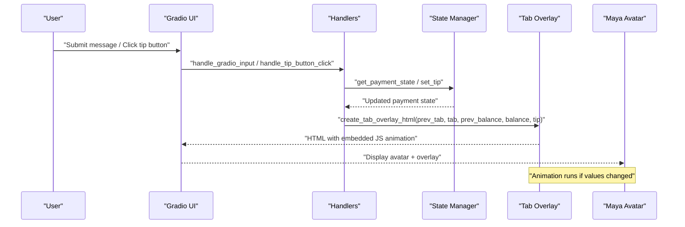
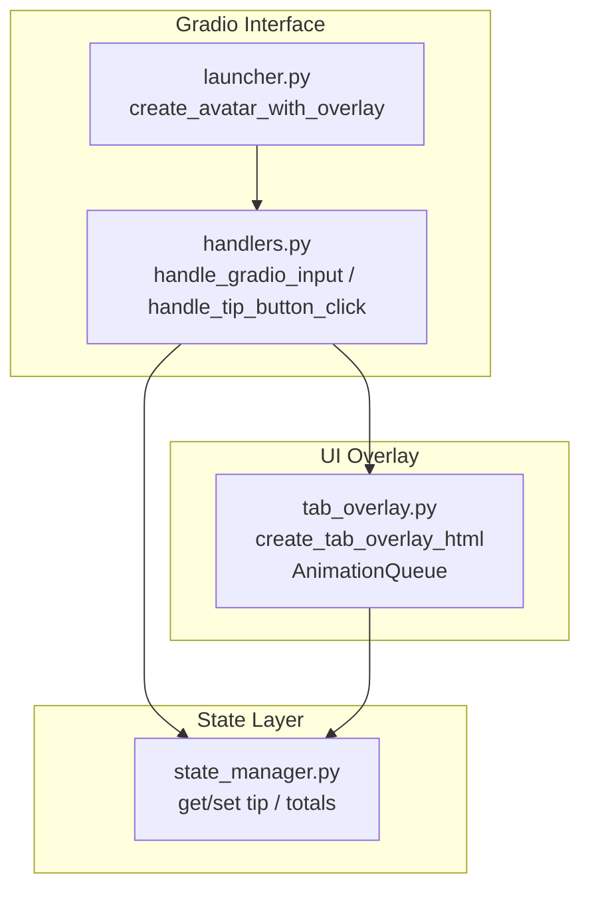
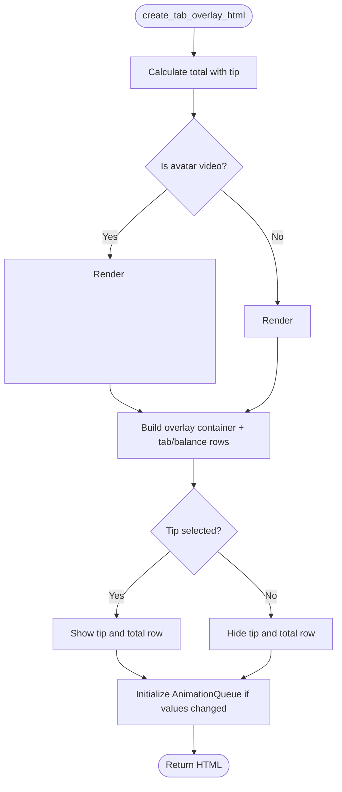
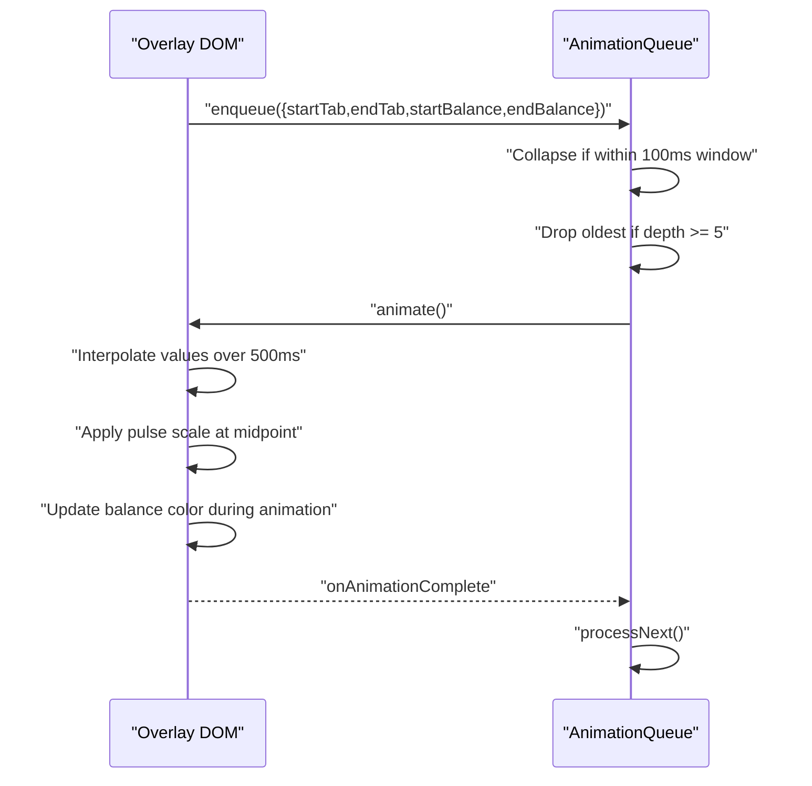
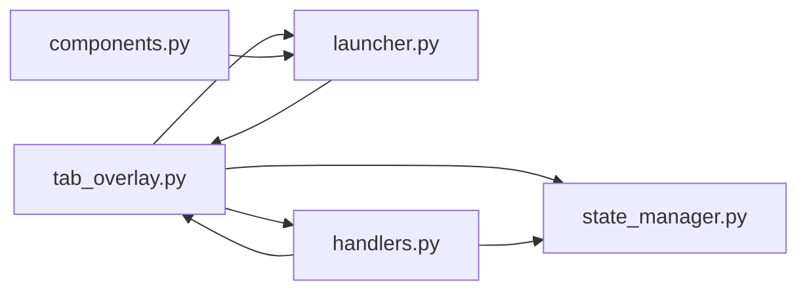

# Tab Overlay System

<cite>
**Referenced Files in This Document**
- [tab_overlay.py](file://src/ui/tab_overlay.py)
- [state_manager.py](file://src/utils/state_manager.py)
- [handlers.py](file://src/ui/handlers.py)
- [launcher.py](file://src/ui/launcher.py)
- [components.py](file://src/ui/components.py)
- [design.md](file://.kiro/specs/stripe-payment/design.md)
- [tasks.md](file://.kiro/specs/stripe-payment/tasks.md)
- [test_payment_properties.py](file://tests/test_payment_properties.py)
</cite>

## Table of Contents
1. [Introduction](#introduction)
2. [Project Structure](#project-structure)
3. [Core Components](#core-components)
4. [Architecture Overview](#architecture-overview)
5. [Detailed Component Analysis](#detailed-component-analysis)
6. [Dependency Analysis](#dependency-analysis)
7. [Performance Considerations](#performance-considerations)
8. [Troubleshooting Guide](#troubleshooting-guide)
9. [Conclusion](#conclusion)

## Introduction
This document describes the tab overlay system that displays real-time payment information superimposed on Maya's avatar. It focuses on the create_tab_overlay_html function that generates dynamic HTML overlays showing current tab balance, user balance, and tip information. The document explains the animation system that smoothly transitions between previous and current payment states, the color-coding system for different payment states, the tip percentage display system with interactive tip buttons and their JavaScript integration, responsive design considerations, CSS styling approach, and integration with the payment state manager. It also covers customization examples, animation timing adjustments, state validation, and requirements compliance for payment visibility and user feedback.

## Project Structure
The tab overlay system spans several modules:
- UI overlay generation and animation: src/ui/tab_overlay.py
- Payment state management: src/utils/state_manager.py
- Gradio UI handlers: src/ui/handlers.py
- Gradio UI launcher: src/ui/launcher.py
- Avatar setup utilities: src/ui/components.py
- Requirements and design specifications: .kiro/specs/stripe-payment/*
- Tests validating behavior: tests/test_payment_properties.py

```mermaid
graph TB
subgraph "UI Layer"
Launcher["launcher.py<br/>Gradio interface"]
Handlers["handlers.py<br/>Event handlers"]
Overlay["tab_overlay.py<br/>Overlay generator + animation"]
Components["components.py<br/>Avatar setup"]
end
subgraph "State Management"
StateMgr["state_manager.py<br/>Payment state + validation"]
end
subgraph "Specifications"
Design["design.md<br/>Component design"]
Tasks[".kiro/specs/stripe-payment/tasks.md<br/>Implementation tasks"]
end
subgraph "Tests"
Tests["test_payment_properties.py<br/>Behavioral tests"]
end
Launcher --> Handlers
Handlers --> StateMgr
Handlers --> Overlay
Launcher --> Overlay
Launcher --> Components
Overlay --> StateMgr
Design --> Overlay
Tasks --> Overlay
Tests --> Overlay
Tests --> StateMgr
```

**Diagram sources**
- [launcher.py](file://src/ui/launcher.py#L1-L354)
- [handlers.py](file://src/ui/handlers.py#L1-L392)
- [tab_overlay.py](file://src/ui/tab_overlay.py#L1-L595)
- [state_manager.py](file://src/utils/state_manager.py#L1-L814)
- [design.md](file://.kiro/specs/stripe-payment/design.md#L308-L376)
- [tasks.md](file://.kiro/specs/stripe-payment/tasks.md#L198-L402)
- [test_payment_properties.py](file://tests/test_payment_properties.py#L608-L807)

**Section sources**
- [launcher.py](file://src/ui/launcher.py#L1-L354)
- [handlers.py](file://src/ui/handlers.py#L1-L392)
- [tab_overlay.py](file://src/ui/tab_overlay.py#L1-L595)
- [state_manager.py](file://src/utils/state_manager.py#L1-L814)
- [design.md](file://.kiro/specs/stripe-payment/design.md#L308-L376)
- [tasks.md](file://.kiro/specs/stripe-payment/tasks.md#L198-L402)
- [test_payment_properties.py](file://tests/test_payment_properties.py#L608-L807)

## Core Components
- create_tab_overlay_html: Generates the HTML/CSS/JS overlay with tab and balance display, tip buttons, and tip/total rows. It positions the overlay at the bottom-left of Maya’s avatar and embeds a fade-in animation for video avatars.
- get_balance_color: Maps current balance to color-coded states (normal, warning, critical).
- create_tip_buttons_html: Renders three tip buttons (10%, 15%, 20%) with visual highlighting and disabled states when tab is $0.
- generate_tip_notification and generate_tip_removal_notification: Produce conversational messages sent to Maya when users select or remove tips.
- AnimationQueue (JavaScript): Manages serialized, collapsing animations for smooth transitions between previous and current values.
- AnimationQueue (Python mirror): Provides property-based testing parity for the JavaScript queue behavior.

Key requirements covered:
- Overlay positioning and visibility: 2.1, 2.3, 2.4, 5.1, 5.2, 5.3, 5.4, 6.1, 7.1, 7.3, 7.4
- Balance color coding: 6.3, 6.4
- Tip system: 7.1–7.12
- State validation and persistence: 1.1–1.5, 3.1–3.4, 3.3

**Section sources**
- [tab_overlay.py](file://src/ui/tab_overlay.py#L151-L485)
- [tab_overlay.py](file://src/ui/tab_overlay.py#L24-L44)
- [tab_overlay.py](file://src/ui/tab_overlay.py#L46-L116)
- [tab_overlay.py](file://src/ui/tab_overlay.py#L118-L148)
- [tab_overlay.py](file://src/ui/tab_overlay.py#L307-L483)
- [tab_overlay.py](file://src/ui/tab_overlay.py#L488-L595)
- [design.md](file://.kiro/specs/stripe-payment/design.md#L308-L376)
- [tasks.md](file://.kiro/specs/stripe-payment/tasks.md#L198-L402)

## Architecture Overview
The tab overlay integrates with the payment state manager and Gradio UI to provide real-time feedback. The flow is:



**Diagram sources**
- [handlers.py](file://src/ui/handlers.py#L23-L184)
- [handlers.py](file://src/ui/handlers.py#L218-L391)
- [state_manager.py](file://src/utils/state_manager.py#L627-L640)
- [state_manager.py](file://src/utils/state_manager.py#L556-L610)
- [tab_overlay.py](file://src/ui/tab_overlay.py#L151-L485)

## Detailed Component Analysis

### create_tab_overlay_html
Responsibilities:
- Embeds a semi-transparent dark background overlay at the bottom-left of the avatar.
- Displays “Tab” and “Balance” with animated count-up transitions when values change.
- Conditionally renders tip buttons and tip/total rows based on tip state.
- Handles avatar media (image/video) with fade-in animation for video assets.
- Embeds JavaScript animation queue and balance color logic.

Animation behavior:
- Only animates when either tab or balance differs from previous values.
- Uses linear interpolation over 500 ms with a mid-point pulse effect.
- Applies getBalanceColor to dynamically update balance text color during animation.

Tip integration:
- Renders tip buttons when tab > $0.
- Shows tip and total row when a tip is selected.
- Uses on_tip_click_callback to connect to JavaScript handler.

Responsive design:
- Container width is constrained to a maximum and adapts to parent width.
- Flex layout with gap spacing ensures readability across sizes.

Customization examples:
- Adjust avatar path for different emotion states.
- Modify colors by updating color constants.
- Change animation duration by editing the duration constant in the JS animation loop.

**Section sources**
- [tab_overlay.py](file://src/ui/tab_overlay.py#L151-L485)

### Animation System
JavaScript AnimationQueue:
- Serializes updates: new updates wait for current 500 ms animation to finish.
- Collapse strategy: updates within 100 ms are merged into a single animation with start from the first and end from the last.
- Max depth: 5 pending animations; older items are dropped if exceeded.
- Events: onAnimationStart, onAnimationComplete, onAnimationCancel callbacks.
- Cancellation: cancelAll renders final values instantly and clears queue.

Python AnimationQueue (mirror):
- Mirrors the JavaScript behavior for property-based testing.
- Validates queue length invariants and collapse behavior.

Timing adjustments:
- Duration: 500 ms for the entire animation.
- Pulse timing: mid-point scaling back to normal.
- Collapse window: 100 ms for merging rapid updates.

**Section sources**
- [tab_overlay.py](file://src/ui/tab_overlay.py#L307-L483)
- [tab_overlay.py](file://src/ui/tab_overlay.py#L488-L595)
- [test_payment_properties.py](file://tests/test_payment_properties.py#L694-L807)

### Color-Coding System
Balance thresholds:
- Normal: balance ≥ $50 → white
- Warning: 0 < balance < $50 → orange
- Critical: balance ≤ $0 → red

Dynamic updates:
- During animation, balance color updates in real-time to reflect the current interpolated value.

Validation:
- Property tests verify boundary behavior and edge cases.

**Section sources**
- [tab_overlay.py](file://src/ui/tab_overlay.py#L24-L44)
- [test_payment_properties.py](file://tests/test_payment_properties.py#L612-L686)

### Tip Percentage Display System
Tip buttons:
- Three buttons: 10%, 15%, 20%.
- Disabled/hidden when tab is $0.
- Selected button highlighted with green background and border; others use default styling.
- Immediate visual state updates on selection/toggle.

Toggle behavior:
- Clicking the same percentage removes the tip (toggle).
- Clicking a different percentage replaces the tip.

Notifications:
- generate_tip_notification composes a message with percentage and amount.
- generate_tip_removal_notification composes a message indicating removal.

Integration:
- JavaScript callback handleTipClick updates a hidden input, which triggers the tip handler.
- The handler calls set_tip and returns updated overlay HTML.

**Section sources**
- [tab_overlay.py](file://src/ui/tab_overlay.py#L46-L116)
- [tab_overlay.py](file://src/ui/tab_overlay.py#L118-L148)
- [handlers.py](file://src/ui/handlers.py#L218-L391)
- [state_manager.py](file://src/utils/state_manager.py#L556-L610)
- [test_payment_properties.py](file://tests/test_payment_properties.py#L1420-L1496)

### Responsive Design and CSS Styling
Layout:
- Overlay container uses relative positioning and flex column layout.
- Bottom-left absolute positioning with padding for spacing.
- Gap between tab and balance rows for readability.

Typography and colors:
- Dark semi-transparent background for contrast.
- Monospace-friendly font stack for consistent digit widths.
- Dynamic color for balance text based on current value.

Media handling:
- Video avatars fade in over the default background.
- Image avatars display without extra animation unless default image is used.

Constraints:
- Max width of 600 px for container to prevent overflow on large screens.
- Rounded corners for avatar media and overlay container.

**Section sources**
- [tab_overlay.py](file://src/ui/tab_overlay.py#L229-L305)

### Integration with Payment State Manager
State fields:
- tab_total, balance, tip_percentage, tip_amount, payment_status, version, needs_reconciliation.

Validation:
- Strict validation for types, ranges, and transitions.
- Tip percentage must be 10, 15, 20, or None.
- Status transitions are enforced (pending → processing → completed).

Atomic operations:
- atomic_order_update performs optimistic locking with version checks.
- atomic_payment_complete resets tab and tip, marks payment as completed.

Tip calculations:
- calculate_tip computes tip amount from tab_total and percentage.
- get_payment_total returns tab_total + tip_amount.

**Section sources**
- [state_manager.py](file://src/utils/state_manager.py#L17-L58)
- [state_manager.py](file://src/utils/state_manager.py#L627-L640)
- [state_manager.py](file://src/utils/state_manager.py#L685-L757)
- [state_manager.py](file://src/utils/state_manager.py#L535-L554)
- [state_manager.py](file://src/utils/state_manager.py#L612-L625)

### Requirements Compliance
- Overlay visibility and animation: 2.1, 2.3, 2.4, 5.1, 5.2, 5.3, 5.4
- Balance color coding: 6.3, 6.4
- Tip system: 7.1–7.12
- State validation and persistence: 1.1–1.5, 3.1–3.4, 3.3

**Section sources**
- [design.md](file://.kiro/specs/stripe-payment/design.md#L308-L376)
- [tasks.md](file://.kiro/specs/stripe-payment/tasks.md#L198-L402)

## Architecture Overview



**Diagram sources**
- [launcher.py](file://src/ui/launcher.py#L13-L47)
- [handlers.py](file://src/ui/handlers.py#L23-L184)
- [handlers.py](file://src/ui/handlers.py#L218-L391)
- [state_manager.py](file://src/utils/state_manager.py#L556-L610)
- [tab_overlay.py](file://src/ui/tab_overlay.py#L151-L485)

## Detailed Component Analysis

### create_tab_overlay_html
- Generates overlay with tab and balance display.
- Embeds tip buttons and tip/total rows when applicable.
- Handles avatar media (image/video) with fade-in animation.
- Initializes and runs the AnimationQueue on load if values changed.



**Diagram sources**
- [tab_overlay.py](file://src/ui/tab_overlay.py#L151-L485)

**Section sources**
- [tab_overlay.py](file://src/ui/tab_overlay.py#L151-L485)

### AnimationQueue (JavaScript)
- Enqueue updates with collapse window and max depth.
- Animate with linear interpolation and mid-point pulse.
- Update balance color during animation.
- Expose cancelAll and queue length inspection.



**Diagram sources**
- [tab_overlay.py](file://src/ui/tab_overlay.py#L307-L483)

**Section sources**
- [tab_overlay.py](file://src/ui/tab_overlay.py#L307-L483)

### AnimationQueue (Python Mirror)
- Mirrors enqueue, collapse, and queue length behavior.
- Used for property-based testing of queue invariants.

**Section sources**
- [tab_overlay.py](file://src/ui/tab_overlay.py#L488-L595)
- [test_payment_properties.py](file://tests/test_payment_properties.py#L694-L807)

### Tip Button System
- Render three buttons with disabled/hidden state when tab is $0.
- Highlight selected button with green background.
- JavaScript callback updates hidden input to trigger handler.

**Section sources**
- [tab_overlay.py](file://src/ui/tab_overlay.py#L46-L116)
- [launcher.py](file://src/ui/launcher.py#L170-L192)
- [handlers.py](file://src/ui/handlers.py#L218-L391)

### State Integration
- Handlers call get_payment_state and set_tip to update overlay.
- Launcher wires state variables and passes them to overlay creation.

**Section sources**
- [handlers.py](file://src/ui/handlers.py#L133-L175)
- [handlers.py](file://src/ui/handlers.py#L281-L301)
- [launcher.py](file://src/ui/launcher.py#L94-L101)
- [launcher.py](file://src/ui/launcher.py#L107-L116)

## Dependency Analysis



**Diagram sources**
- [tab_overlay.py](file://src/ui/tab_overlay.py#L1-L595)
- [state_manager.py](file://src/utils/state_manager.py#L1-L814)
- [launcher.py](file://src/ui/launcher.py#L1-L354)
- [handlers.py](file://src/ui/handlers.py#L1-L392)
- [components.py](file://src/ui/components.py#L1-L55)

**Section sources**
- [tab_overlay.py](file://src/ui/tab_overlay.py#L1-L595)
- [state_manager.py](file://src/utils/state_manager.py#L1-L814)
- [launcher.py](file://src/ui/launcher.py#L1-L354)
- [handlers.py](file://src/ui/handlers.py#L1-L392)
- [components.py](file://src/ui/components.py#L1-L55)

## Performance Considerations
- Animation duration: 500 ms provides smooth feedback without noticeable lag.
- Collapse window: 100 ms reduces redundant animations for rapid updates.
- Max queue depth: 5 prevents memory pressure from excessive pending animations.
- Color updates: getBalanceColor invoked during animation to minimize layout thrashing.
- Media fade-in: Only applied to video avatars to avoid unnecessary overhead for images.

[No sources needed since this section provides general guidance]

## Troubleshooting Guide
Common issues and resolutions:
- Values not animating: Ensure prev_tab and prev_balance differ from current values; the overlay only animates when values change.
- Tip buttons disabled unexpectedly: Verify tab_amount is greater than $0; buttons are hidden/disabled when tab is $0.
- Balance color not updating: Confirm getBalanceColor is called during animation; it updates dynamically based on current interpolated value.
- Tip toggle not working: Ensure set_tip is called with the intended percentage; clicking the same percentage toggles off.
- JavaScript callback not firing: Check that handleTipClick is globally available and the hidden tip input is wired to the change event.

**Section sources**
- [tab_overlay.py](file://src/ui/tab_overlay.py#L459-L478)
- [tab_overlay.py](file://src/ui/tab_overlay.py#L70-L71)
- [handlers.py](file://src/ui/handlers.py#L278-L280)
- [launcher.py](file://src/ui/launcher.py#L170-L192)

## Conclusion
The tab overlay system provides a robust, animated, and visually intuitive way to display real-time payment information on Maya’s avatar. It integrates tightly with the payment state manager, supports dynamic tip selection with immediate feedback, and maintains clear visual states through color-coded balances. The animation system ensures smooth transitions and efficient handling of rapid updates, while the responsive design keeps the overlay readable across screen sizes. The system adheres to the documented requirements for visibility, user feedback, and state validation.