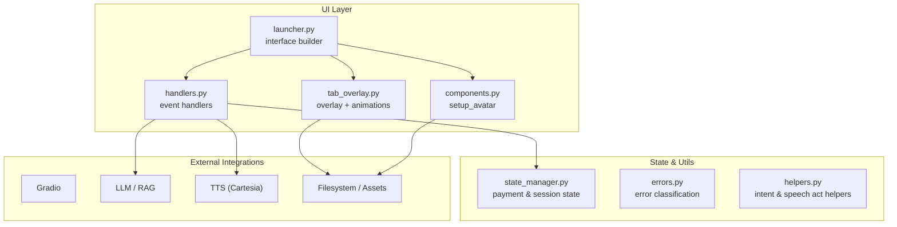
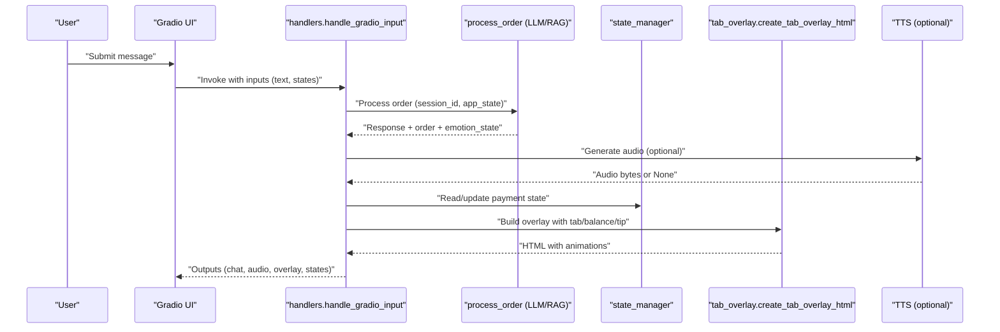
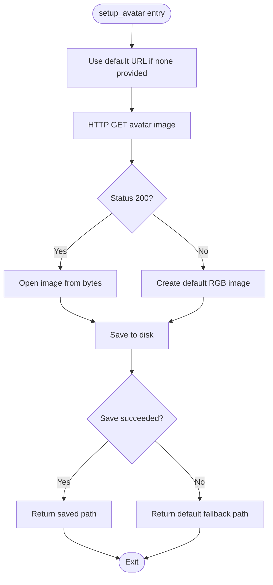
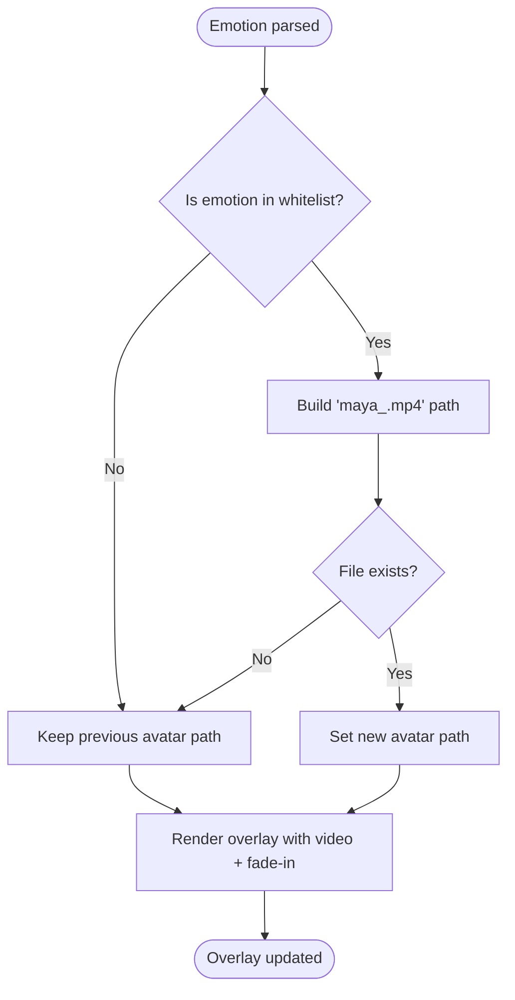
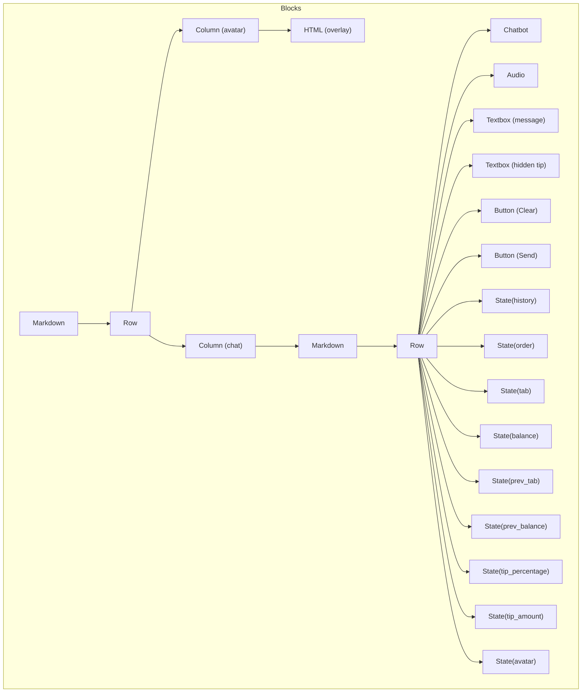
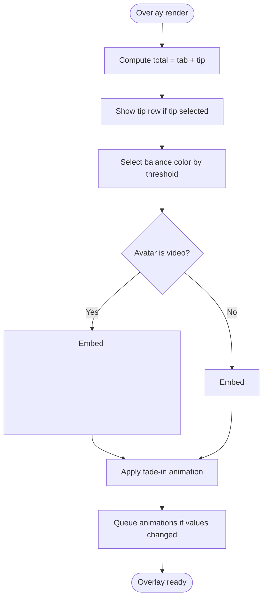
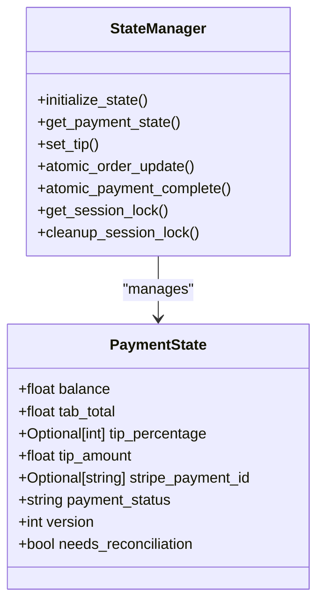
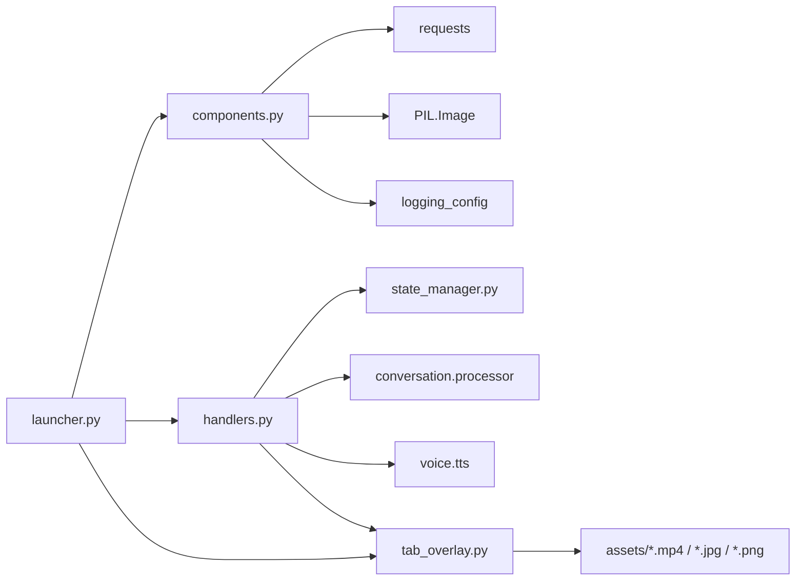

# UI Components Library

<cite>
**Referenced Files in This Document**
- [src/ui/__init__.py](file://src/ui/__init__.py)
- [src/ui/components.py](file://src/ui/components.py)
- [src/ui/handlers.py](file://src/ui/handlers.py)
- [src/ui/launcher.py](file://src/ui/launcher.py)
- [src/ui/tab_overlay.py](file://src/ui/tab_overlay.py)
- [src/utils/state_manager.py](file://src/utils/state_manager.py)
- [src/utils/errors.py](file://src/utils/errors.py)
- [src/utils/helpers.py](file://src/utils/helpers.py)
- [docs/ADR_001_AVATAR_VIDEO_FORMAT.md](file://docs/ADR_001_AVATAR_VIDEO_FORMAT.md)
- [docs/EMOTION_SYSTEM.md](file://docs/EMOTION_SYSTEM.md)
- [tests/test_ui_components.py](file://tests/test_ui_components.py)
- [tests/test_ui_handlers.py](file://tests/test_ui_handlers.py)
- [tests/test_ui_launcher.py](file://tests/test_ui_launcher.py)
</cite>

## Update Summary
**Changes Made**
- Updated section on Tip Notification Functions to reflect removal of deprecated utilities
- Revised UI Components section to emphasize simplified architecture while maintaining core capabilities
- Updated troubleshooting guide to reflect current state management approach
- Added note about deprecated functions still existing in codebase despite removal directive

## Table of Contents
1. [Introduction](#introduction)
2. [Project Structure](#project-structure)
3. [Core Components](#core-components)
4. [Architecture Overview](#architecture-overview)
5. [Detailed Component Analysis](#detailed-component-analysis)
6. [Dependency Analysis](#dependency-analysis)
7. [Performance Considerations](#performance-considerations)
8. [Troubleshooting Guide](#troubleshooting-guide)
9. [Conclusion](#conclusion)
10. [Appendices](#appendices)

## Introduction
This document describes the UI components library that powers MayaMCP's conversational bartender interface. It focuses on:
- The avatar setup system supporting remote downloads and fallbacks, and dynamic emotion-based animations
- Component composition patterns for layout, styling, and responsiveness
- Utility functions for UI state management, validation, and error handling
- Integration with Gradio components and the custom overlay styling system
- Examples of customization, theme adaptation, and accessibility considerations
- The modular architecture enabling reuse and consistent visual UX

**Updated** The library has been simplified to remove deprecated utility functions while maintaining core conversation and payment capabilities.

## Project Structure
The UI subsystem is organized around four primary modules:
- components: Avatar setup and persistence
- handlers: Gradio event handlers orchestrating conversation, TTS, and overlay updates
- launcher: Gradio interface builder with layout, state, and event wiring
- tab_overlay: HTML/CSS/JS overlay for tab/balance display, tip controls, and animations

**Diagram sources**
- [src/ui/launcher.py](file://src/ui/launcher.py#L49-L354)
- [src/ui/components.py](file://src/ui/components.py#L11-L55)
- [src/ui/tab_overlay.py](file://src/ui/tab_overlay.py#L151-L485)
- [src/ui/handlers.py](file://src/ui/handlers.py#L23-L184)
- [src/utils/state_manager.py](file://src/utils/state_manager.py#L48-L800)

**Section sources**
- [src/ui/__init__.py](file://src/ui/__init__.py#L1-L12)
- [src/ui/launcher.py](file://src/ui/launcher.py#L49-L354)

## Core Components
- Avatar setup and persistence: Downloads remote avatar images, falls back to a default image on failure, and saves to disk for later rendering.
- Event handlers: Process user input, orchestrate LLM/RAG/TTS, compute payment state, and resolve emotion-based avatar changes.
- Launcher: Builds the Gradio interface with two-column layout, stateful components, and event bindings.
- Tab overlay: Generates HTML/CSS/JS for tab/balance display, tip buttons, and animated transitions.

**Updated** The tip notification functionality has been simplified - deprecated utility functions `generate_tip_notification` and `generate_tip_removal_notification` have been removed from the core processing flow, though they still exist in the codebase for backward compatibility testing.

Key responsibilities:
- Avatar system: Remote fetch, fallback, save, and runtime selection based on emotion parsing.
- State management: Thread-safe, typed payment state with validation and atomic operations.
- Overlay: Balance color coding, tip selection, and smooth fade-in transitions for video avatars.

**Section sources**
- [src/ui/components.py](file://src/ui/components.py#L11-L55)
- [src/ui/handlers.py](file://src/ui/handlers.py#L23-L184)
- [src/ui/launcher.py](file://src/ui/launcher.py#L49-L354)
- [src/ui/tab_overlay.py](file://src/ui/tab_overlay.py#L151-L485)
- [src/utils/state_manager.py](file://src/utils/state_manager.py#L48-L800)

## Architecture Overview
The UI architecture follows a layered pattern:
- Presentation layer: Gradio Blocks with two equal columns (avatar overlay + chat)
- State layer: Gradio State components plus distributed session store
- Business logic layer: Handlers coordinate processing, TTS, and overlay updates
- Rendering layer: tab_overlay generates HTML/CSS/JS for animations and tip controls
- Asset layer: filesystem-backed avatar images and videos

**Diagram sources**
- [src/ui/handlers.py](file://src/ui/handlers.py#L23-L184)
- [src/ui/tab_overlay.py](file://src/ui/tab_overlay.py#L151-L485)
- [src/utils/state_manager.py](file://src/utils/state_manager.py#L627-L640)

## Detailed Component Analysis

### Avatar Setup System
The avatar setup system manages:
- Default avatar URL resolution
- Remote HTTP fetch with graceful fallback to a default image on failure
- Saving avatar to disk for subsequent rendering
- Runtime selection of emotion-specific avatars when assets exist

**Diagram sources**
- [src/ui/components.py](file://src/ui/components.py#L11-L55)

Key behaviors:
- Fallback on HTTP errors, request exceptions, and image processing failures
- Logging for success and error conditions
- Deterministic return path ensuring UI stability

**Section sources**
- [src/ui/components.py](file://src/ui/components.py#L11-L55)
- [tests/test_ui_components.py](file://tests/test_ui_components.py#L9-L334)

### Emotion-Based Avatar Switching
Maya's avatar reacts to internal emotional states inferred from LLM responses:
- Emotion parsing yields a state string (e.g., neutral, happy, flustered)
- The system validates the emotion against a whitelist and checks asset existence
- If valid and present, the avatar path is updated; otherwise, the previous state is preserved
- The overlay renders the new avatar with a fade-in transition

**Diagram sources**
- [src/ui/handlers.py](file://src/ui/handlers.py#L140-L175)
- [src/ui/tab_overlay.py](file://src/ui/tab_overlay.py#L198-L227)
- [docs/EMOTION_SYSTEM.md](file://docs/EMOTION_SYSTEM.md#L28-L71)

Asset format and transition:
- Videos (.mp4) are preferred for quality and performance
- A poster image is used for the initial frame during fade-in
- The overlay container uses the default avatar as a background for seamless transitions

**Section sources**
- [src/ui/handlers.py](file://src/ui/handlers.py#L140-L175)
- [src/ui/tab_overlay.py](file://src/ui/tab_overlay.py#L198-L227)
- [docs/ADR_001_AVATAR_VIDEO_FORMAT.md](file://docs/ADR_001_AVATAR_VIDEO_FORMAT.md#L1-L27)
- [docs/EMOTION_SYSTEM.md](file://docs/EMOTION_SYSTEM.md#L28-L71)

### Gradio Interface Composition
The launcher composes the UI with:
- Two-column layout: avatar overlay column (left) and chat interface column (right)
- Stateful components: chatbot, audio output, hidden tip input, and multiple State variables
- Event wiring: submit button and textbox submit trigger the input handler; clear button resets state and overlay
- Theme: Ocean theme applied to the Blocks container

**Diagram sources**
- [src/ui/launcher.py](file://src/ui/launcher.py#L84-L230)

**Section sources**
- [src/ui/launcher.py](file://src/ui/launcher.py#L49-L354)

### Tab Overlay and Tip Controls
The overlay displays:
- Tab and balance with animated count-up when values change
- Tip buttons (10%, 15%, 20%) with toggle behavior and visual highlighting
- Tip and total display when a tip is selected
- Balance color coding based on thresholds

**Updated** The tip notification functionality has been simplified. While the deprecated utility functions `generate_tip_notification` and `generate_tip_removal_notification` still exist in the codebase, the core tip processing flow now relies on the state manager for tip calculations and display.

**Diagram sources**
- [src/ui/tab_overlay.py](file://src/ui/tab_overlay.py#L151-L485)

**Section sources**
- [src/ui/tab_overlay.py](file://src/ui/tab_overlay.py#L151-L485)

### State Management Utilities
The state manager provides:
- Typed payment state with validation and constraints
- Thread-safe session locking and cleanup
- Atomic operations for order updates and payment completion
- Helper functions for tip calculation and toggling

**Diagram sources**
- [src/utils/state_manager.py](file://src/utils/state_manager.py#L17-L800)

**Section sources**
- [src/utils/state_manager.py](file://src/utils/state_manager.py#L48-L800)

### Error Handling and Resilience
The UI layer implements robust error handling:
- Avatar setup: fallback to default image and logging on network or processing errors
- Input processing: graceful degradation when LLM/RAG/TTS fail; preserves overlay state and returns safe history
- Payment state: validation and controlled transitions; atomic operations with optimistic locking

**Section sources**
- [src/ui/components.py](file://src/ui/components.py#L29-L55)
- [src/ui/handlers.py](file://src/ui/handlers.py#L97-L118)
- [src/utils/errors.py](file://src/utils/errors.py#L11-L39)

## Dependency Analysis
The UI components depend on:
- Gradio for interface construction and state binding
- PIL for image processing and fallback generation
- Requests for avatar downloads
- Local filesystem for avatar assets and poster images
- Internal state manager for payment and session state
- Optional TTS client for audio synthesis

**Diagram sources**
- [src/ui/components.py](file://src/ui/components.py#L3-L9)
- [src/ui/handlers.py](file://src/ui/handlers.py#L6-L19)
- [src/ui/launcher.py](file://src/ui/launcher.py#L3-L8)
- [src/ui/tab_overlay.py](file://src/ui/tab_overlay.py#L8-L11)

**Section sources**
- [src/ui/components.py](file://src/ui/components.py#L3-L9)
- [src/ui/handlers.py](file://src/ui/handlers.py#L6-L19)
- [src/ui/launcher.py](file://src/ui/launcher.py#L3-L8)
- [src/ui/tab_overlay.py](file://src/ui/tab_overlay.py#L8-L11)

## Performance Considerations
- Avatar delivery: Prefer MP4 for videos to reduce bandwidth and improve playback performance; use poster images for instant visual continuity.
- Overlay animations: The animation queue collapses rapid updates and caps queue depth to minimize UI jitter.
- Network resilience: Avatar setup retries and fallbacks prevent UI stalls on network failures.
- State updates: Atomic operations and thread-safe locks avoid race conditions and ensure consistent state.

## Troubleshooting Guide
Common issues and resolutions:
- Avatar not updating: Verify asset existence under assets/maya_<emotion>.mp4 and corresponding poster image; ensure emotion parsing returns a recognized state.
- Overlay not animating: Confirm tab/balance values actually changed; the animation triggers only on value differences.
- TTS not playing: Ensure TTS client is configured and response text is non-empty; failures are logged and UI continues without audio.
- Payment state inconsistencies: Use atomic operations; check for version mismatches and insufficient funds errors.

**Updated** Tip notification functionality: The deprecated utility functions `generate_tip_notification` and `generate_tip_removal_notification` still exist in the codebase but are no longer actively used in the core tip processing flow. The tip display and calculation are now handled entirely by the state manager and tab overlay components.

**Section sources**
- [src/ui/handlers.py](file://src/ui/handlers.py#L97-L118)
- [src/ui/tab_overlay.py](file://src/ui/tab_overlay.py#L407-L483)
- [src/utils/state_manager.py](file://src/utils/state_manager.py#L685-L757)

## Conclusion
MayaMCP's UI components library provides a robust, modular, and resilient interface for conversational ordering and avatar-driven feedback. The avatar system supports remote fetching, fallbacks, and emotion-based animations with smooth transitions. The Gradio-based launcher composes a responsive layout with stateful components and event handlers. Built-in state management and error handling ensure consistent UX even under failure conditions.

**Updated** The library has been simplified by removing deprecated utility functions while maintaining core conversation and payment capabilities. The system now focuses on streamlined state management and direct tip processing through the overlay components.

## Appendices

### Component Customization Examples
- Change default avatar: Provide a custom avatar_path to the launcher; ensure the path resolves to an existing image/video.
- Modify tip percentages: Update the tip button constants and handler logic to support additional options.
- Adjust overlay styles: Edit the embedded CSS in the overlay generator to change fonts, colors, and layout.
- Theme adaptation: Swap the Ocean theme for another Gradio theme; verify responsive behavior across screen sizes.

### Accessibility Considerations
- Contrast and color: Balance color coding meets minimum contrast ratios; adjust colors for low vision needs.
- Keyboard navigation: Ensure textboxes and buttons are focusable and operable via keyboard.
- Screen reader support: Use descriptive labels and aria attributes where applicable in custom HTML.
- Motion sensitivity: Provide reduced motion options; the overlay's animations can be tuned or disabled.

### Deprecated Function Reference
**Updated** The following utility functions have been removed from the core processing flow but still exist in the codebase for backward compatibility:

- `generate_tip_notification`: Creates conversational tip selection notifications
- `generate_tip_removal_notification`: Creates conversational tip removal notifications

These functions are no longer actively used in the tip processing workflow and have been replaced by direct state management through the overlay components.