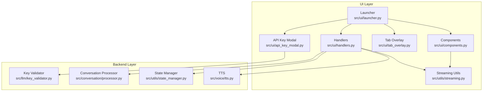
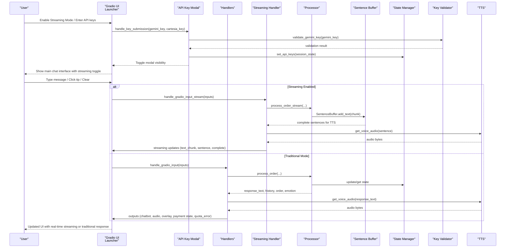
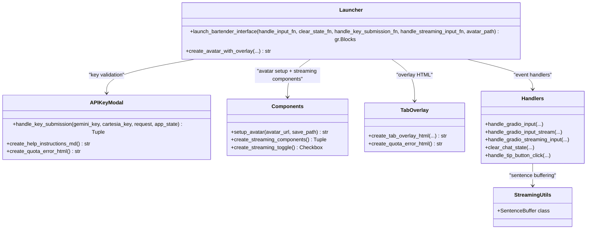
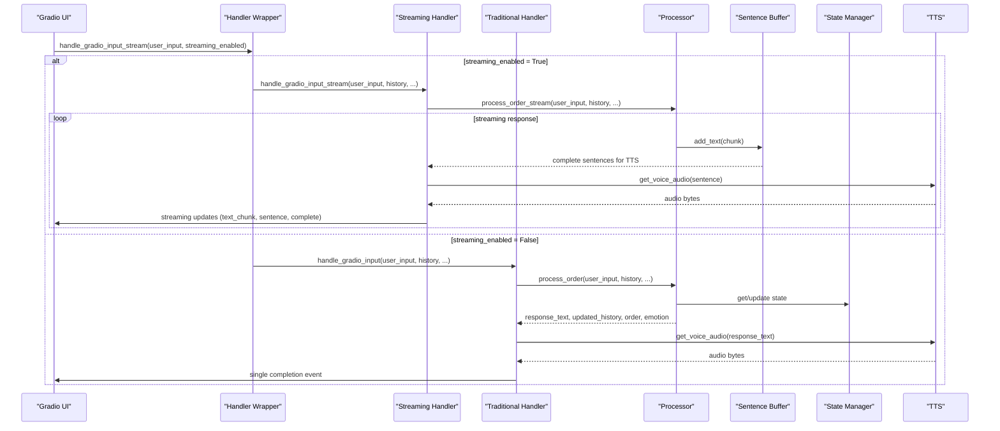
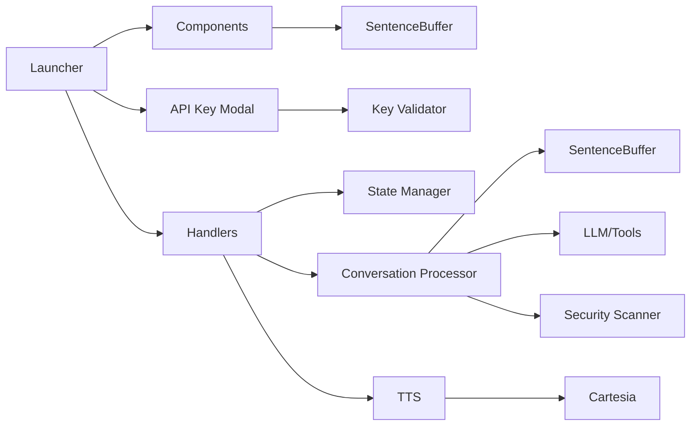

# User Interface Components

<cite>
**Referenced Files in This Document**
- [launcher.py](file://src/ui/launcher.py)
- [api_key_modal.py](file://src/ui/api_key_modal.py)
- [tab_overlay.py](file://src/ui/tab_overlay.py)
- [components.py](file://src/ui/components.py)
- [handlers.py](file://src/ui/handlers.py)
- [state_manager.py](file://src/utils/state_manager.py)
- [key_validator.py](file://src/llm/key_validator.py)
- [processor.py](file://src/conversation/processor.py)
- [tts.py](file://src/voice/tts.py)
- [streaming.py](file://src/utils/streaming.py)
- [test_ui_launcher.py](file://tests/test_ui_launcher.py)
- [test_ui_components.py](file://tests/test_ui_components.py)
- [test_ui_handlers.py](file://tests/test_ui_handlers.py)
- [test_streaming.py](file://tests/test_streaming.py)
- [README.md](file://README.md)
</cite>

## Update Summary
**Changes Made**
- Added comprehensive documentation for streaming components including create_streaming_components() and create_streaming_toggle() functions
- Documented the new streaming vs traditional mode architecture with real-time text and audio generation
- Enhanced the handler system with streaming-specific callbacks including handle_gradio_input_stream() and handle_gradio_streaming_input()
- Added SentenceBuffer utility for pipelined TTS processing
- Updated state management to support streaming mode with separate text/audio displays
- Enhanced launcher architecture with streaming mode toggle and dual display components

## Table of Contents
1. [Introduction](#introduction)
2. [Project Structure](#project-structure)
3. [Core Components](#core-components)
4. [Architecture Overview](#architecture-overview)
5. [Detailed Component Analysis](#detailed-component-analysis)
6. [Dependency Analysis](#dependency-analysis)
7. [Performance Considerations](#performance-considerations)
8. [Troubleshooting Guide](#troubleshooting-guide)
9. [Conclusion](#conclusion)
10. [Appendices](#appendices)

## Introduction
This document explains MayaMCP's Gradio-based user interface system with a focus on the interactive chat experience and visual feedback. The interface has been completely redesigned to support both streaming and traditional modes, featuring real-time text and audio generation capabilities. The system includes enhanced streaming components with create_streaming_components() and create_streaming_toggle() functions that enable immediate feedback during conversation processing. The interface supports a dual-state architecture: an API key input modal that validates credentials before granting access to the main chat interface, and a comprehensive main chat interface with real-time payment information display and animated updates. The system covers the launcher architecture that initializes the Gradio interface with Maya's avatar display and conversation controls, the tab overlay system that shows real-time payment information with animated updates and color-coded warnings, the event handling system that processes user inputs, manages conversation state, coordinates with backend services, and the avatar animation system that responds to conversation context with different emotional expressions. It also documents component composition patterns, styling approaches, responsive design considerations, UI interaction examples, state synchronization between frontend and backend, accessibility features, audio playback integration, visual feedback systems, and real-time updates during conversations.

## Project Structure
The UI system is composed of six primary modules under src/ui plus streaming utilities:
- Launcher: builds the Gradio Blocks layout with dual-state architecture (API key modal + main chat), wires events, and manages session state.
- API Key Modal: handles BYOK authentication with key validation, error display, and state transitions.
- Tab overlay: generates the avatar overlay with animated tab/balance display, tip buttons, and quota error popup.
- Components: avatar setup and fallback handling, plus streaming-specific component creation functions.
- Handlers: event callbacks for user input, clear, tip button clicks, and streaming vs traditional mode handling.
- Streaming Utilities: SentenceBuffer for pipelined TTS processing and streaming response generation.

These modules integrate with backend services:
- State manager: thread-safe, typed payment and conversation state with API key validation.
- Key validator: lightweight API key validation for Gemini and optional Cartesia keys.
- Conversation processor: orchestrates LLM/tool calls, order processing, and emotion extraction with streaming support.
- TTS: text-to-speech synthesis for agent audio with streaming capabilities.

**Diagram sources**
- [launcher.py](file://src/ui/launcher.py#L50-L375)
- [api_key_modal.py](file://src/ui/api_key_modal.py#L83-L137)
- [tab_overlay.py](file://src/ui/tab_overlay.py#L151-L595)
- [components.py](file://src/ui/components.py#L60-L135)
- [handlers.py](file://src/ui/handlers.py#L260-L494)
- [streaming.py](file://src/utils/streaming.py#L12-L116)
- [state_manager.py](file://src/utils/state_manager.py#L306-L310)
- [key_validator.py](file://src/llm/key_validator.py#L20-L87)
- [processor.py](file://src/conversation/processor.py#L566-L634)
- [tts.py](file://src/voice/tts.py#L140-L200)

**Section sources**
- [launcher.py](file://src/ui/launcher.py#L1-L375)
- [api_key_modal.py](file://src/ui/api_key_modal.py#L1-L137)
- [tab_overlay.py](file://src/ui/tab_overlay.py#L1-L595)
- [components.py](file://src/ui/components.py#L1-L135)
- [handlers.py](file://src/ui/handlers.py#L1-L494)
- [streaming.py](file://src/utils/streaming.py#L1-L116)
- [state_manager.py](file://src/utils/state_manager.py#L1-L894)
- [key_validator.py](file://src/llm/key_validator.py#L1-L87)
- [processor.py](file://src/conversation/processor.py#L1-L634)
- [tts.py](file://src/voice/tts.py#L1-L200)

## Core Components
- Launcher: constructs the Gradio Blocks layout with dual-state architecture - API key modal (visible by default) and main chat interface (hidden until validation), defines session state variables including keys_validated_state, wires submit/clear/tip events, injects JavaScript for tip button handling, and adds streaming mode toggle.
- API Key Modal: handles BYOK authentication with Gemini key validation, Cartesia key optional support, error display, and state transitions between modal and chat interface.
- Tab overlay: renders an avatar with a bottom-left overlay showing tab, balance, tip, and total; includes animated count-up transitions, tip buttons with toggle behavior, and quota error popup overlay for rate limit handling.
- Components: downloads and saves the bartender avatar with robust fallbacks, plus streaming-specific component creation functions for real-time text and audio display.
- Handlers: process user input, manage conversation state, update payment state, resolve avatar emotion, orchestrate TTS, handle quota error scenarios, and support both streaming and traditional modes.
- Streaming Utilities: SentenceBuffer class for buffering streaming text and yielding complete sentences for TTS processing, enabling pipelined audio generation.
- State manager: provides typed, validated payment state, thread-safe locking, atomic operations for order updates and tip toggling, and API key state management.
- Key validator: validates Gemini API keys with lightweight API calls and provides meaningful error messages for authentication failures.
- Conversation processor: orchestrates LLM/tool calls, order processing, and emotion extraction from agent responses with streaming support.
- TTS: cleans text for speech, initializes Cartesia client, and synthesizes audio with retry logic.

**Section sources**
- [launcher.py](file://src/ui/launcher.py#L50-L375)
- [api_key_modal.py](file://src/ui/api_key_modal.py#L83-L137)
- [tab_overlay.py](file://src/ui/tab_overlay.py#L151-L595)
- [components.py](file://src/ui/components.py#L60-L135)
- [handlers.py](file://src/ui/handlers.py#L260-L494)
- [streaming.py](file://src/utils/streaming.py#L12-L116)
- [state_manager.py](file://src/utils/state_manager.py#L306-L310)
- [key_validator.py](file://src/llm/key_validator.py#L20-L87)
- [processor.py](file://src/conversation/processor.py#L566-L634)
- [tts.py](file://src/voice/tts.py#L140-L200)

## Architecture Overview
The UI architecture follows a clear separation of concerns with the new streaming-enabled workflow:
- Frontend (Gradio): Dual-state layout with API key modal and main chat interface, session state management, event wiring, and streaming mode toggle.
- Backend (Handlers): Orchestrates conversation, payment, audio, quota error handling, and streaming vs traditional mode selection.
- State (State Manager): Centralized, typed, and validated state with thread-safety and API key validation.
- Key Validation: Lightweight Gemini key validation with error handling and user guidance.
- Tools/LangChain: Conversation processing and tool execution with streaming support.
- Audio: TTS integration with retry and fallback, supporting both traditional and streaming audio generation.
- Streaming: SentenceBuffer for pipelined TTS processing and real-time text/audio updates.

**Diagram sources**
- [launcher.py](file://src/ui/launcher.py#L216-L236)
- [api_key_modal.py](file://src/ui/api_key_modal.py#L83-L137)
- [handlers.py](file://src/ui/handlers.py#L260-L494)
- [processor.py](file://src/conversation/processor.py#L566-L634)
- [streaming.py](file://src/utils/streaming.py#L60-L100)
- [state_manager.py](file://src/utils/state_manager.py#L646-L658)
- [key_validator.py](file://src/llm/key_validator.py#L20-L87)
- [tts.py](file://src/voice/tts.py#L140-L200)

## Detailed Component Analysis

### Launcher: Dual-State Interface with Streaming Mode
The launcher creates the main Gradio Blocks layout with a completely redesigned dual-state architecture:
- Theme: Ocean.
- Two-column layout: API key modal column (visible=True) and main chat column (visible=False).
- Session state: history, order, keys_validated_state, and payment state variables.
- API Key Modal: Gemini key (required) and Cartesia key (optional) inputs with password masking.
- Main Chat Interface: Avatar overlay, chatbot, audio output, text input, tip buttons, and clear/send buttons.
- Streaming Mode Toggle: Checkbox to enable/disable real-time streaming mode.
- Streaming Components: Separate text and audio displays for real-time updates.
- JavaScript: global handleTipClick function to populate hidden tip input and trigger Gradio events.
- Event wiring: submit inputs/outputs include all state variables; clear wrapper resets overlay and state; tip click handler delegates to a dedicated handler.

Key behaviors:
- BYOK key submission: Validates Gemini key with validation function, stores keys in session state, and toggles UI visibility.
- Avatar setup fallback: if avatar path is None, attempts to download and save a default avatar; on failure, falls back to a default asset path.
- State persistence: avatar path is maintained across updates and errors.
- Animation: overlay HTML is regenerated with previous/current values to drive JavaScript animation queue.
- Quota error handling: Main chat interface includes quota_error_display HTML element for popup overlay.
- Streaming mode: Toggle determines whether to use streaming or traditional input handlers.

**Updated** The launcher now implements a dual-state architecture with streaming mode toggle and separate streaming components for real-time text and audio display.

**Section sources**
- [launcher.py](file://src/ui/launcher.py#L50-L375)

#### Launcher Class Diagram

**Diagram sources**
- [launcher.py](file://src/ui/launcher.py#L50-L375)
- [api_key_modal.py](file://src/ui/api_key_modal.py#L83-L137)
- [components.py](file://src/ui/components.py#L60-L135)
- [tab_overlay.py](file://src/ui/tab_overlay.py#L151-L595)
- [handlers.py](file://src/ui/handlers.py#L260-L494)
- [streaming.py](file://src/utils/streaming.py#L12-L116)

### API Key Modal: BYOK Authentication and Validation
The API key modal handles the new BYOK workflow:
- Gemini key validation: Required for chat access; validates with lightweight API call.
- Cartesia key optional: Optional for voice functionality; stored alongside Gemini key.
- Error handling: Provides meaningful error messages for invalid keys, rate limits, and authentication failures.
- State management: Stores validated keys in session state and updates keys_validated_state.
- Help instructions: Provides step-by-step guidance for obtaining API keys from Google AI Studio and Cartesia.
- UI transitions: Hides API key modal and shows main chat interface upon successful validation.

Key validation features:
- Validates Gemini API key using `validate_gemini_key()` function.
- Handles various error scenarios: empty keys, invalid format, authentication failures, rate limits, and network errors.
- Provides user-friendly error messages with specific guidance for each failure type.
- Thread-safe validation using `_VALIDATE_LOCK` to prevent concurrent validation attempts.

**Section sources**
- [api_key_modal.py](file://src/ui/api_key_modal.py#L83-L137)
- [key_validator.py](file://src/llm/key_validator.py#L20-L87)

### Tab Overlay: Real-Time Payment Display with Animated Updates and Quota Error Popup
The tab overlay renders:
- Avatar media: image or video with poster fallback and fade-in animation.
- Bottom-left overlay: tab, balance, tip buttons, and tip/total rows.
- Tip buttons: 10%, 15%, 20% with toggle behavior; disabled when tab is zero.
- Balance color coding: white (>= $50), orange (< $50), red (<= $0).
- Animated count-up: JavaScript AnimationQueue collapses rapid updates, animates from previous to current values, applies pulse scaling, and updates balance color dynamically.
- Quota error popup: Overlay popup for rate limit exceeded scenarios with dismiss functionality.

JavaScript features:
- AnimationQueue: enqueues updates, collapses recent updates, runs animations with requestAnimationFrame, and exposes cancelAll and queue length.
- getBalanceColor: returns color based on current balance.
- Window initialization: compares dataset values and enqueues animation if values changed.
- Quota error popup: Fixed-position overlay with styled popup container and dismiss button.

HTML/CSS/JS generation:
- Embeds styles, media, overlay, tip buttons, and tip/total rows.
- Uses data attributes for start/end values to drive animation.
- Quota error popup includes styled container with backdrop, content, and dismiss button.

**Updated** The tab overlay now works seamlessly with both streaming and traditional modes, providing consistent payment state visualization.

**Section sources**
- [tab_overlay.py](file://src/ui/tab_overlay.py#L151-L595)

#### Tab Overlay Flowchart

**Diagram sources**
- [tab_overlay.py](file://src/ui/tab_overlay.py#L307-L483)

### Components: Avatar Setup and Streaming Components
The avatar setup function:
- Downloads an image from a default URL or a provided URL.
- Processes the image with PIL and saves to disk.
- Provides robust fallbacks: blank image on HTTP failure or processing errors; logs warnings and errors appropriately.
- Returns the saved path or a fallback default path.

**Updated** The components module now includes streaming-specific functions:
- `create_streaming_components()`: Creates tuple of (chatbot_display, agent_audio_output, msg_input, streaming_text_display, streaming_audio_player) for real-time text and audio display.
- `create_streaming_toggle()`: Creates checkbox for enabling/disabling streaming mode with informative description.

Streaming components features:
- Main chatbot: Standard conversation history display.
- Agent audio output: Traditional non-streaming audio output for fallback.
- Streaming text display: Hidden textbox for real-time text updates during streaming.
- Streaming audio player: Hidden audio player for immediate audio playback during streaming.
- Message input: Standard text input for user messages.

**Section sources**
- [components.py](file://src/ui/components.py#L13-L58)
- [components.py](file://src/ui/components.py#L60-L135)

### Handlers: Event Processing, State Coordination, and Streaming Support
The handlers coordinate:
- Input processing: calls the conversation processor, generates TTS audio, resolves avatar emotion, and rebuilds overlay HTML with animation values.
- Clear state: resets session state and clears UI outputs.
- Tip button click: toggles tip percentage, sends notification to Maya, updates state, and returns audio and overlay.
- Streaming vs traditional mode: Wrapper function selects appropriate handler based on streaming toggle.
- Quota error handling: Detects quota limit errors from Gemini API calls and returns quota error HTML for popup display.

**Updated** The handlers now include comprehensive streaming support:
- `handle_gradio_input_stream()`: Streaming handler that yields text chunks, complete sentences for TTS, and final completion events.
- `handle_gradio_streaming_input()`: Wrapper that routes to streaming or traditional handler based on toggle state.
- Sentence buffering: Uses SentenceBuffer to split streaming text into complete sentences for TTS processing.
- Real-time updates: Yields intermediate events for immediate UI updates during streaming.

State synchronization:
- Payment state is read/written via the state manager; tip toggling uses atomic operations.
- Conversation state is updated through the processor; order state is derived from current order.
- Emotion state extracted from agent responses drives avatar emotion resolution.
- API key validation is checked before processing chat inputs.
- Streaming mode state is tracked separately from traditional mode.

Audio integration:
- TTS is invoked only when response text is non-empty and a client is available.
- Streaming mode generates audio for complete sentences as they become available.
- Retry logic and error handling ensure graceful degradation.
- Streaming audio player receives audio chunks for immediate playback.

Quota error handling:
- `_is_quota_error()` function detects rate limit and quota exceeded scenarios.
- Returns QUOTA_ERROR_SENTINEL to indicate quota issues to the UI.
- Generates styled quota error popup HTML for user notification.

**Section sources**
- [handlers.py](file://src/ui/handlers.py#L260-L494)
- [state_manager.py](file://src/utils/state_manager.py#L646-L658)
- [processor.py](file://src/conversation/processor.py#L566-L634)
- [tts.py](file://src/voice/tts.py#L140-L200)

#### Handlers Sequence Diagram

**Diagram sources**
- [handlers.py](file://src/ui/handlers.py#L456-L494)
- [handlers.py](file://src/ui/handlers.py#L260-L454)
- [processor.py](file://src/conversation/processor.py#L566-L634)
- [streaming.py](file://src/utils/streaming.py#L60-L100)
- [state_manager.py](file://src/utils/state_manager.py#L646-L658)
- [tts.py](file://src/voice/tts.py#L140-L200)

### Streaming Utilities: SentenceBuffer for Pipelined TTS
The SentenceBuffer class provides:
- Text chunk buffering: Accumulates streaming text from LLM responses.
- Sentence boundary detection: Identifies complete sentences using regex patterns.
- Abbreviation handling: Prevents false sentence boundaries for common abbreviations.
- Partial text tracking: Maintains incomplete sentences for final flush.
- Pipeline integration: Enables pipelined TTS by sending complete sentences immediately.

Key features:
- Sentence boundary regex: Matches periods, exclamation marks, and question marks.
- Abbreviation list: Handles common abbreviations like mr, mrs, dr, prof, etc.
- False boundary detection: Checks context to avoid splitting abbreviations incorrectly.
- Buffer management: Efficiently manages text accumulation and sentence extraction.
- Flush capability: Returns remaining content as final sentences.

**Section sources**
- [streaming.py](file://src/utils/streaming.py#L12-L116)

### Avatar Animation System: Emotion-Based Expressions
The avatar animation system:
- Resolves emotion from agent responses using a STATE tag pattern.
- Switches to emotion-specific assets (e.g., maya_happy.mp4) when available.
- Maintains current avatar path across updates and errors to preserve continuity.
- Supports six emotions: neutral, happy, flustered, thinking, mixing, upset.

**Section sources**
- [handlers.py](file://src/ui/handlers.py#L40-L70)
- [processor.py](file://src/conversation/processor.py#L76-L84)

## Dependency Analysis
The UI components depend on backend services for state, conversation processing, audio synthesis, and API key validation. The state manager provides:
- Typed payment state with validation.
- Thread-safe locking and atomic operations for concurrent access.
- Tip calculation and toggle behavior.
- Versioned optimistic locking for order updates.
- API key state management with validation tracking.

The key validator provides:
- Lightweight Gemini key validation using `models.list()` API call.
- Comprehensive error handling for various failure scenarios.
- Thread-safe validation using mutex locks.

The conversation processor depends on:
- LLM/tool calling for intent detection and order processing.
- Security scanning for input/output filtering.
- Phase management for conversation flow.
- Streaming support for real-time text generation.

The TTS module depends on:
- Cartesia client initialization and retry logic.
- Text cleaning for pronunciation and punctuation.

**Updated** The streaming components add new dependencies:
- SentenceBuffer for pipelined TTS processing.
- Streaming-specific processor functions for real-time response generation.
- Enhanced handler routing for streaming vs traditional mode selection.

**Diagram sources**
- [launcher.py](file://src/ui/launcher.py#L50-L375)
- [api_key_modal.py](file://src/ui/api_key_modal.py#L83-L137)
- [handlers.py](file://src/ui/handlers.py#L260-L494)
- [components.py](file://src/ui/components.py#L60-L135)
- [streaming.py](file://src/utils/streaming.py#L12-L116)
- [state_manager.py](file://src/utils/state_manager.py#L306-L310)
- [key_validator.py](file://src/llm/key_validator.py#L20-L87)
- [processor.py](file://src/conversation/processor.py#L566-L634)
- [tts.py](file://src/voice/tts.py#L1-L200)

**Section sources**
- [state_manager.py](file://src/utils/state_manager.py#L306-L310)
- [key_validator.py](file://src/llm/key_validator.py#L20-L87)
- [processor.py](file://src/conversation/processor.py#L566-L634)
- [tts.py](file://src/voice/tts.py#L1-L200)

## Performance Considerations
- Animation queue collapsing: the JavaScript AnimationQueue merges rapid updates within a short window to reduce redundant animations and maintain smooth UI updates.
- RequestAnimationFrame: animations use efficient frame scheduling for smooth transitions.
- TTS retry: exponential backoff reduces repeated failures and improves reliability.
- State locking: thread-safe access prevents race conditions and ensures consistent state across concurrent requests.
- Minimal DOM updates: overlay HTML is regenerated with data attributes to drive targeted updates.
- API key validation caching: Validation results are cached per session to avoid repeated API calls.
- Quota error popup: Fixed-position overlay minimizes layout shifts and maintains user focus on error resolution.
- **Updated** Streaming performance optimizations:
  - SentenceBuffer reduces TTS latency by processing complete sentences immediately.
  - Real-time text updates provide immediate feedback during long responses.
  - Streaming audio player enables immediate playback of audio chunks.
  - Memory-efficient text chunk processing prevents excessive memory usage.
  - Asynchronous TTS generation prevents UI blocking during audio synthesis.

**Updated** Performance considerations now include streaming-specific optimizations and real-time processing capabilities.

## Troubleshooting Guide
Common issues and resolutions:
- Avatar setup failures: The launcher attempts avatar setup; on exception, it logs and continues with a default avatar path. The components module provides robust fallbacks for HTTP errors, processing errors, and save failures.
- TTS failures: The handlers catch TTS exceptions and return None for audio; the UI remains functional with text-only responses.
- Empty or whitespace-only responses: The handlers skip TTS generation and continue with UI updates.
- Tip button click handling: The JavaScript function populates a hidden input and triggers Gradio events; ensure the hidden input is present and the function is globally available.
- State reset on clear: The clear handler resets backend state and clears UI outputs; on backend errors, the UI is still cleared to ensure a clean state.
- API key validation failures: The API key modal provides specific error messages for invalid keys, authentication failures, and rate limits. Users can access help instructions for obtaining valid keys.
- Quota error popup: When rate limits are exceeded, the quota error popup appears with dismiss functionality. Users can wait for quota reset or enable billing for continued access.
- **Updated** Streaming mode issues:
  - Streaming toggle not working: Ensure streaming mode is enabled in the UI and that the toggle function is properly wired.
  - Real-time text not appearing: Check that streaming components are visible and that the SentenceBuffer is properly configured.
  - Audio delays: Verify that TTS client is available and that sentence boundaries are being detected correctly.
  - Memory issues: Monitor streaming buffer size and ensure proper cleanup of streaming resources.
  - Mixed streaming/traditional behavior: Verify that the handler wrapper is correctly routing to the appropriate handler based on toggle state.

**Updated** Troubleshooting guide now includes streaming mode specific scenarios and solutions.

**Section sources**
- [launcher.py](file://src/ui/launcher.py#L66-L81)
- [handlers.py](file://src/ui/handlers.py#L120-L132)
- [api_key_modal.py](file://src/ui/api_key_modal.py#L102-L118)
- [test_ui_launcher.py](file://tests/test_ui_launcher.py#L311-L335)
- [test_ui_handlers.py](file://tests/test_ui_handlers.py#L236-L268)
- [test_streaming.py](file://tests/test_streaming.py#L204-L289)

## Conclusion
MayaMCP's UI system combines a responsive Gradio layout with a robust tab overlay that provides real-time financial feedback and animated transitions. The completely redesigned BYOK workflow ensures secure API key management with validation and error handling. The dual-state interface with API key modal and main chat provides a seamless user experience while maintaining security. The event handling system integrates conversation processing, payment state management, audio synthesis, and quota error handling to deliver a cohesive, interactive experience. The avatar animation system enhances engagement by reflecting conversation context through emotion-based expressions. **Updated** The new streaming components significantly enhance the user experience by providing real-time text and audio feedback during conversation processing, with SentenceBuffer enabling pipelined TTS for immediate audio playback. Together, these components form a scalable, accessible, and visually engaging interface that balances performance and user experience while implementing modern security practices and cutting-edge streaming technology.

**Updated** The conclusion now reflects the enhanced streaming capabilities and real-time processing features.

## Appendices

### UI Interaction Examples
- API Key Entry: Enter Gemini API key (required) and optional Cartesia key (optional) in the modal form.
- Chat Access: Click "Start Chatting" to validate keys and transition to main chat interface.
- Ordering drinks: "I'd like a margarita" triggers order processing and updates tab and balance.
- Checking order: "What's in my order?" returns current items and total.
- Recommendations: "Something fruity please" elicits suggestions.
- Billing and payment: "What's my total?" and "I'll pay now" manage bill and payment state.
- Tip selection: Click 10%/15%/20% buttons or say "Add a 20% tip"; toggle removes tip.
- Quota Error Handling: When rate limits are exceeded, a popup appears with guidance for resolution.
- **Updated** Streaming Mode Examples:
  - Toggle streaming: Enable "Enable Streaming Mode" checkbox for real-time feedback.
  - Real-time text: "Tell me about cocktails" shows text appearing as Maya generates responses.
  - Immediate audio: Streaming audio player provides immediate playback of completed sentences.
  - Mixed mode: Traditional mode shows complete responses after processing is finished.

**Updated** UI interaction examples now include streaming mode scenarios and real-time feedback capabilities.

**Section sources**
- [README.md](file://README.md#L184-L230)

### State Synchronization Between Frontend and Backend
- Inputs: user message, session history, current tab, balance, tip percentage, tip amount, avatar path, API key validation state, streaming mode toggle.
- Outputs: empty input, updated history, updated history for display, order state, audio data, overlay HTML, new tab, new balance, previous values for animation, tip percentage, tip amount, avatar path, quota error HTML, streaming text display, streaming audio player.
- Payment state: read via state manager; tip toggling uses atomic operations; optimistic locking prevents concurrent modification conflicts.
- API key state: validated and stored in session state; keys_validated_state tracks authentication status.
- Quota error state: returned as HTML for popup display when rate limits are exceeded.
- **Updated** Streaming state synchronization:
  - Streaming mode toggle: Controls handler selection between streaming and traditional modes.
  - Real-time updates: Streaming handlers yield intermediate events for immediate UI updates.
  - Sentence buffering: Manages text accumulation and sentence boundary detection.
  - Audio pipeline: Coordinates TTS generation with streaming text chunks.
  - Component visibility: Streaming text and audio displays are managed separately from traditional components.

**Updated** State synchronization now includes streaming mode and real-time update coordination.

**Section sources**
- [launcher.py](file://src/ui/launcher.py#L216-L236)
- [handlers.py](file://src/ui/handlers.py#L260-L494)
- [state_manager.py](file://src/utils/state_manager.py#L646-L658)

### Accessibility Features
- Labels and placeholders guide user actions.
- Autoplay audio is controlled by the UI; users can disable audio if desired.
- Clear button resets all state and UI elements.
- Responsive layout adapts to screen sizes with equal column scaling.
- API key modal provides clear error messages and help instructions.
- Quota error popup includes dismiss functionality for accessibility.
- Tip buttons provide visual feedback and keyboard navigation support.
- **Updated** Streaming accessibility features:
  - Streaming toggle provides clear indication of current mode.
  - Real-time text display allows users to follow conversation progress.
  - Separate streaming components can be disabled for users who prefer traditional mode.
  - Audio controls work independently for streaming vs traditional audio players.
  - Screen readers can access streaming text updates as they appear.

**Updated** Accessibility features now include streaming mode considerations and real-time feedback accessibility.

**Section sources**
- [launcher.py](file://src/ui/launcher.py#L126-L154)
- [api_key_modal.py](file://src/ui/api_key_modal.py#L57-L80)
- [tab_overlay.py](file://src/ui/tab_overlay.py#L18-L115)
- [components.py](file://src/ui/components.py#L124-L135)
- [README.md](file://README.md#L184-L230)

### Integration with Audio Playback and Visual Feedback
- TTS integration: text cleaning, client initialization, and retry logic ensure reliable audio generation.
- Visual feedback: animated count-up transitions, color-coded balance warnings, and emotion-based avatar switching enhance user engagement.
- Quota error popup: Fixed-position overlay provides immediate user feedback for rate limit scenarios.
- API key validation: Real-time validation provides instant feedback for key entry.
- **Updated** Streaming audio integration:
  - SentenceBuffer enables pipelined TTS processing for immediate audio playback.
  - Streaming audio player receives audio chunks as they become available.
  - Real-time text display provides immediate visual feedback during processing.
  - Mixed streaming/traditional audio handling ensures compatibility with both modes.
  - Memory-efficient streaming prevents excessive resource usage during long conversations.

**Updated** Integration documentation now includes streaming audio and real-time feedback capabilities.

**Section sources**
- [tts.py](file://src/voice/tts.py#L140-L200)
- [handlers.py](file://src/ui/handlers.py#L340-L397)
- [tab_overlay.py](file://src/ui/tab_overlay.py#L151-L595)
- [api_key_modal.py](file://src/ui/api_key_modal.py#L16-L54)
- [streaming.py](file://src/utils/streaming.py#L60-L100)

### Responsive Design Considerations
- Equal-width columns for avatar and chat.
- Minimum width for avatar column to ensure visibility.
- Flexible overlay layout with centered alignment and spacing.
- API key modal provides full-screen validation experience.
- Quota error popup uses viewport-relative positioning.
- Mobile-responsive tip button layout with appropriate touch targets.
- **Updated** Streaming responsive design:
  - Streaming text display adapts to available space during real-time updates.
  - Separate streaming components can be hidden or shown based on user preference.
  - Audio controls work effectively on mobile devices with streaming mode.
  - Animation performance is optimized for different screen sizes and devices.
  - Toggle switch is prominently positioned for easy access on mobile devices.

**Updated** Responsive design considerations now include streaming mode and real-time component adaptation.

**Section sources**
- [launcher.py](file://src/ui/launcher.py#L103-L125)
- [tab_overlay.py](file://src/ui/tab_overlay.py#L249-L305)
- [api_key_modal.py](file://src/ui/api_key_modal.py#L109-L131)
- [components.py](file://src/ui/components.py#L124-L135)