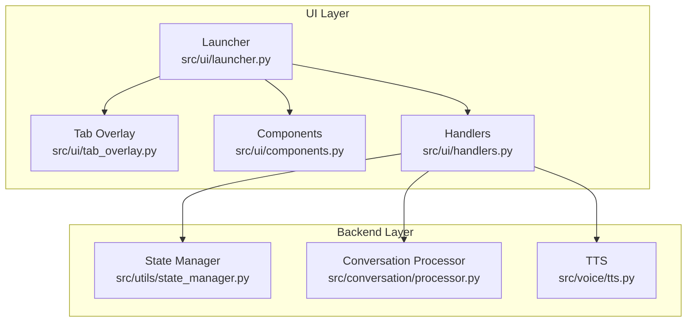
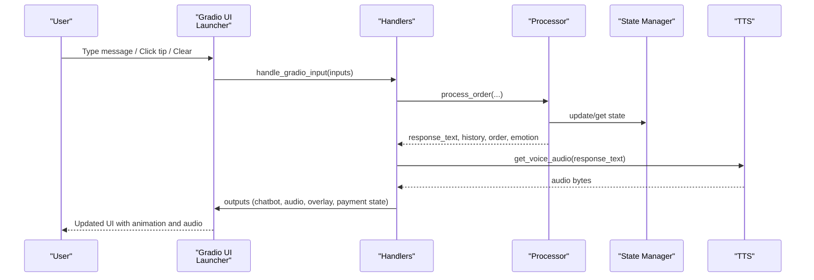
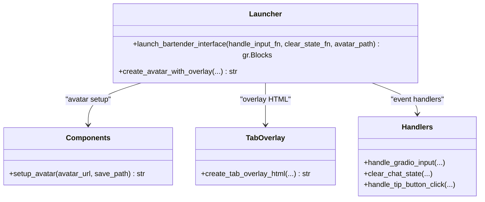
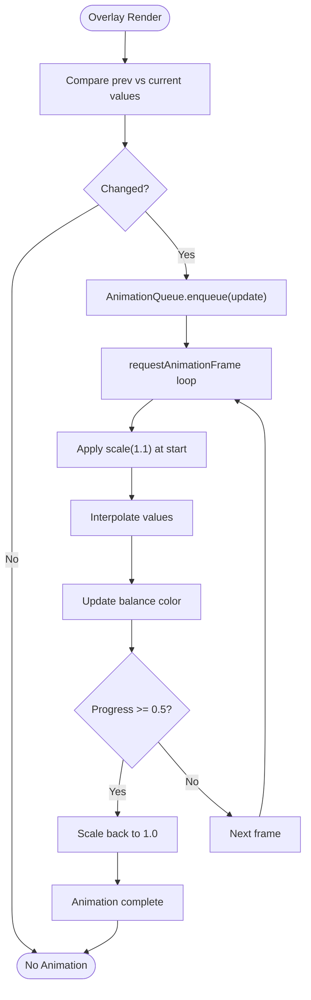
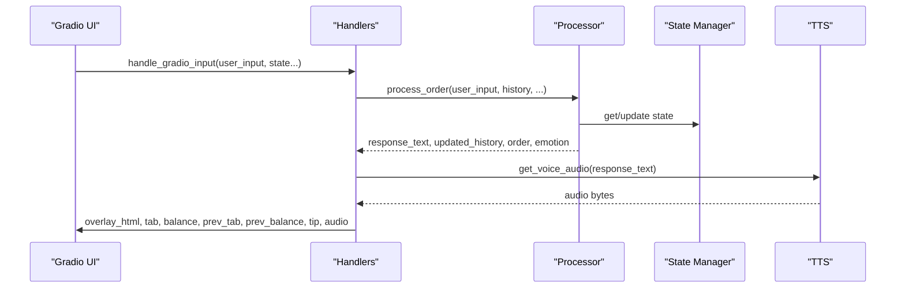
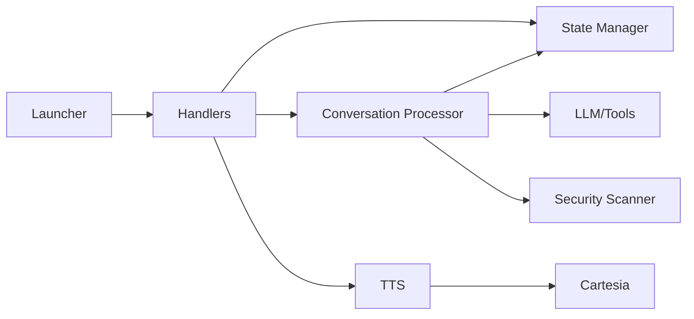

# User Interface Components

<cite>
**Referenced Files in This Document**
- [launcher.py](file://src/ui/launcher.py)
- [tab_overlay.py](file://src/ui/tab_overlay.py)
- [components.py](file://src/ui/components.py)
- [handlers.py](file://src/ui/handlers.py)
- [state_manager.py](file://src/utils/state_manager.py)
- [processor.py](file://src/conversation/processor.py)
- [tts.py](file://src/voice/tts.py)
- [test_ui_launcher.py](file://tests/test_ui_launcher.py)
- [test_ui_components.py](file://tests/test_ui_components.py)
- [test_ui_handlers.py](file://tests/test_ui_handlers.py)
- [README.md](file://README.md)
</cite>

## Table of Contents
1. [Introduction](#introduction)
2. [Project Structure](#project-structure)
3. [Core Components](#core-components)
4. [Architecture Overview](#architecture-overview)
5. [Detailed Component Analysis](#detailed-component-analysis)
6. [Dependency Analysis](#dependency-analysis)
7. [Performance Considerations](#performance-considerations)
8. [Troubleshooting Guide](#troubleshooting-guide)
9. [Conclusion](#conclusion)
10. [Appendices](#appendices)

## Introduction
This document explains MayaMCP’s Gradio-based user interface system with a focus on the interactive chat experience and visual feedback. It covers the launcher architecture that initializes the Gradio interface with Maya’s avatar display and conversation controls, the tab overlay system that shows real-time payment information with animated updates and color-coded warnings, the event handling system that processes user inputs, manages conversation state, and coordinates with backend services, and the avatar animation system that responds to conversation context with different emotional expressions. It also documents component composition patterns, styling approaches, responsive design considerations, UI interaction examples, state synchronization between frontend and backend, accessibility features, audio playback integration, visual feedback systems, and real-time updates during conversations.

## Project Structure
The UI system is composed of four primary modules under src/ui:
- Launcher: builds the Gradio Blocks layout, wires events, and manages session state.
- Tab overlay: generates the avatar overlay with animated tab/balance display and tip buttons.
- Components: avatar setup and fallback handling.
- Handlers: event callbacks for user input, clear, and tip button clicks.

These modules integrate with backend services:
- State manager: thread-safe, typed payment and conversation state.
- Conversation processor: orchestrates LLM/tool calls, order processing, and emotion extraction.
- TTS: text-to-speech synthesis for agent audio.

**Diagram sources**
- [launcher.py](file://src/ui/launcher.py#L49-L354)
- [tab_overlay.py](file://src/ui/tab_overlay.py#L151-L485)
- [components.py](file://src/ui/components.py#L11-L55)
- [handlers.py](file://src/ui/handlers.py#L23-L392)
- [state_manager.py](file://src/utils/state_manager.py#L48-L814)
- [processor.py](file://src/conversation/processor.py#L73-L456)
- [tts.py](file://src/voice/tts.py#L140-L200)

**Section sources**
- [launcher.py](file://src/ui/launcher.py#L1-L354)
- [tab_overlay.py](file://src/ui/tab_overlay.py#L1-L595)
- [components.py](file://src/ui/components.py#L1-L55)
- [handlers.py](file://src/ui/handlers.py#L1-L392)
- [state_manager.py](file://src/utils/state_manager.py#L1-L814)
- [processor.py](file://src/conversation/processor.py#L1-L456)
- [tts.py](file://src/voice/tts.py#L1-L200)

## Core Components
- Launcher: constructs the Gradio Blocks layout with two equal-width columns (avatar overlay + chat), defines session state variables, wires submit/clear/tip events, and injects JavaScript for tip button handling.
- Tab overlay: renders an avatar with a bottom-left overlay showing tab, balance, tip, and total; includes animated count-up transitions and tip buttons with toggle behavior.
- Components: downloads and saves the bartender avatar with robust fallbacks.
- Handlers: process user input, manage conversation state, update payment state, resolve avatar emotion, and orchestrate TTS.
- State manager: provides typed, validated payment state, thread-safe locking, and atomic operations for order updates and tip toggling.
- Conversation processor: orchestrates LLM/tool calls, order processing, and emotion extraction from agent responses.
- TTS: cleans text for speech, initializes Cartesia client, and synthesizes audio with retry logic.

**Section sources**
- [launcher.py](file://src/ui/launcher.py#L49-L354)
- [tab_overlay.py](file://src/ui/tab_overlay.py#L151-L485)
- [components.py](file://src/ui/components.py#L11-L55)
- [handlers.py](file://src/ui/handlers.py#L23-L392)
- [state_manager.py](file://src/utils/state_manager.py#L48-L814)
- [processor.py](file://src/conversation/processor.py#L73-L456)
- [tts.py](file://src/voice/tts.py#L140-L200)

## Architecture Overview
The UI architecture follows a clear separation of concerns:
- Frontend (Gradio): Layout, state, and event wiring.
- Backend (Handlers): Orchestrates conversation, payment, and audio.
- State (State Manager): Centralized, typed, and validated state with thread-safety.
- Tools/LangChain: Conversation processing and tool execution.
- Audio: TTS integration with retry and fallback.

**Diagram sources**
- [launcher.py](file://src/ui/launcher.py#L155-L169)
- [handlers.py](file://src/ui/handlers.py#L23-L184)
- [processor.py](file://src/conversation/processor.py#L73-L456)
- [state_manager.py](file://src/utils/state_manager.py#L627-L640)
- [tts.py](file://src/voice/tts.py#L140-L200)

## Detailed Component Analysis

### Launcher: Gradio Interface Initialization and Event Wiring
The launcher creates the main Gradio Blocks layout with:
- Theme: Ocean.
- Two-column layout: avatar overlay column (scale 1, min-width 200) and chat column (scale 1).
- Session state: history, order, tab, balance, previous tab/balance for animation, tip percentage, tip amount, and avatar path.
- Chatbot: conversation display with messages type.
- Audio: agent voice output (autoplay, non-streaming, wav).
- Text input: user message.
- Hidden tip input: receives JavaScript-triggered tip selections.
- Buttons: Clear and Send.
- JavaScript: global handleTipClick function to populate hidden tip input and trigger Gradio events.
- Event wiring: submit inputs/outputs include all state variables; clear wrapper resets overlay and state; tip click handler delegates to a dedicated handler.

Key behaviors:
- Avatar setup fallback: if avatar path is None, attempts to download and save a default avatar; on failure, falls back to a default asset path.
- State persistence: avatar path is maintained across updates and errors.
- Animation: overlay HTML is regenerated with previous/current values to drive JavaScript animation queue.

**Section sources**
- [launcher.py](file://src/ui/launcher.py#L49-L354)

#### Launcher Class Diagram

**Diagram sources**
- [launcher.py](file://src/ui/launcher.py#L49-L354)
- [components.py](file://src/ui/components.py#L11-L55)
- [tab_overlay.py](file://src/ui/tab_overlay.py#L151-L485)
- [handlers.py](file://src/ui/handlers.py#L23-L392)

### Tab Overlay: Real-Time Payment Display with Animated Updates
The tab overlay renders:
- Avatar media: image or video with poster fallback and fade-in animation.
- Bottom-left overlay: tab, balance, tip buttons, and tip/total rows.
- Tip buttons: 10%, 15%, 20% with toggle behavior; disabled when tab is zero.
- Balance color coding: white (>= $50), orange (< $50), red (<= $0).
- Animated count-up: JavaScript AnimationQueue collapses rapid updates, animates from previous to current values, applies pulse scaling, and updates balance color dynamically.

JavaScript features:
- AnimationQueue: enqueues updates, collapses recent updates, runs animations with requestAnimationFrame, and exposes cancelAll and queue length.
- getBalanceColor: returns color based on current balance.
- Window initialization: compares dataset values and enqueues animation if values changed.

HTML/CSS/JS generation:
- Embeds styles, media, overlay, tip buttons, and tip/total rows.
- Uses data attributes for start/end values to drive animation.

**Section sources**
- [tab_overlay.py](file://src/ui/tab_overlay.py#L151-L485)

#### Tab Overlay Flowchart

**Diagram sources**
- [tab_overlay.py](file://src/ui/tab_overlay.py#L307-L483)

### Components: Avatar Setup and Fallbacks
The avatar setup function:
- Downloads an image from a default URL or a provided URL.
- Processes the image with PIL and saves to disk.
- Provides robust fallbacks: blank image on HTTP failure or processing errors; logs warnings and errors appropriately.
- Returns the saved path or a fallback default path.

**Section sources**
- [components.py](file://src/ui/components.py#L11-L55)

### Handlers: Event Processing and State Coordination
The handlers coordinate:
- Input processing: calls the conversation processor, generates TTS audio, resolves avatar emotion, and rebuilds overlay HTML with animation values.
- Clear state: resets session state and clears UI outputs.
- Tip button click: toggles tip percentage, sends notification to Maya, updates state, and returns audio and overlay.

State synchronization:
- Payment state is read/written via the state manager; tip toggling uses atomic operations.
- Conversation state is updated through the processor; order state is derived from current order.
- Emotion state extracted from agent responses drives avatar emotion resolution.

Audio integration:
- TTS is invoked only when response text is non-empty and a client is available.
- Retry logic and error handling ensure graceful degradation.

**Section sources**
- [handlers.py](file://src/ui/handlers.py#L23-L392)
- [state_manager.py](file://src/utils/state_manager.py#L556-L610)
- [processor.py](file://src/conversation/processor.py#L174-L202)
- [tts.py](file://src/voice/tts.py#L140-L200)

#### Handlers Sequence Diagram

**Diagram sources**
- [handlers.py](file://src/ui/handlers.py#L23-L184)
- [processor.py](file://src/conversation/processor.py#L73-L456)
- [state_manager.py](file://src/utils/state_manager.py#L627-L640)
- [tts.py](file://src/voice/tts.py#L140-L200)

### Avatar Animation System: Emotion-Based Expressions
The avatar animation system:
- Resolves emotion from agent responses using a STATE tag pattern.
- Switches to emotion-specific assets (e.g., maya_happy.mp4) when available.
- Maintains current avatar path across updates and errors to preserve continuity.
- Supports six emotions: neutral, happy, flustered, thinking, mixing, upset.

**Section sources**
- [handlers.py](file://src/ui/handlers.py#L140-L184)
- [processor.py](file://src/conversation/processor.py#L174-L202)

## Dependency Analysis
The UI components depend on backend services for state, conversation processing, and audio synthesis. The state manager provides:
- Typed payment state with validation.
- Thread-safe locking and atomic operations for concurrent access.
- Tip calculation and toggle behavior.
- Versioned optimistic locking for order updates.

The conversation processor depends on:
- LLM/tool calling for intent detection and order processing.
- Security scanning for input/output filtering.
- Phase management for conversation flow.

The TTS module depends on:
- Cartesia client initialization and retry logic.
- Text cleaning for pronunciation and punctuation.

**Diagram sources**
- [launcher.py](file://src/ui/launcher.py#L49-L354)
- [handlers.py](file://src/ui/handlers.py#L23-L392)
- [state_manager.py](file://src/utils/state_manager.py#L48-L814)
- [processor.py](file://src/conversation/processor.py#L1-L456)
- [tts.py](file://src/voice/tts.py#L1-L200)

**Section sources**
- [state_manager.py](file://src/utils/state_manager.py#L48-L814)
- [processor.py](file://src/conversation/processor.py#L1-L456)
- [tts.py](file://src/voice/tts.py#L1-L200)

## Performance Considerations
- Animation queue collapsing: the JavaScript AnimationQueue merges rapid updates within a short window to reduce redundant animations and maintain smooth UI updates.
- RequestAnimationFrame: animations use efficient frame scheduling for smooth transitions.
- TTS retry: exponential backoff reduces repeated failures and improves reliability.
- State locking: thread-safe access prevents race conditions and ensures consistent state across concurrent requests.
- Minimal DOM updates: overlay HTML is regenerated with data attributes to drive targeted updates.

[No sources needed since this section provides general guidance]

## Troubleshooting Guide
Common issues and resolutions:
- Avatar setup failures: The launcher attempts avatar setup; on exception, it logs and continues with a default avatar path. The components module provides robust fallbacks for HTTP errors, processing errors, and save failures.
- TTS failures: The handlers catch TTS exceptions and return None for audio; the UI remains functional with text-only responses.
- Empty or whitespace-only responses: The handlers skip TTS generation and continue with UI updates.
- Tip button click handling: The JavaScript function populates a hidden input and triggers Gradio events; ensure the hidden input is present and the function is globally available.
- State reset on clear: The clear handler resets backend state and clears UI outputs; on backend errors, the UI is still cleared to ensure a clean state.

**Section sources**
- [launcher.py](file://src/ui/launcher.py#L66-L81)
- [handlers.py](file://src/ui/handlers.py#L120-L132)
- [test_ui_launcher.py](file://tests/test_ui_launcher.py#L373-L417)
- [test_ui_handlers.py](file://tests/test_ui_handlers.py#L191-L239)

## Conclusion
MayaMCP’s UI system combines a responsive Gradio layout with a robust tab overlay that provides real-time financial feedback and animated transitions. The event handling system integrates conversation processing, payment state management, and audio synthesis to deliver a cohesive, interactive experience. The avatar animation system enhances engagement by reflecting conversation context through emotion-based expressions. Together, these components form a scalable, accessible, and visually engaging interface that balances performance and user experience.

[No sources needed since this section summarizes without analyzing specific files]

## Appendices

### UI Interaction Examples
- Ordering drinks: “I’d like a margarita” triggers order processing and updates tab and balance.
- Checking order: “What’s in my order?” returns current items and total.
- Recommendations: “Something fruity please” elicits suggestions.
- Billing and payment: “What’s my total?” and “I’ll pay now” manage bill and payment state.
- Tip selection: Click 10%/15%/20% buttons or say “Add a 20% tip”; toggle removes tip.

**Section sources**
- [README.md](file://README.md#L184-L230)

### State Synchronization Between Frontend and Backend
- Inputs: user message, session history, current tab, balance, tip percentage, tip amount, avatar path.
- Outputs: empty input, updated history, updated history for display, order state, audio data, overlay HTML, new tab, new balance, previous values for animation, tip percentage, tip amount, avatar path.
- Payment state: read via state manager; tip toggling uses atomic operations; optimistic locking prevents concurrent modification conflicts.

**Section sources**
- [launcher.py](file://src/ui/launcher.py#L159-L165)
- [handlers.py](file://src/ui/handlers.py#L39-L184)
- [state_manager.py](file://src/utils/state_manager.py#L556-L610)

### Accessibility Features
- Labels and placeholders guide user actions.
- Autoplay audio is controlled by the UI; users can disable audio if desired.
- Clear button resets all state and UI elements.
- Responsive layout adapts to screen sizes with equal column scaling.

**Section sources**
- [launcher.py](file://src/ui/launcher.py#L126-L154)
- [README.md](file://README.md#L184-L230)

### Integration with Audio Playback and Visual Feedback
- TTS integration: text cleaning, client initialization, and retry logic ensure reliable audio generation.
- Visual feedback: animated count-up transitions, color-coded balance warnings, and emotion-based avatar switching enhance user engagement.

**Section sources**
- [tts.py](file://src/voice/tts.py#L140-L200)
- [handlers.py](file://src/ui/handlers.py#L140-L184)
- [tab_overlay.py](file://src/ui/tab_overlay.py#L182-L305)

### Responsive Design Considerations
- Equal-width columns for avatar and chat.
- Minimum width for avatar column to ensure visibility.
- Flexible overlay layout with centered alignment and spacing.

**Section sources**
- [launcher.py](file://src/ui/launcher.py#L103-L125)
- [tab_overlay.py](file://src/ui/tab_overlay.py#L249-L305)